<div align="center">

# 🏛️ Kamu Evrak ve Yazışma Süreçleri için Akıllı Agent Destek Sistemi

### _TEKNOFEST 2026 — Yapay Zeka Dil Ajanları Yarışması · 1. Senaryo_


-8A2BE2?style=for-the-badge)


[](https://github.com/msgxr/teknofest-2026-kamu-evrak-akilli-ajan/actions/workflows/ci.yml)
[](tests/)
[](src/agents/)
[](data/raw/mevzuat_metinleri/)
[](docs/performans_raporu.md)

---

**Kamu kurumlarındaki evrak işleme ve resmî yazışma süreçlerini, birbirleriyle iş birliği yapan
11 uzman yapay zekâ ajanı ve saf Python bir orkestratör ile uçtan uca otomatikleştiren,
çevrimdışı-öncelikli (offline-first), açık kaynak akıllı agent çözümü.**

_Sınıflandır · Anla · Eksikleri Bul · Mevzuatı Eşleştir · Özetle · Önceliklendir · Maskele · Taslakla · Yönlendir_

</div>

---

## 📑 İçindekiler

<table>
<tr>
<td valign="top" width="33%">

**🎯 Giriş**
- [Proje Hakkında](#-proje-hakkında)
- [Neden Bu Proje?](#-neden-bu-proje)
- [Öne Çıkan Özellikler](#-öne-çıkan-özellikler)
- [Bir Bakışta Rakamlar](#-bir-bakışta-rakamlar)

**🏗️ Mimari**
- [Sistem Mimarisi](#️-sistem-mimarisi)
- [Orkestratör ve Kapılar](#-orkestratör-ve-koşullu-kapılar)
- [Veri Akışı (AgentState)](#-veri-akışı--agentstate)
- [Ajan İş Birliği](#-ajan-i̇ş-birliği-sekansı)

</td>
<td valign="top" width="33%">

**🤖 Ajanlar & Katmanlar**
- [11 Uzman Ajan](#-11-uzman-ajan--derinlemesine)
- [Hibrit Mevzuat RAG](#-hibrit-mevzuat-rag--derin-dalış)
- [KVKK Anonimleştirme](#-kvkk-ve-anonimleştirme)
- [Güven & Ölçüm Katmanı](#-güven-ve-ölçüm-katmanı)
- [Triage / Önceliklendirme](#️-triage--akıllı-önceliklendirme)

**⚙️ Kullanım**
- [Teknoloji Yığını](#-teknoloji-yığını)
- [Hızlı Başlangıç](#-hızlı-başlangıç)
- [Kurulum](#-kurulum)
- [Kullanım Kılavuzu](#-kullanım-kılavuzu)

</td>
<td valign="top" width="33%">

**🖥️ Arayüzler**
- [Web Arayüzü](#️-web-arayüzü)
- [REST API](#-rest-api)
- [MCP Sunucusu](#-mcp-sunucusu)

**📊 Kalite & Kanıt**
- [Proje Yapısı](#-proje-yapısı)
- [Veri Setleri](#-veri-setleri)
- [Değerlendirme & Metrikler](#-değerlendirme-ve-metrikler)
- [Adversarial Dayanıklılık](#️-adversarial-dayanıklılık)
- [Test & CI](#-test-ve-ci)
- [Performans](#-performans)
- [Anayasal İlkeler](#-anayasal-i̇lkeler)
- [Yol Haritası](#️-yol-haritası)
- [SSS](#-sık-sorulan-sorular)
- [Katkı & Lisans](#-katkıda-bulunma)
- [Fikri Mülkiyet & Katkı](#-fikri-mülkiyet-ve-katkı)

</td>
</tr>
</table>

---

## 🎯 Proje Hakkında

Bu proje, **TEKNOFEST 2026 Yapay Zeka Dil Ajanları Yarışması**'nın **1. Senaryosu** ("Kamu Evrak
ve Yazışma Süreçleri için Akıllı Agent Destek Sistemi") kapsamında geliştirilmektedir. Amaç,
kamu kurumlarında günlük iş yükünün önemli bir bölümünü oluşturan **evrak hazırlama, okuma,
sınıflandırma, mevzuat eşleştirme, resmî yazı taslaklama, birim yönlendirme ve arşivleme**
süreçlerini, birbirleriyle koordineli çalışan çok-ajanlı bir yapay zekâ sistemiyle yeniden
tasarlamaktır.

### Problem

<table>
<tr><td width="50%">

Kamu kurumlarındaki evrak ve yazışma süreçleri:

- 🔁 **Çok adımlı ve tekrarlı** — her evrak okuma → türlendirme → içerik analizi → mevzuat kontrolü → taslak → yönlendirme zincirinden geçer.
- ⏳ **Zaman baskısı altında** — yasal süreler (4982, 3071, 2577, CİMER) kaçırılırsa hak kaybı doğar.
- 👥 **Dağınık ve kişiye bağımlı** — farklı personel, farklı yorum; iş yükü dengesizliği ve süre uzaması.
- 🔒 **KVKK riskli** — kişisel veri içeren evraklar paylaşılırken maskeleme çoğu zaman elle yapılır.

</td><td width="50%">

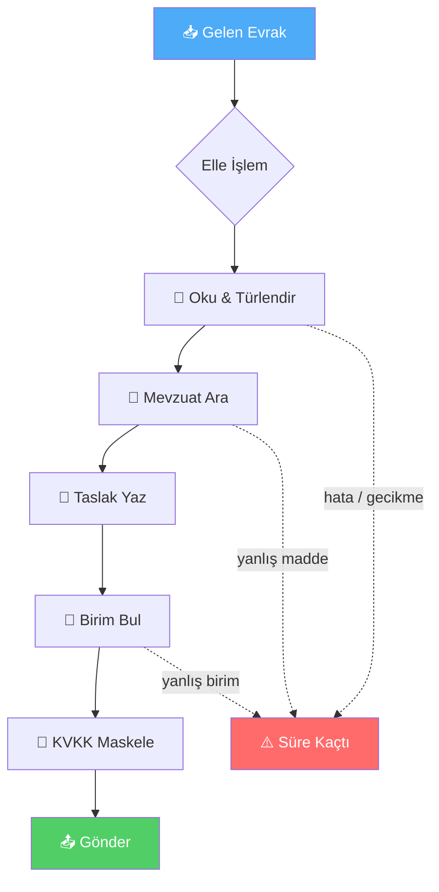

</td></tr>
</table>

### Çözüm

Bu sistem, yukarıdaki manuel zinciri **11 uzman ajan + bir orkestratör** ile otomatikleştirir.
Her ajan tek bir işten sorumludur; orkestratör onları paylaşılan bir durum nesnesi üzerinde
koşullu bir akışla çalıştırır. Kritik nokta: sistem **çevrimdışı-öncelikli**dir — hiçbir LLM veya
internet olmadan, tamamen kural tabanlı yollarla uçtan uca tam işlevlidir; LLM bulunursa yalnızca
**düşük güvenli kararlarda** devreye girer.

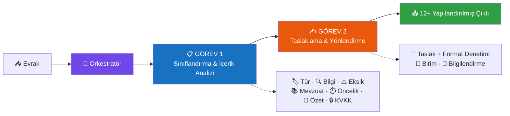

> [!IMPORTANT]
> **Tasarım felsefesi:** Bu bir "LLM sarmalayıcısı" değildir. Çekirdek zekâ; kalibre edilmiş kural
> tabanlı skorlama, saf Python BM25 RAG, istatistiksel Naive Bayes ensemble ve resmî yazışma
> mevzuatının makine-okunur kodlanmasıdır. LLM **opsiyonel bir hızlandırıcıdır**, zorunlu bir
> bağımlılık değil. Bu sayede sistem; internetsiz kurum ağlarında, kişisel veri sızıntısı riski
> olmadan ve tekrar-üretilebilir biçimde çalışır.

---

## 💡 Neden Bu Proje?

<table>
<tr>
<td width="25%" align="center">

### 🔌
**Offline-First**

Çekirdek `requirements.txt` ile, hiçbir LLM/internet olmadan **tam işlevsel**. Kişisel veri 3. taraf API'ye sızmaz.

</td>
<td width="25%" align="center">

### 🧩
**Framework'süz**

LangChain / LangGraph **yok**. Özgün, saf Python orkestrasyon → şeffaf, hafif, denetlenebilir, bağımlılık şişkinliği yok.

</td>
<td width="25%" align="center">

### 🎓
**Ölçüm Titizliği**

ECE kalibrasyon, conformal prediction, McNemar anlamlılık, metamorfik dayanıklılık — akademik ölçüm katmanı.

</td>
<td width="25%" align="center">

### ⚖️
**Mevzuat Temelli**

Her taslak kuralı **yönetmelik madde/fıkra** dayanağıyla denetlenir. Halüsinasyon atıf = otomatik yakalanır.

</td>
</tr>
</table>

Kamu senaryosunda bir yapay zekâ sisteminden beklenen dört şey vardır ve bu proje her birini
mimarinin merkezine koyar:

1. **Güvenilirlik** — Sistem ne zaman emin, ne zaman emin değil? Kalibrasyon (ECE/temperature
   scaling), seçici tahmin (reject option, eşik `0.6`) ve conformal prediction ile **her karar bir
   güven skoruyla** gelir; düşük güvenli kararlar "insan onayı gerekli" işaretiyle döner.
2. **Şeffaflık** — Her ajan adımının süresi ölçülür, her mevzuat önerisi **gerekçe + madde
   referansı** taşır, her karar için kaynak metin span'leri (attribution) çıkarılır.
3. **Veri Koruması** — KVKK anonimleştirme ajanı 9 kategori kişisel veriyi (TCKN, telefon,
   e-posta, IBAN, kişi adı, adres, plaka, doğum tarihi, sicil) format-koruyarak maskeler;
   sızıntı bağımsız bir denetçiyle (`kvkk_denetim.py`) ölçülür.
4. **Dürüstlük** — Ölçümler ne çıkarsa olduğu gibi raporlanır; held-out setlerdeki hatalar
   gizlenmez, teknik raporda analiz edilir.

---

## ✨ Öne Çıkan Özellikler

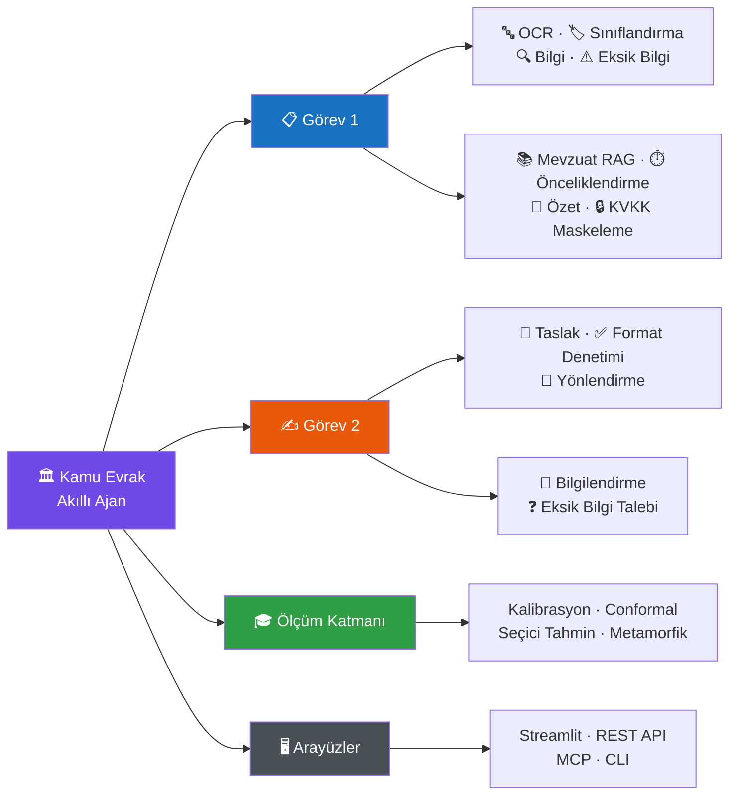

| Özellik | Açıklama |
|---------|----------|
| 📄 **Metin / PDF / Görüntü Okuma** | TXT ve metin katmanlı PDF çekirdekte (`pypdf`); taranmış PDF/görüntü için opsiyonel OCR (Tesseract / EasyOCR) + adaptif ön-işleme (deskew, ölçek, adaptif eşik) |
| 🏷️ **Üçlü Hibrit Sınıflandırma** | Evrak türünü (8 tür + `diğer`) belirleme: (1) ağırlıklı kural skorlaması, (2) saf-Python Naive Bayes ensemble (`0.6×kural + 0.4×ML`), (3) düşük güvende (`<0.6`) opsiyonel LLM eskalasyonu |
| 🔍 **Bilgi Çıkarımı** | Tarih, evrak sayısı, konu, muhatap, İlgi referansları, kurum/kişi/yer adları, TCKN (checksum'lı), telefon, IBAN, para tutarı — ReDoS-güvenli regex + opsiyonel LLM zenginleştirme |
| ⚠️ **Eksik Bilgi Tespiti** | Evrak türüne göre `ZORUNLU_ALANLAR` kontrolü; her eksik için alan/açıklama/öncelik (kritik>önemli>bilgi)/öneri üretir |
| 📚 **Hibrit Mevzuat RAG** | Saf Python **BM25-Okapi** çekirdeği + **madde referanslı + gerekçeli** öneri; düşük skorda (`<0.15`) tür söz dağarcığıyla **düzeltici sorgu genişletme** döngüsü; opsiyonel `turkish-e5-large` semantik katman + `bge-reranker-v2-m3` yeniden sıralama (RRF birleşimi) |
| 📝 **Sadakat-Garantili Özet** | 2-4 cümlelik resmî özet; LLM varsa bağlamlı, yoksa skorlamalı extractive; sayısal olgu düşerse orijinal korunur (halüsinasyon önlemi) |
| ✍️ **Madde-Referanslı Taslak + Format Öz-Denetimi** | Resmî üsluba uygun taslak (5 şablon) + **her kuralı 2646 sayılı Yönetmelik madde/fıkra dayanağıyla** denetleme; ağırlıklı skor, `uygun = skor ≥ 0.8` |
| 🔄 **Reflexion / Keep-Best** | LLM taslağı hedef skorun (`0.85`) altındaysa yapısal geri bildirimle 1 tur daha; LLM ve kural tabanlı adaylardan **en yüksek format skorlusu** seçilir |
| 🏢 **Ağırlıklı Birim Yönlendirme** | 9 birim için ağırlıklı sinyal skorlaması + gerekçe + alternatifler; yakın skorda (`<%15` fark) opsiyonel LLM ayrıştırması |
| ❓ **Eksik Bilgi Talep Yazısı** | Taslak tamamlanamıyorsa eksikleri **gerekçeli, muhatabı doğru seçilmiş** sorularla talep eden yazı |
| ⏰ **Akıllı Önceliklendirme (Triage)** | İVEDİ/GÜNLÜDÜR damgaları + metin içi süre + yasal süre tablosundan (4982/3071/2577/CİMER) **son işlem tarihi** hesabı (iş günü + resmî tatil) |
| 🔒 **KVKK Paylaşım Nüshası** | 9 kategori kişisel veriyi format-koruyarak maskeler (TC `2**********`, telefon, IBAN, ad `E*** K***`, adres...); tamamen kural tabanlı, offline |
| 💬 **Kullanıcı Bilgilendirme** | Süreç durumu, sonraki adımlar ve kritik eksikler için açık Türkçe sorular |
| 🔌 **Offline-First Çalışma** | LLM/internet olmadan tüm ajanlar kural tabanlı yollarla uçtan uca çalışır |
| ⏱️ **Adım Süreleri & Güven İzleme** | Her ajan adımının süresi + güven skoru izlenir (gerçek zamana yakın çalışma kanıtı) |
| 🤝 **Çapraz Tutarlılık Denetimi** | Özet↔kaynak sadakati + taslak↔mevzuat temelliliği çapraz doğrulanır; çelişkide insan onayı önerilir |
| ✋ **İnsan Onayı Kuyruğu (HITL)** | Düşük güvenli / gizlilik-kısıtlı kararlar gerekçeleriyle kuyruğa düşer; Onayla / Düzelt aksiyonları geri bildirim döngüsüne yazılır |
| 🗂️ **Evrak Kayıt Defteri** | SQLite denetim izi: her işlem kayıt altında, filtreli sorgu + istatistik + emsal arama beslemesi |
| 🔗 **Evrak İlişki Zinciri** | İlgi referanslarından + konu/taraf benzerliğinden yazışma zincirlerini (dilekçe → cevap) otomatik kurar |
| 🧠 **Emsal-Tabanlı Akıl Yürütme (CBR)** | Onaylı geçmiş kayıtlardan çoğunluk tür/birim önseli + mevcut kararla çelişki uyarısı (advisory) |
| 📊 **Kurum Kokpiti** | Toplu evrak işleme; tür/birim dağılımı, eksiklik oranı, kaynaklı zaman tasarrufu analizi |
| 📑 **HTML İşlem Raporu** | Arşive/denetime verilebilir, kendine yeten (inline CSS, XSS-güvenli) işlem denetim raporu |
| 📦 **e-Yazışma Üstverisi** | EBYS entegrasyon vizyonlu üstveri taslağı (CBDDO e-Yazışma esinli) + m.28/3 üstveri↔belge tutarlılık denetimi |
| 🌐 **REST API + 🔗 MCP Sunucusu** | Sıfır-bağımlılıklı JSON API (`python -m src.api`) + Model Context Protocol sunucusu (`python -m src.mcp_server`) — EBYS/araç ekosistemi entegrasyonu |

---

## 📊 Bir Bakışta Rakamlar

<div align="center">

| 🤖 Ajan | 🧩 Modül | 📚 Mevzuat | 🗂️ Kurgu Evrak | 🧪 Test | 📈 Sınıflandırma | ⚡ Hız |
|:---:|:---:|:---:|:---:|:---:|:---:|:---:|
| **11** + orkestratör | **32** util/model | **15** belge | **116** (52+64) | **632** geçti | **%93.8–100** | **~88 evrak/sn** |

</div>

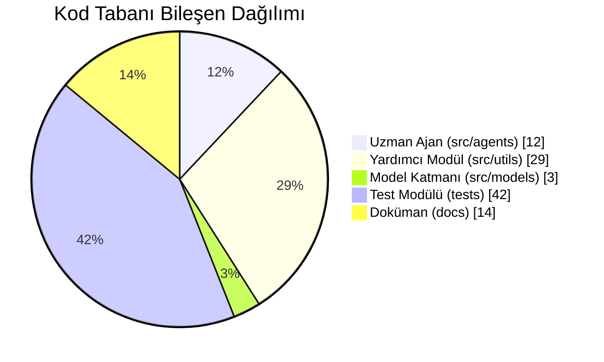

---

## 🏗️ Sistem Mimarisi

Sistem, **framework bağımsız, stdlib tabanlı özgün bir orkestrasyon** üzerine kuruludur:
LangGraph/LangChain gibi bir agent framework'ü **kullanılmaz**. Orkestratör
([`src/agents/orchestrator.py`](src/agents/orchestrator.py)), 11 uzman ajanı paylaşılan bir durum
nesnesi (`AgentState`, bir `dataclass`) üzerinde sırayla çalıştırır; her adımın süresini ve güven
skorunu izler, hata toleransı sağlar. LLM **opsiyoneldir**: OpenAI-uyumlu bir API veya yerel
Ollama bulunursa yalnızca düşük güvenli kararlarda devreye girer; bulunmazsa sistem tamamen kural
tabanlı modda uçtan uca çalışır.

### 🗺️ Yüksek Seviye Mimari

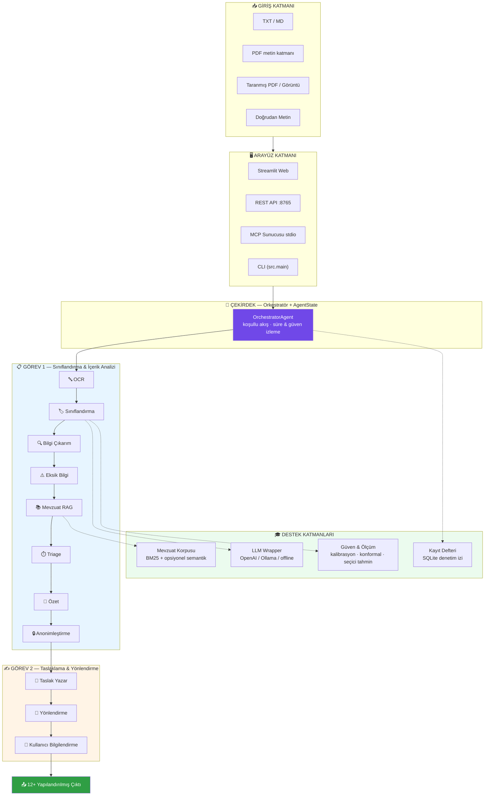

### Teknoloji Yığını

| Katman | Gerçekleşme |
|--------|-------------|
| **Orkestrasyon** | Özgün, saf Python (stdlib `dataclasses` + `time`); agent framework'ü **yok** |
| **LLM erişimi (opsiyonel)** | stdlib `urllib` ile OpenAI-uyumlu API (varsayılan `gpt-4o-mini`) veya yerel Ollama (varsayılan `qwen2.5:7b`); **SDK bağımlılığı yok** |
| **Mevzuat RAG** | Hibrit: saf Python BM25-Okapi (`src/utils/bm25.py`, çekirdek) + düzeltici sorgu genişletme; opsiyonel `turkish-e5-large` semantik arama + `bge-reranker-v2-m3` (RRF, `EMBEDDING_SEMANTIK_AKTIF=1` / `EMBEDDING_RERANK_AKTIF=1`) |
| **İstatistiksel model** | Saf Python Multinomial Naive Bayes + TF-IDF + karakter 3-gram (`src/models/istatistiksel_siniflandirici.py`); sklearn/numpy **yok** |
| **Evrak okuma** | TXT + `pypdf` (çekirdek); `pytesseract`/`pdf2image`/`easyocr` (opsiyonel OCR) |
| **Arayüz** | Streamlit (web, gömülü CSS, dış CDN yok) + `rich` (konsol) |
| **Denetim izi** | `sqlite3` (stdlib) — kayıt defteri + emsal arama |
| **Bağımlılık ayrımı** | `requirements.txt` (çekirdek — sistem bunlarla TAM çalışır) / `requirements-optional.txt` (OCR, semantik arama, yerel model) — LangChain/LangGraph/torch çekirdekte **yer almaz** |

---

## 🧠 Orkestratör ve Koşullu Kapılar

Orkestratör basit bir "sırayla çağır" döngüsü değildir. Üç **koşullu kapı** ile akışı erken
sonlandırabilir, adımları atlayabilir veya insan onayı işaretleyebilir. Bu, kamu senaryosunda
"emin olmadığında durup insana devret" ilkesinin mimariye kodlanmasıdır.

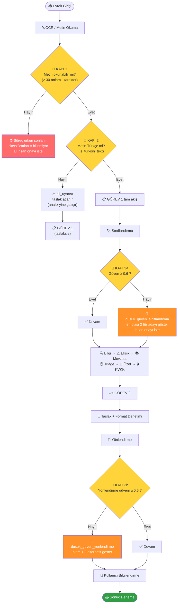

### Kritik Eşik Değerleri (tek referans)

Sistemde birbirine benzeyen ama **farklı** amaçlara hizmet eden eşik değerleri vardır. Karışmasın
diye tek tabloda:

| Eşik | Değer | Nerede | Ne yapar |
|---|:---:|---|---|
| Anlamlı karakter alt sınırı | `30` | orkestratör (Kapı 1) | Bu sayının altında metin "okunamaz" sayılır, süreç erken durur |
| Azami girdi | `200.000` | orkestratör | Güvenlik girdi sınırı (DoS önlemi) |
| İnsan onayı güven eşiği | `0.6` | orkestratör (Kapı 3a/3b) | Altındaki sınıflandırma/yönlendirme kararı insan onayına düşer |
| LLM eskalasyon eşiği | `0.6` | sınıflandırma ajanı | Kural güveni altındaysa (LLM varsa) LLM'e doğrulatılır |
| Reddetme eşiği (Chow) | `0.6` | `secici_tahmin.py` | Seçici tahmin reject option |
| Mevzuat düzeltme döngüsü | `0.15` | mevzuat ajanı | İlk benzerlik altındaysa sorgu genişletilip 1 kez yeniden aranır |
| Zayıf eşleşme işareti | `0.5` | mevzuat ajanı | En iyi benzerlik altındaysa tüm sonuçlar "zayıf" işaretlenir |
| Mevzuat taslak-atıf eşiği | `0.6` | taslak ajanı | Gövdede yalnızca ≥0.6 benzerlikli eşleşmeye atıf yapılır |
| KVKK köprü benzerliği | `0.55` | mevzuat ajanı | TCKN/IBAN saptanınca `kvkk_6698` bu benzerlikle eklenir |
| Yönlendirme LLM ayrıştırma | `%15` | yönlendirme ajanı | İlk iki skor arası fark bundan azsa LLM devreye girer |
| Format "uygun" eşiği | `0.8` | taslak format denetimi | Ağırlıklı skor bunun üstündeyse taslak "uygun" |
| Reflexion hedef skoru | `0.85` | taslak ajanı | LLM taslağı altındaysa 1 tur daha iyileştirilir |
| Triage öncelik (ivedi/yüksek) | `0.8` / `0.55` | triage ajanı | Skor eşiklerine göre öncelik sınıfı |
| Conformal α | `0.1` | `konformal.py` | Hedef kapsama 0.90 |

---

## 🔀 Veri Akışı — `AgentState`

Tüm ajanlar tek bir paylaşılan `AgentState` (`dataclass`) nesnesini okur/yazar. Bu, framework'süz
orkestrasyonun kalbidir: ajanlar birbirini doğrudan çağırmaz; yalnızca durumu zenginleştirir.

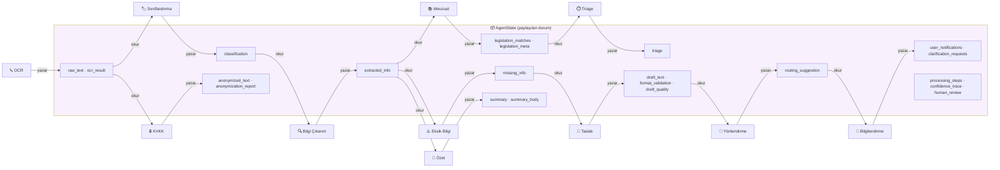

---

## 🤝 Ajan İş Birliği Sekansı

Bir dilekçenin uçtan uca işlenmesi (offline mod):

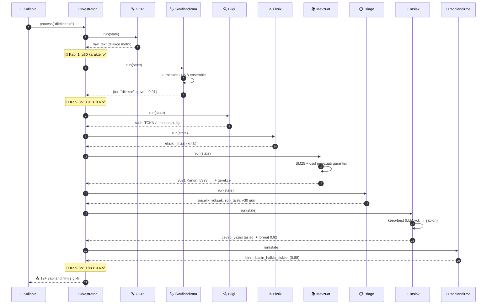

---

## 🤖 11 Uzman Ajan — Derinlemesine

Her ajan **tek sorumluluk** ilkesiyle tasarlanmıştır ve tek bir giriş noktası (`run(self, state)`)
üzerinden çalışır. LLM içeren ajanlar (`classification, info_extraction, summarization,
draft_writer, routing`) **offline-first** ilkesiyle, LLM yoksa/başarısızsa kural tabanlı sonuca
zarifçe düşer. Aşağıda her ajanın görevi, girdi/çıktısı, temel mantığı ve eşik değerleri
kod-temelli olarak verilmiştir.

<div align="center">

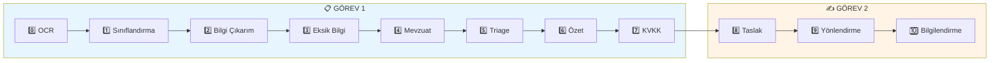

</div>

### 0️⃣ Orkestratör — [`orchestrator.py`](src/agents/orchestrator.py)

| | |
|---|---|
| **Sınıf** | `OrchestratorAgent` · `AgentState` (dataclass) |
| **Görev** | 11 alt ajanı koordine eder; iki görev bloğunu koşullu akışla çalıştırır, adım süresi/güven izler, sonuçları tek sözlükte derler |
| **Giriş** | `input_file` veya doğrudan `text` |
| **Çıkış** | 25+ anahtarlı derlenmiş sonuç sözlüğü |
| **Öne çıkan** | 3 koşullu kapı · `_run_step` ile `time.perf_counter()` süre ölçümü · `on_step` canlı akış (streaming) kancası · çapraz tutarlılık + gizlilik damgası → insan onayı |

Sonuç sözlüğü anahtarları: `input_file, ocr, siniflandirma, bilgi_cikarim, eksik_bilgiler,
mevzuat_eslestirme, mevzuat_arama_meta, ozet, yazi_taslagi, yazi_turu, format_denetimi,
taslak_kalitesi, yonlendirme, bilgilendirmeler, eksik_bilgi_talepleri, onceliklendirme,
anonimlestirme, guven_izleme, tutarlilik_denetimi, emsal_onerisi, kanit_vurgulari, islem_adimlari,
hatalar, insan_onayi`.

---

### 🔤 OCR / Metin Okuma Ajanı — [`ocr_agent.py`](src/agents/ocr_agent.py)

İşlem hattının ilk halkası; orkestratör tarafından Görev 1'den **önce** çalıştırılır.

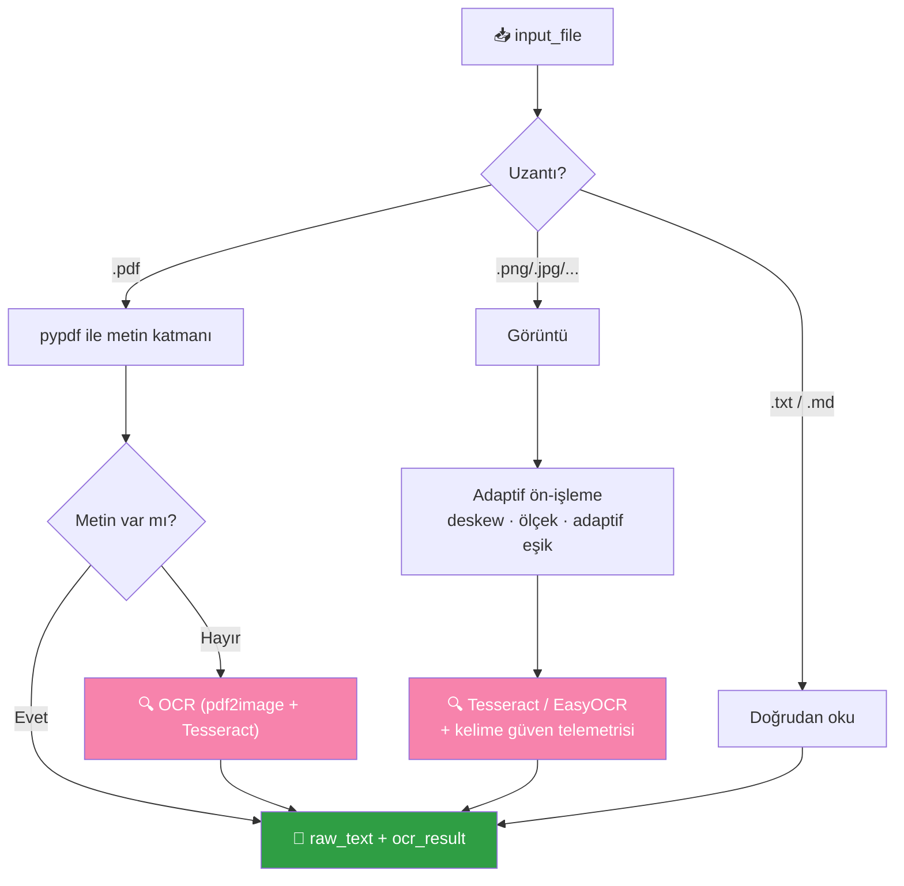

| | |
|---|---|
| **Görev** | PDF/görüntü/metin dosyasından metin çıkarır; PDF'ten metin çıkmazsa OCR'a düşer |
| **Giriş → Çıkış** | `input_file` → `raw_text` + `ocr_result` (kaynak, tür, karakter/kelime sayısı, motor) |
| **Motorlar** | Tesseract (varsayılan) / EasyOCR; adaptif ön-işleme (deskew + ölçek + adaptif eşik) |
| **Güvenlik sınırları** | PDF ilk **50 sayfa** · görüntü **≤40 MP** · OCR **150 DPI** (DoS önlemi) |
| **Zarif düşüş** | `pypdf` → `pdf2image` → açıklayıcı hata; bağımlılık yoksa çekirdek `.txt` yolu etkilenmez |

Desteklenen uzantılar: görüntü `.png/.jpg/.jpeg/.tiff/.bmp`, metin `.txt/.md`, `.pdf`. Görüntü
OCR'ında toplanan kelime düzeyi güven telemetrisi, düşük kaliteli taramalar için bir "belge
kalitesi" (dördüncü kapı) sinyali üretir.

---

### 1️⃣ Sınıflandırma Ajanı — [`classification_agent.py`](src/agents/classification_agent.py)

Evrak türünü **üç bağımsız kanıt kaynağını birleştirerek** belirler:

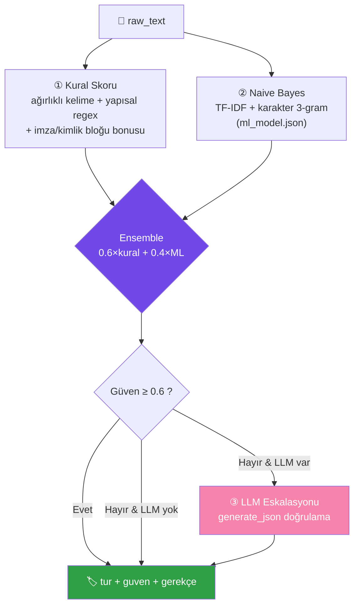

| | |
|---|---|
| **Türler** | `dilekce, ust_yazi, cevap_yazisi, bilgilendirme, tutanak, rapor, genelge, onayli_belge, diger` (8+1) |
| **Giriş → Çıkış** | `raw_text` → `classification = {tur, tur_adi, guven, gerekce, tum_skorlar, yontem, ...}` |
| **Ensemble** | `0.6×kural + 0.4×ML`; model yoksa saf kural (zarif bozulma) |
| **Kalibrasyon** | softmax sıcaklığı `2.0`; skor `≤0` ise `{tur: diger, guven: 0.1}` |
| **LLM eskalasyonu** | yalnız `guven < 0.6` **ve** LLM erişilebilir; geçersiz tür dönerse kural sonucu korunur |
| **Yapısal sinyaller** | imza çizgi bloğu (`_{4,}` ≥2) → tutanak; dilekçe kimlik bloğu (≥2 kişisel alan) → bonus; negatif ağırlıklar (ör. `"Sayı :"` dilekçeye ceza) |

---

### 2️⃣ Bilgi Çıkarım Ajanı — [`info_extraction_agent.py`](src/agents/info_extraction_agent.py)

| | |
|---|---|
| **Görev** | Evraktan anahtar bilgi unsurlarını **ReDoS-güvenli** regex ile çıkarır; LLM varsa **yalnızca ekleyerek** zenginleştirir (regex sonuçları asla ezilmez) |
| **Giriş → Çıkış** | `raw_text` → `extracted_info` (16 anahtar) |
| **Çıkarılan alanlar** | `tarihler, evrak_tarihi, kurum_adlari, kisi_adlari, evrak_sayisi, referans_numaralari, konu, muhatap, dagitim_birimleri, tc_kimlik, telefon, eposta, iban, para_tutarlari, ilgi_referanslari, yerler` |

**Öne çıkan mantık:**
- **TCKN checksum doğrulaması** — 11 hane, ilk hane ≠0, 10. ve 11. hane resmî algoritma ile
  doğrulanır; geçersizler alınmaz. (Kurgu TCKN'ler checksum geçer ama gerçek kişiye ait değildir.)
- **Evrak tarihi ayrıştırma** — 5 öncelikli sinyal: `Tarih :` etiketi → `Sayı :` satırı → yalın
  tarih satırı → tanzim kalıbı → sözel tarih. **İlgi bloğu ve atıf tarihleri hariç tutulur** (belgenin
  kendi tarihi ile atıfta bulunulan tarih karıştırılmaz).
- **Muhatap tespiti** — Türkçe morfolojik yönelme deseni (`-lIğInA/-lUğUnA`) + `Sayın X` + `...makamına`.
- **Prompt injection savunması** — LLM zenginleştirmede evrak metni `belge_blogu(text, 3000)` ile "yalnızca veri" olarak sınırlanır.

> Bu ajanın regex desenleri (`_TC_ADAY, _TELEFON, _EPOSTA, _IBAN`) **tek doğruluk kaynağıdır** ve
> KVKK anonimleştirme ajanı tarafından da import edilir — çıkarım ile maskeleme arasında desen
> ayrışması (sızıntı) böylece önlenir.

---

### 3️⃣ Eksik Bilgi Tespiti — [`missing_info_agent.py`](src/agents/missing_info_agent.py)

Evrak türüne göre **zorunlu alanları** kontrol eder ve her eksik için öncelikli, öneri içeren bir
kayıt üretir. `extracted_info`'nun **doğrulanmış** değerlerini esas alır (ör. `imza` için imza
bloğu, `tc_kimlik` için checksum'lı liste).

<details>
<summary><b>📋 ZORUNLU_ALANLAR — Tam Tablo (tıkla)</b></summary>

| Evrak Türü | Zorunlu Alanlar |
|---|---|
| `dilekce` | tarih, ad_soyad, tc_kimlik, adres, talep_metni, imza |
| `ust_yazi` | tarih, sayi, konu, muhatap, ilgi, metin, imza, kurum_bilgisi |
| `cevap_yazisi` | tarih, sayi, konu, muhatap, ilgi, cevap_metni, imza |
| `bilgilendirme` | tarih, sayi, konu, metin, dagitim, imza |
| `tutanak` | tarih, saat, yer, katilimcilar, gundem, kararlar, **imzalar** |
| `rapor` | tarih, baslik, hazirlayan, bulgular, sonuc, imza |
| `genelge` | tarih, sayi, konu, metin, dagitim |
| `onayli_belge` | tarih, sayi, onaylayan, onay_metni |
| `diger` | tarih, konu, metin |

> ⚠️ Tutanak için alan adı `imzalar`'dır (`imza` değil) — etiket şeması ile birebir uyumlu.

</details>

**Öncelik hiyerarşisi:** `kritik` (tarih, sayı, konu, imza, ad_soyad, talep_metni...) > `önemli`
(muhatap, ilgi, adres, katılımcılar...) > `bilgi`. Türe özel geçersiz kılma: dilekçede `adres` ve
`tc_kimlik` **kritik**e, tutanakta `katilimcilar` ve `kararlar` **kritik**e yükseltilir.

---

### 4️⃣ Mevzuat Eşleştirme (RAG) — [`legislation_agent.py`](src/agents/legislation_agent.py)

En karmaşık bilgi-getirme ajanı. Hibrit RAG ile **madde-referanslı, gerekçeli** mevzuat önerir.
Ayrıntı için → [Hibrit Mevzuat RAG bölümü](#-hibrit-mevzuat-rag--derin-dalış).

| | |
|---|---|
| **Giriş** | `classification.tur, extracted_info (konu, tc_kimlik, iban), raw_text (ilk 1500 karakter)` |
| **Çıkış** | `legislation_matches` (ilk 5; `doc_id, madde_no, madde_etiketi, benzerlik, gerekce, ...`) + `legislation_meta` |
| **Retrieval** | BM25-Okapi (`k1=1.5, b=0.75`) ∪ opsiyonel semantik/rerank (RRF) |
| **Benzerlik** | **mutlak** ölçekte: `min(1, skor / (1.5 × toplam_idf))` — şişirilmez |
| **Garantiler** | Usul mevzuatı garantisi (yazışma→`resmi_yazisma_yonetmeligi`, dilekçe→`3071`); KVKK köprüsü (TCKN/IBAN→`kvkk_6698`) |

---

### 5️⃣ Triage / Önceliklendirme — [`triage_agent.py`](src/agents/triage_agent.py)

Evrakın aciliyetini ve **yasal işlem süresini** hesaplar. Ayrıntı için →
[Triage bölümü](#️-triage--akıllı-önceliklendirme).

| | |
|---|---|
| **Giriş → Çıkış** | `raw_text, classification, extracted_info, legislation_matches` → `triage = {oncelik, skor, sinyaller, yasal_sure, son_tarih, kalan_gun, gerekce}` |
| **3 sinyal katmanı** | Aciliyet damgaları · metin içi açık süre · yasal süre tablosu |
| **Öncelik eşikleri** | skor ≥ `0.8` → ivedi · ≥ `0.55` → yüksek · aksi normal |

---

### 6️⃣ Özet Ajanı — [`summarization_agent.py`](src/agents/summarization_agent.py)

| | |
|---|---|
| **Görev** | 2-4 cümlelik resmî/nesnel özet; LLM varsa bağlamlı prompt, yoksa skorlamalı **extractive** özetleme |
| **Giriş → Çıkış** | `raw_text, classification.tur_adi, extracted_info` → `summary` (künyeli, ekran için) + `summary_body` (künyesiz gövde; taslak yalnızca bunu kullanır) |
| **Sadakat garantisi** | Extract-then-compress: `sadelestir_guvenli` ile sayısal olgu düşerse orijinal cümle korunur (halüsinasyon önlemi) |
| **Extractive skor** | `(pozisyon + 2.0×örtüşme + konu_örtüşme + ipucu) × uzunluk_çarpanı`; seçim sayısı metin uzunluğuna göre 2-4 |

---

### 7️⃣ KVKK Anonimleştirme — [`anonimlestirme_agent.py`](src/agents/anonimlestirme_agent.py)

9 kategori kişisel veriyi format-koruyarak maskeler. Ayrıntı için →
[KVKK bölümü](#-kvkk-ve-anonimleştirme).

| | |
|---|---|
| **Giriş → Çıkış** | `raw_text` (+`extracted_info`) → `anonymized_text` + `anonymization_report` |
| **Kategoriler** | TCKN, telefon, e-posta, IBAN, kişi adı, adres, plaka, doğum tarihi, sicil no |
| **Dayanak** | 6698 sayılı KVKK md.4 (ölçülülük) ve md.8; tamamen kural tabanlı, offline |

---

### 8️⃣ Taslak Yazar Ajanı — [`draft_writer_agent.py`](src/agents/draft_writer_agent.py)

En büyük ajan (1746 satır). Resmî üsluba uygun yazı taslağı üretir ve **yönetmelik kontrol
listesinden** geçirir. Üretim bir **keep-best** yarışıdır: LLM taslağı (+ Reflexion turu) ve kural
tabanlı şablon adayları format skoruna göre yarışır; en yüksek skorlu seçilir.

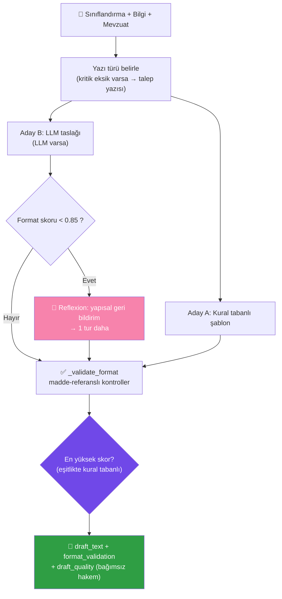

<details>
<summary><b>✅ Format Denetimi — Madde-Referanslı Kontrol Listesi (tıkla)</b></summary>

Her kontrol `{kural_id, durum, detay, dayanak, agirlik}` üretir; dayanaklar **2646 sayılı Resmî
Yazışmalarda Uygulanacak Usul ve Esaslar Hakkında Yönetmelik** fıkralarına atıflıdır:

| Kural | Dayanak | Ağırlık |
|---|---|:---:|
| `tc_basligi` (T.C. başlığı) | m.10/2 | 1.0 |
| `sayi_alani` | m.11/1 | 1.0 |
| `sayi_bicimi` | m.11 | 0.5 |
| `tarih` | m.12/1 | 1.0 |
| `konu_alani` | m.13/1 | 1.0 |
| `konu_kisa_oz` (≤160 karakter) | m.13 | 0.5 |
| `muhatap` | m.14 | 1.0 |
| `ilgi` (koşullu) | m.15/1 | 1.0 |
| `kapanis` | m.16/12 | 1.0 |
| `bitis_hiyerarsi` (Arz/Rica) | m.16/12-a,b | 1.0 |
| `yabanci_kelime` | m.16/8 | 0.25 |
| `maddeleme` | m.16/10 | 0.5 |
| `imza` | m.17 | 1.0 |
| `yetki_devri_unvan` | m.17/9 | 0.5 |
| `gizlilik_kisitli` (koşullu) | m.25/26 | 1.0 |
| `yer_tutucu` (iç kalite) | — | 1.0 |

**`uygun = ağırlıklı_skor ≥ 0.8 AND yer_tutucu_temiz`**. Gövdede yalnızca benzerliği **≥0.6** olan
mevzuat eşleşmelerine atıf yapılır; yoksa "ilgili mevzuat hükümleri" ifadesi kullanılır (uydurma
madde numarası **üretilmez**).

</details>

---

### 9️⃣ Birim Yönlendirme — [`routing_agent.py`](src/agents/routing_agent.py)

Evrağı **9 birimden** doğru olana yönlendirir; ağırlıklı anahtar kelime + konu/muhatap sinyalleri
+ tür bonuslarıyla skorlar.

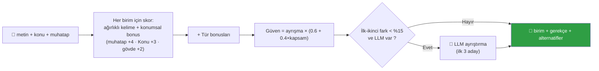

**9 birim:** `yazi_isleri, hukuk, insan_kaynaklari, mali_hizmetler, bilgi_islem, strateji,
basin_halkla_iliskiler, destek_hizmetleri, genel_mudurluk`. Skor yoksa varsayılan `yazi_isleri`
(güven 0.3). "mali" gibi kelimeler tam sözcük kısıtına tabidir ("maliyet" mali birime kaymaz).

---

### 🔟 Kullanıcı Bilgilendirme — [`user_info_agent.py`](src/agents/user_info_agent.py)

| | |
|---|---|
| **Görev** | İşlem sonuçlarını anlaşılır sunar, somut **sonraki adımları** listeler, kritik/önemli eksikler için açık Türkçe sorular üretir |
| **Çıkış** | `user_notifications` + `clarification_requests` (`{alan, soru, soru_muhatabi, gerekce, oncelik}`) |
| **Akıllı muhatap** | İç belge türlerinde (tutanak/rapor/onaylı belge/genelge) soru muhatabı "belgeyi düzenleyen birim", aksi halde "başvuru sahibi" |

---

## 📚 Hibrit Mevzuat RAG — Derin Dalış

Mevzuat önerisi, projenin en özenli bilgi-getirme (retrieval) katmanıdır. Çekirdek **saf Python
BM25-Okapi**'dir (harici `rank_bm25`/sklearn yok); üstüne tema ağırlıklandırma, düzeltici sorgu
genişletme, usul mevzuatı garantisi ve KVKK köprüsü eklenir. Opsiyonel olarak yoğun (dense)
semantik arama + yeniden sıralama devreye alınabilir.

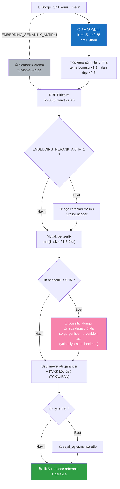

**Neden mutlak benzerlik?** Çoğu RAG demosu skorları rölatif normalize eder ve her zaman "yüksek
benzerlik" gösterir. Bu sistem benzerliği mutlak ölçekte raporlar: en iyi eşleşme bile zayıfsa
(`<0.5`) sonuç **açıkça "zayıf eşleşme" işaretlenir** ve taslakta atıf yapılmaz. Bu, jüri önünde
dürüst ve savunulabilir bir davranıştır.

**Korpus (15 belge):** `belediye_kanunu_5393, bilgi_edinme_kanunu_4982,
cimer_vatandas_basvurulari_bilgi_notu, devlet_arsiv_hizmetleri_yonetmeligi,
devlet_memurlari_kanunu_657, dilekce_hakki_kanunu_3071, e_yazisma_teknik_rehberi_bilgi_notu,
elektronik_imza_kanunu_5070, idari_yargilama_usulu_kanunu_2577, imar_kanunu_3194,
kabahatler_kanunu_5326, kamu_ihale_kanunu_4734, kamu_mali_yonetimi_5018, kvkk_6698,
resmi_yazisma_yonetmeligi` (kaynak: mevzuat.gov.tr, kamuya açık).

---

## 🔒 KVKK ve Anonimleştirme

Kişisel veri içeren evraklar paylaşılırken, sistem **format-koruyan ve geri döndürülemez** bir
maskeleme uygular. Maskeleme sırası, desenlerin birbirine karışmaması için özenle seçilmiştir.

```mermaid
flowchart LR
    IN["📄 Ham metin"] --> M1["1. IBAN<br/>TR** **** 4 hane açık"]
    M1 --> M2["2. TCKN<br/>2********** (checksum'lı)"]
    M2 --> M3["3. Telefon<br/>05** *** ** **"]
    M3 --> M4["4. Plaka<br/>** *** **"]
    M4 --> M5["5. Doğum tarihi<br/>alfasayısal → *"]
    M5 --> M6["6. Sicil no"]
    M6 --> M7["7. E-posta<br/>e***@alan"]
    M7 --> M8["8. Adres"]
    M8 --> M9["9. Kişi adı<br/>E*** K*** (unvan korunur)"]
    M9 --> NET["🕸️ Güvenlik ağı:<br/>kalan değerleri maskele"]
    NET --> OUT["🔒 anonymized_text<br/>+ 9 kategori sayacı"]
    style IN fill:#ff6b6b,color:#fff
    style OUT fill:#2f9e44,color:#fff
```

**Neden IBAN önce?** IBAN'daki hane grupları yanlışlıkla telefon/TCKN desenine aday olmasın diye;
adres kişi adından önce maskelenir. **Tüzel kişi istisnası:** kurum adları/unvanlar maskelenmez;
"ticaret/vergi/tapu" önekli siciller (tüzel) maskelenmez. **Şüphede maskeleme tercih edilir**
(KVKK md.4 ölçülülük ilkesi).

**Bağımsız sızıntı denetimi:** [`kvkk_denetim.py`](src/utils/kvkk_denetim.py) anonimleştirilmiş
metinde kalan maskelenmemiş PII'yi (checksum-geçerli TCKN, telefon, e-posta, IBAN) sayar — i2b2
de-identification protokolünün referanssız uyarlaması.

---

## 🎓 Güven ve Ölçüm Katmanı

Bu proje, kamu senaryosunda kritik olan "sistem ne kadar emin?" sorusuna akademik titizlikle
yanıt veren **12+ ölçüm/güven modülü** içerir. Hepsi saf Python'dur ve ayrı ayrı birim
testlenebilir.

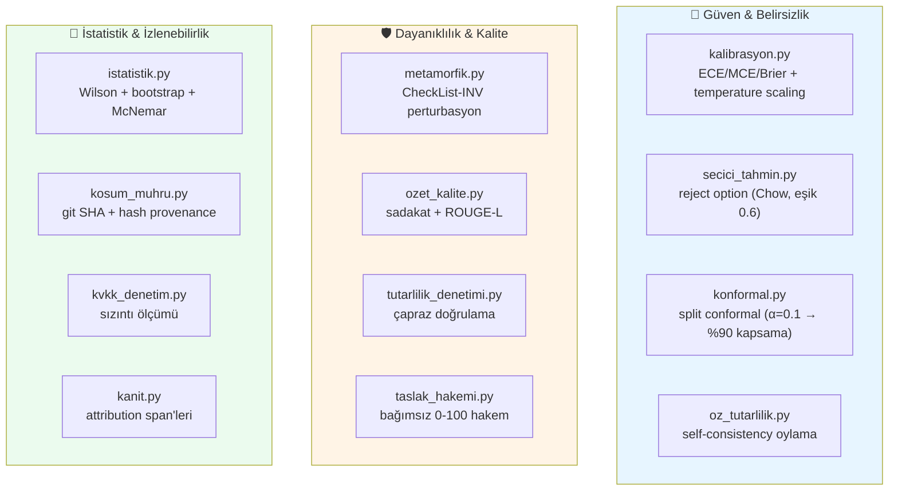

| Modül | Amaç | Yöntem / Literatür |
|---|---|---|
| [`kalibrasyon.py`](src/utils/kalibrasyon.py) | Güven kalibrasyonu ölçümü + tek-skaler sıcaklık ölçekleme | ECE/MCE/Brier/AURC; altın-oran araması; Guo+2017, Naeini 2015 |
| [`secici_tahmin.py`](src/utils/secici_tahmin.py) | Seçici sınıflandırma (reject option) + OOD skoru | Chow 1970; MSP/marj/OOV ağırlıklı belirsizlik; eşik `0.6` |
| [`konformal.py`](src/utils/konformal.py) | Kapsama-garantili tahmin **kümeleri** (LAC) | Angelopoulos&Bates 2021; α=0.1 → %90 kapsama |
| [`metamorfik.py`](src/utils/metamorfik.py) | Etiket-koruyan perturbasyonlarla invaryans testi | Ribeiro+2020 (CheckList-INV); diyakritik/OCR/gürültü |
| [`ozet_kalite.py`](src/utils/ozet_kalite.py) | Referanssız özet sadakati + ROUGE-L | Chen&Bansal 2018; Lin 2004; RAGAS |
| [`tutarlilik_denetimi.py`](src/utils/tutarlilik_denetimi.py) | Ajan çıktılarının çapraz doğrulaması | Du+2023 (Multiagent Debate) |
| [`taslak_hakemi.py`](src/utils/taslak_hakemi.py) | Üreticiden **bağımsız** taslak kalite hakemi (0-100) | LLM-as-judge + kural; RAGAS groundedness |
| [`taslak_reflexion.py`](src/utils/taslak_reflexion.py) | Format çıktısını sözlü eleştiriye çevirme | Shinn+2023 (Reflexion); Madaan+2023 (Self-Refine) |
| [`istatistik.py`](src/utils/istatistik.py) | %95 güven aralıkları + eşleştirilmiş anlamlılık | Wilson 1927; bootstrap; McNemar 1947 |
| [`emsal_cbr.py`](src/utils/emsal_cbr.py) | Emsal-tabanlı akıl yürütme (advisory) | Aamodt&Plaza 1994 |
| [`kosum_muhru.py`](src/utils/kosum_muhru.py) | Tekrarlanabilirlik mührü (git SHA, hash) | NeurIPS reproducibility |
| [`kanit.py`](src/utils/kanit.py) | Karar-kaynak eşlemesi (attribution) | grounded span'ler, halüsinasyon riski yok |
| [`turkce_ner.py`](src/utils/turkce_ner.py) | Türkçe YER NER (gazetteer, 81 il) | CoNLL-tarzı F1 |

---

## ⏱️ Triage — Akıllı Önceliklendirme

Triage ajanı, evrakın aciliyetini **üç sinyal katmanını birleştirerek** hesaplar ve bir yasal
süre varsa **son işlem tarihini** iş günü + resmî tatil takvimine göre bulur. Bu, şartnamedeki
"süreç yönetimi" beklentisinin özgün bir karşılığıdır.

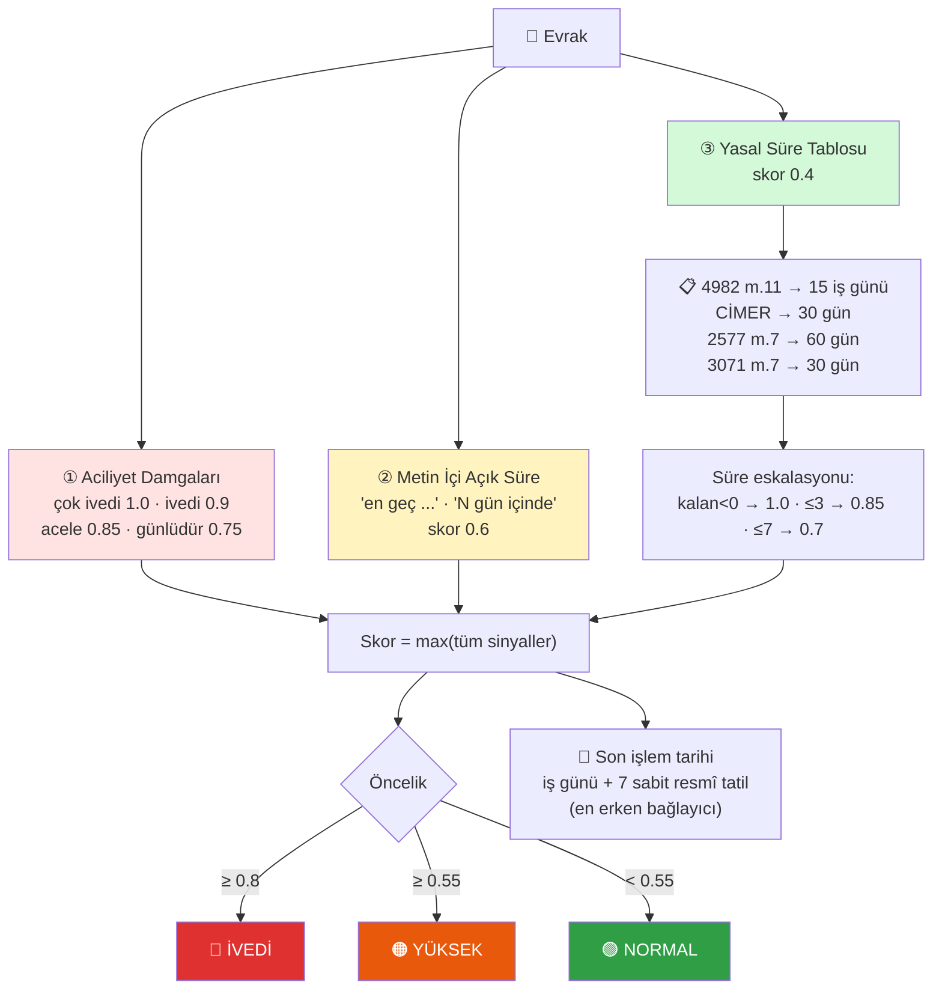

**İhtiyatlı tasarım:** Yasal süre tablosundaki `başvuru_koşulu=True` satırlar yalnızca başvuru
niteliği taşıyan evraklarda uygulanır (tutanak/rapor/genelge gibi iç belgeler hariç). Dinî
bayramlar takvim dışıdır (yaklaşık "en geç" tarih, ihtiyatlı yorum). Evrak tarihi yoksa `son_tarih`
boş döner ve bir not düşülür (halüsinasyon yerine dürüst boşluk).

---

## 🧩 Teknoloji Yığını

<div align="center">

| Alan | Çekirdek (zorunlu) | Opsiyonel (zarif düşümlü) |
|---|---|---|
| **Dil** | Python 3.9+ | — |
| **Orkestrasyon** | stdlib `dataclasses`, `time` | — |
| **LLM** | stdlib `urllib` (OpenAI-uyumlu / Ollama) | — |
| **PDF** | `pypdf ≥6.13.3` | — |
| **RAG** | saf Python BM25 | `sentence-transformers` (semantik + rerank) |
| **ML** | saf Python Naive Bayes | — |
| **Web** | `streamlit ≥1.30` | — |
| **Veri/Grafik** | `pandas`, `altair` | `numpy` |
| **Konsol** | `rich` | — |
| **Denetim izi** | `sqlite3` (stdlib) | — |
| **OCR** | — | `pytesseract`, `pdf2image`, `easyocr`, `opencv`, `Pillow` |
| **Yerel model** | — | `transformers`, `torch` |
| **Sunum** | — | `python-pptx` |
| **Test** | `pytest`, `pytest-cov` | — |

</div>

> [!NOTE]
> **Çekirdek felsefe:** `requirements.txt` yalnızca sistemin TAM çalışması için gerekenleri içerir.
> LangChain / LangGraph / OpenAI-SDK / torch **çekirdekte yer almaz**. Opsiyonel yetenekler
> (`requirements-optional.txt`) yoksa sistem hata vermez; ilgili özellik zarifçe devre dışı kalır
> ve çekirdek `.txt` akışı hiç etkilenmez.

---

## ⚡ Hızlı Başlangıç

### 🪟 Windows (tek tık)

Depoyu indirin ve **`calistir.bat`** dosyasına **çift tıklayın**. Betik otomatik olarak:

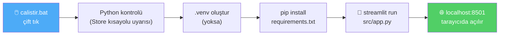

Ek kurulum gerektirmez; ilk çalıştırmada bağımlılık kurulumu birkaç dakika sürebilir.

### 🐧 Linux / macOS

Bağımlılıklar kuruluysa (`pip install -r requirements.txt`) tek komut yeterlidir:

```bash
./baslat.sh          # Streamlit web arayüzü  → http://localhost:8501
./baslat.sh --api    # REST API              → http://127.0.0.1:8765
```

### 🐳 Docker

Hazır imaj yayınlanmaz; **Dockerfile sağlanır** (temel imaj `python:3.12-slim`, root olmayan
kullanıcı, HEALTHCHECK'li):

```bash
docker build -t kamu-evrak-ajan .
docker run --rm -p 8501:8501 -p 8765:8765 kamu-evrak-ajan
# Streamlit :8501  ·  REST API :8765
```

---

## 🚀 Kurulum

### Gereksinimler

- **Python 3.9+** (CI 3.9 ve 3.12'de doğrular)
- `pip`

### Adım Adım

```bash
# 1. Depoyu klonlayın
git clone https://github.com/msgxr/teknofest-2026-kamu-evrak-akilli-ajan.git
cd teknofest-2026-kamu-evrak-akilli-ajan

# 2. Sanal ortam oluşturun
python -m venv .venv
# Windows:
.venv\Scripts\activate
# Linux/macOS:
source .venv/bin/activate

# 3. Çekirdek bağımlılıkları yükleyin (sistem bunlarla TAM çalışır)
pip install -r requirements.txt

# 3b. (Opsiyonel) OCR, semantik arama, yerel model yetenekleri için
pip install -r requirements-optional.txt

# 4. (Opsiyonel) LLM kullanacaksanız ortam değişkenlerini ayarlayın
#    LLM tanımlanmazsa sistem kural tabanlı modda TAM işlevli çalışır.
cp .env.example .env          # Windows: copy .env.example .env
# .env içinde OPENAI_API_KEY tanımlayın veya yerel Ollama başlatın

# 5. Örnek bir evrak işleyerek kurulumu doğrulayın
python -m src.main --input data/raw/kurgu_evraklar/dilekce_01.txt
```

### Ortam Değişkenleri (opsiyonel LLM)

| Değişken | Varsayılan | Açıklama |
|---|---|---|
| `LLM_BACKEND` | _(otomatik)_ | `openai` / `ollama` / `offline` |
| `OPENAI_API_KEY` | — | OpenAI veya uyumlu API anahtarı |
| `LLM_BASE_URL` | `https://api.openai.com/v1` | OpenAI-uyumlu uç (OpenRouter, Groq, vLLM, LM Studio...) |
| `LLM_MODEL_NAME` | `gpt-4o-mini` | OpenAI yolu model adı |
| `LLM_OLLAMA_MODEL` | `qwen2.5:7b` | Ollama model adı |
| `APP_OFFLINE` | — | `1` → **katı offline kilidi** (PII sızıntısı önlemi) |
| `EMBEDDING_SEMANTIK_AKTIF` | `0` | `1` → `turkish-e5-large` semantik arama |
| `EMBEDDING_RERANK_AKTIF` | `0` | `1` → `bge-reranker-v2-m3` yeniden sıralama |

> **Katı offline kilidi (`APP_OFFLINE=1`):** Ham/maskesiz kişisel verinin 3. taraf API'ye
> sızmasını kesin olarak önlemek için LLM tespitini devre dışı bırakır; sistem tamamen kural
> tabanlı çalışır.

---

## 📖 Kullanım Kılavuzu

### 🖱️ Komut Satırı (CLI)

```bash
# Tek evrak işleme
python -m src.main --input data/raw/kurgu_evraklar/dilekce_01.txt

# Çalışma modu: full (varsayılan) / classify (Görev 1) / draft (Görev 2)
python -m src.main --input data/raw/kurgu_evraklar/ust_yazi_01.txt --mode classify

# Bir klasördeki tüm .txt evrakları toplu işle + özet tablo
python -m src.main --klasor data/raw/kurgu_evraklar --json sonuclar.json

# Her evrak için HTML denetim raporu üret
python -m src.main --klasor data/raw/kurgu_evraklar --html-rapor ./raporlar

# İşlemleri SQLite kayıt defterine yaz
python -m src.main --input data/raw/kurgu_evraklar/rapor_01.txt --kayit

# Demo senaryosu (3 farklı evrak türü, uçtan uca)
python -m src.main --demo
# veya doğrudan:
python demo/demo_scenario.py
```

<details>
<summary><b>Tüm CLI argümanları (tıkla)</b></summary>

| Argüman | Kısa | Değerler | İşlev |
|---|---|---|---|
| `--input` | `-i` | dosya yolu | Tek evrak işle |
| `--output` | `-o` | dizin | Çıktı dizini (varsayılan `./output/`) |
| `--mode` | `-m` | full/classify/draft | Çalışma modu |
| `--klasor` | | dizin | Dizindeki tüm `.txt` toplu işle |
| `--json` | | dosya | Sonuçları JSON'a yaz |
| `--html-rapor` | | dizin | Evrak başına HTML rapor |
| `--kayit` | | flag | Kayıt defterine yaz |
| `--demo` | | flag | Demo senaryosu |
| `--web` | | flag | Streamlit'i başlat |
| `--verbose` | `-v` | flag | DEBUG log |

</details>

### 🐍 Python API

`pipeline.process()` bir **sözlük (dict)** döndürür; tüm sonuç alanlarına anahtarla erişilir.

```python
from src.pipelines.end_to_end_pipeline import EndToEndPipeline

pipeline = EndToEndPipeline()

# Dosyadan evrak işle (TXT / PDF; OCR bağımlılıkları kuruluysa PNG/JPG)
sonuc = pipeline.process("data/raw/kurgu_evraklar/dilekce_01.txt")

print(sonuc["siniflandirma"]["tur_adi"])     # "Dilekçe"
print(sonuc["siniflandirma"]["guven"])        # 0.91
print(sonuc["ozet"])                          # Evrak özeti
print(sonuc["yazi_taslagi"])                  # Resmî yazı taslağı
print(sonuc["yonlendirme"]["birim"])          # Birim yönlendirme
print(sonuc["onceliklendirme"]["son_tarih"])  # Yasal son işlem tarihi
print(sonuc["islem_adimlari"])                # Adım adım süre/durum kaydı

# Dosya olmadan doğrudan metin işleme
sonuc = pipeline.process_text(
    "Sayın Yazı İşleri Müdürlüğüne,\n\nDilekçeme ilişkin bilgi talep ediyorum. Arz ederim."
)
print(sonuc["siniflandirma"]["tur"])

# Toplu işleme
sonuclar = pipeline.process_batch([
    "data/raw/kurgu_evraklar/dilekce_01.txt",
    "data/raw/kurgu_evraklar/ust_yazi_01.txt",
])
```

### 📊 Değerlendirme

```bash
# Geliştirme seti (52 evrak) üzerinde tüm metrikler
python scripts/evaluate.py

# Tutulmuş (held-out) setler
python scripts/evaluate.py --veri-dizini data/raw/kurgu_evraklar_heldout    --rapor-dosyasi data/processed/eval_report_heldout.json
python scripts/evaluate.py --veri-dizini data/raw/kurgu_evraklar_heldout_v4 --rapor-dosyasi data/processed/eval_report_heldout_v4.json

# Metamorfik dayanıklılık testi
python scripts/dayaniklilik_testi.py

# Performans benchmark'ı
python scripts/benchmark.py
```

---

## 🖥️ Web Arayüzü

Streamlit tabanlı kurumsal pano; tamamen saf Python ile üretilir (ayrı CSS/HTML dosyası ve dış
CDN çağrısı **yoktur** → offline-first korunur). **8 sekmeden** oluşur:

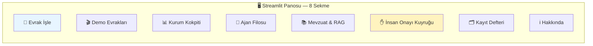

| Sekme | İçerik |
|---|---|
| 📄 **Evrak İşle** | Dosya yükleme (TXT/PDF/PNG/JPG) veya metin yapıştırma → **canlı akış** ile 11 ajanlık işlem hattı (her adım süresiyle anlık yazılır) → tam sonuç görünümü |
| 🎬 **Demo Evrakları** | Kurgusal örnekleri seçip işleme, içerik önizleme, etiket gösterimi |
| 📊 **Kurum Kokpiti** | Toplu işleme + canlı akış + 4 metrik + tür/birim dağılım grafikleri + **kaynaklı zaman tasarrufu** kaydırıcısı + evrak ilişki zinciri |
| 🤖 **Ajan Filosu** | Multi-Agent Swarm görünümü: 11 ajan kartı (rol + canlı durum), Görev 1→2 akış şeridi, 3 koşullu kapı açıklaması |
| 📚 **Mevzuat & RAG** | Canlı BM25-Okapi araması, korpus kütüphanesi kartları, **oturum içi yeni mevzuat ekleme** (RAG ingestion) |
| ✋ **İnsan Onayı Kuyruğu** | HITL: düşük güven/gizlilik kayıtları → **Onayla / Düzelterek Kaydet** → geri bildirim döngüsü |
| 🗂️ **Kayıt Defteri** | SQLite denetim izi: istatistik kartları, dağılım grafikleri, filtreli sorgu, en yeni 50 kayıt |
| ℹ️ **Hakkında** | Mimari özeti, ajan tablosu, ASCII şema, şartname eşleşmesi |

**Sonuç görünümü** her evrak için: metrik satırı → öncelik → çok-ajanlı işlem hattı görseli →
HTML rapor indirme → sınıflandırma/çıkarım/eksikler/mevzuat/özet (sol) + taslak (Düz Metin / Resmî
A4 görünümü)/format denetimi/yönlendirme/bilgilendirme (sağ) → emsal evraklar → **KVKK Paylaşım
Nüshası** (maskeli varsayılan; ham nüsha yalnızca "🔓 bilinçli erişim" arkasında) → e-Yazışma
üstverisi → işlem adımları.

---

## 🌐 REST API

Saf stdlib `http.server` (ThreadingHTTPServer), **sıfır ek bağımlılık**. Varsayılan bind
`127.0.0.1:8765`. Tüm yanıtlar UTF-8 JSON. Başlatma: `python -m src.api`.

| Yol | Method | Döndürür |
|---|:---:|---|
| `/saglik` | GET | Servis durumu, sürüm, LLM backend, ajan sayısı |
| `/birimler` | GET | Yönlendirme birim kataloğu (9 birim) |
| `/evrak-turleri` | GET | Evrak türü kataloğu (8+1) |
| `/evrak/isle` | POST | `{"metin","mod"}` → uçtan uca pipeline sonucu |
| `/evrak/anonimlestir` | POST | `{"metin"}` → KVKK anonim metin + rapor |

```bash
# Başlat
python -m src.api --port 8765

# Örnek çağrı
curl -X POST http://127.0.0.1:8765/evrak/isle \
  -H "Content-Type: application/json" \
  -d '{"metin":"Sayın Yazı İşleri Müdürlüğüne, bilgi talep ediyorum. Arz ederim.","mod":"full"}'
```

**Güvenlik:** 1 MB gövde sınırı (413), Content-Length zorunlu, geçersiz JSON (400), bilinmeyen uç
(404), 60 sn timeout, hata mesajları iç ayrıntı sızdırmaz.

---

## 🔗 MCP Sunucusu

**Model Context Protocol** (JSON-RPC 2.0 / stdio) sunucusu — 5 aracı harici `mcp` SDK gerektirmeden
sağlar; EBYS/ajan ekosistemlerinin sistemi bir **"araç"** olarak çağırabilmesi vizyonu.
Başlatma: `python -m src.mcp_server`.

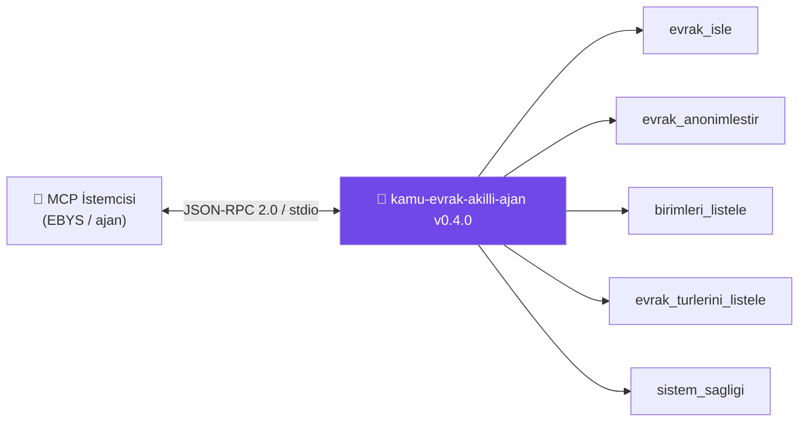

| Araç | İşlev |
|---|---|
| `evrak_isle` | Uçtan uca işleme; yanıt `insan_onayi.gerekli` bayrağı taşır |
| `evrak_anonimlestir` | KVKK paylaşım nüshası üretir |
| `birimleri_listele` | Yönlendirme birimlerini listeler |
| `evrak_turlerini_listele` | Tanınan evrak türlerini listeler |
| `sistem_sagligi` | Çalışma durumu + LLM backend |

---

## 📁 Proje Yapısı

```
teknofest-2026-kamu-evrak-akilli-ajan/
├── README.md                       # Bu dosya
├── LICENSE                         # Apache 2.0
├── CHANGELOG.md                    # Sürüm geçmişi (Keep a Changelog)
├── CONTRIBUTING.md                 # Katkı + değerlendirme bütünlüğü kuralları
├── Dockerfile                      # python:3.12-slim, root olmayan kullanıcı
├── baslat.sh / calistir.bat        # Linux-macOS / Windows başlatıcılar
├── requirements.txt                # Çekirdek (sistem bunlarla TAM çalışır)
├── requirements-optional.txt       # Opsiyonel (OCR, semantik, yerel model)
├── pyproject.toml                  # Proje meta (Python ≥3.9, ruff, mypy)
├── .env.example                    # Ortam değişkenleri örneği
│
├── src/
│   ├── agents/                     # 🤖 11 uzman ajan + orchestrator.py
│   │   ├── orchestrator.py         #    Koşullu akış, 3 kapı, AgentState
│   │   ├── ocr_agent.py            #    0️⃣ Metin/PDF/görüntü okuma
│   │   ├── classification_agent.py #    1️⃣ Üçlü hibrit sınıflandırma
│   │   ├── info_extraction_agent.py#    2️⃣ Bilgi çıkarımı
│   │   ├── missing_info_agent.py   #    3️⃣ Eksik bilgi (ZORUNLU_ALANLAR)
│   │   ├── legislation_agent.py    #    4️⃣ Hibrit mevzuat RAG
│   │   ├── triage_agent.py         #    5️⃣ Önceliklendirme + yasal süre
│   │   ├── summarization_agent.py  #    6️⃣ Sadakat-garantili özet
│   │   ├── anonimlestirme_agent.py #    7️⃣ KVKK maskeleme
│   │   ├── draft_writer_agent.py   #    8️⃣ Taslak + format denetimi
│   │   ├── routing_agent.py        #    9️⃣ Birim yönlendirme
│   │   └── user_info_agent.py      #    🔟 Kullanıcı bilgilendirme
│   │
│   ├── models/
│   │   ├── llm_wrapper.py           # Model-agnostik LLM (urllib, SDK yok)
│   │   └── istatistiksel_siniflandirici.py  # Saf Python Naive Bayes
│   │
│   ├── utils/                       # 🧩 29 yardımcı modül (güven/ölçüm katmanı)
│   │   ├── bm25.py                  #    BM25-Okapi (RAG çekirdeği)
│   │   ├── kalibrasyon.py           #    ECE + temperature scaling
│   │   ├── konformal.py             #    Conformal prediction
│   │   ├── secici_tahmin.py         #    Reject option
│   │   ├── metamorfik.py            #    CheckList-INV dayanıklılık
│   │   ├── kvkk_denetim.py          #    Sızıntı ölçümü
│   │   ├── kayit_defteri.py         #    SQLite denetim izi
│   │   ├── kokpit.py                #    Kurum kokpiti
│   │   └── ...                      #    (+21 modül; ayrıntı: docs/)
│   │
│   ├── templates/                   # 5 resmî yazı şablonu (.txt)
│   ├── pipelines/end_to_end_pipeline.py  # EndToEndPipeline
│   ├── app.py                       # Streamlit web arayüzü (8 sekme)
│   ├── api.py                       # REST API (http.server)
│   ├── mcp_server.py                # MCP sunucusu (JSON-RPC/stdio)
│   ├── config.py                    # pydantic-settings ayarları
│   └── main.py                      # CLI giriş noktası
│
├── data/
│   ├── raw/
│   │   ├── kurgu_evraklar/          # 52 geliştirme evrakı + etiketler.json
│   │   ├── kurgu_evraklar_heldout/  # 16 tutulmuş (v1)
│   │   ├── kurgu_evraklar_heldout_v2/  # 16 tutulmuş (v2)
│   │   ├── kurgu_evraklar_heldout_v3/  # 16 adversarial (v3)
│   │   ├── kurgu_evraklar_heldout_v4/  # 16 temiz adversarial (v4)
│   │   └── mevzuat_metinleri/       # 15 mevzuat belgesi (RAG korpusu)
│   └── processed/                   # eval_report*.json, kayıt defteri
│
├── scripts/                         # evaluate.py, benchmark.py, dayaniklilik_testi.py, ...
├── tests/                           # 42 test modülü (632 test)
├── docs/                            # 14 teknik doküman
├── demo/                            # Demo senaryoları
└── presentations/                   # Sunum kaynakları (md) + PPTX
```

---

## 📊 Veri Setleri

Bu projede **gerçek kamu verisi kullanılmamaktadır** — tümü sentetik/kurgudur. Kurgu TCKN'ler
resmî checksum'ı geçer ama gerçek bir kişiye ait olamaz (KVKK ilkesi). Telefonlar `05XX 000 XX XX`
kalıbındadır; il/ilçe adları kurgu evrenlerdendir (Akçova, Bozkırova, Puslupınar...).

```mermaid
pie showData
    title Etiketli Kurgu Evrak Dağılımı
    "Geliştirme (kalibrasyon)" : 52
    "Tutulmuş v1" : 16
    "Tutulmuş v2" : 16
    "Adversarial v3" : 16
    "Temiz Adversarial v4" : 16
```

| Set | Evrak | Rol | Adlandırma |
|---|:---:|---|---|
| `kurgu_evraklar/` | **52** | Ana geliştirme & kalibrasyon seti | `<tur>_01..07` + `ornek_*` |
| `kurgu_evraklar_heldout/` | 16 | 1. tutulmuş set (dış geçerlilik) | `<tur>_h1/_h2` |
| `kurgu_evraklar_heldout_v2/` | 16 | 2. tutulmuş set | `<tur>_v1/_v2` |
| `kurgu_evraklar_heldout_v3/` | 16 | Adversarial (zorlayıcı) set | `<tur>_a1/_a2` |
| `kurgu_evraklar_heldout_v4/` | 16 | İyileştirme sonrası **temiz** adversarial | `<tur>_b1/_b2` |
| `mevzuat_metinleri/` | 15 | RAG korpusu (kanun/yönetmelik) | kanun/yönetmelik adı |

**Etiket şeması** (`etiketler.json`): her evrak için `{tur, birim_kodu, eksik_alanlar, aciklama,
mevzuat_beklenen?}`. `eksik_alanlar` anahtarları `ZORUNLU_ALANLAR` ile birebir uyumludur;
opsiyonel `mevzuat_beklenen`, isabet@3 metriği için 1-3 doc_id listeler. Etiketler **sistem
çıktısına bakılmadan**, içerik + hukuki rehberle atanır.

> [!WARNING]
> **Değerlendirme bütünlüğü:** Tutulmuş (held-out) setler kural/kod geliştirmede kullanılmaz. Bir
> held-out setteki hataya bakılarak düzeltme yapılırsa set held-out niteliğini kaybeder ve bu
> durum `docs/teknik_rapor.md §5`'e açıkça yazılır. `eval_report*.json` dosyaları elle
> düzenlenmez; yalnızca `scripts/evaluate.py` üretir.

---

## 📈 Değerlendirme ve Metrikler

Etiketli sentetik setlerde, **tamamen çevrimdışı (kural tabanlı)** modda ölçülmüştür
(`python scripts/evaluate.py`; metodoloji: [docs/teknik_rapor.md](docs/teknik_rapor.md)).

<div align="center">

| Metrik | Geliştirme (52) | Tutulmuş (16) | Tutulmuş v2 (16) | Temiz Adversarial v4 (16) |
|---|:---:|:---:|:---:|:---:|
| 🏷️ Sınıflandırma doğruluğu | **1.000** | **1.000** | **1.000** | 0.938 |
| 🏢 Birim yönlendirme doğruluğu | 0.962 | **1.000** | 0.938 | 0.938 |
| ⚠️ Eksik bilgi tespiti (micro-F1) | **1.000** | **1.000** | **1.000** | **1.000** |
| 📚 Mevzuat önerisi isabet@3 | 0.962 | 0.875 | 0.750 | 0.938 |
| ✍️ Taslak kalitesi (bağımsız hakem, 0-100) | 93.6 | 95.8 | 94.6 | 94.7 |
| ⏱️ Evrak başına medyan süre | 0.011 sn | 0.012 sn | 0.012 sn | ~0.012 sn |

</div>

### Ölçülen Metrikler ve Yöntem

| Metrik | Hesaplama |
|---|---|
| **Sınıflandırma** | accuracy + sınıf bazında precision/recall/F1 + macro-F1 + confusion matrisi |
| **Yönlendirme** | tahmin `birim_kodu` == etiket `birim_kodu` |
| **Eksik bilgi** | micro precision/recall/F1 (tüm evraklarda TP/FP/FN toplanır) |
| **Mevzuat isabet@k** | beklenen doc_id'lerden ≥1'i ilk-k tahminde varsa hit (k=1,3) + MRR + nDCG (RAGAS) |
| **Taslak kalitesi** | üreticiden bağımsız hakem (0-100), ortalama/asgari |
| **Performans** | evrak başına ortalama/medyan süre + adım bazında süre |

**Ek ölçüm katmanları:** güven kalibrasyonu (ECE/MCE/Brier; sıcaklık öğrenimi yalnız geliştirme
setinde), seçici tahmin/reject-option (eşik 0.6), split conformal prediction (α=0.1), özet kalitesi
(sadakat/kaynak-kapsama), KVKK sızıntı denetimi, %95 güven aralıkları (Wilson+bootstrap), koşum
mührü (git SHA+hash), ablasyon (McNemar: tam sistem vs. baseline).

---

## 🛡️ Adversarial Dayanıklılık

Sistemin dış geçerliliğini kanıtlamak için, geliştirmede hiç görülmemiş **adversarial (zorlayıcı)**
setler kullanılmıştır: bozuk sayı bloğu, kopuk İlgi zinciri, sözel tarih, KVKK-yoğun içerik,
çift-doğalı olurlar.

```mermaid
flowchart LR
    V3["🔴 v3 — İLK ÖLÇÜM<br/>(düzeltmesiz)<br/>eksik F1: 0.667<br/>isabet@3: 0.875"]
    V3 --> FIX["🔧 3 İLKESEL DÜZELTME<br/>• Yapısal İlgi denetimi<br/>• Sözel tarih çözümü<br/>• KVKK veri-sinyali köprüsü"]
    FIX --> V3B["🟡 v3 — YENİDEN ÖLÇÜM<br/>eksik F1: 0.833<br/>isabet@3: 0.938"]
    FIX --> V4["🟢 v4 — TEMİZ SET<br/>(dokunulmamış, çift-etiketli)<br/>eksik F1: 1.000<br/>isabet@3: 0.938"]
    style V3 fill:#ff6b6b,color:#fff
    style FIX fill:#ffd43b
    style V3B fill:#ffe066
    style V4 fill:#51cf66,color:#fff
```

**Dürüstlük geleneği:** v3 seti üzerinde ölçülen üç sınırlılık (yapısal İlgi denetimi, sözel tarih,
KVKK veri-sinyali) **ilkesel olarak** giderilmiş (dosyaya özgü ezber olmadan; dev/tutulmuş/v2'de
sıfır regresyon). İyileştirilmiş sistem, **tamamen dokunulmamış, bağımsız çift-etiketlemeli yeni
bir adversarial set (v4)** ile temiz ölçülmüştür: sınıflandırma 0.938 · yönlendirme 0.938 · **eksik
bilgi micro-F1 1.000** (FP 0 / FN 0) · mevzuat isabet@3 0.938 · taslak 94.7. Üç düzeltme de bağımsız
evrende genelledi.

**Metamorfik dayanıklılık:** `scripts/dayaniklilik_testi.py`, etiket-koruyan bozulmalar
(diyakritik kaybı, yazım/OCR hatası, gürültü) altında tür/birim kararının **değişmeme oranını**
(invaryans) ve robust accuracy'yi ölçer (CheckList-INV).

---

## 🧪 Test ve CI

```mermaid
pie showData
    title Test Kapsamı Dağılımı
    "Ajanlar (11)" : 11
    "Ölçüm/Güven Katmanı" : 13
    "Arayüz/API/MCP" : 5
    "Yardımcı & Entegrasyon" : 9
```

**632 test** (42 modül) geçer. Kapsam: her ajan + tüm ölçüm modülleri + API/MCP + uçtan uca
entegrasyon + streaming + KVKK sızıntı + istatistiksel anlamlılık.

```bash
pytest tests/                              # tüm testler
pytest tests/test_classification.py        # tek modül
pytest tests/ --cov=src --cov-report=html  # kapsama raporu
```

### CI Hattı ([`.github/workflows/ci.yml`](.github/workflows/ci.yml))

```mermaid
flowchart LR
    PUSH["push / PR"] --> M1["🐍 Python 3.9"] & M2["🐍 Python 3.12"]
    M1 --> INSTALL["pip install<br/>requirements.txt"]
    M2 --> INSTALL
    INSTALL --> COMPILE["compileall<br/>(derleme denetimi)"]
    COMPILE --> TEST["pytest tests/"]
    TEST --> SMOKE["evaluate.py --limit 5<br/>(hızlı smoke)"]
    SMOKE --> OK["✅ Yeşil"]
    style OK fill:#51cf66,color:#fff
```

Her `push`/`pull_request`'te GitHub Actions, **Python 3.9 ve 3.12** matrisinde derleme denetimi,
tüm test paketini ve 5 evraklık hızlı değerlendirme smoke'unu çalıştırır (held-out bütünlüğü için
rapor geçici dizine yazılır).

<details>
<summary><b>42 test modülü (tıkla)</b></summary>

`test_adillik`, `test_anonimlestirme`, `test_api`, `test_asistan`, `test_asistan_hesap`,
`test_baseline`, `test_benchmark`, `test_bulanik`, `test_classification`, `test_draft_writer`,
`test_emsal`, `test_emsal_cbr`, `test_end_to_end`, `test_evaluation`, `test_eyazisma_xml`,
`test_goruntu_onisleme`, `test_ilgi_sozel_tarih_kvkk`, `test_iliski_zinciri`, `test_istatistik`,
`test_istatistiksel_siniflandirici`, `test_kalibrasyon`, `test_kanit`, `test_kayit_defteri`,
`test_kokpit_eyazisma`, `test_konformal`, `test_kosum_muhru`, `test_kvkk_denetim`,
`test_legislation`, `test_llm_constrained`, `test_mcp_server`, `test_metamorfik`,
`test_oz_tutarlilik`, `test_ozet_kalite`, `test_resmi_pdf`, `test_sayi_ustveri`,
`test_secici_tahmin`, `test_streaming`, `test_taslak_hakemi`, `test_taslak_reflexion`,
`test_triage`, `test_turkce_ner`, `test_tutarlilik`.

</details>

---

## 🚀 Performans

Benchmark (84 evrak × 5 tekrar, tek çekirdek, çevrimdışı) — ayrıntı:
[docs/performans_raporu.md](docs/performans_raporu.md):

<div align="center">

| Gösterge | Değer |
|---|:---:|
| ⚡ Verim (throughput) | **~88 evrak/saniye** |
| ⏱️ Gecikme (medyan) | 11.3 ms |
| ⏱️ Gecikme (p95) | 14.2 ms |
| 📈 Ölçekleme (1x→10x) | ~doğrusal |

</div>

`scripts/benchmark.py` verim, p95/p99 gecikme, adım bazında süre, tepe bellek (tracemalloc) ve
1x/5x/10x ölçekleme doğrusallığını ölçer; sonuç `data/processed/benchmark_raporu.json`.

---

## 📤 Örnek Çıktı

`pipeline.process()` çağrısının döndürdüğü sözlüğün yapısı (kısaltılmış örnek):

```jsonc
{
  "siniflandirma": {
    "tur": "dilekce",
    "tur_adi": "Dilekçe",
    "guven": 0.91,
    "yontem": "ensemble",          // kural + Naive Bayes birleşimi
    "gerekce": "Ağırlıklı kelime + kimlik bloğu sinyalleri"
  },
  "bilgi_cikarim": {
    "evrak_tarihi": "10.07.2026",
    "tc_kimlik": ["2**********"],   // ekranda maskeli
    "muhatap": "Basın ve Halkla İlişkiler Müdürlüğü",
    "ilgi_referanslari": []
  },
  "eksik_bilgiler": [
    { "alan": "imza", "oncelik": "kritik", "oneri": "Islak/e-imza ekleyiniz" }
  ],
  "mevzuat_eslestirme": [
    {
      "doc_id": "dilekce_hakki_kanunu_3071",
      "madde_etiketi": "m.7",
      "benzerlik": 0.83,
      "gerekce": "dilekçe · başvuru · cevap terimleri"
    }
  ],
  "onceliklendirme": {
    "oncelik": "yuksek",
    "yasal_sure": "3071 sayılı Kanun m.7 — 30 gün",
    "son_tarih": "09.08.2026",
    "kalan_gun": 27
  },
  "ozet": "Dilekçe | Konu: ... | Tarih: 10.07.2026 ...",
  "yazi_taslagi": "T.C.\n... (cevap yazısı taslağı) ...",
  "yazi_turu": "cevap_yazisi",
  "format_denetimi": { "uygun": true, "skor": 0.92 },
  "taslak_kalitesi": { "puan": 94, "yontem": "kural_tabanli" },
  "yonlendirme": {
    "birim": "Basın ve Halkla İlişkiler Müdürlüğü",
    "birim_kodu": "basin_halkla_iliskiler",
    "guven": 0.88,
    "alternatifler": ["yazi_isleri", "destek_hizmetleri"]
  },
  "anonimlestirme": { "rapor": { "toplam": 3, "yontem": "kural_tabanli" } },
  "insan_onayi": { "gerekli": false, "gerekceler": [] },
  "islem_adimlari": [
    { "agent": "ocr", "status": "success", "sure_saniye": 0.001 },
    { "agent": "classification", "status": "success", "sure_saniye": 0.003 }
  ]
}
```

---

## 🔐 Güvenlik ve Sağlamlık

Kamu senaryosu, bir yapay zekâ sisteminin yalnızca "doğru" değil aynı zamanda **saldırıya
dayanıklı** olmasını da gerektirir. Sistem, bilinen zafiyet sınıflarına karşı katmanlı savunma
içerir:

```mermaid
flowchart TB
    subgraph LLM_SEC["🤖 LLM Güvenliği"]
        A["Dolaylı Prompt Injection<br/>(OWASP LLM01)"] --> A1["belge_blogu() sınırlayıcı<br/>+ GUVENLIK_SISTEM_EKI<br/>evrak = 'yalnızca veri'"]
        B["Veri Sızıntısı"] --> B1["APP_OFFLINE=1 katı kilit<br/>PII 3. tarafa gitmez"]
    end
    subgraph INPUT_SEC["📥 Girdi Güvenliği"]
        C["ReDoS<br/>(CWE-1333)"] --> C1["RFC-sınırlı regex<br/>nicelleyiciler"]
        D["Girdi Şişirme (DoS)"] --> D1["≤200.000 karakter<br/>PDF ≤50 sayfa · ≤40 MP"]
        E["PDF Zafiyeti"] --> E1["PyPDF2 terk → pypdf<br/>≥6.13.3"]
    end
    subgraph DATA_SEC["🗄️ Veri & Çıktı Güvenliği"]
        F["SQL Injection<br/>(CWE-89)"] --> F1["Parametreli sorgular<br/>LIKE ESCAPE"]
        G["XSS<br/>(CWE-79)"] --> G1["html.escape<br/>HTML raporda"]
        H["SSRF / Yol<br/>(CWE-22)"] --> H1["URL şema doğrulaması<br/>yalnız http/https"]
    end
    style LLM_SEC fill:#fff0f6
    style INPUT_SEC fill:#fff9db
    style DATA_SEC fill:#e6fcf5
```

| Zafiyet Sınıfı | Savunma | Nerede |
|---|---|---|
| **Dolaylı prompt injection** (OWASP LLM01) | Evrak metni her LLM çağrısında `belge_blogu(...)` sınırlayıcısı + `GUVENLIK_SISTEM_EKI` sistem talimatıyla "yalnızca veri" olarak işaretlenir | `llm_wrapper.py` |
| **Veri sızıntısı** | `APP_OFFLINE=1` katı offline kilidi; ham/maskesiz PII 3. taraf API'ye gönderilmez | `llm_wrapper.py` |
| **ReDoS** (CWE-1333) | E-posta/telefon desenleri RFC-sınırlı nicelleyicilerle yazıldı (katastrofik geri-izleme yok) | `info_extraction_agent.py` |
| **Girdi şişirme (DoS)** | Azami 200.000 karakter girdi sınırı; PDF ilk 50 sayfa; görüntü ≤40 MP | orkestratör, `ocr_agent.py` |
| **PDF zafiyeti** | Yamasız DoS açığı olan `PyPDF2` terk edildi; bakımlı `pypdf ≥6.13.3` kullanılır | `requirements.txt` |
| **SQL injection** (CWE-89) | Kayıt defterinde tüm sorgular parametreli; `LIKE ESCAPE` ile joker arındırma | `kayit_defteri.py` |
| **XSS** (CWE-79) | HTML işlem raporunda tüm türeyen değerler `html.escape` | `islem_raporu.py` |
| **SSRF / yol geçişi** (CWE-22/B310) | LLM URL'lerinde yalnızca `http/https` şemasına izin | `llm_wrapper.py` |

---

## 🏛️ Mimari Kararlar

Bazı tasarım kararları, alışılmış "hızlı prototip" seçimlerinden bilinçli olarak ayrışır. En
önemlileri ve gerekçeleri:

<details open>
<summary><b>1. Neden framework yok (saf Python orkestrasyon)?</b></summary>

**Karar:** LangChain/LangGraph yerine `dataclass` + `time` üzerine kurulu özgün orkestratör.
**Gerekçe:** Kamu senaryosunda (a) güvenlik yüzeyini küçük tutmak, (b) her adımı okunur/test
edilebilir kılmak, (c) bağımlılık şişkinliğinden kaçınmak, (d) offline çalışmayı garanti etmek.
Sonuç: 632 test, tam denetlenebilir akış, çekirdekte tek bir ağır bağımlılık yok.
</details>

<details>
<summary><b>2. Neden offline-first (LLM opsiyonel)?</b></summary>

**Karar:** Sistem, hiçbir LLM olmadan uçtan uca tam işlevli; LLM yalnızca düşük güvenli kararlarda.
**Gerekçe:** Kurum ağları çoğu zaman internetsizdir ve kişisel veri 3. taraf API'ye çıkamaz.
Çekirdek zekâ; kalibre kural skorlaması + BM25 RAG + Naive Bayes'tir. LLM bir **hızlandırıcıdır**,
tek nokta arıza (single point of failure) değil.
</details>

<details>
<summary><b>3. Neden mutlak benzerlik (rölatif değil)?</b></summary>

**Karar:** Mevzuat benzerliği `min(1, skor / 1.5·Σidf)` ile mutlak ölçekte raporlanır.
**Gerekçe:** Rölatif normalizasyon her zaman "yüksek benzerlik" gösterir ve jüriyi yanıltır. Mutlak
ölçekle, zayıf eşleşme (`<0.5`) açıkça işaretlenir ve taslakta atıf yapılmaz — dürüst ve
savunulabilir.
</details>

<details>
<summary><b>4. Neden saf Python Naive Bayes (sklearn değil)?</b></summary>

**Karar:** TF-IDF + karakter 3-gram özellikli Multinomial NB, sıfır ağır bağımlılıkla.
**Gerekçe:** Küçük veri rejiminde (52 evrak) NB güçlü ve şeffaftır; ağırlıklar JSON'da okunabilir;
kural sınıflandırıcıyla `0.6/0.4` ensemble edilebilir. sklearn/numpy çekirdeğe girmez.
</details>

<details>
<summary><b>5. Neden desenler tek doğruluk kaynağı?</b></summary>

**Karar:** PII regex desenleri (`_TC_ADAY, _TELEFON, _EPOSTA, _IBAN`) `info_extraction`'da tanımlı;
KVKK ajanı bunları import eder.
**Gerekçe:** Çıkarım ile maskeleme arasında desen ayrışması olursa, çıkarılan ama maskelenmeyen PII
(sızıntı) doğar. Tek kaynak bu sınıf hatayı kökten önler.
</details>

---

## 🔁 İnsan-Döngüde (HITL) Durum Makinesi

Düşük güvenli veya gizlilik-kısıtlı kararlar otomatik "geçmez"; gerekçeleriyle bir insan onayı
kuyruğuna düşer. Nihai karar **her zaman insandadır**.

```mermaid
stateDiagram-v2
    [*] --> İşleniyor
    İşleniyor --> Otomatik_Onay: güven ≥ 0.6 ve tutarlı
    İşleniyor --> Kuyrukta: güven 0.6 altında · gizlilik · çelişki
    Kuyrukta --> Onaylandı: 👤 Kararı Onayla
    Kuyrukta --> Düzeltildi: 👤 Düzelterek Kaydet
    Düzeltildi --> GeriBildirim: geri_bildirim.jsonl
    GeriBildirim --> Kalibrasyon: kalibrasyon_onerisi.py
    Otomatik_Onay --> [*]
    Onaylandı --> [*]
    Kalibrasyon --> [*]
    note right of Kuyrukta
      Kayıt defterinde
      insan_onayi = True
    end note
```

Kullanıcı düzeltmeleri `data/processed/geri_bildirim.jsonl`'e yazılır; `kalibrasyon_onerisi.py`
bunlardan somut kalibrasyon önerileri üretir (kuralları **otomatik değiştirmez** — insan onayı).

---

## 🧱 Pipeline Bileşen Modeli

```mermaid
classDiagram
    class EndToEndPipeline {
        +process(input_file, mode) dict
        +process_text(text, mode) dict
        +process_batch(files) list
        -_kayda_gecir(results)
    }
    class OrchestratorAgent {
        +process(input_file, mode, on_step) dict
        +process_text(text, mode) dict
        -_run_workflow(mode) dict
        -_run_step(name) 
        -AgentState state
    }
    class AgentState {
        +raw_text
        +classification
        +extracted_info
        +legislation_matches
        +draft_text
        +routing_suggestion
        +processing_steps
    }
    class KayitDefteri {
        +kaydet(sonuc) int
        +sorgula(...) list
        +istatistik() dict
    }
    class LLMWrapper {
        +is_available() bool
        +generate(prompt) str
        +generate_json(prompt, schema) dict
    }
    EndToEndPipeline --> OrchestratorAgent : delege eder
    EndToEndPipeline --> KayitDefteri : denetim izi
    OrchestratorAgent --> AgentState : yönetir
    OrchestratorAgent --> LLMWrapper : opsiyonel
    OrchestratorAgent --> "11" UzmanAjan : koordine eder
```

---

## 🧭 Anayasal İlkeler

Bu proje, Anthropic'in **Anayasal Yapay Zekâ (Constitutional AI)** yaklaşımını TEKNOFEST şartname
kısıtlarıyla harmanlar. [`CLAUDE.md`](CLAUDE.md) tüm yapay zekâ ajanları için bağlayıcı bir proje
anayasasıdır:

| # | İlke | Karşılığı |
|:---:|---|---|
| 1 | **Zarardan kaçınma** | Geri döndürülemez işlemler öncesi onay; hiçbir çıktı güvenliğe zarar veremez |
| 2 | **Halüsinasyon yasağı** | Emin olunmayan bilgi üretilmez; eksiklik "bilgi yetersizliği" olarak raporlanır |
| 3 | **Veri koruması (KVKK)** | Gerçek kişisel veri asla üretilmez/kopyalanmaz/sızdırılmaz |
| 4 | **Nesnellik & şeffaflık** | Ölçümler olduğu gibi raporlanır; başarısızlıklar gizlenmez |
| 5 | **Önce planlama** | Karmaşık görevlerde zorluklar/sınırlar/uç senaryolar önceden analiz edilir |
| 6 | **Ayrıştırma** | Büyük görevler bağımlı küçük alt görevlere bölünür |
| 7 | **Öz-denetim** | Her önemli çıktı teslim öncesi doğrulanır (test, çalıştırma, şema kontrolü) |
| 8 | **Proaktif otonomi** | Tutarsızlıklar (doküman-kod uyumsuzluğu, bozuk yol) proaktif raporlanır |

Bu ilkeler mimariye de yansır: **halüsinasyon yasağı** → mevzuat mutlak benzerliği + attribution
span'leri; **veri koruması** → KVKK ajanı + `APP_OFFLINE` kilidi; **şeffaflık** → adım süreleri +
güven izleme + koşum mührü.

---

## 📐 Şartname Uyumu

| Şart | Karşılanma |
|---|---|
| 🇹🇷 **Türkçe zorunluluğu** | Tüm kod yorumları, dokümanlar, çıktılar, arayüz Türkçe |
| 📖 **Açık kaynak** | Apache 2.0; model ağırlığı yüklenmez, üçüncü taraf modeller `docs/model_bilgileri.md`'de dokümante |
| 🔒 **Gerçek kamu verisi yasağı** | Yalnızca sentetik/kurgu veri; gerçek PII üretilmez |
| ✅ **Görev bütünlüğü** | Görev 1 (sınıflandırma+analiz) ve Görev 2 (taslak+yönlendirme) ikisi de zorunlu ve tam |
| 🔌 **Offline-first** | Çekirdek `requirements.txt` ile hiçbir LLM olmadan tam işlevsel |

Ayrıntılı gereksinim → kanıt haritası: [docs/sartname_uyum_matrisi.md](docs/sartname_uyum_matrisi.md).

---

## 🛣️ Yol Haritası

```mermaid
flowchart LR
    subgraph DEV["🛠️ Geliştirme · Temmuz 2026"]
        direction TB
        V01["v0.1.0 — İskelet"] --> V02["v0.2.0 — Uçtan uca iki görev"]
        V02 --> V03["v0.3.0 — 9 → 11 ajan"]
        V03 --> V04["v0.4.0 — Kalite + üçlü ensemble + entegrasyon"]
    end
    subgraph ON["🎯 Ön Değerlendirme · 12 Temmuz 2026"]
        direction TB
        P1["Ön değerlendirme sunumu"] --> P2["Adversarial v4 temiz ölçüm"]
        P2 --> P3["632 test yeşil"]
    end
    subgraph FIN["🏆 Final · Ağustos 2026"]
        direction TB
        F1["Final yarışması"] --> F2["Canlı demo"] --> F3["Jüri sunumu"]
    end
    DEV --> ON --> FIN
    style DEV fill:#e7f5ff
    style ON fill:#fff4e6
    style FIN fill:#ebfbee
```

**Planlanan geliştirmeler:** kalıcı ChromaDB semantik indeks, çok-dilli girdi desteği, EBYS canlı
entegrasyon pilotu, yerel LLM ince ayarı (Turkish-Llama karşılaştırması), aktif öğrenme
döngüsünün otomasyonu.

---

## ❓ Sık Sorulan Sorular

<details>
<summary><b>LLM olmadan sistem gerçekten tam çalışır mı?</b></summary>

Evet. Çekirdek `requirements.txt` ile, hiçbir LLM/internet olmadan 11 ajanın tamamı kural tabanlı
yollarla uçtan uca çalışır. Yukarıdaki tüm metrikler **çevrimdışı modda** ölçülmüştür. LLM yalnızca
düşük güvenli kararlarda (sınıflandırma güveni <0.6, yönlendirme farkı <%15) opsiyonel bir
hızlandırıcıdır.
</details>

<details>
<summary><b>Neden LangChain/LangGraph kullanılmadı?</b></summary>

Şeffaflık, hafiflik ve denetlenebilirlik için. Framework bağımlılığı, kamu senaryosunda hem
güvenlik yüzeyini büyütür hem de "kutu içinde ne oluyor?" sorusunu zorlaştırır. Saf Python
orkestrasyon her adımı okunur/test edilebilir kılar ve bağımlılık şişkinliğini önler.
</details>

<details>
<summary><b>Kurgu TCKN'ler gerçek mi?</b></summary>

Hayır. Kurgu TCKN'ler resmî checksum algoritmasını geçer (böylece sistem doğru davranır) ama
gerçek bir kişiye ait değildir. Gerçek PII üretmek/kopyalamak proje anayasasınca yasaktır.
</details>

<details>
<summary><b>Kişisel veri 3. taraf API'ye sızar mı?</b></summary>

Hayır. `APP_OFFLINE=1` ile katı offline kilidi devreye alınır ve LLM tespiti tamamen kapatılır.
Ayrıca LLM zenginleştirme her yerde `belge_blogu(...)` sınırlayıcısıyla prompt injection'a karşı
korunur ve KVKK ajanı paylaşım öncesi maskeleme yapar.
</details>

<details>
<summary><b>Sonuçlar tekrar üretilebilir mi?</b></summary>

Evet. `eval_report*.json` yalnızca `scripts/evaluate.py` ile üretilir ve her rapora git commit
SHA + platform + requirements hash + veri seti içerik hash'i gömülür (`kosum_muhru.py`). Tüm
rastgelelik (bootstrap, metamorfik) tohumludur.
</details>

---

## 📚 Dokümanlar

| Doküman | Konu |
|---|---|
| [teknik_rapor.md](docs/teknik_rapor.md) | Ana teknik rapor (mimari, metodoloji, §5 değerlendirme) |
| [sartname_uyum_matrisi.md](docs/sartname_uyum_matrisi.md) | Şartname gereksinim → kanıt haritası |
| [gelistirici_rehberi.md](docs/gelistirici_rehberi.md) | Yeni ajan/tür/birim/mevzuat/API ucu ekleme |
| [model_bilgileri.md](docs/model_bilgileri.md) | Üçüncü taraf model erişim/sürüm/lisans |
| [model_karti.md](docs/model_karti.md) | Model kartı (Mitchell+2019 biçimi) |
| [veri_seti_datasheet.md](docs/veri_seti_datasheet.md) | Veri seti datasheet (Gebru+2021) |
| [performans_raporu.md](docs/performans_raporu.md) | Performans/ölçeklenebilirlik |
| [api_rehberi.md](docs/api_rehberi.md) | REST API / EBYS entegrasyon rehberi |
| [mcp_vizyonu.md](docs/mcp_vizyonu.md) | MCP entegrasyon vizyonu |
| [adillik_beyani.md](docs/adillik_beyani.md) | Adillik/yanlılıktan arındırma beyanı |
| [GUVENLIK_DENETIM_RAPORU.md](docs/GUVENLIK_DENETIM_RAPORU.md) | Güvenlik denetim raporu |
| [standart_dosya_plani_notu.md](docs/standart_dosya_plani_notu.md) | Standart Dosya Planı (SDP) notu |
| [takp_aktarim_plani.md](docs/takp_aktarim_plani.md) | TAKP aktarım planı |
| [yarisma_resmi_kaynak_rehberi.md](docs/yarisma_resmi_kaynak_rehberi.md) | Yarışma resmî kaynak rehberi |

---

## 🔧 Katkı ve Sürdürülebilirlik

Proje, sürdürülebilir açık kaynak geliştirme için gerekli altyapıyla gelir:

- **CI**: Her push/PR'da GitHub Actions (Python 3.9 + 3.12) — derleme + testler + smoke.
- **Katkı kuralları**: Kurulum, üslup (Türkçe zorunluluğu, stdlib önceliği), dal/commit düzeni ve
  değerlendirme bütünlüğü için [CONTRIBUTING.md](CONTRIBUTING.md).
- **Mimari genişletme**: Yeni ajan/tür/birim/mevzuat/API ucu ekleme adımları gerçek dosya-satır
  referanslarıyla [docs/gelistirici_rehberi.md](docs/gelistirici_rehberi.md)'de.
- **Sürüm geçmişi**: [CHANGELOG.md](CHANGELOG.md) (Keep a Changelog biçimi).

---

## 🤝 Katkıda Bulunma

Katkılarınızı bekliyoruz! Hata bildirimi ve öneriler için GitHub üzerinden issue açabilir,
değişiklikleriniz için pull request gönderebilirsiniz. Lütfen [CONTRIBUTING.md](CONTRIBUTING.md)
içindeki üslup ve değerlendirme bütünlüğü kurallarına uyun.

---

## 📄 Lisans

Bu proje [Apache License 2.0](LICENSE) ile lisanslanmıştır.

---

## 📜 Fikri Mülkiyet ve Katkı

Bu depo **Apache License 2.0** ile açık kaynak olarak yayımlanmıştır. Bu lisans
izin verici (permissive) bir lisanstır: kod, telif/atıf bildirimleri ve `NOTICE`
dosyası korunmak kaydıyla **ticari kullanım dâhil** serbestçe kullanılabilir,
değiştirilebilir ve dağıtılabilir (bkz. Apache-2.0 §4).

Eser sahipliği **AGENTRA TECH** ekip üyelerine aittir (FSEK m.10, iştirak halinde
eser sahipliği). Yeniden dağıtan taraflar, telif bildirimlerini ve `NOTICE`
dosyasını korumak zorundadır; atıf/isim bildiriminin kaldırılması hem lisans
şartını hem de FSEK'teki devredilemez "adın belirtilmesi" hakkını ihlal eder.

Katkılar, Apache-2.0 §5 uyarınca projenin mevcut lisansı ile **aynı şartlarda**
kabul edilir (inbound = outbound). Ayrı bir CLA gerekmez; telif hakları ilgili
katkı sahiplerinde kalır.

---

## 👥 Takım

### AGENTRA TECH

- **Şeyma Nur Çebi** — Takım Kaptanı
- **Muhammed Sina Gün**
- **Emine Elik**
- **Zeynep Akel**

---

## 🙏 Teşekkürler

- [TEKNOFEST](https://www.teknofest.org) — Yarışma organizasyonu
- [Bilişim Vadisi](https://www.bilisimvadisi.com.tr) — Yarışma yürütücüsü
- [Türksat](https://www.turksat.com.tr) — Yarışma destekçisi
- [Türkiye Açık Kaynak Platformu (TAKP)](https://github.com/Turkiye-Acik-Kaynak-Platformu) — Açık kaynak altyapı

---

<div align="center">

### 🏛️ TEKNOFEST 2026 — Yapay Zeka Dil Ajanları Yarışması

**11 uzman ajan · saf Python orkestrasyon · offline-first · KVKK uyumlu · açık kaynak**

_Bu proje TEKNOFEST 2026 kapsamında geliştirilmektedir._


⭐ **Beğendiyseniz yıldız vermeyi unutmayın!**

</div>
