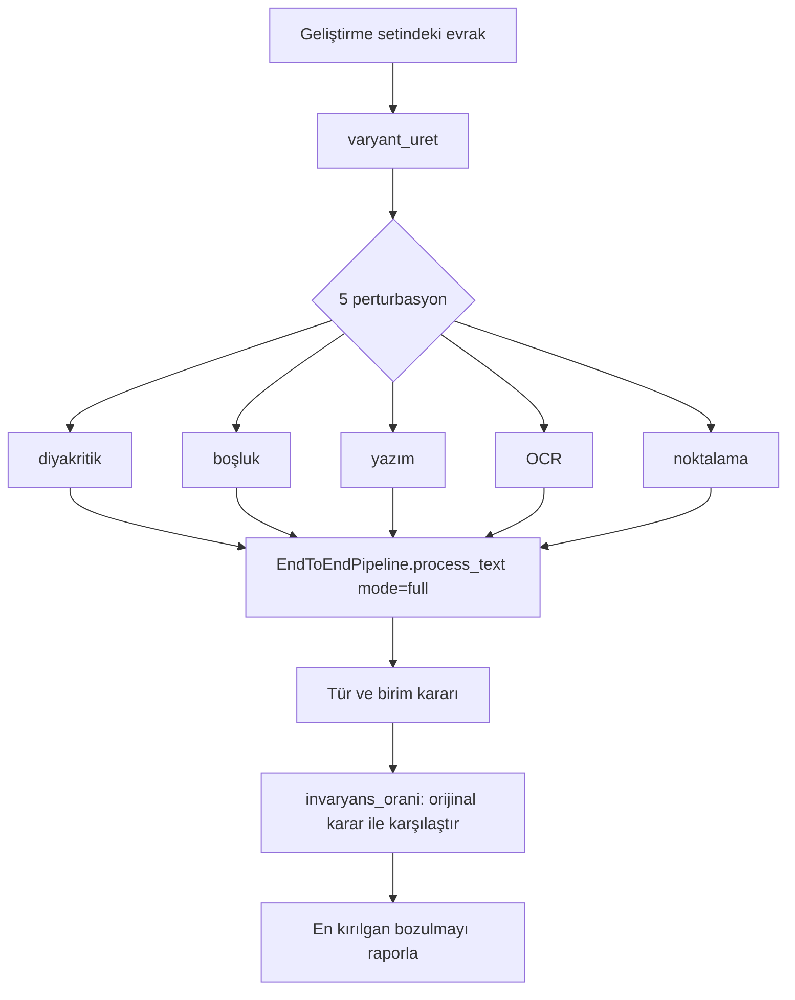

# Adversarial Dayanıklılık 🛡️

Bu sayfa, sistemin bilinçli olarak zorlaştırılmış (adversarial) evraklara ve metin bozulmalarına (perturbasyon) karşı ne kadar dayanıklı olduğunu; bu dayanıklılığın nasıl ölçüldüğünü ve ölçüm sonuçlarını olduğu gibi, dürüstçe belgeler. İki adversarial veri seti (v3 ve v4) ile metamorfik dayanıklılık çerçevesi (CheckList-INV) bir arada ele alınır.

> [!NOTE]
> **TL;DR** — Sistem, geliştirme ve ilk iki tutulmuş (held-out) sette sınıflandırmada tam doğruluk (1.0) verirken, adversarial v3 ve v4 setlerinde sınıflandırma doğruluğu **0.9375** (macro-F1 0.9333) seviyesine düşer. Bu düşüş gizlenmez: adversarial setler tam da sınırları zorlamak için tasarlandığından beklenen ve sağlıklı bir sinyaldir. KVKK sızıntısı beş setin **tamamında 0** kalır; taslak kalitesi adversarial setlerde bile yüksektir (v3 95.8 / v4 94.7). Metamorfik testler (diyakritik katlama, boşluk/yazım/OCR/noktalama gürültüsü) tür ve birim invaryansını `scripts/dayaniklilik_testi.py` ile deterministik olarak ölçer.

---

## 🎯 Neden Adversarial Test?

Kamu evrak akışında sistem, yalnızca temiz ve kalıplı belgelerle değil; OCR gürültüsü taşıyan, alışılmadık ifade biçimleri kullanan, sınıf sınırlarında gezinen (ör. hem tutanak hem rapor izlenimi veren) veya kasıtlı olarak yanıltıcı yapılar içeren evraklarla karşılaşabilir. "İyi havada" ölçülen tam doğruluk skorları, sistemin gerçek kırılganlık noktalarını gizleyebilir.

Adversarial değerlendirmenin üç amacı vardır:

1. **Kırılganlığı görünür kılmak** — Sistemin nerede ve nasıl hata yaptığını, saklamak yerine ölçülebilir kanıta bağlamak (Anayasal İlke 4: Nesnellik ve şeffaflık). Bu yaklaşım [Değerlendirme ve Metrikler](Değerlendirme-ve-Metrikler) ve [Anayasal İlkeler ve Etik](Anayasal-İlkeler-ve-Etik) sayfalarında da temel alınır.
2. **Aşırı iddiadan kaçınmak** — Yalnızca temiz set skorlarına dayanan "%100 doğruluk" iddiası jüri karşısında hem yanıltıcı hem de kırılgandır. Adversarial düşüşleri raporlamak dürüstlüğü kanıtlar.
3. **Regresyon siperi kurmak** — Yeni bir kural veya kod değişikliği, temiz seti bozmadan adversarial seti bozabilir. Adversarial setler bu tür sessiz gerilemeleri yakalar.

---

## 🧪 v3 ve v4 Setlerinin Tasarımı ve Amacı

Değerlendirme paketi beş etiketli sentetik setten oluşur (ayrıntı: [Veri Setleri](Veri-Setleri)). Bunların son ikisi adversarialdir:

| Set | Evrak | Rol |
|---|---|---|
| `kurgu_evraklar` | 52 | Geliştirme / kalibrasyon |
| `kurgu_evraklar_heldout` | 16 | 1. tutulmuş set |
| `kurgu_evraklar_heldout_v2` | 16 | 2. tutulmuş set |
| **`kurgu_evraklar_heldout_v3`** | **16** | **Adversarial (zorlaştırılmış)** |
| **`kurgu_evraklar_heldout_v4`** | **16** | **Adversarial-temiz** |

### v3 — Adversarial

v3, sınıf sınırlarını ve içerik analizini bilinçle zorlayan 16 evraktan oluşur. Amaç, sistemin en güçlü olduğu boyutlarda (sınıflandırma, eksik bilgi tespiti) gerçek zorluk üretmek ve kırılma noktalarını ölçmektir.

### v4 — Adversarial-Temiz

v4, v3 ile aynı zorluk felsefesini taşır ancak **değerlendirme bütünlüğü** amacıyla ayrı üretilmiştir. v3 üzerinde ölçüm yapıldıktan sonra, iyileştirme sürecinde v3'ün gözlemlerinden herhangi bir bilgi sızmış olabileceği ihtimaline karşı, **dokunulmamış temiz bir adversarial set** olarak v4 oluşturulmuştur. Böylece "geliştirme-bilgili olabilecek" bir set (v3) ile "temiz ölçüm" seti (v4) yan yana raporlanır.

> [!IMPORTANT]
> v3 ve v4 ayrımı, projenin held-out disiplininin somut bir uygulamasıdır: bir set üzerinde ölçüm-sonrası kural/kod düzeltmesi yapılırsa o set held-out niteliğini kaybeder. Bu durumda temiz ölçüm için yeni, dokunulmamış bir set üretilir. Ayrıntı için bkz. [Değerlendirme ve Metrikler](Değerlendirme-ve-Metrikler) ve `docs/teknik_rapor.md §5`.

---

## 📉 Adversarial Setlerdeki Metrik Düşüşleri

Aşağıdaki tüm sayılar `scripts/evaluate.py` ile üretilen `data/processed/eval_report*.json` raporlarından, offline (LLM kullanılamıyor) çekirdek modunda ölçülmüştür. Ölçüm anındaki kod durumu tekrarlanabilirlik mührüyle sabitlenir (ölçümler `08616ff` commit'inde alınmıştır). Hiçbiri elle düzenlenmez.

### Sınıflandırma

| Set | Doğruluk (accuracy) | Macro-F1 |
|---|---|---|
| Geliştirme (52) | 1.0 | — |
| Tutulmuş (16) | 1.0 | — |
| Tutulmuş v2 (16) | 1.0 | — |
| **Adversarial v3 (16)** | **0.9375** | **0.9333** |
| **Adversarial-temiz v4 (16)** | **0.9375** | **0.9333** |

16 evraklık sette 0.9375 doğruluk, **1 yanlış sınıflandırma** demektir. Bu, sınıf sınırlarını zorlayan adversarial tasarımın doğrudan sonucudur: temiz setlerde ayırt edici olan yapısal/anahtar-kelime sinyalleri, sınırdaki evraklarda zayıflar. Sınıflandırma hattının çalışma mantığı için bkz. [Görev 1 — Okuma ve Analiz](Görev-1-Okuma-ve-Analiz).

### Eksik Bilgi Tespiti

| Set | Micro-F1 | Ayrıntı |
|---|---|---|
| Geliştirme | 1.0 | — |
| Tutulmuş | 1.0 | — |
| Tutulmuş v2 | 1.0 | — |
| **Adversarial v3** | **0.8333** | **TP 5 / FP 2 / FN 0** |
| Adversarial-temiz v4 | 1.0 | — |

v3'teki en belirgin düşüş burada gözlenir: **micro-F1 0.8333**. Ayrıntıya bakıldığında yanlış negatif (FN) yoktur — yani sistem gerçekten eksik olan hiçbir alanı **kaçırmamıştır**; iki **yanlış pozitif** (FP) üretmiştir, yani var olan bir bilgiyi "eksik" saymıştır. Bu, güvenlik açısından tercih edilebilir bir hata yönüdür: eksik bilgi kaçırmaktansa fazladan uyarı üretmek, insan-döngüde denetimle telafi edilebilir. v4'te bu düşüş görülmez (micro-F1 1.0), yani v3'teki FP'ler dar ve sete özgü bir kalıptan kaynaklanmıştır. Eksik bilgi mantığı için bkz. [Görev 1 — Okuma ve Analiz](Görev-1-Okuma-ve-Analiz).

### Diğer Boyutlar (Adversarial Setlerde Korunan Performans)

| Metrik | v3 | v4 |
|---|---|---|
| Yönlendirme doğruluğu | 1.0 | 0.9375 |
| Taslak kalite ortalaması (0-100) | 95.8 | 94.7 |
| KVKK sızıntısı | 0 kaçak | 0 kaçak |
| Özet sadakati | 0.9688 | 0.9688 |

Dikkat çeken noktalar:

- **KVKK sızıntısı beş setin tamamında 0** kalır — anonimleştirme katmanı adversarial baskı altında bile sızıntı üretmez. Bu, format-koruyan maskeleme ve bağımsız sızıntı denetçisinin (`kacak_olc`) adversarial dayanıklılığının en güçlü kanıtıdır. Bkz. [KVKK ve Anonimleştirme](KVKK-ve-Anonimleştirme).
- **Taslak kalitesi** adversarial setlerde bile yüksek kalır (v3 95.8, v4 94.7); keep-best/Reflexion mekanizması kaliteyi asla düşürmediğinden bu beklenen bir sonuçtur. Bkz. [Görev 2 — Taslak ve Yönlendirme](Görev-2-Taslak-ve-Yönlendirme).
- **Özet sadakati** v3/v4'te 0.9688'e (temiz setlerdeki 1.0'dan) düşer; `sadelestir_guvenli` sadakat garantisi olguları korur, ancak adversarial metinlerde ölçülen sadakat marjinal olarak geriler. Bkz. [Görev 1 — Okuma ve Analiz](Görev-1-Okuma-ve-Analiz).

### Ablasyon: Adversarial Baskı Altında Katma Değer

Tam sistemin, bilerek zayıf tutulmuş bag-of-words baseline'a karşı sınıflandırma doğruluğu farkı adversarial setlerde de belirgindir:

| Set | Tam sistem | Baseline |
|---|---|---|
| Geliştirme | 1.0 | 0.5385 |
| Tutulmuş | 1.0 | 0.375 |
| Tutulmuş v2 | 1.0 | 0.625 |
| **Adversarial v3** | **0.9375** | **0.375** |
| **Adversarial-temiz v4** | **0.9375** | **0.5** |

Adversarial setlerde baseline neredeyse çöker (0.375–0.5) ama tam sistem 0.9375'te kalır. Bu, hibrit sınıflandırma katmanının (kural + istatistiksel model ensemble) katma değerinin en görünür olduğu yerdir. Ablasyon, tam sistem ile keyword-baseline arasındaki farkı McNemar testiyle anlamlılık açısından da sınar. Ablasyon metodolojisi için bkz. [Değerlendirme ve Metrikler](Değerlendirme-ve-Metrikler).

> [!NOTE]
> **Dürüst okuma:** v3'ün sınıflandırma (0.9375) ve eksik bilgi (0.8333) skorları setin en zayıf noktalarıdır ve bilinçle raporlanır. Ölçüm sonuçları ne çıkarsa çıksın olduğu gibi sunulur; sonuç manipülasyonu ve jüriyi yanıltıcı sunum şartnameye göre etik ihlaldir.

---

## 🔁 Metamorfik Dayanıklılık (CheckList-INV)

Adversarial *setler* sabit, elle etiketli evraklardır. Metamorfik test ise **etiket-koruyan** (label-preserving) bozulmalar üretir: bir evrağa küçük, anlamı bozmayan gürültü uygulanır ve sistemin **aynı** kararı vermesi (invaryans) beklenir. Bu yaklaşım Ribeiro vd. (2020) CheckList-INV geleneğine ve metamorfik test literatürüne dayanır.

Metamorfik çekirdek `src/utils/metamorfik.py` içinde 5 deterministik perturbasyon tanımlar:

| Perturbasyon | Fonksiyon | Parametre / Davranış |
|---|---|---|
| Diyakritik katlama | `diyakritik_katla` | Türkçe aksanlı harfleri ASCII karşılığına indirger |
| Boşluk gürültüsü | `bosluk_gurultu` | Her boşluğun ikiye katlanma olasılığı 0.12 |
| Yazım gürültüsü | `yazim_gurultu` | En fazla 3 kelimede, yalnızca 6+ harfli kelimelerin orta harflerinde transpozisyon |
| OCR ikamesi | `ocr_ikame` | En fazla 4 ikame; çiftler: (İ,I), (l,ı), (rn,m), (O,0) |
| Noktalama gürültüsü | `noktalama_gurultu` | Virgül/noktanın düşürülme olasılığı 0.15 |

Bu perturbasyonlar **deterministik ve tohumludur** (aynı tohum → aynı varyant); `varyant_uret` ile bir evraktan varyant üretir, `invaryans_orani` ile orijinal karar ile varyant kararının tutarlılığını ölçer.

### Akış



### `scripts/dayaniklilik_testi.py`

Bu CLI koşucusu, geliştirme setindeki her evrağa `varyant_uret` uygular, her varyantı [Orkestratör ve Koşullu Kapılar](Orkestratör-ve-Koşullu-Kapılar) üzerinden `EndToEndPipeline.process_text(mode="full", kayit=False)` ile işler ve şunları hesaplar:

- **Tür invaryansı** — perturbasyon sonrası sınıflandırma kararının değişmeme oranı
- **Birim invaryansı** — yönlendirme kararının değişmeme oranı
- **Gürbüz doğruluk** — bozulmuş girdilerde doğruluk
- **En kırılgan bozulma** — en düşük tür invaryansına yol açan perturbasyon türü

Varsayılan tohum **1234**'tür (tekrarlanabilirlik). Tüm yollar göreli üretilir; raporlara mutlak yol (makine/kullanıcı adı) sızmaz.

```bash
# Metamorfik dayanıklılık testini çalıştır
python scripts/dayaniklilik_testi.py
```

Metamorfik ölçüm de değerlendirme bütünlüğüne tabidir: held-out setlerde bu test tuning'e yol açacak biçimde kullanılmaz; yalnızca ölçüm amaçlıdır. Güven/ölçüm katmanının tümü için bkz. [Güven ve Ölçüm Katmanı](Güven-ve-Ölçüm-Katmanı).

---

## 🔍 Bilinen Zayıflıklar ve İyileştirme Yönü

Dürüst bir dayanıklılık değerlendirmesi, kırılma noktalarını da adlandırır:

- [ ] **Sınıflandırma sınır belirsizliği (v3/v4: 0.9375)** — Sınıf sınırında gezinen adversarial evraklarda 1 hata gözlenir. İyileştirme yönü: yapısal sinyallerin ve ensemble ağırlıklarının, sınır durumlarını temiz setleri bozmadan ele alacak biçimde genişletilmesi. Değişiklik yapılırsa held-out bütünlüğü kuralı uygulanmalıdır.
- [ ] **Eksik bilgi yanlış pozitifleri (v3: micro-F1 0.8333, FP 2 / FN 0)** — Sistem eksik bilgi kaçırmıyor ama v3'te iki kez var olan bilgiyi eksik sayıyor. Hata yönü güvenli taraftadır (FN yok). İyileştirme yönü: alan mevcudiyeti kontrollerinin (`_check_field_exists`) adversarial ifade biçimlerine karşı sağlamlaştırılması.
- [ ] **Özet sadakatinde marjinal geriler (v3/v4: 0.9688)** — Adversarial metinlerde extractive özetin olgu temsili hafifçe düşer; sadakat garantisi olguları korur ama ölçülen skor 1.0'ın altındadır.
- [ ] **OCR gürültüsüne karşı gerçek tarama testi eksikliği** — Metamorfik OCR ikamesi sentetik bir yaklaşımdır; gerçek taranmış belge OCR maliyetini ve hata dağılımını birebir temsil etmez. Bkz. [Veri Setleri](Veri-Setleri).

Bu maddelerin gelecek planlaması için bkz. [Yol Haritası](Yol-Haritası).

---

## 🔒 Held-out Bütünlüğü Notu

> [!WARNING]
> Adversarial setler (v3, v4) held-out disiplinine tabidir. Bir set üzerinde ölçülen **hatalara bakılarak kural veya kod düzeltmesi yapılırsa, o set held-out niteliğini KAYBEDER.** Bu durum `docs/teknik_rapor.md §5`'e açıkça yazılmak zorundadır. Nitekim v4 seti, v3'ten bilgi sızmış olabileceği ihtimaline karşı temiz ölçüm için dokunulmamış olarak ayrı üretilmiştir.

Ayrıca:

- `data/processed/eval_report*.json` dosyaları elle düzenlenmez; yalnızca `scripts/evaluate.py` ile üretilir.
- Her rapora tekrarlanabilirlik mührü (git commit SHA + platform + veri seti içerik hash'i) gömülür; böylece jüri sonuçların hangi kod durumunda üretildiğini doğrulayabilir.
- Adversarial ölçümler ne çıkarsa çıksın olduğu gibi raporlanır; başarısızlıklar gizlenmez (Anayasal İlke 4).

Bu ilkelerin geniş çerçevesi için bkz. [Anayasal İlkeler ve Etik](Anayasal-İlkeler-ve-Etik) ve şartname kanıt haritası için [Şartname Uyum Matrisi](Şartname-Uyum-Matrisi).

---

## İlgili Sayfalar

- [Değerlendirme ve Metrikler](Değerlendirme-ve-Metrikler) — 5 set, tüm doğrulanmış metrikler, held-out disiplini
- [Güven ve Ölçüm Katmanı](Güven-ve-Ölçüm-Katmanı) — metamorfik, kalibrasyon, konformal, seçici tahmin
- [Veri Setleri](Veri-Setleri) — sentetik evrak setleri, etiket şeması, datasheet
- [Görev 1 — Okuma ve Analiz](Görev-1-Okuma-ve-Analiz) — sınıflandırma, bilgi çıkarımı, eksik bilgi
- [Anayasal İlkeler ve Etik](Anayasal-İlkeler-ve-Etik) — şeffaflık, değerlendirme bütünlüğü
- [Test ve Sürekli Entegrasyon](Test-ve-Sürekli-Entegrasyon) — 632 test (depo CI rozeti), kalite kapıları
