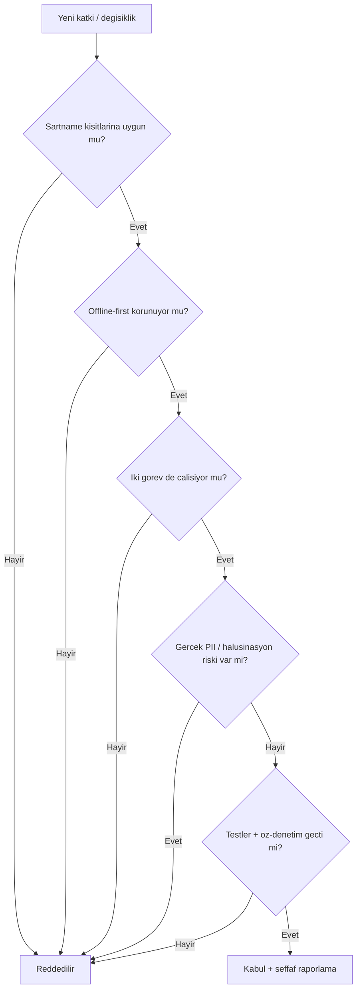

# Anayasal İlkeler ve Etik 🧭

Bu sayfa, projenin yönetişim ve etik omurgasını anlatır: proje anayasası (`CLAUDE.md`), tüm yapay zekâ ajanları için bağlayıcı 8 anayasal ilke, ihlal edilemez şartname kısıtları, adillik beyanı, güvenlik denetimi, değerlendirme bütünlüğü kuralları ve güvenlik politikası. Amaç, teknik sistemin **doğru, dürüst, KVKK uyumlu ve şartnameye tam uyumlu** biçimde geliştirilip teslim edilmesini güvence altına almaktır.

> [!NOTE]
> **TL;DR** — Depoda çalışan her ajan `CLAUDE.md` proje anayasasına uymak zorundadır. Anthropic'in Anayasal Yapay Zekâ (Constitutional AI) yaklaşımı, TEKNOFEST 2026 şartname kısıtlarıyla harmanlanmıştır. Öne çıkan ilkeler: **zarardan kaçınma**, **halüsinasyon yasağı**, **KVKK (gerçek veri yasağı)** ve **nesnellik/şeffaflık**. Kararlar kimlikten bağımsızdır (adillik beyanı), sistem public çıkış öncesi çok-ajanlı bir güvenlik denetiminden geçmiştir (1 YÜKSEK + 6 ORTA bulgu düzeltildi) ve held-out setler üzerinde ölçüm bütünlüğü kod düzeyinde korunur.

---

## 1. Constitutional AI: Neden ve Nasıl?

Bu proje, otonom bir çok-ajanlı sistemin (11 uzman ajan + orkestratör) davranışını yalnızca kod testleriyle değil, aynı zamanda **açıkça yazılı, bağlayıcı ilkelerle** yönetir. Anthropic'in "Constitutional AI" fikri, bir sistemin çıktılarını üst düzey ilkeler kümesine (anayasaya) göre denetlemeyi öngörür. Burada bu yaklaşım tersine de işler: yalnızca üretilen içerik değil, **kodu yazan/değiştiren ajanlar da** aynı anayasaya tabidir.

Anayasa `CLAUDE.md` dosyasında yaşar. Bu dosya:

- Proje kimliğini ve kritik tarihleri (ön değerlendirme sunumu **12 Temmuz 2026**, final **Ağustos 2026**) tanımlar,
- İhlal edilemez şartname kısıtlarını sıralar,
- Komut ve mimari haritayı verir,
- Değerlendirme bütünlüğü kurallarını koyar,
- 8 anayasal ilkeyi ve kapsamlı görevler için çıktı şablonunu belirler.

> [!IMPORTANT]
> `CLAUDE.md` içindeki "Şartname Kısıtları (İHLAL EDİLEMEZ)" bölümü, hiçbir performans kazancı uğruna esnetilemez. Bir değişiklik tek bir görevi bile bozuyorsa ya da bir kısıtı çiğniyorsa kabul edilemez.

---

## 2. Sekiz Anayasal İlke

Aşağıdaki sekiz ilke, "Constitutional Autonomous Agent" başlığı altında `CLAUDE.md` içinde tanımlıdır ve bu projede çalışan her ajan için bağlayıcıdır.

| # | İlke | Özü | Sistemdeki somut karşılığı |
|---|------|-----|-----------------------------|
| 1 | **Zarardan kaçınma** | Geri döndürülemez/yıkıcı işlemler (silme, force-push, veri üzerine yazma) öncesi onay alınır | Kayıt defteri varsayılan kapalı; istisnalar iş akışını çökertmez, `errors` listesine eklenir |
| 2 | **Halüsinasyon yasağı** | Emin olunmayan bilgi üretilmez; eksiklik "bilgi yetersizliği" olarak raporlanır | Mevzuat gerekçesi yalnızca gözlenen sinyallerden kurulur; taslakta uydurma madde/atıf yasaktır |
| 3 | **Veri koruması (KVKK)** | Gerçek kişisel veri asla üretilmez, kopyalanmaz, sızdırılmaz | Sentetik veri ilkesi; anonimleştirme ajanı; bağımsız sızıntı denetçisi |
| 4 | **Nesnellik ve şeffaflık** | Ölçümler olduğu gibi raporlanır; başarısızlıklar gizlenmez | Tekrarlanabilirlik mührü; hataların açık raporlanması |
| 5 | **Önce planlama** | Karmaşık görevlerde icraat öncesi zorluk/sınır/uç senaryo analizi ve "tamamlanma kriteri" | Çıktı şablonundaki "Hedef ve Kısıt Analizi" bölümü |
| 6 | **Ayrıştırma** | Büyük görevler birbirine bağımlı küçük alt görevlere bölünür | Koşullu orkestrasyon akışı; ajanların tek sorumluluk ilkesi |
| 7 | **Öz-denetim** | Her önemli çıktı teslim öncesi doğrulanır (test/çalıştırma/şema) | Bağımsız kalite hakemi; format öz-denetimi; çapraz tutarlılık |
| 8 | **Proaktif otonomi** | Makul riskli adımlar için izin beklenmez; tutarsızlıklar proaktif raporlanır | Doküman-kod uyumsuzluklarının açıkça belgelenmesi |

Bu ilkeler soyut sloganlar değildir; her biri mimaride somut bir mekanizmaya bağlanmıştır. Örneğin **halüsinasyon yasağı**, evrak tarihi tespit edilemediğinde [Triage ve Önceliklendirme](Triage-ve-Önceliklendirme) ajanının uydurma tarih üretmek yerine `son_tarih=null` döndürüp şeffaf bir `not` alanı eklemesiyle uygulanır. Aynı ilke, [Mevzuat RAG ve Hibrit Arama](Mevzuat-RAG-ve-Hibrit-Arama) katmanında benzerlik skorunun **mutlak** ölçekte tutulmasıyla (göreli normalizasyonun bilinçle terk edilmesiyle) korunur; böylece zayıf bir eşleşme yapay olarak 1.0'a şişirilip yanlış mevzuat alıntısına yol açmaz.

### 2.1 Kapsamlı Görev Çıktı Şablonu

Anayasa, çok adımlı/kapsamlı görevlerde yanıtların şu bölümlerle yapılandırılmasını ister:

1. **Hedef ve Kısıt Analizi** — ana hedef, kısıtlar, kabul kriterleri
2. **Stratejik Yol Haritası** — adımlar ve durumları
3. **İcraat, Çözüm ve Bulgular** — kod, analiz, içerik
4. **Öz-Denetim ve Kalite Kontrol** — anayasa/güvenlik + performans doğrulaması
5. **Sonraki Adım ve Eylem Planı** — sıradaki adım + kullanıcıdan beklenen

Küçük/tek adımlı işlerde şablon atlanabilir; ancak **öz-denetim her durumda** yapılır.

---

## 3. Şartname Kısıtları (İhlal Edilemez)

TEKNOFEST 2026 Yapay Zekâ Dil Ajanları Yarışması — 1. Senaryo şartnamesinden türeyen beş kısıt, anayasanın çekirdeğidir. Ayrıntılı kanıt eşlemesi için bkz. [Şartname Uyum Matrisi](Şartname-Uyum-Matrisi).

> [!WARNING]
> Bu beş kısıttan herhangi birini bozan bir katkı, ölçüm sonucu ne olursa olsun geri çevrilir.

1. **Türkçe zorunluluğu** — Tüm kod yorumları, dokümanlar, çıktılar ve sunumlar Türkçe hazırlanır (teknik terimler İngilizce orijinal formlarıyla parantez içinde verilebilir).
2. **Açık kaynak** — Depo Apache 2.0 lisanslıdır. Depoya model ağırlığı yüklenmez; üçüncü taraf modeller yalnızca bağlantı + sürüm + lisans + kullanım talimatı ile `docs/model_bilgileri.md` içinde belgelenir (bkz. [Model Bilgileri ve LLM Ekosistemi](Model-Bilgileri)).
3. **Gerçek kamu verisi ASLA kullanılmaz** — Yalnızca sentetik/kurgu veri. Kurgu TCKN'ler resmî checksum'ı geçer ama gerçek bir kişiye ait olamaz (bkz. [Veri Setleri](Veri-Setleri)).
4. **Görev bütünlüğü** — [Görev 1](Görev-1-Okuma-ve-Analiz) (sınıflandırma + içerik analizi) ve [Görev 2](Görev-2-Taslak-ve-Yönlendirme) (taslak + birim yönlendirme) ikisi de zorunludur; tek görevi bozan değişiklik kabul edilemez.
5. **Offline-first korunur** — Çekirdek `requirements.txt` ile, hiçbir LLM olmadan tam işlevsel çalışma bozulamaz. Yeni bağımlılıklar çekirdek/opsiyonel disiplinine (`requirements.txt` vs `requirements-optional.txt`) uyar.

Aşağıdaki akış, bir katkının anayasal süzgeçten nasıl geçtiğini özetler.

---

## 4. Adillik Beyanı (`docs/adillik_beyani.md`)

Sistem, evrak işleme kararlarının (**tür, birim, öncelik, eksik alan**) başvuranın kimliğinden bağımsız olması gerektiğini benimser. Adillik beyanı bu ilkeyi ve sınırlarını dürüstçe tanımlar.

**Yöntem — karşı-olgusal (counterfactual) değişmezlik testi.** Aynı evrak, yalnızca kimlik bilgileri (ad-soyad, cinsiyet çağrışımı, il/ilçe) değiştirilerek varyantlara dönüştürülür ve kararların değişmediği doğrulanır (`tests/test_adillik.py`).

> [!NOTE]
> **Dürüst kapsam beyanı:** Bu test, kararların kimlikten bağımsızlığını doğrular; **kapsamlı bir toplumsal yanlılık denetimi değildir** ve öyle sunulmaz.

Beyan, önemli bir teknik nüansı da açıkça kabul eder: istatistiksel sınıflandırıcı, adları teknik olarak öznitelik uzayına alır. Yani "adlar girdide hiç yok" gibi bir iddia yapılmaz. Bunun yerine, kararların adlardan **etkilenmediği** karşı-olgusal testle gösterilir. Bu güveni sağlayan mimari gerçek şudur: [Sınıflandırma](Görev-1-Okuma-ve-Analiz) ensemble'ında kural tabanlı skorun ağırlığı **%60**'tır (istatistiksel modelin ağırlığı %40) ve Resmî Yazışma Yönetmeliği'ne dayalı genel geçer alan bilgisini kodlar; tekil adların katkısı ihmal edilebilir kalır.

---

## 5. Güvenlik Denetim Raporu (`docs/GUVENLIK_DENETIM_RAPORU.md`)

Public çıkış öncesi, sistem çok-ajanlı bir güvenlik denetiminden geçirildi. Tehdit modeli OWASP LLM Top 10 çerçevesine (özellikle LLM01 prompt injection, LLM04 kaynak tüketimi) dayanır.

**Ana bulgular ve durum:**

- **1 YÜKSEK + 6 ORTA bulgu tespit edildi ve tümü düzeltildi.**
- En kritik bulgu **PyPDF2 3.0.1 DoS açığıydı** (PYSEC-2026-1835); bakımlı ardıl olan `pypdf` (>=6.13.3) sürümüne geçilerek kapatıldı.
- `pip-audit` "No known vulnerabilities found" döndürüyor.
- Git geçmişi dâhil **sır veya gerçek PII sızıntısı bulunmadı**; RCE'ye giden klasik açıklar (eval/exec/pickle/komut enjeksiyonu) yok.

**Uygulanan güvenlik sınırları (kaynak tüketimi savunması):**

| Kontrol | Değer | Amaç / Bulgu |
|---|---|---|
| `_MAX_GIRDI_KARAKTER` | 200.000 | Güvenilmeyen girdi merkezî uzunluk sınırı (orchestrator başında kırpma) |
| `MAX_PDF_SAYFA` | 50 | Çok sayfalı PDF bombasına karşı |
| `Image.MAX_IMAGE_PIXELS` | 40.000.000 | Görüntü (decompression) bombasına karşı |
| `pdf2image dpi` | 150 | PDF→görüntü çözünürlük sınırı |
| Streamlit `maxUploadSize` | 20 MB | Yükleme boyutu sınırı |
| Streamlit `showErrorDetails` | none | Traceback ifşasını engelleme |
| E-posta regex | RFC sınırlı niceleyiciler | Kuadratik ReDoS'u önleme (CWE-1333) |

**Prompt injection savunması.** Evrak metni her LLM çağrısında `belge_blogu` sentinel sarmalıyla "yalnızca veri" olarak işaretlenir ve sistem prompt'una `GUVENLIK_SISTEM_EKI` uyarısı eklenir. Kritik olarak, sınıflandırma ve yönlendirme çıktıları **kapalı listelerle (enum/allowlist)** doğrulandığı için, belge içine gömülü bir talimat kararı değiştiremez. Ayrıntı için bkz. [MCP Sunucusu](MCP-Sunucusu) ve [REST API](REST-API) güvenlik notları.

> [!IMPORTANT]
> **Şeffafça kabul edilen 3 kalıntı risk:** (a) ham istisna mesajının arayüze yazılması, (b) bağımlılık sürümlerinin `==` yerine `>=` ile sabitlenmesi (on-prem kurulum esnekliği gerekçesiyle), (c) git geçmişindeki kişisel bir e-posta adresi. Bunlar gizlenmez; risk kabulü olarak açıkça belgelenir (Anayasa İlke 4: nesnellik ve şeffaflık).

---

## 6. Değerlendirme Bütünlüğü Kuralları

Anayasa, jüriyi yanıltıcı sunumun ve sonuç manipülasyonunun **etik ihlal** olduğunu vurgular. Bu ilkeyi somutlaştıran kurallar:

- **Held-out disiplini:** Tutulmuş (held-out) setler üzerinde ölçülen hatalara bakılarak kural/kod düzeltmesi yapılırsa set held-out niteliğini KAYBEDER; bu durum `docs/teknik_rapor.md` §5'e açıkça yazılmak ZORUNDADIR. Bu nedenle geliştirme-bilgili sayılan v3 setinin yanına, temiz ölçüm için **dokunulmamış v4 seti** üretilmiştir.
- **Rapor üretimi:** `data/processed/eval_report*.json` dosyaları elle düzenlenmez; yalnızca `scripts/evaluate.py` ile üretilir.
- **Ölçüm bütünlüğü kod düzeyinde:** Sıcaklık ölçekleme (temperature scaling) yalnızca geliştirme setinde öğrenilir; held-out setlerde yalnızca ölçüm yapılır. Bu kural doğrudan kodda uygulanır (`sicaklik_ogren_izinli` yalnızca geliştirme setinde `True`).
- **Tekrarlanabilirlik mührü:** Her rapora git commit SHA + çalışma ağacı durumu, Python/platform sürümü, `requirements.txt` sha256 ve veri seti içerik hash'i gömülür.
- **Nesnel raporlama:** Ölçüm sonuçları ne çıkarsa çıksın olduğu gibi raporlanır.

İlkesel bir örnek: Standart Dosya Planı (SDP), retrieval korpusuna eklendiğinde mevzuat isabet@3 metriğini **0,962 → 0,923** düşürdüğü ölçüldü. Bu ölçüme dayanarak SDP korpusa **alınmadı**, referans belge olarak tutuldu. Karar, "daha iyi görünen" değil, "ölçülen" gerçeğe göre verildi. Metriklerin tamamı için bkz. [Değerlendirme ve Metrikler](Değerlendirme-ve-Metrikler).

---

## 7. SECURITY.md ve KVKK Bildirim Politikası

`SECURITY.md`, sorumlu güvenlik açığı bildirimi için politikayı tanımlar:

- Zafiyet bildirimleri **7 gün içinde** yanıtlanır.
- KVKK kapsamına giren durumlar için ayrı bir bildirim kanalı vardır.
- Güvenli kullanım notları (tam offline çalışma için `APP_OFFLINE=1` katı kilidi vb.) belgelenir.

`APP_OFFLINE=1` kilidi devreye girdiğinde hiçbir prompt/evrak metni dışarı gönderilmez; bu, başıboş bir API anahtarıyla beklenmedik dış ağ bağlantısını ve maskesiz PII sızıntısını engelleyerek gizlilik/KVKK garantisini teknik olarak sağlar (bkz. [Model Bilgileri ve LLM Ekosistemi](Model-Bilgileri) ve [Kurulum ve Yapılandırma](Kurulum-ve-Yapılandırma)).

---

## 8. Telif, Lisans ve Atıf

- **Lisans:** Apache 2.0 (`LICENSE`).
- **Telif:** AGENTRA TECH (`NOTICE`).
- **Eser sahipleri:** Şeyma Nur Çebi (Takım Kaptanı), Muhammed Sina Gün, Emine Elik, Zeynep Akel — FSEK m.10 iştirak hâlinde eser sahipliği (`AUTHORS`, `CITATION.cff`).
- **Değişiklik günlüğü:** `CHANGELOG.md` — Keep a Changelog / SemVer temelli, commit-kanıtlı; her girdiye şartname izi eklenir.

Üçüncü taraf model ağırlıkları depoya konmaz; tedarik zinciri güvenliği için `safetensors` tercihi + sabit revizyon + sha256 doğrulama önerilir. Yeni bağımlılıklar çekirdek/opsiyonel disiplinine uyar; ücretli servis/kapalı API zorunluluğu yasaktır (yerel/on-prem çalışabilirlik korunur).

---

## 9. Etik İlkelerin Mimariye Yansıması — Özet

Aşağıdaki tablo, her etik ilkenin sistemde nerede somutlaştığını tek bakışta gösterir.

| Etik ilke | Nerede uygulanır | İlgili sayfa |
|---|---|---|
| Halüsinasyon yasağı | Mutlak benzerlik ölçeği; uydurma madde/atıf yasağı; tarih yoksa `null`+not | [Mevzuat RAG](Mevzuat-RAG-ve-Hibrit-Arama), [Triage](Triage-ve-Önceliklendirme) |
| KVKK | Format-koruyan maskeleme (9 kategori) + bağımsız sızıntı denetçisi | [KVKK ve Anonimleştirme](KVKK-ve-Anonimleştirme) |
| Adillik | Karşı-olgusal değişmezlik testi; kural ağırlığı %60 | [Uzman Ajanlar](Uzman-Ajanlar) |
| İnsan-döngüde | Düşük güvende karar bloklanmaz, "insan onayı gerekli" işaretlenir | [Orkestratör ve Koşullu Kapılar](Orkestratör-ve-Koşullu-Kapılar) |
| Şeffaflık | Tekrarlanabilirlik mührü; risk kabulleri; held-out disiplini | [Değerlendirme ve Metrikler](Değerlendirme-ve-Metrikler) |
| Güvenlik | Girdi sınırları; prompt injection savunması; kapalı-liste doğrulama | [Güven ve Ölçüm Katmanı](Güven-ve-Ölçüm-Katmanı) |

Bu bütünlük, projenin temel tezidir: **Otonomi, ancak açıkça yazılı, ölçülebilir ve denetlenebilir ilkelerle birleştiğinde kamu güvenine layık olur.**

---

## İlgili Sayfalar

- [Şartname Uyum Matrisi](Şartname-Uyum-Matrisi) — Her şartname maddesinin kanıt haritası
- [KVKK ve Anonimleştirme](KVKK-ve-Anonimleştirme) — 9 kategori maskeleme ve sızıntı denetimi
- [Değerlendirme ve Metrikler](Değerlendirme-ve-Metrikler) — Held-out disiplini ve tekrarlanabilirlik
- [Güven ve Ölçüm Katmanı](Güven-ve-Ölçüm-Katmanı) — Kalibrasyon, seçici tahmin, dayanıklılık
- [Model Bilgileri ve LLM Ekosistemi](Model-Bilgileri) — Lisanslar ve LLM opsiyonelliği
- [Orkestratör ve Koşullu Kapılar](Orkestratör-ve-Koşullu-Kapılar) — İnsan-döngüde karar mantığı
