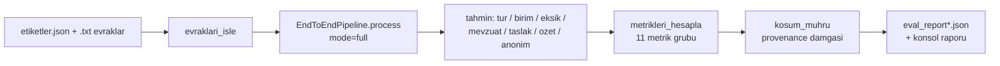

# Değerlendirme ve Metrikler 📊

Bu sayfa, sistemin nasıl ölçüldüğünü — hangi betiğin, hangi setler üzerinde, hangi eksenlerde çalıştığını — ve tüm doğrulanmış metrik sonuçlarını, held-out disiplinini ve tekrarlanabilirlik mührünü tek yerde toplar. Buradaki tüm sayılar `scripts/evaluate.py` ile üretilmiş `data/processed/eval_report*.json` raporlarından birebir alınmıştır.

> [!NOTE]
> **TL;DR** — Değerlendirme saf Python metriklerle (`sklearn`/`numpy` yok) 5 etiketli set üzerinde yapılır: geliştirme (52), tutulmuş (16), tutulmuş v2 (16), adversarial v3 (16), adversarial-temiz v4 (16). Ölçüm offline modda (LLM erişilemiyor) alınmıştır. Sınıflandırma doğruluğu ilk üç sette **1.0**, adversarial v3/v4'te **0.9375**; KVKK sızıntısı beş sette **0 kaçak**; her rapora git commit + platform + veri seti içerik hash'i içeren tekrarlanabilirlik mührü gömülür. Ölçüm sonuçları ne çıkarsa olduğu gibi raporlanır.

---

## 1. Nasıl Ölçülür? 🔬

Değerlendirme çekirdeği `scripts/evaluate.py` içindedir. Her evrağı [uçtan uca hattımızla](Sistem-Mimarisi) (`EndToEndPipeline.process(mode="full")`) işler, sistemin ürettiği çıktıyı etiketle karşılaştırır ve TEKNOFEST şartname puanlama eksenlerini artı ek güvence katmanlarını hesaplar.

Tasarım ilkeleri:

- **Saf Python, bağımlılıksız** — metrik fonksiyonları (`hesapla_accuracy`, `hesapla_sinif_metrikleri`, `hesapla_set_metrikleri`, `hesapla_isabet_at_k`, `hesapla_siralama_metrikleri`, `hesapla_confusion_matrix`, `hesapla_taslak_kalitesi`, `hesapla_medyan`) pipeline importundan ayrılmıştır; `tests/test_evaluation.py` bunları pipeline yüklemeden test eder.
- **Mutlak yol sızmaz** — `goreli_yol` fonksiyonu, git ile izlenen rapor JSON'una makine/kullanıcı adı sızdırmamak için tüm yolları proje köküne göre göreli yazar.
- **Rapor elle düzenlenmez** — `data/processed/eval_report*.json` dosyaları yalnızca `evaluate.py` ile üretilir; elle düzenleme değerlendirme bütünlüğü kuralının ihlalidir.
- **Dürüst raporlama** — etiketi olmayan evrak metriğe katılmaz; ölçülemeyen değer `None` döner (`0.0` ile karışmasın diye).



### Ölçülen eksenler

`metrikleri_hesapla` şu metrik gruplarını birleştirip nihai rapor sözlüğünü üretir:

| Grup | İçerik |
|---|---|
| Sınıflandırma | accuracy, macro P/R/F1, confusion matrix, yanlışlar |
| Yönlendirme | accuracy, yanlış yönlendirmeler |
| Eksik bilgi | micro P/R/F1 + TP/FP/FN |
| Mevzuat önerisi | isabet@3, isabet@1, MRR/nDCG, context P-R, isabetsizler |
| Taslak kalitesi | ortalama / asgari puan (0-100) |
| Kalibrasyon | ECE/MCE/Brier + temperature scaling |
| Seçici tahmin | reject-option kapsama / risk |
| Konformal | kapsama garantili tahmin kümeleri |
| KVKK | anonimleştirme sonrası sızıntı sayımı |
| Özet kalitesi | sadakat / kaynak-kapsama / sıkıştırma |
| Güven aralıkları | Wilson + bootstrap %95 GA |
| Ablasyon | tam sistem vs keyword-baseline (McNemar) |
| Performans | evrak başına ort/medyan süre + adım süreleri |

Bu ölçüm katmanının matematiksel ayrıntıları için [Güven ve Ölçüm Katmanı](Güven-ve-Ölçüm-Katmanı) sayfasına bakın.

---

## 2. Beş Değerlendirme Seti 📁

Değerlendirme, farklı zorluk ve amaçlara sahip 5 etiketli sentetik set üzerinde yürütülür. Tüm setlerin köken, bileşim ve KVKK belgeleri için [Veri Setleri](Veri-Setleri) sayfasına bakın.

| Set | Dizin | Evrak | Rol |
|---|---|---|---|
| Geliştirme | `data/raw/kurgu_evraklar` | 52 | Geliştirme + kalibrasyon (temperature scaling burada öğrenilir) |
| Tutulmuş | `data/raw/kurgu_evraklar_heldout` | 16 | Held-out doğrulama |
| Tutulmuş v2 | `data/raw/kurgu_evraklar_heldout_v2` | 16 | İkinci held-out doğrulama |
| Adversarial v3 | `data/raw/kurgu_evraklar_heldout_v3` | 16 | Zorlaştırılmış / çeldirici set |
| Adversarial-temiz v4 | `data/raw/kurgu_evraklar_heldout_v4` | 16 | İyileştirme sonrası dokunulmamış temiz adversarial set |

Etiket şeması: `{tur, birim_kodu, eksik_alanlar, aciklama, mevzuat_beklenen?}`. `eksik_alanlar` anahtarları `src/agents/missing_info_agent.py` içindeki `ZORUNLU_ALANLAR` ile birebir uyumludur (örn. tutanak için `imzalar`, `imza` değil). Ayrıca 15 belgelik mevzuat korpusu, mevzuat isabet@3 ölçümünü besler.

---

## 3. Büyük Metrik Tablosu 📈

> [!IMPORTANT]
> Aşağıdaki değerler **git commit `08616ff`** üzerinde, **offline backend** (LLM kullanılamıyor) durumunda ölçülmüştür. Kaynak: `scripts/evaluate.py` → `data/processed/eval_report*.json`. Tablodaki her sayı doğrulanmış rapordan birebir alınmıştır; başka hiçbir sayı türetilmemiştir.

### 3.1 Ana şartname eksenleri

| Metrik | Geliştirme (52) | Tutulmuş (16) | v2 (16) | Adversarial v3 (16) | Adversarial-temiz v4 (16) |
|---|---|---|---|---|---|
| **Sınıflandırma doğruluğu (accuracy)** | 1.0 | 1.0 | 1.0 | 0.9375 | 0.9375 |
| **Sınıflandırma macro-F1** | 1.0 | 1.0 | 1.0 | 0.9333 | 0.9333 |
| **Yönlendirme doğruluğu** | 0.9615 | 1.0 | 0.9375 | 1.0 | 0.9375 |
| **Eksik bilgi (micro-F1)** | 1.0 | 1.0 | 1.0 | 0.8333 | 1.0 |
| **Taslak kalite ortalaması (0-100)** | 93.6 | 95.8 | 94.6 | 95.8 | 94.7 |
| **KVKK sızıntısı (kaçak)** | 0 | 0 | 0 | 0 | 0 |
| **Özet sadakati** | 1.0 | 1.0 | 1.0 | 0.9688 | 0.9688 |

Notlar:

- İlk üç sette sınıflandırma doğruluğu 1.0 olduğundan macro-F1 de zorunlu olarak 1.0'dır (tüm tahminler doğru). Adversarial v3/v4'te doğruluk 0.9375, macro-F1 0.9333 raporlanmıştır.
- Geliştirme setinde taslak kalite **asgari** puanı 73'tür; ortalama 93.6.
- Adversarial v3'te eksik bilgi tespiti tp5 / fp2 / fn0 dağılımıyla micro-F1 = 0.8333'e düşer; v4'te tekrar 1.0'a çıkar.
- KVKK sızıntısı beş setin tamamında 0 kaçaktır (sızıntısız oran 1.0). Maskeleme mantığı için [KVKK ve Anonimleştirme](KVKK-ve-Anonimleştirme) sayfasına bakın.
- Özet sadakati, özetteki sayı/tarih olgularının kaynakta bulunma oranıdır; ayrıntı için [Görev 1 — Okuma ve Analiz](Görev-1-Okuma-ve-Analiz).

### 3.2 Mevzuat önerisi ölçümü hakkında

Mevzuat önerisi isabet@3 metriği yalnızca `mevzuat_beklenen` etiketi **boş olmayan** evraklar üzerinden hesaplanır; etiketsiz evrak metriğe katılmaz, etiketli evrak yoksa isabet oranı `0.0` ile karışmaması için `None` döner. Sıralama kalitesi ayrıca MRR ve nDCG (ikili ilgililik, log₂ indirimli) ile, bağlam kalitesi RAGAS-tarzı context precision/recall@k ile raporlanır. Hibrit arama ayrıntıları için [Mevzuat RAG ve Hibrit Arama](Mevzuat-RAG-ve-Hibrit-Arama) sayfasına bakın.

### 3.3 Yönlendirme setindeki şeffaflık notu

Geliştirme setindeki yönlendirme doğruluğu 0.9615'tir; iki hata (`cevap_yazisi_06`, `tutanak_06`) gerçek işlevsel belirsizliktir ve **etiket/kod değişikliği yapılmamıştır**. Bu tutum, [held-out disiplini](#5-held-out-disiplini-ve-şeffaflık) geleneğimizin bir parçasıdır. Yönlendirme mantığı için [Görev 2 — Taslak ve Yönlendirme](Görev-2-Taslak-ve-Yönlendirme).

---

## 4. Ablasyon Tablosu — Tam Sistem vs Baseline 🧪

Ablasyon, hibrit sınıflandırma sistemimizi (kural + istatistiksel Naive Bayes + düşük güvende opsiyonel eskalasyon) bilerek zayıf ama adil kurulmuş bir **bag-of-words / anahtar kelime sayımı** baseline'ıyla (`src/utils/baseline.py` → `baseline_siniflandir`) karşılaştırır. Baseline'da güven, kalibrasyon, ensemble, reject-option ve koşullu kapılar **yoktur**; amaç saman-kukla tuzağına düşmeden gerçek katkıyı göstermektir.

| Set | Tam sistem (accuracy) | Baseline (accuracy) |
|---|---|---|
| Geliştirme (52) | 1.0 | 0.5385 |
| Tutulmuş (16) | 1.0 | 0.375 |
| v2 (16) | 1.0 | 0.625 |
| Adversarial v3 (16) | 0.9375 | 0.375 |
| Adversarial-temiz v4 (16) | 0.9375 | 0.5 |

İstatistiksel anlamlılık, McNemar eşleştirilmiş testi (Yates süreklilik düzeltmeli χ²) ile ölçülür. Tam sistem her sette baseline'ı belirgin biçimde geçer; en zorlu adversarial setlerde bile fark büyüktür. Hibrit sınıflandırıcının iç yapısı için [Görev 1 — Okuma ve Analiz](Görev-1-Okuma-ve-Analiz) sayfasına bakın.

---

## 5. Held-out Disiplini ve Şeffaflık 🛡️

> [!WARNING]
> **Bağlayıcı kural:** Tutulmuş (held-out) bir set üzerinde ölçülen hatalara bakılarak kural veya kod düzeltmesi yapılırsa, o set held-out niteliğini **KAYBEDER** ve bu durum `docs/teknik_rapor.md` §5'e açıkça yazılmak ZORUNDADIR.

Held-out bütünlüğü hem koda hem sürece gömülüdür:

- **Kalibrasyon yalnızca geliştirme setinde** — temperature scaling (`sicaklik_ogren_izinli`) yalnızca `set_adi == "kurgu_evraklar"` iken öğrenilir; held-out setlerde yalnızca ölçüm yapılır. Böylece held-out'ta gizli tuning'e yol açılmaz.
- **v3 → v4 üretimi** — v3 adversarial seti geliştirme-bilgili sayıldığı için, temiz ölçüm amacıyla dokunulmamış bir v4 seti üretilmiştir.
- **`mevzuat_beklenen` istisnası** — Bu opsiyonel etiketin sonradan eklenmesi kod/kural değişikliği içermediğinden held-out niteliğini bozmaz. Etiketler sistem çıktısına bakılmadan, içerik + hukuki rehberle atanır ve bağımsız ikinci gözden geçirmeyle onaylanır (dosya bazlı gerekçeler `data/raw/mevzuat_beklenen_gerekceleri.json`).
- **Küçük n dürüstlüğü** — n=16'lık setlerde geniş güven aralıkları kusur değil, dürüstlük göstergesidir. Nokta tahminine Wilson skoru ve bootstrap %95 GA eklenir; aşırı iddiadan kaçınılır.

> [!NOTE]
> `mevzuat_beklenen` usul-katmanı etiketleri, sistemin tür-öncelik kuralıyla aynı hukuki gerçeklikten türediği için isabet@3 kısmen iyimser olabilir; bu metrik bir regresyon siperi ve genelleme ölçüsü olarak okunmalıdır (bkz. `data/README.md` dürüstlük notu).

Şeffaflık gerekçeleri için [Anayasal İlkeler ve Etik](Anayasal-İlkeler-ve-Etik) ve [Adversarial Dayanıklılık](Adversarial-Dayanıklılık) sayfalarına bakın.

---

## 6. Ek Güvence Katmanı Ölçümleri 🎯

Değerlendirme, şartname eksenlerinin ötesinde karar güvenilirliğini nicelleştiren katmanlar da raporlar. Aşağıdaki değerler **geliştirme setinde** ölçülmüştür.

### Kalibrasyon
- ECE: **0.1882** → sıcaklık ölçekleme (T=0.25) sonrası **0.0081**.
- Sıcaklık ölçekleme argmax'ı değiştirmez; yalnızca güveni kalibre eder.

### Seçici tahmin (reject option)
- Eşik **0.6**, kapsama **0.9038**, risk **0.0**, **5 evrak reddedildi** (insan onayına devredildi).

### Konformal (split conformal prediction)
- Alfa **0.1**, hedef kapsama **0.9**, ampirik kapsama **1.0**, ortalama küme boyutu **1.0**.

Bu üç katmanın matematiği ve tasarım kararları için [Güven ve Ölçüm Katmanı](Güven-ve-Ölçüm-Katmanı) sayfasına bakın.

---

## 7. Performans 🚀

Performans, geliştirme setinde şu değerlerle ölçülmüştür:

- Evrak başına **ortalama 0.2278 sn**, **medyan 0.1355 sn**.
- Diğer setlerde medyan yaklaşık **0.08–0.16 sn** aralığındadır.

> [!NOTE]
> **İki farklı verimi karıştırmayın.** README rozetindeki yaklaşık **88 evrak/sn** ifadesi, sınıflandırma-hattı verimini anlatır (dar kapsamlı benchmark). Uçtan uca hat için evrak başına **0.1–0.5 sn** aralığını kullanın. OCR adımı düz metin okuduğu için ~0 ms görünür; bu, gerçek taranmış PDF OCR maliyetini temsil etmez.

Ayrıntılı benchmark metodolojisi (soğuk başlangıç / ısınma / bellek ayrı ölçülür, gecikme yüzdelikleri p95/p99, 1x/5x/10x ölçekleme doğrusallığı) `scripts/benchmark.py` ve `docs/performans_raporu.md` içindedir. Benchmark sayıları tek makine/tek süreç ölçümüdür; farklı donanımda mutlak değerler değişir, göreli dağılım ve doğrusallık taşınabilir.

---

## 8. Tekrarlanabilirlik Mührü 🔏

Her değerlendirme raporuna, jürinin sonuç-manipülasyonu endişesini kapatan makine-okunur bir köken (provenance) damgası gömülür (`src/utils/kosum_muhru.py`). NeurIPS tekrarlanabilirlik standardına uygun bu mühür şunları içerir:

- **git_commit** SHA + `calisma_agaci_kirli` bayrağı (git yoksa `bilinmiyor`),
- **python** sürümü ve **platform**,
- **requirements.txt** sha256'sı,
- **set_icerik_hash** — sıralı `.txt` adları + içerikleri ve `etiketler.json`'un sha256'sı (ilk 16 hex hane).

```json
{
  "tekrarlanabilirlik": {
    "git_commit": "08616ff",
    "calisma_agaci_kirli": false,
    "python": "3.9.6",
    "platform": "…",
    "requirements_sha256": "…",
    "set_icerik_hash": "…"
  }
}
```

Hiçbir mutlak yol raporlanmaz; git izlenen JSON'a makine/kullanıcı bilgisi sızmaz. `git` bulunamazsa alanlar `bilinmiyor` değerine düşer (5 sn zaman aşımıyla).

---

## 9. Komutlar 💻

```bash
# Birim + uçtan uca testler
pytest tests/

# Değerlendirme (HER ZAMAN göreli yollarla — raporlara mutlak yol sızmasın)
python scripts/evaluate.py --veri-dizini data/raw/kurgu_evraklar \
  --rapor-dosyasi data/processed/eval_report.json

python scripts/evaluate.py --veri-dizini data/raw/kurgu_evraklar_heldout \
  --rapor-dosyasi data/processed/eval_report_heldout.json

python scripts/evaluate.py --veri-dizini data/raw/kurgu_evraklar_heldout_v2 \
  --rapor-dosyasi data/processed/eval_report_heldout_v2.json

python scripts/evaluate.py --veri-dizini data/raw/kurgu_evraklar_heldout_v3 \
  --rapor-dosyasi data/processed/eval_report_heldout_v3.json

python scripts/evaluate.py --veri-dizini data/raw/kurgu_evraklar_heldout_v4 \
  --rapor-dosyasi data/processed/eval_report_heldout_v4.json

# Metamorfik dayanıklılık (CheckList-INV; tür/birim invaryansı)
python scripts/dayaniklilik_testi.py
```

Testler ve sürekli entegrasyon için [Test ve Sürekli Entegrasyon](Test-ve-Sürekli-Entegrasyon) sayfasına bakın (depo CI rozetine göre 508 test geçiyor; `pytest tests/` ile doğrulanır).

---

## 10. Dürüstlük Beyanı ✅

Değerlendirme sonuçları, TEKNOFEST şartnamesinin ve [proje anayasamızın](Anayasal-İlkeler-ve-Etik) nesnellik ve şeffaflık ilkelerine tam bağlılıkla raporlanır:

- Ölçüm sonuçları **ne çıkarsa olduğu gibi** raporlanır; başarısızlıklar gizlenmez.
- `eval_report*.json` dosyaları **elle düzenlenmez**; yalnızca `scripts/evaluate.py` üretir.
- Sonuç manipülasyonu ve jüriyi yanıltıcı sunum, şartnameye göre etik ihlaldir ve bu depoda kesinlikle yapılmaz.
- Ölçülmemiş hiçbir metrik ölçülmüş gibi sunulmaz; belirsizlik açıkça belirtilir ve küçük örneklem güven aralıklarıyla ifade edilir.

Bu sayfadaki her sayı, adı geçen commit'te üretilmiş raporlara dayanır ve bağımsız olarak `evaluate.py` yeniden çalıştırılarak doğrulanabilir.

---

## İlgili Sayfalar

- [Güven ve Ölçüm Katmanı](Güven-ve-Ölçüm-Katmanı) — kalibrasyon, seçici tahmin, konformal, metamorfik
- [Adversarial Dayanıklılık](Adversarial-Dayanıklılık) — v3/v4 setleri ve `dayaniklilik_testi.py`
- [Veri Setleri](Veri-Setleri) — sentetik setler, etiket şeması, datasheet, KVKK ilkesi
- [Şartname Uyum Matrisi](Şartname-Uyum-Matrisi) — her şartname maddesinin kanıt haritası
- [Test ve Sürekli Entegrasyon](Test-ve-Sürekli-Entegrasyon) — 508 test, CI iş akışı, kalite kapıları
- [Anayasal İlkeler ve Etik](Anayasal-İlkeler-ve-Etik) — değerlendirme bütünlüğü ve şeffaflık kuralları
