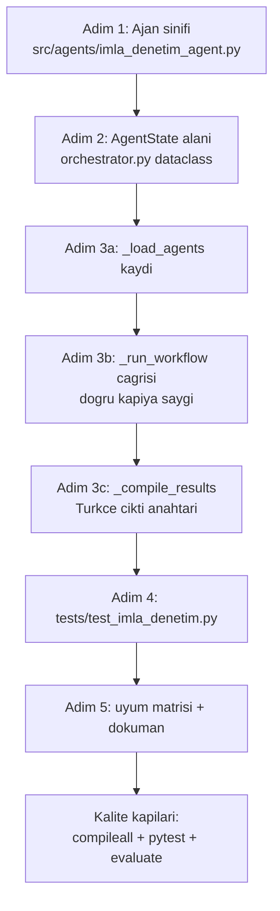

# Geliştirici Rehberi 🛠️

Bu sayfa, sisteme yeni yetenek eklemek isteyen geliştiriciler için bir çalışma kılavuzudur: geliştirme ortamının kurulumu, kod organizasyonu ve konvansiyonlar, yeni bir ajanın adım adım eklenmesi, `AgentState`'in genişletilmesi, yeni evrak türü/birim/mevzuat ekleme, framework-süz mimari kararının gerekçesi, test yazımı ve katkı/inceleme kuralları. Depodaki `CONTRIBUTING.md` ve `docs/gelistirici_rehberi.md` bu rehberi tamamlar.

> [!NOTE]
> **TL;DR** — Her ajan tek bir sözleşmeye uyar: `run(self, state: AgentState) -> AgentState`. Yeni bir ajan eklemek beş dosyaya dokunmaktır: (1) `src/agents/<ad>_agent.py` ajan sınıfı, (2) `orchestrator.py` içinde `AgentState` alanı, (3) `_load_agents` kaydı, (4) `_run_workflow` çağrısı, (5) `_compile_results` çıktı anahtarı — artı test. Konvansiyonlar sabittir: **Türkçe** docstring/yorum, **saf Python + stdlib** çekirdek, **Python 3.9 uyumu**, `from __future__ import annotations`. Yeni çekirdek bağımlılık eklenmez; opsiyonel yetenekler `requirements-optional.txt`'e import-hatasına dayanıklı biçimde girer. Held-out setlere bakarak kural yazmak yasaktır.

---

## 1. Geliştirme Ortamı Kurulumu

Sistem **offline-first** tasarlanmıştır: çekirdek bağımlılıklarla, hiçbir LLM olmadan uçtan uca çalışır. Kurulumun ilk hedefi bu çekirdek yolu doğrulamaktır.

```bash
# Depoyu klonlayın
git clone https://github.com/msgxr/teknofest-2026-kamu-evrak-akilli-ajan.git
cd teknofest-2026-kamu-evrak-akilli-ajan

# Sanal ortam (Python 3.9+)
python3 -m venv venv
source venv/bin/activate        # Windows: venv\Scripts\activate

# Çekirdek bağımlılıklar — sistem bunlarla TAM çalışır (offline, LLM'siz)
pip install -r requirements.txt

# (Opsiyonel) OCR / semantik arama / yerel model yetenekleri
pip install -r requirements-optional.txt

# Kurulumu doğrulayın (tek evrak CLI)
python -m src.main --input data/raw/kurgu_evraklar/dilekce_01.txt
```

Depo kökünde `./baslat.sh` web arayüzünü, `./baslat.sh --api` ise REST API'yi (varsayılan port 8765) tek komutla başlatır.

### Çekirdek / opsiyonel disiplini

| Katman | Dosya | İçerik | Kural |
|---|---|---|---|
| Çekirdek | `requirements.txt` | Sistem bununla LLM'siz, offline, TAM çalışır | Yeni çekirdek bağımlılık **eklenmez** |
| Opsiyonel | `requirements-optional.txt` | OCR (pytesseract/easyocr/pdf2image/opencv), semantik arama (`sentence_transformers`), PDF üretimi (reportlab), yerel/uzak LLM | Import hatasına dayanıklı; yoksa zarif düşüş |

Opsiyonel bir yetenek eksikse ilgili ajan/katman sessizce devre dışı kalır ve çekirdek akış bozulmaz. Örneğin `reportlab` kurulu değilse `PDF_KULLANILABILIR=False` olur ve `.txt` yolu çalışmaya devam eder; `cv2`/`pytesseract` yoksa görüntü ön-işleme atlanır ama `.txt`/`.md` okuma etkilenmez. Kurulum, LLM backend seçimi ve `.env` ayarları için ayrıntılar [Kurulum ve Yapılandırma](Kurulum-ve-Yapılandırma) sayfasındadır.

---

## 2. Kod Organizasyonu ve Konvansiyonlar

### Dizin haritası

| Dizin / Dosya | Sorumluluk |
|---|---|
| `src/agents/` | 11 uzman ajan + `orchestrator.py` (koşullu akış, 3 kapı) |
| `src/models/llm_wrapper.py` | Model-agnostik LLM katmanı (stdlib `urllib`; OpenAI-uyumlu / Ollama / offline otomatik tespit) |
| `src/models/istatistiksel_siniflandirici.py` | Saf Python Multinomial Naive Bayes (sınıflandırma ensemble'ı) |
| `src/utils/` | BM25, Türkçe NLP, güven/ölçüm katmanı, KVKK denetimi, resmî yazışma yardımcıları |
| `src/pipelines/end_to_end_pipeline.py` | Orkestratörü sarmalayan uçtan uca hat + isteğe bağlı SQLite denetim izi |
| `src/config.py` | `pydantic_settings` tabanlı merkezî konfigürasyon |
| `src/api.py` | Sıfır-bağımlılık REST API (`http.server`) |
| `src/mcp_server.py` | JSON-RPC 2.0 stdio MCP sunucusu |
| `src/main.py` | `argparse` tabanlı CLI |
| `src/templates/` | 5 resmî yazı şablonu |
| `scripts/` | `evaluate.py`, `benchmark.py`, `dayaniklilik_testi.py`, `ml_egit.py` |
| `data/raw/` | Etiketli sentetik setler + mevzuat korpusu |
| `docs/` | Teknik rapor, model bilgileri, şartname uyum matrisi, bu rehber |

Mimarinin kuş bakışı anlatımı için [Sistem Mimarisi](Sistem-Mimarisi) ve orkestrasyon ayrıntıları için [Orkestratör ve Koşullu Kapılar](Orkestratör-ve-Koşullu-Kapılar) sayfalarına bakın.

### Üslup kuralları (bağlayıcı)

- **Türkçe zorunluluğu** — Tüm docstring'ler, kod yorumları, log mesajları ve kullanıcıya dönük çıktılar Türkçedir. Teknik terimler İngilizce orijinal formlarıyla kullanılabilir. Bu, şartnamenin gereğidir.
- **Python 3.9 uyumu** — Kod tabanı Python 3.9'u destekler. Yeni modüllerde `from __future__ import annotations` kullanın; 3.10+ sözdizimine (`match`, çalışma zamanı `X | Y` tip birleşimi) dayanmayın. CI, Python 3.9 ve 3.12 sürümleri üzerinde koşar.
- **stdlib önceliği** — Yeni çekirdek bağımlılık eklenmez. Zorunlu yeni yetenekler önce stdlib ile denenir, mümkün değilse opsiyonel katmana import-dayanıklı eklenir.
- **Logger deseni** — Her modül kendi logger'ını `logger = logging.getLogger("kamu_evrak_ajan.<modul>")` kalıbıyla açar; `print` yalnızca CLI çıkış noktalarında kullanılır.
- **Ajan sözleşmesi** — Her ajan, paylaşılan `AgentState` nesnesini alan ve geri döndüren tek bir `run(self, state)` metodu sunar.
- **Gerçek kişisel veri YASAK** — Test/örnek verilerde yalnızca açıkça kurgu değerler kullanılır. Kurgu TCKN'ler resmî checksum'ı geçebilir ama gerçek bir kişiye ait olamaz (KVKK ilkesi). Ayrıntı: [KVKK ve Anonimleştirme](KVKK-ve-Anonimleştirme).

### Ajan sözleşmesi

Her ajan aynı minimal arayüzü paylaşır — bağımlılık enjeksiyonu, kalıtım zorunluluğu veya dekoratör yoktur:

```python
class OrnekAgent:
    def __init__(self) -> None:
        logger.info("Örnek Agent başlatıldı.")

    def run(self, state: "AgentState") -> "AgentState":
        """Girdiyi state'ten okur, sonucunu state'e yazar."""
        ...
        return state
```

`AgentState` ajanlar arasında paylaşılan bir `@dataclass`'tır (`src/agents/orchestrator.py`). Her ajan girdisini `state`'ten okur ve sonucunu `state`'e yazar; bir sonraki ajan güncellenmiş `state`'i alır. Bu düz veri-akışı, framework yerine sade Python dataclass'ıyla kurulan sözleşmenin özüdür.

---

## 3. Neden Framework-süz? (Mimari Karar Gerekçesi)

Sistem, bir ajan orkestrasyon kütüphanesi (LangChain, LangGraph, CrewAI vb.) kullanmadan **saf Python** ile yazılmıştır. Bu bilinçli bir mühendislik kararıdır:

> [!IMPORTANT]
> **Offline-first korunur.** Çekirdek `requirements.txt` ile sistem, hiçbir LLM veya harici servis olmadan tam işlevsel çalışmalıdır. Ağır orkestrasyon framework'leri geniş bağımlılık ağaçları, çoğu zaman zorunlu bir LLM istemcisi ve sürüm kırılganlığı getirir — bu, offline-first ve yerel/on-prem çalışabilirlik kısıtıyla çelişir.

- **Şeffaflık ve denetlenebilirlik** — Akış, `_run_workflow()` içinde okunabilir düz Python `if/else` bloklarıdır. Üç koşullu kapının (okunabilirlik / dil / düşük güven) her biri kaynak kodda birebir izlenebilir; jüri için "kutu içinde ne oluyor" sorusu doğrudan yanıtlanır.
- **Determinizm** — Çekirdek kural tabanlı olduğu için aynı girdi aynı çıktıyı üretir; değerlendirme ve dayanıklılık testleri tekrarlanabilir kalır. LLM yalnızca opsiyonel bir iyileştirme katmanıdır ve yalnızca düşük güvende devreye girer.
- **Bağımlılık minimizasyonu = güvenlik yüzeyi minimizasyonu** — Tedarik zinciri saldırı yüzeyi küçük tutulur; LLM çağrıları bile harici SDK yerine stdlib `urllib` ile yapılır (`src/models/llm_wrapper.py`).
- **Kararlılık** — Framework API kırılmaları yarışma teslim takvimini riske atmaz.

Sonuç: orkestrasyon "sihri" yoktur; `OrchestratorAgent`, 11 ajanı sabit bir sözlükte tutar, koşullu bir sırayla çağırır, her adımı `time.perf_counter` ile ölçer ve hataları yutup `state.errors`'a kaydeder (bir ajanın çökmesi hattı durdurmaz).

> [!NOTE]
> Orkestratör LLM eskalasyonunu **doğrudan yapmaz**. Düşük güvende LLM'e danışma, ilgili ajanın (ör. `ClassificationAgent`) *içinde* gerçekleşir; orkestratör yalnızca güven izleme kaydını tutar ve eşik altında insan onayı işaretler. Bu tasarımın ayrıntıları [Orkestratör ve Koşullu Kapılar](Orkestratör-ve-Koşullu-Kapılar) sayfasındadır.

---

## 4. Yeni Bir Ajan Nasıl Eklenir (adım adım)

Örnek olarak, evrak metninden yazım/imla puanı üreten kurgusal bir `ImlaDenetimAgent` ekleyelim. Aşağıdaki akış, gerçek dosyalara dokunma sırasını gösterir.



### Adım 1 — Ajan sınıfı iskeleti

Yeni dosya: `src/agents/imla_denetim_agent.py`. Kısa bir şablon için `src/agents/summarization_agent.py`, zengin docstring geleneği için `src/agents/triage_agent.py` iyi örneklerdir.

```python
"""
İmla Denetim Agent — evrak metninde yazım denetimi. (Ne yaptığını,
hangi İLKESEL kurala dayandığını ve şartnamenin hangi maddesini
karşıladığını Türkçe açıklayın.)
"""

from __future__ import annotations

import logging
from typing import TYPE_CHECKING

if TYPE_CHECKING:
    from src.agents.orchestrator import AgentState

logger = logging.getLogger("kamu_evrak_ajan.imla_denetim")


class ImlaDenetimAgent:
    """Evrak metninde imla denetimi yapan ajan."""

    def __init__(self) -> None:
        logger.info("İmla Denetim Agent başlatıldı.")

    def run(self, state: "AgentState") -> "AgentState":
        """Metni denetler ve sonucu state.imla_denetimi alanına yazar."""
        metin = state.raw_text
        # ... kural tabanlı analiz ...
        state.imla_denetimi = {"skor": 1.0, "bulgular": []}
        return state
```

`AgentState` yalnızca tip denetimi için `TYPE_CHECKING` altında import edilir (dairesel import'tan kaçınır). Ajan istisna fırlatabilir; orkestratör bunu adım kaydına ve `state.errors`'a işler (çökme yerine zarif düşüş).

### Adım 2 — `AgentState` alanı ekleme

`src/agents/orchestrator.py` içindeki `AgentState` dataclass'ına, ilgili görev bloğunun altına varsayılanlı bir alan ekleyin. **Mutable (değiştirilebilir) varsayılanlar için `field(default_factory=...)` zorunludur** — dataclass ham `dict`/`list` varsayılanı kabul etmez:

```python
imla_denetimi: dict = field(default_factory=dict)
```

`AgentState` alanları beş mantıksal grupta düzenlenir; yeni alanı doğru gruba yerleştirin:

| Grup | Örnek alanlar |
|---|---|
| Giriş | `input_file`, `raw_text` |
| Görev 1 | `ocr_result`, `classification`, `extracted_info`, `missing_info`, `legislation_matches`, `legislation_meta`, `summary`, `summary_body` |
| Yenilik | `anonymized_text`, `anonymization_report`, `triage` |
| Görev 2 | `draft_text`, `draft_type`, `format_validation`, `draft_quality`, `routing_suggestion`, `user_notifications`, `clarification_requests` |
| Meta | `errors`, `processing_steps`, `confidence_trace`, `workflow_warnings`, `human_review_required`, `human_review_reasons` |

### Adım 3 — Orkestratöre kayıt (üç nokta)

Aynı dosyada üç noktaya dokunulur:

1. **`_load_agents()`** — import + `self.agents` sözlüğüne `"imla_denetim": ImlaDenetimAgent(),` girdisi. Ajanlar bu sözlükte sabit sırayla yüklenir (`ocr, classification, info_extraction, missing_info, legislation, summarization, draft_writer, routing, user_info, triage, anonimlestirme`).
2. **`_run_workflow()`** — akışta doğru yere `self._run_step("imla_denetim", "İmla denetimi")` çağrısı. **Koşullu kapılara saygı gösterin**: içerik analizi ajanları yalnızca metin okunabilir iken çalışmalıdır (Görev 1 bloğu bunun örneğidir). Görev 1 gerçek çalışma sırası şudur: `classification → info_extraction → missing_info → legislation → triage → summarization → anonimlestirme` (dikkat: triage, summarization'dan **önce** çalışır).
3. **`_compile_results()`** — sonuç sözlüğüne Türkçe anahtar: `"imla_denetimi": self.state.imla_denetimi,`.

> [!WARNING]
> Sonuç sözlüğü (`_compile_results` çıktısı) dış API'nin bir parçasıdır. **Yeni anahtar eklemek geriye uyumludur; var olan anahtar adını değiştirmek kırıcıdır** — REST API, MCP, Streamlit ve `scripts/evaluate.py` bu anahtarlara bağlıdır. Mevcut anahtarlar: `input_file, ocr, siniflandirma, bilgi_cikarim, eksik_bilgiler, mevzuat_eslestirme, mevzuat_arama_meta, ozet, yazi_taslagi, yazi_turu, format_denetimi, taslak_kalitesi, yonlendirme, bilgilendirmeler, eksik_bilgi_talepleri, onceliklendirme, anonimlestirme, guven_izleme, tutarlilik_denetimi, emsal_onerisi, kanit_vurgulari, islem_adimlari, hatalar, insan_onayi`.

### Adım 4 — Test

Yeni dosya: `tests/test_imla_denetim.py`. Gelenek: sınıf bazlı gruplama + Türkçe test adları (örnek: `tests/test_triage.py`). En az üç düzeyde test yazın — ajanı tek başına (birim), sınır durumu, ve uçtan uca entegrasyon:

```python
class TestImlaDenetimAgent:
    def test_temiz_metin_tam_puan(self): ...     # birim: ajan tek başına
    def test_bos_metin_cokmez(self): ...         # sınır durumu

class TestOrkestratorEntegrasyonu:
    def test_sonuc_sozlugunde_alan_var(self):    # uçtan uca
        sonuc = OrchestratorAgent().process_text("...")
        assert "imla_denetimi" in sonuc
```

### Adım 5 — Uyum matrisi ve dokümantasyon

- `docs/sartname_uyum_matrisi.md`: ajanın karşıladığı şartname gereksinimine kanıt satırı ekleyin. Ayrıntı: [Şartname Uyum Matrisi](Şartname-Uyum-Matrisi).
- Ajan sayısına dokunuyorsanız README ve `docs/teknik_rapor.md` mimari bölümünü hizalayın (11 → 12).
- İsteğe bağlı olarak `src/app.py` içindeki ilgili sekmeye bir gösterim bloğu ekleyebilirsiniz; sonuç sözlüğünde alan zaten döndüğü için zorunlu değildir.

---

## 5. `AgentState`'e Alan Ekleme — İlkeler

`AgentState`, sistemin tek paylaşılan bellek modelidir. Alan eklerken:

- **Varsayılan her zaman "boş ama geçerli"** olmalı: `dict` için `field(default_factory=dict)`, `list` için `field(default_factory=list)`, skaler için nötr değer (`""`, `0.0`, `None`). Böylece bir kapı tetiklenip ajan atlansa bile sonuç sözlüğünün şekli korunur (ilgili alan boş kalır).
- **Meta alanlar additive'dir** — `workflow_warnings` öğe şeması `{kod, baslik, mesaj, seviye}`'dir; `UserInfoAgent` bunları kullanıcı bilgilendirmelerine çevirir. Uyarı üretmek istiyorsanız yeni bir tür/karar alanı yerine bu listeye eklemek çoğunlukla daha uygundur.
- **Güven izleme** yalnızca sınıflandırma ve yönlendirme adımlarında yapılır (`confidence_trace`); yeni bir karar ajanı güven üretiyorsa aynı deseni izleyin. Güven ve ölçüm katmanının bütünü için [Güven ve Ölçüm Katmanı](Güven-ve-Ölçüm-Katmanı) sayfasına bakın.
- `EndToEndPipeline`, orkestratör çıktısına ayrıca `islem_suresi_saniye` anahtarını ekler; bu anahtar `_compile_results` içinde **yoktur**, pipeline sarmalayıcısında eklenir.

---

## 6. Yeni Bir Evrak Türü Ekleme

Sistem 8 evrak türünü (+`diger`) tanır: `dilekce, ust_yazi, cevap_yazisi, bilgilendirme, tutanak, rapor, genelge, onayli_belge`. "Davet yazısı" gibi yeni bir tür eklemek için:

1. **Sınıflandırma** — `src/agents/classification_agent.py` içindeki `EVRAK_TURLERI` sözlüğüne yeni anahtar ekleyin (`ad` + `aciklama`); ağırlıklı anahtar kelimeleri `AGIRLIKLI_KELIMELER`'e, yapısal regex sinyallerini `_YAPISAL_SINYALLER`'e ekleyin. Tür anahtarı (ör. `davet_yazisi`) sistem genelinde kimliktir.
2. **Zorunlu alanlar** — `src/agents/missing_info_agent.py` içindeki `ZORUNLU_ALANLAR` sözlüğüne türe özgü alan listesi ekleyin; tür tanımsızsa `diger` varsayılanı kullanılır.
3. **Usul mevzuatı (opsiyonel)** — Tür belirli bir usul mevzuatına tabiyse `src/agents/legislation_agent.py` içindeki `TUR_MEVZUAT_AGIRLIKLARI` tablosuna doc_id ekleyin.
4. **Taslak şablonu (opsiyonel)** — Türe özel resmî yazı gerekiyorsa `src/templates/` altına şablon ekleyip `DRAFT_TYPE_MAP` eşlemesini genişletin. Taslak ayrıntıları: [Görev 2 — Taslaklama ve Yönlendirme](Görev-2-Taslak-ve-Yönlendirme).
5. **Veri + etiket** — `data/raw/kurgu_evraklar/` altına 2–3 **kurgu** örnek ekleyin ve `etiketler.json`'a `{tur, birim_kodu, eksik_alanlar, aciklama}` şemasıyla etiketleyin. Held-out setlere dokunmayın.
6. **ML ensemble** — İstatistiksel sınıflandırıcı (`src/models/istatistiksel_siniflandirici.py`) etiketli veriden `scripts/ml_egit.py` ile eğitilir; yeni tür örnekleri eklendiyse modeli yeniden eğitip `data/processed/ml_model.json`'u güncelleyin. Model dosyası yoksa/bozuksa sistem saf kural tabanlı moda zarifçe düşer.
7. **Test + ölçüm** — Sınıflandırma testi ekleyin ve `python scripts/evaluate.py` ile geliştirme seti doğruluğunun gerilemediğini doğrulayın.

> [!IMPORTANT]
> `eksik_alanlar` etiket anahtarları, `ZORUNLU_ALANLAR` ile **birebir** uyumlu olmalıdır. Örneğin tutanak için `imzalar` kullanılır, `imza` değil. Bu tutarlılık `scripts/evaluate.py` eksik-bilgi metriğinin doğru ölçülmesi için şarttır.

---

## 7. Yeni Bir Birim Ekleme

Sistem 9 kamu birimine yönlendirir: `yazi_isleri, hukuk, insan_kaynaklari, mali_hizmetler, bilgi_islem, strateji, basin_halkla_iliskiler, destek_hizmetleri, genel_mudurluk`. Yeni birim eklemek için:

1. `src/agents/routing_agent.py` içindeki `BIRIMLER` sözlüğüne yeni anahtar ekleyin (mevcut girdilerle aynı şema: `ad`, `aciklama`, `{anahtar_kelime: ağırlık}`). Anahtar (ör. `cevre_koruma`), etiketlerdeki `birim_kodu` değeriyle birebir aynıdır.
2. Yönlendirme sinyallerini **ilkesel** yazın: birimin gerçek görev alanının söz dağarcığı — belirli bir test dosyasına özel ezber değil. Güçlü sinyaller 2–3× ağırlık taşır.
3. REST API'deki `GET /birimler` kataloğu (`src/api.py`, `_birim_katalogu`) `BIRIMLER`'den otomatik beslenir; ek iş gerekmez.
4. `python scripts/evaluate.py` ile yönlendirme doğruluğunun gerilemediğini doğrulayın.

Yönlendirme güven formülü, tür bonusları ve LLM tie-break mantığı için [Görev 2 — Taslaklama ve Yönlendirme](Görev-2-Taslak-ve-Yönlendirme) sayfasına bakın.

---

## 8. Yeni Bir Mevzuat Belgesi Ekleme

Mevzuat korpusu `data/raw/mevzuat_metinleri/*.txt` dosyalarından oluşur ve `LegislationAgent._ensure_index()` tarafından otomatik yüklenir — **dosyayı doğru formatta koymak yeterlidir**, kod değişikliği gerekmez:

1. Dosya adı = doc_id: `ornek_kanun_1234.txt` (küçük harf, alt çizgi).
2. Dosya formatı (`_parse_corpus_file`): başlık bloğu + `## ` ile başlayan bölümler (chunk). Her bölüm bir chunk olur ve madde numaraları üstveriye işlenir:

   ```
   # Başlık: <resmî ad>
   # Kaynak: <kaynak, ör. mevzuat.gov.tr bağlantısı>
   # Anahtar-Kelimeler: <virgülle ayrılmış liste>

   ## Madde 7 — Cevap süresi
   <2–5 cümlelik bölüm metni>

   ## <sonraki bölüm>
   ...
   ```

3. Yalnızca **kamuya açık** mevzuat metni/özeti kullanın; kaynak satırı zorunlu şeffaflık kanıtıdır.
4. (Opsiyonel) Belge belirli türler için usul mevzuatıysa veya bir alan temasına aitse `TUR_MEVZUAT_AGIRLIKLARI` / `MEVZUAT_TEMALARI` tablolarına doc_id ekleyin.

> [!WARNING]
> Korpus ve BM25 indeksi **sınıf düzeyinde önbelleğe** alınır (tüm `LegislationAgent` örnekleri paylaşır). Değişikliğin görünmesi için çalışan süreci (Streamlit/API) yeniden başlatın.

RAG mimarisinin (BM25 çekirdek, düzeltici sorgu genişletme, opsiyonel semantik + reranker) tamamı için [Mevzuat RAG ve Hibrit Arama](Mevzuat-RAG-ve-Hibrit-Arama) sayfasına bakın.

---

## 9. Yeni Bir API Ucu Ekleme

REST API (`src/api.py`) stdlib `http.server` üzerine kuruludur; framework yoktur.

- **GET ucu** — `do_GET()` içindeki `if/elif` zincirine yeni yol ekleyin; yanıtı JSON yardımcısıyla döndürün. Veri üreten mantığı, `_saglik_bilgisi` / `_birim_katalogu` gibi ayrı bir modül düzeyi fonksiyona koyun ve import'ları tembel (fonksiyon içinde) yapın ki sunucu açılışı hafif kalsın.
- **POST ucu** — `do_POST()` başındaki izinli yol demetine yolu ekleyin; gövde okuma için mevcut `_json_govde()` / `_metin_al()` yardımcılarını kullanın (boyut sınırı ve hata yanıtları oradan hazır gelir).
- **Güvenlik gelenekleri** — İç hata ayrıntısı yanıta sızdırılmaz (log'a yazılır, kullanıcıya genel Türkçe mesaj döner); bilinmeyen uçta gövde sınırlı tüketilir; girdi uzunluk sınırları korunur. Sunucu loglarına evrak metni yazılmaz (KVKK).
- **Test** — `tests/test_api.py` sunucuyu `sunucu_olustur(port=0)` ile ayrı thread'de kaldırır; yeni uç için aynı desenle olumlu + olumsuz (404/400) test ekleyin.
- **Dokümantasyon** — `docs/api_rehberi.md`'ye ucun istek/yanıt örneğini ekleyin.

REST API sözleşmesinin tamamı [REST API](REST-API), MCP eşlemesi [MCP Sunucusu](MCP-Sunucusu) sayfalarındadır.

---

## 10. Test Yazma

Testler `tests/` altında, `pytest` ile koşar. Gelenek: sınıf bazlı gruplama, Türkçe test adları, davranış-odaklı iddialar.

```bash
pytest tests/ -q                             # tüm testler (kısa çıktı)
pytest tests/test_classification.py          # tek modül
pytest tests/ --cov=src --cov-report=html    # kapsama raporu
python -m compileall -q src scripts          # derleme / py39 sözdizimi denetimi
```

- Bir PR açmadan önce **tüm testler yerelde yeşil olmalıdır**. Depo CI rozetine göre 632 test geçmektedir.
- Metrik fonksiyonları (`scripts/evaluate.py`) pipeline importundan ayrılmıştır (gecikmeli import); `tests/test_evaluation.py` ve `tests/test_benchmark.py` bunları pipeline yüklemeden doğrudan test eder.
- Davranış değiştiren her PR'a test eşlik eder; kod + test aynı commit'te gelir.

Test haritası, CI iş akışı ve kalite kapıları için [Test ve Sürekli Entegrasyon](Test-ve-Sürekli-Entegrasyon) sayfasına bakın.

---

## 11. Katkı, Commit ve Kod İnceleme

### Dal ve commit düzeni

- `main` dalı her zaman yeşil tutulur; değişiklikler konu dalları üzerinden PR ile gelir.
- Dal adları: `feat/<kisa-ad>`, `fix/<kisa-ad>`, `docs/<kisa-ad>`.
- Commit mesajları **Conventional Commits + Türkçe özet** biçimindedir:

  ```
  feat(triage): süreli evrak için iş günü hesabı
  fix(kvkk): kişi adı sızıntısı kapatıldı
  docs: geliştirici rehberi eklendi
  ```

- Bir commit tek bir mantıksal değişiklik içerir; kullanıcıya dönük değişiklikler `CHANGELOG.md`'nin `[Yayınlanmamış]` bölümüne işlenir.

### Kod inceleme ölçütleri

Bir PR incelenirken şunlar denetlenir:

- [ ] Ajan sözleşmesine uyum (`run(state) -> state`), Türkçe docstring/yorum, logger deseni.
- [ ] Python 3.9 uyumu; yeni çekirdek bağımlılık **yok** (opsiyonel ise import-dayanıklı).
- [ ] Offline-first korunmuş — LLM/opsiyonel katman yoksa çekirdek akış çalışıyor.
- [ ] Davranış değişikliğine test eşlik ediyor; `pytest tests/ -q` yeşil.
- [ ] KVKK: gerçek kişisel veri yok, sızıntı yok.
- [ ] Değerlendirme bütünlüğü: held-out setlere bakılarak kural yazılmamış; `eval_report*.json` elle düzenlenmemiş.
- [ ] Sonuç sözlüğü anahtarları korunmuş (kırıcı yeniden adlandırma yok).

### Fikri mülkiyet (Inbound = Outbound)

Depoya gönderilen tüm katkılar, Apache License 2.0 §5 uyarınca projenin mevcut lisansı (Apache-2.0) ile **aynı şartlarda** kabul edilir. Ayrı bir CLA gerekmez; telif hakları katkı sahibinde kalır. Telif sahibi: AGENTRA TECH.

---

## 12. Değerlendirme Bütünlüğü (İHLAL EDİLEMEZ)

Bu proje ölçülebilir başarım raporlar; ölçümün güvenilirliği her şeyin üstündedir.

> [!WARNING]
> **Held-out setlere bakarak kural yazılmaz.** `data/raw/kurgu_evraklar_heldout*` altındaki setler nihai ölçüm içindir. Bu setlerdeki hatalara bakılarak kural/kod kalibre edilirse set held-out niteliğini **kaybeder** ve bu durum `docs/teknik_rapor.md` §5'e açıkça yazılmak zorundadır. Kural geliştirme yalnızca geliştirme seti (`data/raw/kurgu_evraklar`, 52 evrak) üzerinde yapılır.

- **Rapor dosyaları elle düzenlenmez** — `data/processed/eval_report*.json` yalnızca `scripts/evaluate.py` ile üretilir.
- **Sonuçlar olduğu gibi raporlanır** — Ölçüm ne çıkarsa çıksın gizlenmez, seçici sunulmaz; sonuç manipülasyonu şartnameye göre etik ihlaldir.
- **Tekrarlanabilirlik mührü** — Her rapora git commit SHA + platform + veri seti içerik hash gömülür (`src/utils/kosum_muhru.py`); mutlak yol sızmaz.

Held-out disiplini, adversarial setler ve tekrarlanabilirlik için [Değerlendirme ve Metrikler](Değerlendirme-ve-Metrikler) ve [Adversarial Dayanıklılık](Adversarial-Dayanıklılık) sayfalarına bakın. Anayasal çerçevenin bütünü [Anayasal İlkeler ve Etik](Anayasal-İlkeler-ve-Etik) sayfasındadır.

---

## 13. Teslim Öncesi Kalite Kapıları

Her genişletmede, PR'dan önce üç komut çalıştırılır:

```bash
python -m compileall -q src scripts   # sözdizimi / py39 uyumu
pytest tests/ -q                      # tüm testler yeşil
python scripts/evaluate.py            # geliştirme seti metrikleri gerilemedi
```

Aynı denetimler CI'da (`.github/workflows/ci.yml`) Python 3.9 ve 3.12 üzerinde otomatik koşar; CI kırmızıyken PR birleştirilmez. İsteğe bağlı olarak metamorfik dayanıklılığı da doğrulayın:

```bash
python scripts/dayaniklilik_testi.py  # tür/birim invaryansı (CheckList-INV)
```

---

## İlgili Sayfalar

- [Sistem Mimarisi](Sistem-Mimarisi) — Genel mimari, `AgentState` veri akışı, dizin haritası
- [Orkestratör ve Koşullu Kapılar](Orkestratör-ve-Koşullu-Kapılar) — Koşullu akış ve 3 kapının kaynak-düzeyi mantığı
- [Uzman Ajanlar](Uzman-Ajanlar) — 11 ajanın genel bakışı ve görev sayfaları
- [Test ve Sürekli Entegrasyon](Test-ve-Sürekli-Entegrasyon) — Test haritası, CI iş akışı, kalite kapıları
- [Kurulum ve Yapılandırma](Kurulum-ve-Yapılandırma) — Bağımlılıklar, `.env`, LLM backend seçimi
- [Anayasal İlkeler ve Etik](Anayasal-İlkeler-ve-Etik) — Anayasa, KVKK, değerlendirme bütünlüğü
