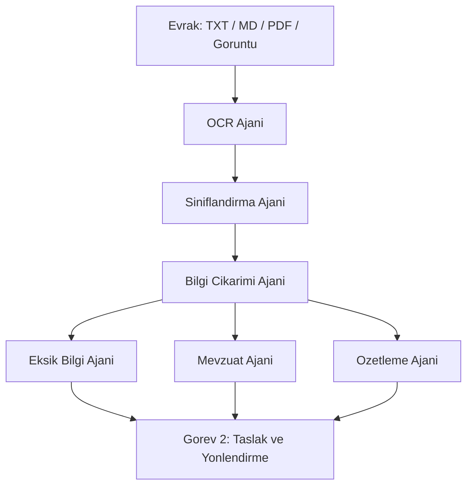

# 📋 Görev 1 — Okuma, Sınıflandırma ve İçerik Analizi

TEKNOFEST 2026 şartnamesinin **1. Görevi**, bir evrağın makine tarafından okunmasını, türünün belirlenmesini, içindeki bilgi unsurlarının çıkarılmasını, eksikliklerinin saptanmasını, ilgili mevzuatın önerilmesini ve kısa bir özetinin üretilmesini kapsar. Bu sayfa, Görev 1'i yürüten beş ajanı (OCR, Sınıflandırma, Bilgi Çıkarımı, Eksik Bilgi, Özetleme) bir arada anlatır.

> [!NOTE]
> **TL;DR** — Bir evrak sisteme girdiğinde önce **OCR Ajanı** metni çıkarır, ardından **Sınıflandırma Ajanı** 8 türden birini üçlü hibrit yöntemle belirler (kural + Naive Bayes + isteğe bağlı LLM), **Bilgi Çıkarımı Ajanı** tarih/sayı/TCKN/muhatap gibi 16 alanı ReDoS-güvenli regex ile toplar, **Eksik Bilgi Ajanı** türe özgü zorunlu alanları denetler, **Özetleme Ajanı** ise sadakat garantili 2–4 cümlelik resmî bir özet üretir. Hepsi LLM olmadan tam çalışır; LLM yalnızca isteğe bağlı bir zenginleştirmedir. Mevzuat önerisi bu görevin parçasıdır ve ayrı sayfada anlatılır: [Mevzuat RAG ve Hibrit Arama](Mevzuat-RAG-ve-Hibrit-Arama).

---

## Görev 1 Akışı

Aşağıdaki akış, orkestratörün Görev 1 kapsamında ajanları hangi sırayla çağırdığını gösterir. Koşullu kapıların (okunabilirlik, dil, düşük güven) ayrıntısı için [Orkestratör ve Koşullu Kapılar](Orkestratör-ve-Koşullu-Kapılar) sayfasına bakınız.



| Ajan | Sorumluluk | Girdi | Ana Çıktı (AgentState) |
|---|---|---|---|
| **OCR** | Metin çıkarımı | `input_file` | `raw_text`, `ocr_result` |
| **Sınıflandırma** | Tür belirleme | `raw_text` | `classification` |
| **Bilgi Çıkarımı** | Alan çıkarımı | `raw_text` | `extracted_info` |
| **Eksik Bilgi** | Zorunlu alan denetimi | `classification.tur` + `extracted_info` | `missing_info` |
| **Özetleme** | Kısa resmî özet | `raw_text` + `extracted_info` | `summary`, `summary_body` |

---

## 1. OCR Ajanı — Metin Çıkarımı

`src/agents/ocr_agent.py`

Hattın ilk halkasıdır ve dosya uzantısına göre üç yola dallanır:

- **Metin dosyaları (TXT / MD)** → doğrudan okunur (`engine_used = "direct"`).
- **PDF** → `pypdf` ile sayfalardan metin çıkarılır; metin katmanı yoksa veya `pypdf` mevcut değilse taranmış PDF olarak OCR'a düşülür (`pdf2image` ile görüntüye çevrilir).
- **Görüntü** → `PIL` ile açılır, piksel sınırı uygulanır, adaptif ön-işlemeden geçer ve OCR motoruna verilir.

**Adaptif ön-işleme** (`src/utils/goruntu_onisleme.py`, `on_isle`): gri tonlama → eğiklik düzeltme (deskew, Otsu + `minAreaRect`) → ölçekleme (küçük görüntüleri OCR için büyütme) → gürültü giderme (medianBlur) → adaptif eşikleme. `cv2` (OpenCV) kurulu değilse veya hata olursa görüntü olduğu gibi döndürülür (zarif bozulma).

**OCR motoru** isteğe bağlıdır: Tesseract (`pytesseract`) veya EasyOCR (`easyocr.Reader(['tr'])`). Görüntü girdilerinde ayrıca bir **kalite telemetrisi** üretilir:

```json
"ocr_kalite": {
  "ortalama_guven": 0.0,
  "dusuk_guven_orani": 0.0,
  "kalite": "yuksek | orta | dusuk",
  "insan_onayi_onerilir": false
}
```

Bu telemetri, orkestratörün **okunabilirlik kapısı** için bir sinyaldir: düşük kaliteli tarama, insan onayına yönlendirilebilir.

> [!NOTE]
> OCR/görüntü bağımlılıkları (`pytesseract`, `easyocr`, `opencv`, `pdf2image`) çekirdek değildir; `requirements-optional.txt` içindedir. Değerlendirme setleri düz metin olduğundan çekirdek kurulum, OCR olmadan da uçtan uca çalışır. Ayrıntı: [Kurulum ve Yapılandırma](Kurulum-ve-Yapılandırma).

---

## 2. Sınıflandırma Ajanı — Tür Belirleme

`src/agents/classification_agent.py`

Evrağı **8 türden** birine (ve gerektiğinde `diğer` artık kategorisine) atar:

| Kod | Tür | Kod | Tür |
|---|---|---|---|
| `dilekce` | Dilekçe | `tutanak` | Tutanak |
| `ust_yazi` | Üst Yazı | `rapor` | Rapor |
| `cevap_yazisi` | Cevap Yazısı | `genelge` | Genelge |
| `bilgilendirme` | Bilgilendirme | `onayli_belge` | Onaylı Belge |

### Üçlü hibrit yöntem

1. **Ağırlıklı kural skorlaması** — Üç sinyal kaynağı birleştirilir:
   - `AGIRLIKLI_KELIMELER`: türe özgü, kalibre edilmiş anahtar kelime sözlüğü (Türkçe küçük harfe indirgenmiş metinde alt-dizi eşleşmesi).
   - `_YAPISAL_SINYALLER`: 24 adet derlenmiş regex (çok-satırlı mod). Ağırlıklar **negatif de olabilir** — örneğin bir "Sayı :" satırı dilekçe olasılığını düşürür (dilekçelerde resmî sayı bulunmaz).
   - `_KIMLIK_ALANLARI`: 5 dilekçe kimlik/iletişim alanı (Ad Soyad, T.C. Kimlik No, Adres, Telefon, İmza); en az iki farklı alan bulunursa dilekçe bonusu uygulanır.
2. **İstatistiksel model (Naive Bayes)** — `src/models/istatistiksel_siniflandirici.py`. Saf Python Multinomial Naive Bayes; TF-IDF ağırlıklı, log-uzayda, Laplace düzeltmeli. Öznitelikler: kelime token'ları + kelime-sınırlı karakter 3-gram'ları. Model, `data/processed/ml_model.json` dosyasından yüklenir; ensemble ağırlığı **0.6 × kural + 0.4 × model** biçimindedir.
3. **LLM eskalasyonu (isteğe bağlı)** — Yalnızca güven **0.6 altında** kaldığında devreye girer. LLM yoksa sistem tamamen kural + model sonucuyla çalışır.

Çıktı, `state.classification` sözlüğüdür ve her karar bir **güven skoru** taşır:

```json
{
  "tur": "dilekce",
  "tur_adi": "Dilekçe",
  "guven": 0.982,
  "yontem": "kural_tabanli | hibrit_ensemble | llm_eskalasyon",
  "gerekce": "...",
  "tum_skorlar": { "dilekce": 0.98, "ust_yazi": 0.01, "...": 0.0 }
}
```

Boş metinde `tur = "bilinmiyor"`, `guven = 0.0` döner. Karşılaştırma için ayrıca bir **bag-of-words baseline** (`baseline_siniflandir`) bulunur; ablasyon ölçümlerinde kullanılır.

> [!IMPORTANT]
> Sınıflandırma doğruluğu (accuracy): geliştirme seti **1.0**, tutulmuş **1.0**, tutulmuş v2 **1.0**, adversarial v3 **0.9375**, adversarial-temiz v4 **0.9375** (v3/v4 için makro-F1 **0.9333**). Ablasyonda tam hibrit sistem, bag-of-words baseline'ı geniş farkla geçer (ör. geliştirme 1.0 vs 0.5385). Ayrıntı: [Değerlendirme ve Metrikler](Değerlendirme-ve-Metrikler).

---

## 3. Bilgi Çıkarımı Ajanı — İçerik Analizi

`src/agents/info_extraction_agent.py`

Metinden **16 alanı** ReDoS-güvenli düzenli ifadelerle çıkarır ve `state.extracted_info` sözlüğüne yazar:

`tarihler`, `evrak_tarihi`, `kurum_adlari`, `kisi_adlari`, `evrak_sayisi`, `referans_numaralari`, `konu`, `muhatap`, `dagitim_birimleri`, `tc_kimlik`, `telefon`, `eposta`, `iban`, `para_tutarlari`, `ilgi_referanslari`, `yerler`.

Öne çıkan doğrulama ve çözümleme adımları:

- **T.C. Kimlik No checksum** (`_tc_kimlik_gecerli`): 11 hane, ilk hane ≠ 0 ve 10./11. hane algoritması doğrulanır. Böylece rastgele 11 haneli sayılar TCKN sayılmaz. (Kurgu TCKN'ler yalnızca bu checksum'ı geçer, gerçek bir kişiye ait değildir — bkz. [Veri Setleri](Veri-Setleri).)
- **Sözel tarih çözümleme** (`sozel_tarih_bul`, `tanzim_tarihi_bul`): "on ikinci günü" gibi rakamsız tarihleri ve tutanak kapanış düzenlenme tarihini çözer.
- **Yer/varlık NER** (`src/utils/turkce_ner.py`, `yer_cikar`): Türkçe yer adlarını çıkarır; `varlik_f1` ile ölçülür.
- **İsteğe bağlı LLM zenginleştirmesi** (`_enrich_with_llm`): regex sonuçlarını **asla ezmez**, yalnızca tamamlayıcıdır (halüsinasyon önlemi).

Çıkarılan kişisel veri alanları (TCKN, telefon, e-posta, IBAN, kişi adı, adres) arayüzde KVKK paneline taşınır ve maskeli paylaşım nüshasında maskelenir — bkz. [KVKK ve Anonimleştirme](KVKK-ve-Anonimleştirme).

---

## 4. Eksik Bilgi Ajanı — Zorunlu Alan Denetimi

`src/agents/missing_info_agent.py`

Her evrak türünün resmî olarak taşıması gereken alanları `ZORUNLU_ALANLAR` sözlüğünde tutar ve mevcut olmayanları raporlar. Örnek zorunlu alan şemaları:

| Tür | Zorunlu alanlar |
|---|---|
| `dilekce` | tarih, ad_soyad, tc_kimlik, adres, talep_metni, imza |
| `ust_yazi` | tarih, sayi, konu, muhatap, ilgi, metin, imza, kurum_bilgisi |
| `cevap_yazisi` | tarih, sayi, konu, muhatap, ilgi, cevap_metni, imza |
| `tutanak` | tarih, saat, yer, katilimcilar, gundem, kararlar, imzalar |
| `rapor` | tarih, baslik, hazirlayan, bulgular, sonuc, imza |
| `genelge` | tarih, sayi, konu, metin, dagitim |
| `onayli_belge` | tarih, sayi, onaylayan, onay_metni |

Her eksik alan için `{alan, aciklama, oncelik, oneri}` üretilir ve **kritik > önemli > bilgi** sırasına göre dizilir. Denetim, yalnızca alan adı aramaz; yapısal sezgiseller kullanır: `_has_address`, `_has_signature`, `_has_title`, ve Türkçe eklemeli dilde son-ünsüz yumuşamasına toleranslı kök araması (`_anahtar_gecer`). Böylece "imza" alanı, metinde tam "imza" kelimesi geçmese de imza bloğundan tespit edilebilir.

Bu çıktı, Görev 2'de iki yere beslenir: eksikse taslak tamamlanamaz ve otomatik bir **eksik bilgi talep yazısı** üretilir — bkz. [Görev 2 — Taslaklama ve Birim Yönlendirme](Görev-2-Taslak-ve-Yönlendirme).

> [!IMPORTANT]
> Eksik bilgi tespiti (micro-F1): geliştirme **1.0**, tutulmuş **1.0**, tutulmuş v2 **1.0**, adversarial v3 **0.8333** (tp5 / fp2 / fn0), adversarial-temiz v4 **1.0**. v3'teki düşüş dürüstçe raporlanır — bkz. [Adversarial Dayanıklılık](Adversarial-Dayanıklılık).

---

## 5. Özetleme Ajanı — Sadakat Garantili Özet

`src/agents/summarization_agent.py`

Evraktan kısa, resmî ve **nesnel** bir özet üretir. İki yolu vardır ve aralarında otomatik seçim yapar:

- **LLM yolu** (`_generate_summary`): erişilebilirse bağlamlı bir istemle 2–4 cümlelik üretken özet. Evrak metni `belge_blogu(text, 4000)` ile "yalnızca veri" olarak işaretlenir (istem enjeksiyonu / prompt injection savunması). LLM yoksa, boş dönerse veya hata olursa extractive yola düşülür.
- **Extractive yol** (`_extractive_summary`): cümleler pozisyon + anahtar kelime örtüşmesi + konu örtüşmesi + ipucu kalıbı + uzunluk çarpanıyla skorlanır; en iyi 2–4 cümle **orijinal sırayla** birleştirilir.

Ajan iki alan döndürür:
- `state.summary` — başında tek satır künye (`[Tür] | Konu: … | Tarih: …`) bulunan **ekran özeti**.
- `state.summary_body` — künyesiz gövde. **Taslak yazımı yalnızca bu alanı kullanır.**

**Sadakat garantisi** (`src/utils/ozet_kalite.py`): muhafazakâr cümle sıkıştırma (`sadelestir_guvenli`) uygulanır; ancak sıkıştırma sonrası **sayısal olgu kümesi değişirse orijinal cümle korunur**. Böylece özet, kaynakta olmayan bir tutar/tarih uyduramaz. Kalite, referanssız metriklerle ölçülür: `sadakat`, `kaynak_kapsama`, `sikistirma_orani` ve ROUGE-L.

> [!IMPORTANT]
> Özet sadakati: geliştirme / tutulmuş / tutulmuş v2 **1.0**, adversarial v3 / v4 **0.9688**. Ölçüm ayrıntısı için [Güven ve Ölçüm Katmanı](Güven-ve-Ölçüm-Katmanı) ve [Değerlendirme ve Metrikler](Değerlendirme-ve-Metrikler).

---

## Görev 1 Çıktısı, Görev 2'ye Nasıl Bağlanır?

Görev 1'in ürettiği yapılandırılmış durum (`classification`, `extracted_info`, `missing_info`, `summary_body`) doğrudan Görev 2'nin girdisidir: tür ve içerik taslak şablonunu seçer, muhatap ve konu resmî yazıyı doldurur, eksik alanlar talep yazısını tetikler, içerik sinyalleri ise birim yönlendirmesini yönlendirir. Bu uçtan uca bağlantı için [Görev 2 — Taslaklama ve Birim Yönlendirme](Görev-2-Taslak-ve-Yönlendirme) ve [Sistem Mimarisi](Sistem-Mimarisi) sayfalarına bakınız.

---

## İlgili Sayfalar

- [Uzman Ajanlar](Uzman-Ajanlar) — 11 ajanın genel bakışı
- [Mevzuat RAG ve Hibrit Arama](Mevzuat-RAG-ve-Hibrit-Arama) — Görev 1'in mevzuat önerisi bileşeni
- [Görev 2 — Taslaklama ve Birim Yönlendirme](Görev-2-Taslak-ve-Yönlendirme) — bir sonraki görev
- [Değerlendirme ve Metrikler](Değerlendirme-ve-Metrikler) — bu ajanların doğrulanmış başarımı
- [Veri Setleri](Veri-Setleri) — sınıflandırma ve etiket şeması
- [Sözlük](Sözlük) — NER, TF-IDF, ReDoS gibi kavramlar
