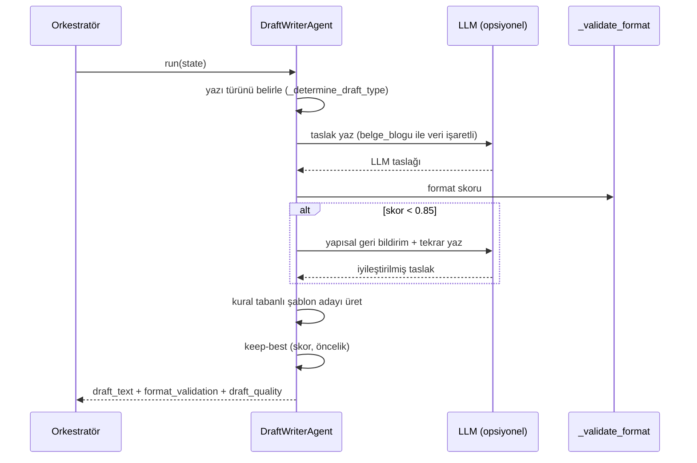

# Görev 2 — Taslaklama ve Birim Yönlendirme ✍️

Bu sayfa, TEKNOFEST 2026 şartnamesinin **Görev 2** kapsamını — gelen evraka uygun resmî yazı **taslağının üretilmesi** ve evrakın doğru **kamu birimine yönlendirilmesi** — sistemde nasıl gerçekleştirdiğimizi ajan ajan, madde madde açıklar. Görev 2, Görev 1'in içerik analizi çıktıları üzerine kurulur ve Resmî Yazışma Yönetmeliği'ne (RG 10.06.2020/31151) tam uyumu esas alır.

> [!NOTE]
> **TL;DR** — Görev 2, dört ajanla çalışır: **Taslak Yazımı** (`draft_writer_agent.py`), **Yönlendirme** (`routing_agent.py`), **Kullanıcı Bilgilendirme** (`user_info_agent.py`) ve isteğe bağlı **Resmî PDF** üretimi (`resmi_pdf.py`).
> - **5 resmî şablon** + madde-referanslı yönetmelik kontrol listesi (8 zorunlu + koşullu kurallar, toplam 16 potansiyel kural).
> - Taslak hibrittir: **LLM + Reflexion** turu ile **kural tabanlı şablon** arasından **keep-best** (en yüksek format skorlu, eşitlikte kural tabanlı) seçilir; LLM yoksa deterministik şablon her zaman geçerli bir taslak üretir.
> - Format skoru **≥ 0.8** ve doldurulmamış yer tutucu yoksa taslak "uygun" sayılır; bağımsız bir hakem taslağı ayrıca **0-100** puanlar.
> - Yönlendirme **9 kamu birimi** arasında ağırlıklı skorlama + tür bonusu ile yapılır; skorlar yakınsa (fark < %15) **LLM ayrıştırması** devreye girer.
> - Doğrulanmış taslak kalite ortalaması: geliştirme **93.6** (asgari 73), tutulmuş **95.8**, v2 **94.6**, v3 **95.8**, v4 **94.7** (0-100 ölçeği).

---

## 1. Görev 2 Şartname Gereksinimleri

Şartname, Görev 2'yi Görev 1 ile birlikte **zorunlu** kılar; değerlendirme uçtan uca senaryolar üzerinden yapılır ve tek görevi eksik bırakan sistem tamamlanmış sayılmaz. Görev 2'nin ürettiği çıktılar şunlardır:

| Gereksinim | Sistemdeki karşılığı | Dosya |
|---|---|---|
| Gelen evraka uygun resmî yazı **taslağı** üret | `DraftWriterAgent` — 5 şablon + LLM/Reflexion + kural tabanlı | `src/agents/draft_writer_agent.py` |
| Taslağın **resmî formata uygunluğu** | Madde-referanslı `_validate_format` kontrol listesi + bağımsız hakem | `src/agents/draft_writer_agent.py`, `src/utils/taslak_hakemi.py` |
| Evrakı **ilgili birime yönlendir** (gerekçeli) | `RoutingAgent` — ağırlıklı skor + alternatif + gerekçe | `src/agents/routing_agent.py` |
| Kullanıcıyı **bilgilendir** ve eksikleri talep et | `UserInfoAgent` — durum, sonraki adım, eksik bilgi talep yazısı | `src/agents/user_info_agent.py` |
| Çıktının **resmî görsel formatta** paylaşımı | `resmi_pdf.taslak_pdf_uret` (opsiyonel) | `src/utils/resmi_pdf.py` |

Bu ajanların orkestratör akışındaki yeri ve koşullu kapılar için bkz. [Orkestratör ve Koşullu Kapılar](Orkestratör-ve-Koşullu-Kapılar). Görev 1 tarafı için bkz. [Görev 1 — Okuma, Sınıflandırma ve İçerik Analizi](Görev-1-Okuma-ve-Analiz).

> [!IMPORTANT]
> Görev 2 ajanları, orkestratörün üç koşullu kapısına tabidir: metin **okunamıyorsa** (Kapı 1) taslak/yönlendirme atlanır; evrak dili **Türkçe değilse** (Kapı 2) taslak üretimi atlanır ama yönlendirme ve analiz yine çalışır; **düşük güvende** (Kapı 3) karar bloklanmaz, "insan onayı gerekli" işareti konur.

---

## 2. Görev 2 Akış Şeması

```mermaid
flowchart TD
    A[Görev 1 çıktıları:<br/>tür + bilgi + eksik + mevzuat + özet] --> B{Kapı 1:<br/>Metin okunabilir mi?}
    B -- Hayır --> Z[Taslak & yönlendirme atlanır]
    B -- Evet --> C{Kapı 2:<br/>Dil Türkçe mi?}
    C -- Hayır --> D[Taslak atlanır<br/>dil_uyarisi]
    C -- Evet --> E[DraftWriter:<br/>tür belirle - LLM+Reflexion / şablon - keep-best]
    E --> F[Format denetimi<br/>_validate_format + hakem 0-100]
    D --> G[RoutingAgent:<br/>9 birim ağırlıklı skor + tür bonusu]
    F --> G
    G --> H{Skorlar yakın mı?<br/>fark < %15}
    H -- Evet + LLM var --> I[LLM ayrıştırma<br/>aday listesiyle sınırlı]
    H -- Hayır --> J[Kural tabanlı karar]
    I --> K[UserInfoAgent:<br/>bildirim + eksik bilgi talebi + sonraki adım]
    J --> K
    F --> L[(Opsiyonel)<br/>resmi_pdf: taslak - PDF]
```

---

## 3. Taslak Yazımı Ajanı (`DraftWriterAgent`)

`DraftWriterAgent`, gelen evrak türü, çıkarılan bilgiler ve mevzuat eşleşmelerinden yola çıkarak Resmî Yazışma Yönetmeliği'ne uygun bir resmî yazı taslağı üretir. Girdisi `AgentState` üzerinden `classification.tur`, `extracted_info`, `missing_info`, `legislation_matches`, `summary_body` ve `raw_text`'tir. Çıktısı `state.draft_type`, `state.draft_text`, `state.format_validation`, `state.draft_quality` alanlarıdır.

> [!NOTE]
> Taslak yazımı **yalnızca `state.summary_body` (künyesiz gövde)** alanını kullanır; ekran özetindeki `[Tür] | Konu: … | Tarih: …` künyesi resmî gövdeye sızmaz. Özetleme ayrımının ayrıntısı için bkz. [Görev 1 — Okuma, Sınıflandırma ve İçerik Analizi](Görev-1-Okuma-ve-Analiz).

### 3.1. 5 Resmî Şablon

Sistemde `src/templates/` altında `{alan}` yer tutuculu beş resmî yazı iskeleti bulunur:

| Şablon dosyası | Amaç |
|---|---|
| `ust_yazi.txt` | Üst yazı (kurum içi/dışı gönderim yazısı) |
| `cevap_yazisi.txt` | Bir başvuru/yazıya resmî cevap |
| `bilgilendirme_metni.txt` | Bilgilendirme metni |
| `eksik_bilgi_talep.txt` | Başvuru sahibinden eksik bilgi/belge talebi |
| `iade_ikmal_notu.txt` | Kurum içi iade/ikmal notu (düzenleyen birime) |

**Yazı türü belirleme.** Kritik öncelikli eksik bilgi varsa ayrım ikiye çıkar:
- **Başvuru türlerinde** (yalnızca `dilekce`, `BASVURU_TURLERI`) başvuru sahibine **`eksik_bilgi_talep`** üretilir.
- **İç/kurumsal türlerde** düzenleyen birime **`iade_ikmal_notu`** üretilir — iç belgeye vatandaş tebligatı yazılmaz.

Kritik eksik yoksa gelen evrak türü, `DRAFT_TYPE_MAP` ile yazı türüne eşlenir:

```text
dilekce        -> cevap_yazisi
ust_yazi       -> cevap_yazisi
cevap_yazisi   -> bilgilendirme
tutanak        -> ust_yazi
rapor          -> ust_yazi
genelge        -> bilgilendirme
onayli_belge   -> bilgilendirme
diger          -> ust_yazi
```

`İlgi` bölümü içeren şablonlar `TEMPLATES_WITH_ILGI = {ust_yazi, cevap_yazisi, eksik_bilgi_talep, iade_ikmal_notu}`'dur; yalnızca `bilgilendirme` şablonunda giriş cümlesi "İlgi'de kayıtlı" yerine "Kurumumuza intikal eden" atfını kullanır.

### 3.2. Hibrit Üretim: LLM + Reflexion ve Keep-Best

Taslak üretimi (`_generate_draft`) daima iki aday kurar ve en iyisini seçer:

1. **LLM adayı** (varsa) — bir **Reflexion / Self-Refine** turu içerir.
2. **Kural tabanlı şablon adayı** — her zaman güvenli, deterministik, offline üretilir.

Adaylar `(skor, oncelik)` ikilisine göre azalan sıralanır; **eşitlikte kural tabanlı (öncelik=1) LLM'e (öncelik=0) tercih edilir** (keep-best). LLM taslağının format skoru `REFLEXION_HEDEF_SKOR = 0.85` eşiğinin altındaysa, başarısız kurallardan `yapisal_geri_bildirim` ile sözlü bir düzeltme notu (`taslak_reflexion.py`, azami **6** kural) üretilip LLM'e bir tur daha yazdırılır. Döngü keep-best olduğundan **kaliteyi asla düşürmez**.



> [!NOTE]
> LLM tamamen opsiyoneldir. LLM erişilemezse kural tabanlı şablon her zaman geçerli bir resmî taslak üretir (offline-first). LLM katmanının nasıl seçildiği için bkz. [Model Bilgileri ve LLM Ekosistemi](Model-Bilgileri) ve [Kurulum ve Yapılandırma](Kurulum-ve-Yapılandırma). Evrak metni LLM'e `belge_blogu` ile "yalnızca veri" olarak sarılır (dolaylı prompt injection savunması, OWASP LLM01).

### 3.3. Resmî Yazışma Yönetmeliği Kontrol Listesi (Madde-Referanslı)

`_validate_format`, taslağı madde-referanslı bir kontrol listesinden geçirir. Her kural `{kural_id, kural, durum, detay, dayanak, agirlik}` şemasındadır ve dayanaklar 2646 sayılı Yönetmeliğin (RG 10.06.2020/31151) fıkralarına bağlanır.

**Zorunlu kurallar (her zaman eklenir — 8 adet):**

| Kural | Dayanak |
|---|---|
| `tc_basligi` | m.10/2 |
| `sayi_alani` | m.11/1 |
| `tarih` | m.12/1 |
| `konu_alani` | m.13/1 |
| `muhatap` | m.14 |
| `kapanis` | m.16/12 |
| `imza` | m.17 |
| `yer_tutucu` | iç kalite kuralı (doldurulmamış `[...]`/`{...}` yasağı) |

**Koşullu kurallar (yalnızca ilgili bağlam varsa eklenir):** `sayi_bicimi` (0.5), `konu_kisa_oz` (0.5), `ilgi` (belirli türlerde), `bitis_hiyerarsi`, `yabanci_kelime` (0.25), `maddeleme` (0.5), `yetki_devri_unvan` (0.5), `gizlilik_kisitli`. Kodda toplam potansiyel kural sayısı **16**'dır; kural sayısı sabit değildir, bağlama göre değişir.

Örnek bir koşullu kural: `konu_kisa_oz`, Konu satırının m.13/2 "kısa ve öz" ilkesini `_KONU_AZAMI_UZUNLUK = 160` karakter eşiğiyle denetler; bu sınırı aşan Konu uyarılır. `yabanci_kelime` kuralı ise m.16/8 uyarınca sabit bir İngilizce sözcük listesini (attachment, deadline, download, e-mail, email, feedback, mail, meeting, online, server, update, upload) arar.

> [!IMPORTANT]
> **Uydurma madde atfı yapılmaz.** Her kural gerçek yönetmelik fıkrasına bağlanır; yönetmelikte karşılığı olmayan denetimler açıkça "iç kalite kuralı" olarak işaretlenir. Bu, Anayasal İlkeler'deki halüsinasyon yasağının doğrudan uygulamasıdır — bkz. [Anayasal İlkeler ve Etik](Anayasal-İlkeler-ve-Etik).

### 3.4. Format Skoru ve Uygunluk Eşiği

Format skoru, kuralların **ağırlıklı ortalamasıdır**: `sum(durum=True ağırlıkları) / toplam_ağırlık`, 2 haneye yuvarlanır. Taslağın `uygun` bayrağı **True** olması için iki koşul birlikte sağlanmalıdır:

- Ağırlıklı skor **≥ 0.8**, **VE**
- Hiç doldurulmamış yer tutucu (`[...]` veya `{...}`) kalmamış olması.

### 3.5. Hitap–Kapanış Uyumu

Kapanış (Yön. m.16/12), kurum kademe hiyerarşisiyle seçilir. Uygun kapanış ailesi: **arz ederim / rica ederim / saygılarımla / bilgilerinize sunulur / arz olunur.**

| Muhatap kademesi | Kapanış |
|---|---|
| Üst ve aynı düzeydeki makam | "arz ederim" |
| Alt makam | "rica ederim" |
| Gerçek kişi | "Saygılarımla." / "Bilgilerinize sunulur." |

Bitiş ifadesi ↔ muhatap hiyerarşisi tutarlılığı (`bitis_hiyerarsi` kuralı) **yalnızca hem muhatap hem gönderen kademesi tespit edilebiliyorsa** denetlenir; belirsizlikte yanlış alarm üretilmez. Ayrıca resmî yazı üçüncü şahıs anlatım gerektirdiğinden, başvuru sahibinin birinci şahıs cümleleri (zamir + ek morfolojik tespit) Konu satırına ve özet atıf paragrafına taşınmaz.

### 3.6. Bağımsız Kalite Hakemi (`taslak_puanla`)

Üretici ajandan **bağımsız** bir hakem (`src/utils/taslak_hakemi.py`), taslağı **0-100** ölçeğinde puanlar. Bu, doğrulayıcı-ajan (verifier) desenidir: üreten ile denetleyen ayrılır.

- **Kural tabanlı yol:** `biçim (0.4) + üslup (0.3) + mevzuat_temellilik (0.3)` ağırlıklı ortalama.
- **LLM-as-judge yolu:** `0.7 × llm_rubrik + 0.15 × biçim + 0.15 × temellilik`.

Üslup cezaları: birinci şahıs anlatı (cümle başına **15**, azami 45), yabancı kelime (kelime başına **10**, azami 30), uygun kapanış yoksa **25**. Mevzuat temelliliği **her iki yolda da deterministik** kalır (halüsinasyonu halüsinasyonla denetlememek için): öneri listesinde olmayan atıf halüsinasyon işareti sayılıp **10** puana düşürülür; atıf yoksa nötr **70**; eşleşen atıf, mutlak benzerlik `/0.6` oranında 100'e kadar puanlanır.

> [!WARNING]
> İki farklı ağırlık dünyası vardır ve karıştırılmamalıdır: `_validate_format` içindeki kural ağırlıkları (0.25–1.0) **format skorunu** belirler; `taslak_hakemi`'ndeki `AGIRLIK_*` değerleri **kalite puanını** belirler.

### 3.7. Dürüstlük Güvenceleri

- **Sayı uydurulmaz.** Sayı satırına `TASLAK_SAYI_IBARESI = "(TASLAK — sayı EBYS tarafından verilecektir)"` yazılır; gerçek sayıyı EBYS verir.
- **Sahte logo/mühür eklenmez.**
- **Gizlilik dereceli kaynak evrakta (Yön. m.25)** taslak `human_review_required=True` yapılır ve yalnızca insan onayıyla kullanılabilir (Kapı 3); denetim listesine `gizlilik_kisitli` kuralı eklenir.

Mevzuat temelliliğinin dayandığı RAG katmanı için bkz. [Mevzuat RAG ve Hibrit Arama](Mevzuat-RAG-ve-Hibrit-Arama). `MEVZUAT_ATIF_ESIGI = 0.6`'nın altındaki eşleşmeler için taslakta genel "ilgili mevzuat hükümleri" ifadesi kullanılır, özgül atıf zorlanmaz.

---

## 4. Resmî PDF Üretimi (`resmi_pdf.taslak_pdf_uret`)

`src/utils/resmi_pdf.py`, taslak düz metnini Yönetmelik görsel formatına döker: antet ortalı/kalın, Sayı+Tarih iki hücreli tablo (tarih sağda), alan etiketleri solda, muhatap ortalı, imza sağda.

| Parametre | Değer | Dayanak |
|---|---|---|
| `KENAR_CM` | 2.5 cm | A4 yazı alanı kuralı |
| `GOVDE_PUNTO` / `ANTET_PUNTO` | 12 | Times New Roman 12 (ek kılavuz) |
| `GOVDE_LEADING` | 15 (~1.25 kat satır aralığı) | — |
| `_IMZA_GIRINTI_ESIGI` | 20 | girintili satır "imza bloğu" sayılır, sağa hizalanır |

> [!IMPORTANT]
> **PDF içeriği değiştirmez; yalnızca görsel dizgiyi resmîleştirir** — içerik eklemez/çıkarmaz, sahte logo/mühür/sayı eklenmez. `reportlab` **opsiyonel** bağımlılıktır; kurulu değilse `.txt` yolu bozulmaz. Font zinciri Times New Roman → Liberation Serif → gömülü DejaVu Serif; hiç serif font yoksa **sessizce sans-serif'e düşülmez**, görünür bir hata verilir (resmî format bütünlüğü). Resmî format %100 uyum, kalıcı takım kuralımızdır.

---

## 5. Yönlendirme Ajanı (`RoutingAgent`)

`RoutingAgent`, evrakı ağırlıklı anahtar kelime skorlamasıyla **9 kamu biriminden** birine yönlendirir; gerekçe, güven ve alternatif üretir, skorlar yakınsa LLM'e danışır. Çıktı `state.routing_suggestion = {birim, birim_kodu, gerekce, guven, alternatifler, yontem, eslesen_sinyaller}`.

### 5.1. BİRİMLER Sözlüğü (9 Birim)

`BIRIMLER` sözlüğü, tam 9 kamu birimi içerir; bu liste yönlendirmenin tek doğruluk kaynağıdır:

| Birim kodu | Ad |
|---|---|
| `yazi_isleri` | Yazı İşleri Müdürlüğü |
| `hukuk` | Hukuk Müşavirliği |
| `insan_kaynaklari` | İnsan Kaynakları Müdürlüğü |
| `mali_hizmetler` | Mali Hizmetler Müdürlüğü |
| `bilgi_islem` | Bilgi İşlem Müdürlüğü |
| `strateji` | Strateji Geliştirme Dairesi |
| `basin_halkla_iliskiler` | Basın ve Halkla İlişkiler Müdürlüğü |
| `destek_hizmetleri` | Destek Hizmetleri Müdürlüğü |
| `genel_mudurluk` | Genel Müdürlük |

Her birim için `{anahtar_kelime: ağırlık}` eşlemesi tanımlıdır. Güçlü sinyaller 2-3× ağırlık taşır; örneğin `dava / mahkeme / hukuki görüş / yasal işlem = 3.0` (hukuk), `bütçe / ödenek / muhasebe / tahakkuk / hakediş = 3.0` (mali_hizmetler).

### 5.2. Ağırlıklı Skor ve Bonuslar

Skorlama, sözcük sınırına saygılı, Türkçe ek çekimine izin veren regex eşleştirme (`govde_desen`) ile yapılır. `TAM_KELIMELER = {"mali"}` istisnası, "maliyet" gibi öneklerle karışmayı önlemek için ek çekimine izin vermez.

- **Tekrar bonusu:** `1.0 + 0.25 × min(adet-1, 3)` (tavan 1.75×).
- **Konu alanı ekstra ağırlığı:** kelime Konu alanında da geçerse ağırlığı bir kez daha eklenir.
- **Birim-adı bonusu (kademeli):** muhatap satırı **4.0**, Konu alanı **3.0**, yalnızca metin/kurum_adları **2.0**.
- **Tür bonusu:** sabit `TUR_BONUSLARI` tablosu; `onayli_belge → genel_mudurluk` için sabit değil **içerik-orantılı**: `0.4 × max(içerik skorları)` (`ONAYLI_BELGE_BONUS_ORANI = 0.4`). Bu, karar merciini (üst yönetim) işi yürüten birimden ayırır.

**Güven** ayrışma ve kapsamın birleşimidir:

```text
guven = ayrisma * (0.6 + 0.4 * kapsam)
ayrisma = best / (best + second)
kapsam  = min(best / 8.0, 1.0)
guven ∈ [0.3, 0.97]  (skor <= 0 iken sabit 0.3)
```

### 5.3. Gerekçe, Alternatif ve Yakın Skorda LLM

Her karar **gerekçelidir**: en fazla 3 kelime sinyali gösterilir, ilk 5 eşleşen sinyal (`eslesen_sinyaller`) çıktıya yazılır. **Alternatifler** olarak sıralı listenin `[1:4]` dilimi (en iyi hariç, skoru > 0 sonraki 3 birim) sunulur.

İki birim skoru **çok yakınsa** (`second > 0` ve `best - second < 0.15 × best`, yani fark < %15, `LLM_ESIK = 0.15`) ve LLM mevcutsa nihai karar LLM'e sorulur. LLM'in seçtiği `birim_kodu` **yalnızca aday listesinde ise** kabul edilir (evrak metni `belge_blogu` ile veri işaretli — OWASP LLM01). Kullanılan yöntem `yontem` alanına `kural_tabanli` veya `llm_ayristirma` olarak yazılır.

> [!NOTE]
> Hiçbir birim pozitif skor almazsa evrak varsayılan olarak Yazı İşleri Müdürlüğü'ne **0.3** güvenle, `kural_tabanli` yöntemle yönlendirilir; alternatifler boştur. LLM yoksa/hata verirse kural tabanlı sonuç korunur (offline-first).

---

## 6. Kullanıcı Bilgilendirme Ajanı (`UserInfoAgent`)

`UserInfoAgent`, işlem sonuçlarını kullanıcıya bildirir ve kritik/önemli eksik alanlar için açık Türkçe eksik-bilgi soruları üretir. Çıktı `state.user_notifications` ve `state.clarification_requests`'tir.

### 6.1. Durum ve Sonraki Adım Bildirimleri

Bildirimler şu sırayla üretilir: **(0)** akış uyarıları (koşullu kapılar), **(1)** durum, aciliyet/triage, **(2)** eksik bilgi, **(3)** mevzuat (ilk 3, her biri 100 karakter özet), **(4)** yönlendirme, **(5)** hata, **(6)** sonraki adımlar.

**Sonraki adımlar**, koşullu kapılara göre uyarlanır:
- `bos_metin` kapısında yalnızca 2 tekrar-yükleme adımı.
- `dil_uyarisi` kapısında dil doğrulama adımı.
- `human_review_required` ise insan kontrolü adımı eklenir.

Aciliyet/triage bildirimi öncelik `normal` ve son_tarih yoksa üretilmez; ivedi/yüksek seviyede "uyarı" olarak gösterilir. Triage mantığı için bkz. [Triage ve Akıllı Önceliklendirme](Triage-ve-Önceliklendirme).

### 6.2. Eksik Bilgi Talep Yazısı (`clarification_requests`)

Eksik bilgi talepleri **yalnızca `kritik` ve `önemli`** öncelikli alanlar için üretilir; kritikler öne sıralanır. Her talep `{alan, soru, soru_muhatabi, gerekce, oncelik}` içerir.

Soru muhatabı türe göre koşullanır:
- **Kurum içi belge türlerinde** (`_IC_BELGE_TURLERI = {tutanak, rapor, onayli_belge, genelge}`) muhatap `duzenleyen_birim`'dir; `_IC_BELGE_ALAN_SORULARI` kullanılır ve soruya "(Bu bilgi, belgeyi düzenleyen birimden talep edilmelidir.)" eklenir.
- **Diğer türlerde** muhatap `basvuru_sahibi`'dir.

Gerekçe dayanağı: dilekçe türünde ve alan `_DILEKCE_ZORUNLU_ALANLAR = {ad_soyad, adres, imza, tc_kimlik}` içindeyse **3071 sayılı Dilekçe Hakkı Kanunu**; aksi halde Resmî Yazışmalarda Usul ve Esaslar Yönetmeliği gösterilir.

`eksik_bilgi_talep` şablonundaki tamamlama süresi **15 (on beş) gün**'dür; `iade_ikmal_notu` iç belgesinde süre şartı uygulanmaz.

---

## 7. Örnek Taslak Çıktı

> [!NOTE]
> Aşağıdaki taslak **illustratif** bir kural tabanlı çıktı iskeletidir; kişisel veriler kurgudur. Gerçek çıktı, evrak içeriğine ve çıkarılan alanlara göre doldurulur; sayı satırı bilinçle boş bırakılır.

```text
                        T.C.
              ÖRNEK BÜYÜKŞEHİR BELEDİYESİ
                Yazı İşleri Müdürlüğü

Sayı : (TASLAK — sayı EBYS tarafından verilecektir)      14.07.2026
Konu : Bilgi edinme başvurusunun cevaplandırılması

              Sayın [Başvuru Sahibi Adı Soyadı]

İlgi'de kayıtlı başvurunuz Müdürlüğümüzce incelenmiştir. Talebiniz,
ilgili mevzuat hükümleri çerçevesinde değerlendirilmiş olup gerekli
bilgiler aşağıda sunulmuştur.

[Cevap gövdesi — özet gövdeden türetilir]

Bilgilerinize sunulur.

                                        [Ad SOYAD]
                                        Yazı İşleri Müdürü
```

Bu taslak, `_validate_format` ile denetlenir (T.C. başlığı, Sayı/Tarih/Konu/Muhatap/kapanış/imza) ve `taslak_puanla` ile 0-100 puanlanır. Uçtan uca örnek çalıştırma için bkz. [Komut Satırı (CLI) ve Demo](Komut-Satırı-ve-Demo) ve [Web Arayüzü — Evrak Zekâ](Web-Arayüzü).

---

## 8. Doğrulanmış Metrikler

Aşağıdaki değerler `scripts/evaluate.py` ile üretilmiş `eval_report*.json` raporlarından (offline backend / LLM kullanılamaz durumunda) alınmıştır.

| Set (evrak) | Taslak kalite ort. (0-100) | Yönlendirme doğruluğu |
|---|---|---|
| Geliştirme (52) | 93.6 (asgari 73) | 0.9615 |
| Tutulmuş (16) | 95.8 | 1.0 |
| Tutulmuş v2 (16) | 94.6 | 0.9375 |
| Adversarial v3 (16) | 95.8 | 1.0 |
| Adversarial-temiz v4 (16) | 94.7 | 0.9375 |

Geliştirme setindeki 2 yönlendirme hatası (`cevap_yazisi_06`, `tutanak_06`) gerçek işlevsel belirsizlikten kaynaklanır; etiket/kod değişikliği **yapılmamıştır**. Held-out disiplini, güven aralıkları ve tekrarlanabilirlik mührü için bkz. [Değerlendirme ve Metrikler](Değerlendirme-ve-Metrikler). Adversarial setlerin dayanıklılık ölçümü için bkz. [Adversarial Dayanıklılık](Adversarial-Dayanıklılık).

> [!IMPORTANT]
> Yukarıda listelenen dışında hiçbir sayısal metrik üretilmez. Ölçüm sonuçları ne çıkarsa olduğu gibi raporlanır; sonuç manipülasyonu şartnameye göre etik ihlaldir.

---

## 9. Öz-Denetim ve Sınırlar

- **Offline-first:** LLM, Reflexion ve PDF katmanlarının hiçbiri olmadan da Görev 2 tam işlevseldir; kural tabanlı şablon + kural tabanlı hakem + kural tabanlı yönlendirme deterministik çalışır.
- **İnsan döngüde:** düşük güven, gizlilik dereceli evrak ve kritik eksik bilgi durumlarında sistem karar vermez, insan onayını **önerir**; bloklamaz.
- **Sınır:** Yazı türü eşlemesi (`DRAFT_TYPE_MAP`) sabit kurallıdır; alışılmadık evrak tiplerinde LLM adayı devreye girse de nihai seçim keep-best ile deterministik güvenceye alınır. Şablon dışı özgün evrak yapıları, mevcut 5 şablonun kapsamıyla sınırlıdır.

Görev 2'nin şartname maddeleriyle kanıt eşlemesi için bkz. [Şartname Uyum Matrisi](Şartname-Uyum-Matrisi).

---

## İlgili Sayfalar

- [Görev 1 — Okuma, Sınıflandırma ve İçerik Analizi](Görev-1-Okuma-ve-Analiz)
- [Orkestratör ve Koşullu Kapılar](Orkestratör-ve-Koşullu-Kapılar)
- [Mevzuat RAG ve Hibrit Arama](Mevzuat-RAG-ve-Hibrit-Arama)
- [Triage ve Akıllı Önceliklendirme](Triage-ve-Önceliklendirme)
- [Değerlendirme ve Metrikler](Değerlendirme-ve-Metrikler)
- [Şartname Uyum Matrisi](Şartname-Uyum-Matrisi)
