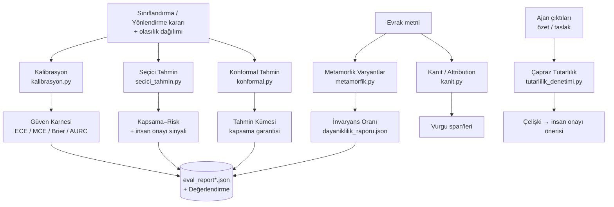

# Güven ve Ölçüm Katmanı 📐

Bu katman, sistemin ürettiği her kararı ölçülebilir bir güven, kalibrasyon, belirsizlik ve dayanıklılık kanıtıyla donatan saf‑Python akademik ölçüm altyapısıdır. Amaç basittir: "doğru cevap" yetmez; kararın ne kadar güvenilir olduğu, ne zaman insana devredilmesi gerektiği ve hangi kanıta dayandığı da nicel olarak gösterilmelidir.

> [!NOTE]
> **TL;DR** — `src/utils/` altındaki ölçüm modülleri her sınıflandırma/yönlendirme kararını akademik güvence katmanlarından geçirir: **Kalibrasyon** (ECE/MCE/Brier + sıcaklık ölçekleme; geliştirme setinde ECE **0.1882 → 0.0081**, T=0.25), **Seçici tahmin** (reject option, eşik **0.6**; kapsama **0.9038**, risk **0.0**), **Konformal tahmin** (α=0.1, hedef kapsama 0.9, ampirik kapsama **1.0**), **Metamorfik dayanıklılık** (CheckList‑INV tür/birim invaryansı), **çapraz tutarlılık**, **öz‑tutarlılık** ve **kanıt/attribution**. Hepsi harici bağımlılık olmadan (numpy/scipy yok), offline‑first çalışır. Ölçüm modülleri kararı **değiştirmez**; yalnızca güven raporlar veya insan onayı önerir.

---

## Neden bu katman var?

Kamu evrak süreçlerinde bir kararın yanlış olması kadar, **yanlış olduğu hâlde yüksek güvenle sunulması** da risklidir. Modern makine öğrenmesi modelleri sık sık aşırı özgüvenlidir (overconfident): olasılık çıktıları gerçek isabet oranını yansıtmaz. Bu katman üç temel soruyu nicel olarak yanıtlar:

- **"Bu 0.9 güven gerçekten %90 isabet mi demek?"** → Kalibrasyon (ECE/MCE/Brier + sıcaklık ölçekleme)
- **"Sistem ne zaman kendi kendine 'emin değilim, insana sor' demeli?"** → Seçici tahmin (reject option) ve conformal küme boyutu
- **"Bu karar hangi kaynak metne dayanıyor ve küçük bozulmalara karşı sağlam mı?"** → Kanıt/attribution ve metamorfik dayanıklılık

Bu, [Anayasal İlkeler ve Etik](Anayasal-İlkeler-ve-Etik) sayfasında tanımlı **halüsinasyon yasağı** ve **nesnellik/şeffaflık** ilkelerinin mühendislik karşılığıdır: emin olunmayan bilgi üretilmez, belirsizlik açıkça raporlanır, başarısızlıklar gizlenmez.

> [!IMPORTANT]
> Ölçüm katmanının tamamı **additive/ölçüm‑amaçlı**dır. Sıcaklık ölçekleme argmax'ı (seçilen sınıfı) değiştirmez, yalnızca güven skorunu kalibre eder. Çapraz tutarlılık denetimi ve conformal kümeler kararı **bloklamaz**; yalnızca güven/kanıt raporlar ya da insan onayı önerir. Sorumlu otomasyon ilkesi.

---

## Katman Haritası



Her modül [Değerlendirme ve Metrikler](Değerlendirme-ve-Metrikler) sayfasında anlatılan `scripts/evaluate.py` tarafından çağrılır ve sonuçları `data/processed/eval_report*.json` raporlarına gömülür.

---

## 1. Kalibrasyon — Güven skoru gerçekten güvenilir mi?

**Dosya:** `src/utils/kalibrasyon.py`

Kalibrasyon, modelin verdiği güven skorunun gerçek isabet oranıyla ne kadar örtüştüğünü ölçer ve gerekirse düzeltir.

### Ölçüm metrikleri

| Metrik | Ne ölçer | Literatür |
|---|---|---|
| **ECE** (Expected Calibration Error) | Güven kutularının ortalama güven ↔ ortalama isabet farkının ağırlıklı toplamı | Guo vd. 2017; Naeini vd. 2015 |
| **MCE** (Maximum Calibration Error) | En kötü kutudaki kalibrasyon sapması | Naeini vd. 2015 |
| **Brier skoru** | Olasılık tahminlerinin karesel hata ortalaması | Brier 1950 |
| **AURC** | Risk‑kapsama eğrisi altındaki alan (reddetme kalitesi) | Geifman & El‑Yaniv 2017 |

ECE, varsayılan **10 kutulu** (bin) güvenilirlik diyagramı (reliability diagram) üzerinden hesaplanır; son kutuda üst sınır dahil edilir. Formül özü: `ECE = Σ (|kutu|/N)·|doğruluk(kutu) − güven(kutu)|`.

### Sıcaklık ölçekleme (temperature scaling)

Aşırı özgüvenli olasılıkları düzeltmenin standart yolu tek bir skaler sıcaklık parametresi `T` öğrenmektir. Modül, NLL'i (negatif log‑olabilirlik) minimize eden `T` değerini **altın‑oran (golden section) araması** ile `[0.25, 5.0]` aralığında **40 turda** bulur (altın oran sabiti ≈ 0.618). Sonuç 3 ondalığa yuvarlanır.

> [!NOTE]
> **Doğrulanmış sonuç (geliştirme seti, 52 evrak):** Sıcaklık ölçekleme ECE'yi **0.1882 → 0.0081** düşürür (T = 0.25). Bu, güven skorunun gerçek isabet oranıyla neredeyse tam örtüşür hâle gelmesi demektir.

```python
# src/utils/kalibrasyon.py — kavramsal kullanım
from src.utils.kalibrasyon import kalibrasyon_raporu

rapor = kalibrasyon_raporu(
    olasiliklar, dogru_maskesi,
    sicaklik_ogren_izinli=True,   # YALNIZCA geliştirme setinde True
)
# rapor -> {ece, mce, brier, aurc, sicaklik, ece_kalibre, reliability_kutulari}
```

> [!IMPORTANT]
> **Değerlendirme bütünlüğü:** Sıcaklık öğrenimi yalnızca `sicaklik_ogren_izinli=True` iken (yani geliştirme setinde) çalışır. Tutulmuş (held‑out) setlerde sıcaklık **öğrenilmez**, yalnızca ölçüm yapılır. Bu kural koda gömülüdür ve [Değerlendirme ve Metrikler](Değerlendirme-ve-Metrikler) ile [Veri Setleri](Veri-Setleri) sayfalarındaki held‑out disiplinini korur. Sıcaklık ölçekleme argmax'ı asla değiştirmez — karar aynı kalır, yalnızca güven kalibre olur.

---

## 2. Seçici Tahmin — Ne zaman insana devretmeli?

**Dosya:** `src/utils/secici_tahmin.py`

Seçici tahmin (selective classification / reject option), düşük güvenli kararları reddedip insan denetimine (HITL — human‑in‑the‑loop) bırakma mantığıdır. Klasik **Chow reddetme kuralı** (Chow 1970) uygulanır.

### Belirsizlik skoru

Belirsizlik, üç sinyalin ağırlıklı birleşimidir (0 = çok güvenli, 1 = çok belirsiz):

```text
belirsizlik = (1 − MSP)·0.5 + (1 − marj)·0.3 + OOV·0.2
```

- **MSP** (Maximum Softmax Probability) — en yüksek sınıf olasılığı, OOD (dağıtım‑dışı) referans temeli (Hendrycks & Gimpel 2017)
- **marj** — en yüksek iki sınıf arasındaki fark
- **OOV** — sözlük‑dışı (out‑of‑vocabulary) sinyali

### Kapsama–risk dengesi

`kapsam_risk()`, verilen güven eşiğinde üç değeri hesaplar: **kapsama** (kabul edilen karar oranı), **risk** (kabul edilenler içindeki hata oranı) ve **reddedilen sayısı**. Varsayılan reddetme eşiği **0.6**'dır — bu, [Orkestratör ve Koşullu Kapılar](Orkestratör-ve-Koşullu-Kapılar) sayfasındaki 3. kapı (düşük güven) eşiğiyle ve sınıflandırma ajanının LLM eskalasyon eşiğiyle **aynı** değerdir.

> [!NOTE]
> **Doğrulanmış sonuç (geliştirme seti):** Eşik 0.6'da kapsama **0.9038**, risk **0.0**, **5 evrak** reddedildi. Yani sistem evrakların büyük çoğunluğunu otomatik karara bağlar ve kabul ettiklerinde hiç hata yapmaz; kalan belirsiz evrakları insana devreder.

---

## 3. Konformal Tahmin — Kapsama garantisi

**Dosya:** `src/utils/konformal.py`

Konformal tahmin (conformal prediction), tek bir sınıf yerine, **istatistiksel kapsama garantisi** taşıyan bir tahmin **kümesi** üretir. Split conformal yöntemi ve **LAC** uygunsuzluk skoru (`s = 1 − p(gerçek sınıf)`) kullanılır (Angelopoulos & Bates 2021; Sadinle vd. 2019; Vovk).

- **α = 0.1** → hedef kapsama `1 − α = 0.90`
- Eşik, `ceil((n+1)(1−α))` indeksli ampirik kuantildir; küçük `n`'de 1.0'a doyar (muhafazakâr garanti)
- Boş küme durumunda en yüksek olasılıklı sınıf alınır

Ortalama küme boyutu 1.0'a yakınsa sistem çoğu evrakta **tek net karar** üretiyor; büyük kümeler belirsizliğe işaret eder.

> [!NOTE]
> **Doğrulanmış sonuç (geliştirme seti):** α = 0.1, hedef kapsama 0.9, **ampirik kapsama 1.0**, **ortalama küme boyutu 1.0**. Kapsama garantisi sağlanmış ve kümeler tekil kalmış — yani sistem hem güvenli hem kararlı.

> [!WARNING]
> Küçük örneklem (n = 16 tutulmuş setler) durumunda conformal eşiğinin 1.0'a doyması bir **kusur değil**, muhafazakâr garantinin doğal sonucudur. Aynı şekilde geniş güven aralıkları da (bkz. §7) aşırı iddiadan kaçınmanın dürüstlük göstergesidir.

---

## 4. Metamorfik Dayanıklılık — İnvaryans testleri

**Dosya:** `src/utils/metamorfik.py` · **Koşucu:** `scripts/dayaniklilik_testi.py`

Metamorfik test (CheckList‑INV; Ribeiro vd. 2020), **etiket‑koruyan** deterministik bozulmalar uygulayıp kararın değişmemesi (invaryans) gerektiğini denetler. 5 perturbasyon kayıtlıdır:

| Perturbasyon | Parametre |
|---|---|
| `diyakritik_katla` | Türkçe aksan katlama (ç→c, ş→s …) |
| `bosluk_gurultu` | Her boşluğun ikiye katlanma olasılığı **0.12** |
| `yazim_gurultu` | En fazla **3** kelimede, yalnızca 6+ harfli kelimelerde orta‑harf transpozisyonu |
| `ocr_ikame` | En fazla **4** OCR‑benzeri ikame; çiftler (İ,I),(l,ı),(rn,m),(O,0) |
| `noktalama_gurultu` | Virgül/nokta düşürme olasılığı **0.15** |

Perturbasyonlar **deterministik ve tohumludur** (varsayılan tohum **1234**) — aynı tohum aynı varyantı üretir, sonuçlar tekrarlanabilir. `dayaniklilik_testi.py`, geliştirme setindeki her evrağa varyant üretip `EndToEndPipeline` ile **tür invaryansı**, **birim invaryansı** ve **gürbüz doğruluk** ölçer; en kırılgan bozulmayı (en düşük tür invaryansı) `dayaniklilik_raporu.json` içinde raporlar. Tüm yollar göreli üretilir (raporlara mutlak yol sızmaz).

> [!NOTE]
> Metamorfik testlerin, v3/v4 adversarial setlerin ve dayanıklılık koşucusunun ayrıntılı analizi için ayrı sayfaya bakınız: [Adversarial Dayanıklılık](Adversarial-Dayanıklılık).

---

## 5. Çapraz Tutarlılık Denetimi — Ajanlar birbirini doğruluyor

**Dosya:** `src/utils/tutarlilik_denetimi.py`

Çok‑ajanlı doğrulama (multi‑agent verification) deseni: farklı ajanların çıktıları arasında çelişki aranır. İki denetim yapılır:

1. **Özet ↔ kaynak sadakati** — Özetin sadakati 1.0'ın altındaysa (kaynakta olmayan sayısal olgu içeriyorsa) çelişki işaretlenir. Sadakat ölçümü `src/utils/ozet_kalite.py` `sadakat()` fonksiyonundan gelir (bkz. [Görev 1 — Okuma, Sınıflandırma ve İçerik Analizi](Görev-1-Okuma-ve-Analiz)).
2. **Taslak ↔ mevzuat temelliliği** — Taslak gövdesindeki `NNNN sayılı` mevzuat atıfları (regex `\b(\d{3,5})\s*sayılı`), mevzuat öneri listesinde bulunmalıdır. Listede olmayan atıf halüsinasyon işareti sayılır.

> [!IMPORTANT]
> Çelişki bulunduğunda denetim **insan onayı önerir ama kararı bloklamaz**. Bu, orkestratörün `_compile_results` aşamasında `insan_onayi.gerekli` bayrağıyla birleşir (bkz. [Orkestratör ve Koşullu Kapılar](Orkestratör-ve-Koşullu-Kapılar)). Halüsinasyonu halüsinasyonla denetlememek için mevzuat temelliliği her zaman deterministik (kural tabanlı) kalır.

---

## 6. Öz‑Tutarlılık — Çoğunluk oyu

**Dosya:** `src/utils/oz_tutarlilik.py`

Öz‑tutarlılık (self‑consistency; Wang vd. 2022), aynı girdi için birden çok LLM örneklemesinin çoğunluk kararını ve **uzlaşı oranını** (adet/toplam) hesaplar. Uzlaşı oranı, kalibre güven için bir vekildir. Geçerli karar yoksa `(None, 0.0)` döner.

Bu mekanizma sınıflandırma ajanının LLM eskalasyonunda opsiyonel olarak kullanılır (`_OZ_TUTARLILIK_ORNEK`, varsayılan 1 = tek çağrı; >1 ise K örnekleme + çoğunluk oyu). Ayrıntı için [Görev 1 — Okuma, Sınıflandırma ve İçerik Analizi](Görev-1-Okuma-ve-Analiz) ve [Model Bilgileri](Model-Bilgileri).

---

## 7. İstatistiksel Anlamlılık — Güven aralıkları ve McNemar

**Dosya:** `src/utils/istatistik.py`

Küçük veri setlerinde tek nokta metriği yanıltıcıdır; bu modül metrikleri **istatistiksel güvence** ile sunar:

| Fonksiyon | Yöntem | Parametre |
|---|---|---|
| `wilson_araligi` | Wilson skor güven aralığı (Wilson 1927) | z = 1.96 (%95) |
| `bootstrap_araligi` | Bootstrap GA (Efron 1979), deterministik | 2000 tekrar, α = 0.05, tohum 1234 |
| `mcnemar` | Eşleştirilmiş McNemar testi (McNemar 1947) | Yates süreklilik düzeltmeli χ², p < 0.05 |

McNemar testi özellikle **ablasyon** için kritiktir: tam sistem ile bag‑of‑words baseline (`baseline_siniflandir`) arasındaki farkın istatistiksel anlamlılığını ölçer. Ablasyon sonuçları [Değerlendirme ve Metrikler](Değerlendirme-ve-Metrikler) sayfasında ayrıntılıdır (örneğin geliştirme setinde tam sistem 1.0 vs baseline 0.5385).

> [!NOTE]
> Küçük `n` (16 evrak) durumunda geniş güven aralıkları **dürüstlük göstergesi** olarak sunulur — aşırı iddiadan kaçınma ilkesi. Bu tekrarlanabilirlik yaklaşımı, koşum mührüyle (git commit + platform + veri seti içerik hash) birlikte, jürinin sonuç‑manipülasyonu endişesini kapatmayı hedefler.

---

## 8. Kanıt / Attribution — Karar hangi metne dayanıyor?

**Dosya:** `src/utils/kanit.py`

`vurgu_spanlari()`, bir kararı destekleyen kaynak metin parçalarını (span) **birebir eşleşme** ile bulur: tarih, kurum, kişi, yer, TCKN, konu ve aciliyet/gizlilik damgaları. Yalnızca kaynakta gerçekten bulunan değerler işaretlenir — bu **grounded** (temellendirilmiş) açıklanabilirliktir, halüsinasyon riski yoktur ve karar **değiştirilmez** (additive).

- En fazla **60** kanıt döndürülür
- Damga kanıtları (Resmî Yazışma Yönetmeliği m.25/m.26): `GÜNLÜDÜR`, `ACELE`, `İVEDİ`, `İVEDİDİR`, `GİZLİ`, `HİZMETE ÖZEL`, `KİŞİYE ÖZEL`

Bu span'ler orkestratörün `kanit_vurgulari` çıktısına eklenir ve [Web Arayüzü — Evrak Zekâ](Web-Arayüzü) üzerinde kararı gerekçelendiren vurgular olarak gösterilebilir. Aciliyet damgaları [Triage ve Akıllı Önceliklendirme](Triage-ve-Önceliklendirme) ile örtüşür.

---

## Tasarım İlkeleri

- **Saf Python, harici bağımlılık yok.** Tüm modüller numpy/scipy olmadan çalışır — offline‑first çekirdek korunur (bkz. [Sistem Mimarisi](Sistem-Mimarisi)).
- **Ölçüm ≠ karar.** Sıcaklık ölçekleme argmax'ı değiştirmez; conformal ve tutarlılık denetimi kararı bloklamaz, yalnızca insan onayı sinyali üretir.
- **Değerlendirme bütünlüğü koda gömülü.** Sıcaklık öğrenimi yalnızca geliştirme setinde; held‑out setlerde tuning yapılmaz. Perturbasyonlar deterministik ve etiket‑koruyan.
- **Dürüst raporlama.** Küçük `n`'de güven aralıkları ve doygun conformal eşikleri gizlenmez; aşırı iddiadan kaçınılır.
- **Grounded açıklanabilirlik.** Kanıt span'leri yalnızca kaynakta birebir bulunanı işaretler.

> [!NOTE]
> Bu katmandaki `bulanik.py` (Damerau‑Levenshtein bulanık eşleme) niyet motoruna, `kanit.py` ise açıklanabilirlik katmanına aittir; CLAUDE.md mimari haritasında ölçüm katmanıyla birlikte değerlendirilirler.

---

## Kod ve Modül Haritası

| Modül | Sorumluluk |
|---|---|
| `src/utils/kalibrasyon.py` | ECE/MCE, Brier, AURC, sıcaklık öğrenme/uygulama, kalibrasyon raporu |
| `src/utils/secici_tahmin.py` | Belirsizlik skoru, Chow reddetme, kapsama‑risk |
| `src/utils/konformal.py` | Uygunsuzluk skorları, konformal eşik, tahmin kümesi, değerlendirme |
| `src/utils/metamorfik.py` | 5 etiket‑koruyan perturbasyon, varyant üretimi, invaryans oranı |
| `src/utils/tutarlilik_denetimi.py` | Özet sadakati + taslak mevzuat temelliliği çapraz denetimi |
| `src/utils/oz_tutarlilik.py` | Çoğunluk oyu + uzlaşı oranı (self‑consistency) |
| `src/utils/istatistik.py` | Wilson/bootstrap GA, McNemar testi, oran özeti |
| `src/utils/kanit.py` | Karar‑kaynak kanıt span'leri (grounded attribution) |
| `scripts/dayaniklilik_testi.py` | Metamorfik dayanıklılık CLI koşucusu |
| `src/utils/ozet_kalite.py` | Sadakat/kapsama/ROUGE‑L (tutarlılık denetimine kaynak) |

Bu modüllerin nasıl orkestre edildiği [Orkestratör ve Koşullu Kapılar](Orkestratör-ve-Koşullu-Kapılar), sonuçların nasıl raporlandığı [Değerlendirme ve Metrikler](Değerlendirme-ve-Metrikler) sayfalarında anlatılır.

---

## İlgili Sayfalar

- [Değerlendirme ve Metrikler](Değerlendirme-ve-Metrikler) — `evaluate.py`, 5 set, tüm doğrulanmış metrikler ve held‑out disiplini
- [Adversarial Dayanıklılık](Adversarial-Dayanıklılık) — metamorfik testler, v3/v4 setler, `dayaniklilik_testi.py` ayrıntısı
- [Orkestratör ve Koşullu Kapılar](Orkestratör-ve-Koşullu-Kapılar) — düşük güven kapısı, güven izleme, tutarlılık/CBR entegrasyonu
- [Anayasal İlkeler ve Etik](Anayasal-İlkeler-ve-Etik) — halüsinasyon yasağı, şeffaflık, değerlendirme bütünlüğü
- [Görev 1 — Okuma, Sınıflandırma ve İçerik Analizi](Görev-1-Okuma-ve-Analiz) — sınıflandırma güveni, özet sadakati kaynağı
- [Sistem Mimarisi](Sistem-Mimarisi) — offline‑first çekirdek ve ölçüm katmanının konumu
