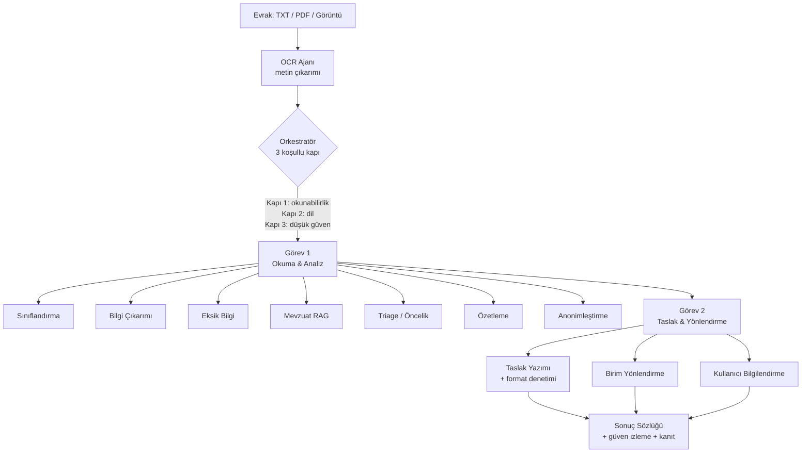

# 🏛️ Kamu Evrak ve Yazışma Süreçleri için Akıllı Agent Destek Sistemi

**TEKNOFEST 2026 Yapay Zeka Dil Ajanları Yarışması — 1. Senaryo.** Kamu kurumlarına gelen evrakları hızlıca okuyup sınıflandıran, içeriğini analiz eden, eksik bilgileri saptayan, ilgili mevzuatı gösteren, Resmî Yazışma Yönetmeliği'ne uygun taslak üreten ve doğru birime yönlendiren; **çevrimdışı (offline-first)** ve **framework'süz saf Python** ile çalışan 11 uzman ajanlı bir yapay zekâ dil ajanı sistemi.

> [!NOTE]
> **TL;DR** — 11 uzman ajan + 1 orkestratör, hiçbir LLM olmadan uçtan uca çalışır. Kural tabanlı çekirdek + isteğe bağlı LLM eskalasyonu (yalnızca düşük güvende). Görev 1 (okuma, sınıflandırma, içerik analizi) ve Görev 2 (taslak üretimi, birim yönlendirme) tam kapsanır; KVKK anonimleştirme ve akıllı önceliklendirme yenilik modülleriyle desteklenir. Tüm çıktılar sentetik/kurgu veri üzerinde ölçülmüştür; gerçek kamu verisi asla kullanılmaz.

---

## Nedir?

Bu sistem, bir kamu kurumunun evrak akışındaki insan iş yükünü azaltmayı hedefleyen, uçtan uca bir **çok-ajanlı (multi-agent)** karar destek hattıdır. Bir evrak (düz metin, PDF veya taranmış görüntü) sisteme girdiğinde, merkezî bir **orkestratör** onu koşullu bir iş akışından geçirir: metin çıkarımı (OCR), tür sınıflandırması, bilgi çıkarımı, eksik alan tespiti, mevzuat eşleştirme, önceliklendirme, özetleme, KVKK anonimleştirme, resmî taslak yazımı ve birim yönlendirmesi.

Tasarımın temel felsefesi **offline-first** olmasıdır: çekirdek işlevsellik hiçbir dil modeline, harici API'ye veya ağ bağlantısına ihtiyaç duymaz. LLM yalnızca güvenin düşük olduğu belirsiz durumlarda, isteğe bağlı bir iyileştirme katmanı olarak devreye girer. Bu yaklaşım hem KVKK/yerel kurulum gereksinimlerini hem de internet kesintisine karşı dayanıklılığı güvence altına alır.

---

## Bir Bakışta

| Boyut | Değer |
|---|---|
| Uzman ajan | **11** ajan + 1 orkestratör |
| Evrak türü | **8** tür (+ "diğer" artık kategori) |
| Yönlendirme birimi | **9** kamu birimi |
| Mevzuat korpusu | **15** sentetik mevzuat metni |
| Değerlendirme seti | **5** etiketli set (52 + 16 + 16 + 16 + 16 = 116 evrak) |
| Test | **508 test** (depo CI rozeti) |
| Çalışma modu | **Offline-first** — LLM olmadan tam işlevsel |
| Bağımlılık | Framework'süz saf Python (çekirdek) |
| Lisans | Apache 2.0 — Telif: AGENTRA TECH |

---

## En Önemli Metrikler (Doğrulanmış)

Aşağıdaki değerler `scripts/evaluate.py` ile üretilen `data/processed/eval_report*.json` dosyalarından, **offline backend** (LLM kullanılamıyor) koşulunda ölçülmüştür. Ayrıntılı ölçüm için [Değerlendirme ve Metrikler](Değerlendirme-ve-Metrikler) sayfasına bakınız.

| Metrik | Geliştirme (52) | Tutulmuş (16) | Tutulmuş v2 (16) | Adversarial v3 (16) | Adversarial-temiz v4 (16) |
|---|---|---|---|---|---|
| Sınıflandırma doğruluğu | 1.0 | 1.0 | 1.0 | 0.9375 | 0.9375 |
| Yönlendirme doğruluğu | 0.9615 | 1.0 | 0.9375 | 1.0 | 0.9375 |
| Eksik bilgi (micro-F1) | 1.0 | 1.0 | 1.0 | 0.8333 | 1.0 |
| Taslak kalitesi (0-100) | 93.6 | 95.8 | 94.6 | 95.8 | 94.7 |
| KVKK sızıntısı | 0 | 0 | 0 | 0 | 0 |

Adversarial v3/v4 setlerinde sınıflandırma için makro-F1 0.9333 ölçülmüştür. Kalibrasyon tarafında geliştirme setinde ECE değeri sıcaklık ölçekleme (T=0.25) ile 0.1882'den 0.0081'e düşürülmüştür (ayrıntı: [Güven ve Ölçüm Katmanı](Güven-ve-Ölçüm-Katmanı)).

> [!IMPORTANT]
> **Metrik dürüstlüğü** bu projenin anayasal ilkesidir. Ölçüm sonuçları ne çıkarsa olduğu gibi raporlanır; başarısızlıklar gizlenmez. Adversarial v3 setindeki sınıflandırma ve eksik-bilgi düşüşleri kasıtlı olarak açıkça sunulur. Performans için: sınıflandırma-hattı verimi (README rozeti ~88 evrak/sn) ile uçtan uca hat gecikmesi (evrak başına **0.1–0.5 sn**) farklı ölçülerdir ve karıştırılmamalıdır.

---

## Mimari — Bir Bakışta

Sistem, girdi evrağını iki zorunlu göreve ayıran koşullu bir akış izler. Orkestratör üç **koşullu kapı** uygular: okunabilirlik, dil ve düşük güven. Ayrıntı için [Sistem Mimarisi](Sistem-Mimarisi) ve [Orkestratör ve Koşullu Kapılar](Orkestratör-ve-Koşullu-Kapılar) sayfalarına bakınız.



Orkestratör, tüm ajan çıktılarını tek bir sonuç sözlüğünde derler ve `EndToEndPipeline` bu sözlüğe toplam işlem süresini ekleyip isteğe bağlı SQLite denetim izine yazar (`src/agents/orchestrator.py`, `src/pipelines/end_to_end_pipeline.py`). İş akışı düz sıralı bir zincir değildir; kapılar tetiklense de sonuç sözlüğünün yapısı korunur (ilgili alanlar boş kalır) ve düşük güvende karar bloklanmaz, yalnızca "insan onayı gerekli" işareti konur.

---

## Nereden Başlamalı?

### 🚀 Yeni Kullanıcı / Değerlendirici iseniz
Sistemi 5 dakikada ayağa kaldırıp ilk evrağı işleyin, sonra ne yaptığını anlayın.

- [Hızlı Başlangıç](Hızlı-Başlangıç) — kurulum + ilk evrak
- [Proje Hakkında](Proje-Hakkında) — problem, çözüm, yenilik modülleri
- [Web Arayüzü — Evrak Zekâ](Web-Arayüzü) — kurumsal sunum panosu
- [Sık Sorulan Sorular (SSS)](Sık-Sorulan-Sorular)

### 🧑‍⚖️ Jüri iseniz
Şartname uyumunu, ölçüm bütünlüğünü ve etik duruşu doğrudan kanıtlarıyla inceleyin.

- [Şartname Uyum Matrisi](Şartname-Uyum-Matrisi) — her maddenin kanıt haritası
- [Değerlendirme ve Metrikler](Değerlendirme-ve-Metrikler) — 5 set, held-out disiplini, tekrarlanabilirlik
- [Adversarial Dayanıklılık](Adversarial-Dayanıklılık) — v3/v4 setler, metamorfik testler
- [Anayasal İlkeler ve Etik](Anayasal-İlkeler-ve-Etik) — KVKK, adillik, değerlendirme bütünlüğü

### 👩‍💻 Geliştirici iseniz
Kod yapısını, ajan mimarisini ve katkı konvansiyonlarını öğrenin.

- [Geliştirici Rehberi](Geliştirici-Rehberi) — yeni ajan ekleme, konvansiyonlar
- [Sistem Mimarisi](Sistem-Mimarisi) — AgentState veri akışı, dizin haritası
- [Test ve Sürekli Entegrasyon](Test-ve-Sürekli-Entegrasyon) — 508 test, kalite kapıları
- [REST API](REST-API) · [MCP Sunucusu](MCP-Sunucusu) · [Komut Satırı (CLI) ve Demo](Komut-Satırı-ve-Demo)

---

## Tam Sayfa Haritası

### Genel Bakış ve Başlangıç
- [Proje Hakkında](Proje-Hakkında) — problem, çözüm, senaryo kapsamı, tasarım felsefesi
- [Hızlı Başlangıç](Hızlı-Başlangıç) — 5 dakikada kurulum ve ilk evrak
- [Kurulum ve Yapılandırma](Kurulum-ve-Yapılandırma) — bağımlılıklar, `.env`, LLM backend seçimi, `config.py`, Docker

### Mimari ve Ajanlar
- [Sistem Mimarisi](Sistem-Mimarisi) — genel mimari, `AgentState`, ajan iş birliği
- [Orkestratör ve Koşullu Kapılar](Orkestratör-ve-Koşullu-Kapılar) — 3 kapı, hibrit karar mantığı
- [Uzman Ajanlar](Uzman-Ajanlar) — 11 ajanın genel bakış tablosu

### Görev 1 ve Görev 2
- [Görev 1 — Okuma, Sınıflandırma ve İçerik Analizi](Görev-1-Okuma-ve-Analiz) — OCR, sınıflandırma, çıkarım, özet
- [Mevzuat RAG ve Hibrit Arama](Mevzuat-RAG-ve-Hibrit-Arama) — BM25, düzeltici RAG, semantik + reranker, emsal/CBR
- [Görev 2 — Taslaklama ve Birim Yönlendirme](Görev-2-Taslak-ve-Yönlendirme) — taslak, Reflexion, yönlendirme

### Yenilik Modülleri
- [Triage ve Akıllı Önceliklendirme](Triage-ve-Önceliklendirme) — aciliyet damgaları, yasal süre tablosu
- [KVKK ve Anonimleştirme](KVKK-ve-Anonimleştirme) — 9 kategori maskeleme, sızıntı denetimi
- [Güven ve Ölçüm Katmanı](Güven-ve-Ölçüm-Katmanı) — kalibrasyon, seçici tahmin, konformal, metamorfik

### Değerlendirme ve Veri
- [Değerlendirme ve Metrikler](Değerlendirme-ve-Metrikler) — `evaluate.py`, tüm doğrulanmış metrikler
- [Adversarial Dayanıklılık](Adversarial-Dayanıklılık) — v3/v4 setler, `dayaniklilik_testi.py`
- [Veri Setleri](Veri-Setleri) — sentetik evraklar, mevzuat korpusu, etiket şeması, datasheet

### Arayüzler
- [Web Arayüzü — Evrak Zekâ](Web-Arayüzü) — kurumsal pano ve klasik arayüz
- [REST API](REST-API) — `src/api.py` uç noktaları
- [MCP Sunucusu](MCP-Sunucusu) — JSON-RPC 2.0 stdio, 5 araç
- [Komut Satırı (CLI) ve Demo](Komut-Satırı-ve-Demo) — `src/main.py`, demo senaryosu

### Kalite, Uyum ve Yönetişim
- [Test ve Sürekli Entegrasyon](Test-ve-Sürekli-Entegrasyon) — test haritası, CI iş akışı
- [Şartname Uyum Matrisi](Şartname-Uyum-Matrisi) — kanıt haritası
- [Anayasal İlkeler ve Etik](Anayasal-İlkeler-ve-Etik) — anayasa, KVKK, güvenlik
- [Model Bilgileri ve LLM Ekosistemi](Model-Bilgileri) — modeller, lisanslar, model kartı

### Referans
- [Geliştirici Rehberi](Geliştirici-Rehberi) — kod yapısı, katkı, mimari kararlar
- [Sık Sorulan Sorular (SSS)](Sık-Sorulan-Sorular) — offline, LLM, KVKK, doğruluk
- [Sözlük (Kavramlar)](Sözlük) — teknik ve resmî yazışma terimleri
- [Yol Haritası](Yol-Haritası) — gelecek planlar, kritik tarihler

---

## Hızlı Deneme

```bash
# Tek evrak — komut satırı
python -m src.main --input data/raw/kurgu_evraklar/dilekce_01.txt

# Kurumsal sunum panosu (Evrak Zekâ)
streamlit run app.py

# Değerlendirme — göreli yollarla (raporlara mutlak yol sızmaz)
python scripts/evaluate.py --veri-dizini data/raw/kurgu_evraklar \
    --rapor-dosyasi data/processed/eval_report.json

# Testler
pytest tests/
```

Ayrıntı için [Hızlı Başlangıç](Hızlı-Başlangıç) ve [Komut Satırı (CLI) ve Demo](Komut-Satırı-ve-Demo) sayfalarına bakınız.

---

## Yasal Uyarı

> [!WARNING]
> Bu depoda **gerçek kamu verisi veya gerçek kişisel veri asla kullanılmaz.** Tüm evraklar sentetik/kurgudur; kurgu TCKN'ler yalnızca resmî checksum'ı geçer ancak gerçek bir kişiye ait olamaz (KVKK ilkesi). Sistemin anonimleştirme ve KVKK güvenceleri hakkında ayrıntı için [KVKK ve Anonimleştirme](KVKK-ve-Anonimleştirme) ve [Anayasal İlkeler ve Etik](Anayasal-İlkeler-ve-Etik) sayfalarına bakınız. Depo Apache 2.0 lisanslıdır; telif AGENTRA TECH'e aittir.

---

## İlgili Sayfalar

- [Proje Hakkında](Proje-Hakkında)
- [Hızlı Başlangıç](Hızlı-Başlangıç)
- [Sistem Mimarisi](Sistem-Mimarisi)
- [Değerlendirme ve Metrikler](Değerlendirme-ve-Metrikler)
- [Şartname Uyum Matrisi](Şartname-Uyum-Matrisi)
- [Sık Sorulan Sorular (SSS)](Sık-Sorulan-Sorular)
