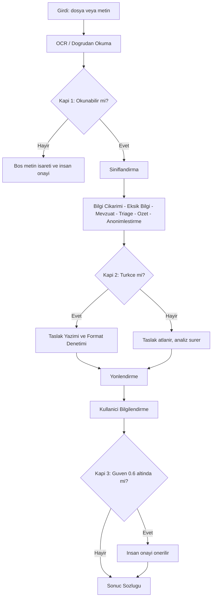

# Hızlı Başlangıç 🚀

Bu sayfa, projeyi sıfırdan çalışır hâle getirip **ilk evrağınızı yaklaşık 5 dakikada** işlemeniz için gereken tüm adımları içerir: önkoşullar, kurulum, ilk komut satırı koşusu, panoların açılması, testlerin doğrulanması ve arayüzlerin bir bakışta karşılaştırması.

> [!NOTE]
> **TL;DR** — Python 3.9+ kurulu bir makinede şu üç komut yeter:
> ```bash
> pip install -r requirements.txt
> python -m src.main --input data/raw/kurgu_evraklar/dilekce_01.txt
> pytest tests/
> ```
> Sistem **tamamen çevrimdışı (offline-first)** çalışır; hiçbir LLM, API anahtarı veya GPU gerekmez. Çekirdek saf Python'dur ve kural tabanlı 11 uzman ajan + orkestratör, LLM olmadan uçtan uca tam işlevseldir. LLM yalnızca **isteğe bağlı** bir iyileştirme katmanıdır (düşük güvenli kararlarda devreye girer).

---

## 1. Önkoşullar

| Gereksinim | Açıklama |
|---|---|
| **Python 3.9+** | Çekirdek saf Python/stdlib ile yazılmıştır. Geliştirme ve ölçümler Python 3.9.6 üzerinde yapılmıştır. |
| **pip** | Bağımlılık kurulumu için (çekirdek listesi küçüktür). |
| **git** | Depoyu klonlamak için. |
| İnternet | **Gerekmez.** Çekirdek işleme çevrimdışı çalışır; internet yalnızca opsiyonel LLM/semantik model kullanmak isterseniz gerekir. |
| GPU | **Gerekmez.** |

> [!IMPORTANT]
> Çekirdek `requirements.txt`, hiçbir LLM olmadan tam işlevsel çalışmayı garanti eder. Semantik arama, yeniden sıralama (rerank), OCR motorları ve PDF üretimi gibi ek yetenekler **opsiyonel bağımlılıklardır** ve ayrı yönetilir. Ayrıntı için [Kurulum ve Yapılandırma](Kurulum-ve-Yapılandırma) sayfasına bakın.

## 2. Depoyu Klonlama

```bash
git clone <depo-adresi> teknofest-2026-kamu-evrak-akilli-ajan
cd teknofest-2026-kamu-evrak-akilli-ajan
```

## 3. Sanal Ortam (önerilir)

Bağımlılıkları sistemden yalıtmak için bir sanal ortam kullanın.

**Linux / macOS:**
```bash
python -m venv .venv
source .venv/bin/activate
```

**Windows (PowerShell):**
```powershell
python -m venv .venv
.\.venv\Scripts\Activate.ps1
```

## 4. Bağımlılıkları Kurma (çekirdek / offline)

```bash
pip install -r requirements.txt
```

Bu, sistemi **tam offline** çalıştırmak için yeterlidir. İsteğe bağlı yetenekleri (semantik RAG, OCR, PDF, LLM) etkinleştirmek isterseniz opsiyonel bağımlılık disiplini için [Kurulum ve Yapılandırma](Kurulum-ve-Yapılandırma) sayfasını izleyin.

> [!NOTE]
> Yeni bağımlılıklar çekirdek/opsiyonel ayrımına uyar: çekirdek `requirements.txt`, isteğe bağlı yetenekler `requirements-optional.txt` ile yönetilir. Bu ayrım, offline-first güvencesini korumak için bilinçlidir.

## 5. İlk Çalıştırma — Tek Evrak (CLI)

Depo, etiketli **sentetik/kurgu** evrak setleriyle birlikte gelir. İlk denemeyi bir örnek dilekçe üzerinde yapalım:

```bash
python -m src.main --input data/raw/kurgu_evraklar/dilekce_01.txt
```

`src/main.py`, `argparse` tabanlı komut satırı giriş noktasıdır ve `EndToEndPipeline` üzerinden evrağı uçtan uca işler.

### Beklenen çıktının özeti

Tek bir evrak, orkestratörün **koşullu akışından** geçerek Görev 1 (okuma + içerik analizi) ve Görev 2 (taslak + yönlendirme) bloklarını çalıştırır. Çıktı, tüm ajan sonuçlarını tek bir sözlükte toplar; başlıca alanlar şunlardır:

| Alan | İçerik |
|---|---|
| `siniflandirma` | Evrak türü (8 türden biri + `diger`), güven skoru ve yöntem (`kural_tabanli` / `hibrit_ensemble` / `llm_eskalasyon`) |
| `bilgi_cikarim` | Tarih, sayı, TCKN, konu, muhatap, kurum/kişi/yer, IBAN, telefon vb. |
| `eksik_bilgiler` | Türe göre zorunlu alan denetimi; her eksik için açıklama + öncelik + öneri |
| `mevzuat_eslestirme` | BM25 ile bulunan, madde-referanslı mevzuat önerileri (gerekçeli) |
| `onceliklendirme` (triage) | Aciliyet, yasal süre, son işlem tarihi, kalan gün |
| `ozet` | Kısa, resmî, nesnel özet (künyeli) |
| `yazi_taslagi` + `format_denetimi` + `taslak_kalitesi` | Resmî yazı taslağı, yönetmelik kontrol listesi skoru ve 0-100 kalite puanı |
| `yonlendirme` | 9 kamu biriminden hedef birim, gerekçe, güven, alternatifler |
| `anonimlestirme` | KVKK uyumlu maskelenmiş nüsha + rapor |
| `insan_onayi` | Düşük güven / gizlilik gibi durumlarda insan kontrolü işareti ve gerekçeleri |

> [!NOTE]
> Çevrimdışı modda evrak başına işlem süresi tipik olarak saniyenin küçük bir kesridir (uçtan uca hat için yaklaşık 0.1–0.5 sn aralığı). Bu, LLM kullanılmayan kural tabanlı çekirdeğin hızıdır.

### Yararlı CLI seçenekleri

```bash
# Tek evrak işleme
python -m src.main --input data/raw/kurgu_evraklar/dilekce_01.txt

# Toplu klasör işleme (--klasor), kayıt defteri (--kayit) ve
# JSON/HTML rapor gibi ek seçenekler için ayrıntılı sayfaya bakın.
```

CLI'nin tüm bayrakları, toplu klasör işleme, JSON/HTML rapor çıktısı ve demo modları için [Komut Satırı (CLI) ve Demo](Komut-Satırı-ve-Demo) sayfasına bakın.

## 6. Uçtan Uca Akış (bir bakışta)



> [!NOTE]
> Kapı 3 (düşük güven) hem sınıflandırma hem de yönlendirme güvenini denetler; eşik **0.6** olup altındaki kararlar bloklanmaz, yalnızca `insan_onayi.gerekli` işareti + gerekçe konur. Tutarlılık denetimi, emsal/CBR önerisi ve kanıt vurguları **danışma niteliğindedir (advisory/additive)**; kararı ezmez.

Bu koşullu akışın ayrıntıları (3 kapı, güven eşikleri, hibrit karar mantığı) için [Orkestratör ve Koşullu Kapılar](Orkestratör-ve-Koşullu-Kapılar) sayfasına bakın.

## 7. Streamlit Panolarını Açma

Projenin iki farklı web arayüzü vardır.

### Kurumsal sunum panosu — "Evrak Zekâ"

```bash
streamlit run app.py
```

Tek dosyalık, gömülü CSS'li kurumsal pano. Evrak İşleme / KVKK / Asistan sayfaları **gerçek** `EndToEndPipeline`, anonimleştirme ve BM25-RAG çekirdeğine bağlıdır; backend yüklenemezse pano çökmez, açık **"SIMÜLASYON"** etiketiyle zarifçe düşer. Genel Bakış / Toplu İşleme / Telemetri gibi sayfalar ise doğaları gereği açıkça **"temsili demo"** etiketlidir. Ölçülmemiş hiçbir metrik gerçekmiş gibi sunulmaz.

### Klasik işlevsel arayüz

```bash
streamlit run src/app.py
```

Canlı ajan hattını **akış (streaming)** olarak gösteren klasik demo arayüzü; Görev 1/Görev 2 modlarını (`full` / `classify` / `draft`) destekler.

> [!NOTE]
> Streamlit arayüzü varsayılan olarak **8501** portunda çalışır (`AppSettings` varsayılanı). Ayrıntılar ve sayfa haritası için [Web Arayüzü — Evrak Zekâ](Web-Arayüzü) sayfasına bakın.

## 8. Testlerle Doğrulama

Kurulumun sağlığını doğrulamak için test paketini çalıştırın:

```bash
pytest tests/
```

> [!NOTE]
> Depo CI rozetine göre **632 test** geçmektedir. Testler birim ve uçtan uca senaryoları kapsar; kurulum sonrası ilk doğrulama adımı olarak önerilir. Test haritası ve kalite kapıları için [Test ve Sürekli Entegrasyon](Test-ve-Sürekli-Entegrasyon) sayfasına bakın.

## 9. Değerlendirme Koşusu (isteğe bağlı)

Sistemin metriklerini kendiniz üretmek isterseniz saf Python değerlendirme betiğini çalıştırabilirsiniz:

```bash
python scripts/evaluate.py --veri-dizini data/raw/kurgu_evraklar --rapor-dosyasi data/processed/eval_report.json
```

Betik; sınıflandırma, yönlendirme, eksik bilgi, mevzuat önerisi ve taslak kalitesi metriklerini üretir ve her rapora tekrarlanabilirlik mührü (git commit + platform + veri seti içerik hash'i) gömer. Tüm doğrulanmış sonuçlar ve held-out disiplini için [Değerlendirme ve Metrikler](Değerlendirme-ve-Metrikler) sayfasına bakın.

> [!NOTE]
> Geliştirme setinde (52 evrak) sınıflandırma doğruluğu **1.0**, adversarial setlerde (v3/v4, 16'şar evrak) **0.9375**; KVKK sızıntısı beş setin tamamında **0 kaçak**. Ayrıntılı, set-set metrikler için değerlendirme sayfasına bakın.

## 10. Arayüzler — Bir Bakışta

Sistem, aynı 11-ajan + orkestratör çekirdeğine altı farklı yoldan erişim sunar:

| Arayüz | Komut / Erişim | Ne için? | Bağımlılık |
|---|---|---|---|
| **CLI** | `python -m src.main --input <dosya>` | Tek evrak veya toplu klasör işleme, JSON/HTML rapor | Çekirdek |
| **Klasik web** | `streamlit run src/app.py` | Canlı ajan hattı (streaming), Görev 1/2 modları | Streamlit |
| **Kurumsal pano** | `streamlit run app.py` | "Evrak Zekâ" sunum panosu (gerçek + temsili demo etiketli sayfalar) | Streamlit |
| **REST API** | `python -m src.api` (varsayılan `127.0.0.1:8765`) | EBYS entegrasyonu için sıfır-bağımlılık JSON API (5 uç) | Yalnızca stdlib |
| **MCP sunucusu** | `python -m src.mcp_server` | stdio JSON-RPC 2.0 MCP (5 araç); harici SDK yok | Yalnızca stdlib |
| **Konsol demo** | `python demo/demo_scenario.py` | Hazır senaryo ile hızlı gösterim | Çekirdek |

REST API için [REST API](REST-API), MCP için [MCP Sunucusu](MCP-Sunucusu) sayfalarına bakın.

> [!WARNING]
> REST API varsayılan olarak `127.0.0.1` (dışa kapalı) adresine bağlanır. Dışa açmak bilinçli bir `--host` kararı gerektirir. İstek gövdesi 1 MB ile sınırlıdır ve sunucu loglarına evrak metni **yazılmaz** (KVKK). Güvenli kullanım notları için [REST API](REST-API) sayfasına bakın.

## 11. Sık Karşılaşılan Durumlar

- **"LLM olmadan çalışır mı?"** — Evet, çekirdek tamamen kural tabanlıdır ve LLM olmadan uçtan uca tam işlevseldir. Tam çevrimdışı garanti için `APP_OFFLINE=1` ortam değişkeni katı bir kilit sağlar (hiçbir prompt/evrak metni dışarı gönderilmez).
- **"Gerçek kamu verisi kullanabilir miyim?"** — Hayır. Depo yalnızca **sentetik/kurgu** veriyle çalışır; kurgu TCKN'ler resmi checksum'ı geçer ama gerçek bir kişiye ait olamaz (KVKK ilkesi). Bkz. [KVKK ve Anonimleştirme](KVKK-ve-Anonimleştirme).
- **"Streamlit backend yüklenmezse?"** — Kurumsal pano çökmez; açık **"SIMÜLASYON"** etiketiyle zarifçe düşer.

Diğer sorular için [Sık Sorulan Sorular (SSS)](Sık-Sorulan-Sorular) sayfasına göz atın.

## 12. Sonraki Adımlar

- [ ] Sistem mimarisini ve veri akışını öğren → [Sistem Mimarisi](Sistem-Mimarisi)
- [ ] Opsiyonel yetenekleri (LLM/semantik/OCR/PDF) yapılandır → [Kurulum ve Yapılandırma](Kurulum-ve-Yapılandırma)
- [ ] 11 uzman ajanı tanı → [Uzman Ajanlar](Uzman-Ajanlar)
- [ ] Projenin amacını ve yenilik modüllerini kavra → [Proje Hakkında](Proje-Hakkında)
- [ ] Tüm doğrulanmış metrikleri gör → [Değerlendirme ve Metrikler](Değerlendirme-ve-Metrikler)

---

## İlgili Sayfalar

- [Ana Sayfa](Home) — Wiki karşılama ve tam gezinme
- [Kurulum ve Yapılandırma](Kurulum-ve-Yapılandırma) — Çekirdek/opsiyonel bağımlılıklar, `.env`, LLM backend, Docker
- [Sistem Mimarisi](Sistem-Mimarisi) — Genel mimari ve `AgentState` veri akışı
- [Orkestratör ve Koşullu Kapılar](Orkestratör-ve-Koşullu-Kapılar) — 3 kapı ve hibrit karar mantığı
- [Komut Satırı (CLI) ve Demo](Komut-Satırı-ve-Demo) — `src/main.py` tüm bayrakları ve demo senaryosu
- [Sık Sorulan Sorular (SSS)](Sık-Sorulan-Sorular) — Offline çalışma, LLM, KVKK, kurulum soruları
