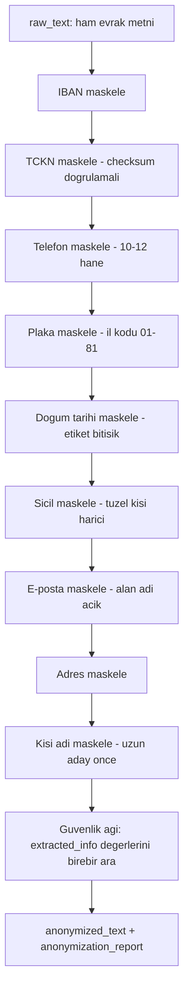
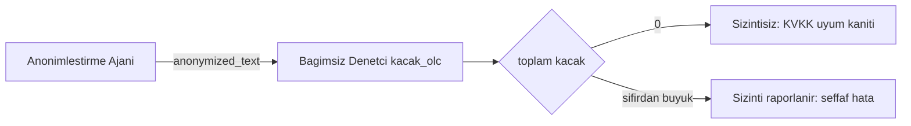

# KVKK ve Anonimleştirme 🛡️

Bu sayfa, sistemin özgün yenilik modüllerinden biri olan **KVKK uyumlu anonimleştirme** katmanını açıklar: evrak metnindeki gerçek kişilere ait kişisel verileri **format koruyan** ve **geri döndürülemez** biçimde maskeleyerek paylaşım/arşiv nüshası üreten, tamamen kural tabanlı ve çevrimdışı çalışan alt sistem ile onun bağımsız sızıntı denetçisi.

> [!NOTE]
> **TL;DR** — Anonimleştirme ajanı, evraktaki **9 kişisel-veri kategorisini** (TCKN, telefon, e-posta, IBAN, kişi adı, adres, plaka, doğum tarihi, sicil) sıralı çok geçişli regex maskelemeyle işler. Maskeler orijinal biçimi korur ama geri çözülemez (ör. `1**********`, `E*** K***`). Katman **tamamen kural tabanlı ve offline**'dır; hiçbir üçüncü taraf API'ye veri gitmez. Bağımsız bir **sızıntı denetçisi** (`kvkk_denetim.py`) maskeleme kalitesini nicel ölçer ve **beş değerlendirme setinin tamamında 0 kaçak** (sızıntısız oran 1.0) raporlanmıştır. Hukuki dayanak: **6698 sayılı KVKK m.4 ve m.8**.

---

## Neden Bir Anonimleştirme Katmanı?

Kamu evrak süreçlerinde bir belgenin birden fazla nüshası dolaşır: işlem gören **asıl nüsha**, birim içi **paylaşım nüshası** ve uzun ömürlü **arşiv nüshası**. Asıl nüshada kişisel verinin bulunması zorunludur; ancak paylaşım ve arşiv nüshalarında **amaçla bağlantılı, sınırlı ve ölçülü** işleme ilkesi gereği kişisel verinin gereğinden fazla dolaşıma sokulmaması gerekir.

Bu modülün özgün katkısı, evrak işleme hattının doğal bir çıktısı olarak **maskeli bir paylaşım/arşiv nüshası** üretmesidir. Böylece kurum, aynı belgeyi hem tam yetkili birime asıl haliyle hem de daha geniş bir çevreye maskeli haliyle sunabilir.

> [!IMPORTANT]
> Bu katman **gerçek kişileri** korur. Kurum adları, unvanlar ve makam/görev bildiren ifadeler **maskelenmez**, çünkü KVKK yalnızca gerçek kişilere ait kişisel veriyi korur; tüzel kişi ve görev bilgisi kişisel veri değildir. Bu ayrım, aşırı maskelemeyle belgenin işlevsizleşmesini önler.

---

## Hukuki Dayanak

Anonimleştirme kararı ve tasarımı iki temel KVKK maddesine bağlanır:

| Dayanak | İlke | Sistemdeki Karşılığı |
|---|---|---|
| **6698 s. KVKK m.4** | Amaçla bağlantılı, sınırlı ve ölçülü işleme | "Şüphede maskele" ilkesi: paylaşım nüshasında sızıntı, aşırı maskelemeden daha ağır ihlal sayılır |
| **6698 s. KVKK m.8** | Kişisel verilerin aktarma şartları | Paylaşım/arşiv nüshasının maskeli üretilmesi, aktarım öncesi ölçülülük güvencesi |

Bu dayanaklar `src/agents/anonimlestirme_agent.py` dosyasının başında açıkça belgelenmiştir. Anayasal ilkelerle bağı için bkz. [Anayasal İlkeler ve Etik](Anayasal-İlkeler-ve-Etik).

---

## 9 Kişisel-Veri Kategorisi ve Maskeleme Biçimleri

Ajan aşağıdaki dokuz kategoriyi sıralı geçişlerle maskeler. Her maske **format koruyan** (orijinal karakter/ayraç düzenini korur) ve **geri döndürülemez**dir; mutabakat ve okunabilirlik için sınırlı sayıda açık hane bırakılır.

| # | Kategori | Maske Biçimi | Örnek (önce → sonra) | Not |
|---|---|---|---|---|
| 1 | **TCKN** | İlk 1 hane açık, kalan 10 yıldız | `10000000214` → `1**********` | Yalnızca resmî checksum'ı geçen sayılar maskelenir |
| 2 | **Telefon** | İlk 2 hane açık, ayraç düzeni korunur | `0532 415 22 07` → `05** *** ** **` | 10–12 hane aralığı dışı eşleşme telefon sayılmaz |
| 3 | **E-posta** | Yerel kısmın ilk 1 harfi + `***` + `@alan` | `elif.kocak@icisleri.gov.tr` → `e***@icisleri.gov.tr` | Alan adı (kurum bilgisi) açık kalır |
| 4 | **IBAN** | `TR` öneki + son 4 hane açık, kalan yıldız | `TR33 0006 1005 1978 6457 8413 26` → `TR** **** **** **** **** **** 26` | Boşluk düzeni korunur |
| 5 | **Kişi adı** | Her sözcüğün ilk 1 harfi + `***` | `Elif KOÇAK` → `E*** K***` | Unvan önekleri (Dr., Prof.) korunur |
| 6 | **Adres** | Etiketli adres bölgesi maskelenir | — | İl/ilçe düzeyi (tek başına kişiyi belirlemeyen) korunabilir |
| 7 | **Plaka** | Sabit `** *** **` maskesi | `06 ABC 1234` → `** *** **` | İl kodu 01–81 doğrulaması yapılır |
| 8 | **Doğum tarihi** | Etiket bitişikse maske dizesi | — | Yalnızca "doğum tarihi" etiketine bitişikse maskelenir |
| 9 | **Sicil no** | İlk 1 hane açık, kalan yıldız | — | Tüzel kişi sicilleri (Ticaret/Vergi/Tapu/Oda...) maskelenmez |

Maske üretim yardımcıları `_tc_maskesi`, `_telefon_maskesi`, `_eposta_maskesi`, `_iban_maskesi`, `_tarih_maskesi`, `_sicil_maskesi`, `_kisi_adi_maskesi` fonksiyonlarıdır (`src/agents/anonimlestirme_agent.py`).

> [!NOTE]
> Yukarıdaki örnek değerler tamamen **kurgudur**. Örnek TCKN, resmî checksum'ı geçen ancak gerçek bir kişiye atanamayan kurgu aralıktan (`10000000xxx`) seçilmiştir. Sistem gerçek kişisel veri üretmez, kopyalamaz veya işlemez; sentetik veri ilkesi için bkz. [Veri Setleri](Veri-Setleri).

---

## Format-Koruyan ve Geri Döndürülemez Maskeleme Mantığı

Maskelemenin iki tasarım hedefi vardır ve bunlar bilinçli olarak dengelenmiştir:

- **Format koruma** — Maske, orijinalin karakter türünü ve ayraç düzenini taklit eder. Bir telefon numarası maskelendiğinde hâlâ telefon numarasına benzer; bir belgeyi okuyan, alanın ne olduğunu anlar ama değeri okuyamaz. Bu, resmî yazışmanın okunabilirliğini ve mutabakat kabiliyetini korur.
- **Geri döndürülemezlik** — Maskeleme tek yönlüdür; hiçbir eşleme tablosu, anahtar veya çözme yolu tutulmaz. Bırakılan kısmi açık haneler (ör. IBAN'ın son 4 hanesi) tek başına kişiyi tanımlamaya yetmez, yalnızca kurumsal mutabakata hizmet eder.

### Maskeleme Geçiş Sırası (çakışma önleme)

Geçiş sırası **kritiktir** ve desen çakışmasını önlemek için özenle belirlenmiştir:

```
IBAN → TCKN → telefon → plaka → doğum tarihi → sicil → e-posta → adres → kişi adı
```

- **IBAN önce** maskelenir ki IBAN'ın hane grupları telefon veya TCKN desenlerine yanlış aday olmasın.
- **Adresler, kişi adlarından önce** maskelenir ki adres içindeki sözcükler ad olarak yanlış yakalanmasın.
- **Kişi adı en son**; en uzun aday önce maskelenir (`Dr. Mehmet Kaya` varken `Mehmet Kaya` parçası ayrıca eşleşmesin).



### TCKN Checksum Güvencesi

Bir 11 haneli sayının kimlik olup olmadığı **resmî checksum algoritmasıyla** doğrulanır; checksum geçmeyen sayılar (evrak/karar no olabilir) **dokunulmadan** bırakılır. Kural şöyledir: 11 hane, ilk hane 0 olamaz, tüm haneler aynı olamaz; 10. hane `((d0+d2+d4+d6+d8)*7 - (d1+d3+d5+d7)) % 10`, 11. hane ilk 10 hanenin toplamının `% 10`'udur. Bu doğrulama `info_extraction_agent`'tan import edilen `_tc_kimlik_gecerli` ile yapılır (tek doğruluk kaynağı).

### Çok Katmanlı Kişi Adı Yakalama

Kişi adları en az altı kaynaktan derlenir: `extracted_info.kisi_adlari`, `Ad Soyad :` alan satırı, `Sayın` hitabı, numaralı liste, görevli etiketli satır (Hazırlayan/Düzenleyen/Teslim Alan), imza satırı/bloğu ve serbest metin `Ad SOYAD` kalıbı. Yanlış pozitifleri elemek için kurum/mekân ipuçları, makam sözcükleri, 81 il adı ve tümü-büyük kalıp sözcükleri elenir. İmza bloğu yalnızca belgenin **son 12 satırında** aranır (resmî yazıda imza belge sonundadır).

### Güvenlik Ağı

Son bir geçiş, `extracted_info`'daki doğrulanmış `tc_kimlik`, `telefon`, `eposta`, `iban` değerlerini metinde **birebir arayıp** regex geçişlerinden kaçan örnekleri de maskeler. Bu, çıkarım katmanının bulduğu her değerin nihai nüshada maskelenmesini garanti eder. Bilgi çıkarımının nasıl çalıştığı için bkz. [Görev 1 — Okuma, Sınıflandırma ve İçerik Analizi](Görev-1-Okuma-ve-Analiz).

---

## Tamamen Kural Tabanlı ve Offline

Bu katman, projenin **offline-first** felsefesinin somut bir örneğidir:

- [x] **Üçüncü taraf API yok** — Hiçbir bulut anonimleştirme servisi çağrılmaz; evrak metni makineden çıkmaz.
- [x] **LLM gerektirmez** — `anonymization_report` yöntem alanı daima `"kural_tabanli"`dır.
- [x] **Bağımsız çalışır** — `extracted_info` boş olsa bile ajan kendi regex geçişleriyle çalışır.
- [x] **Deterministik** — Aynı girdi her zaman aynı maskeli çıktıyı üretir; tekrarlanabilirdir.

Bu tasarım hem KVKK/yerel kurulum gereksinimleriyle hem de internet kesintisine karşı dayanıklılıkla uyumludur. Genel LLM opsiyonelliği için bkz. [Model Bilgileri ve LLM Ekosistemi](Model-Bilgileri).

---

## Bağımsız Sızıntı Denetçisi (`kvkk_denetim.py`)

Maskeleme kalitesi, **anonimleştirme ajanından bağımsız** bir denetçiyle nicel olarak ölçülür. `kacak_olc` fonksiyonu (`src/utils/kvkk_denetim.py`), maskelenmiş metinde **maskelenmeden kalan** PII desenlerini kategori bazında sayar; bu, maskeleme recall'ının referanssız (altın span etiketi gerektirmeyen) doğrulamasıdır ve i2b2 de-identification geleneğinin hafif bir uyarlamasıdır.

Denetçi dört kategoride kaçak sayar ve bir toplam döndürür:

```json
{
  "eposta": 0,
  "telefon": 0,
  "iban": 0,
  "tckn": 0,
  "toplam": 0
}
```

> [!IMPORTANT]
> Denetçi, maskeli değerleri saymaz çünkü `*` içeren maskeler PII desenleriyle eşleşmez — yalnızca **gerçek biçimli kalan** PII yakalanır. `toplam == 0` ise sızıntı yoktur. Bu, KVKK uyum iddiasını nicel kanıta bağlar.

### Bağımsızlığın Korunması

Denetçi, ajanla **aynı desenleri paylaşmaz**; kendi bağımsız (ve bilinçli olarak daha gevşek) desenlerini kullanır. TCKN checksum mantığı bile iki yerde ayrı ayrı uygulanır (ajanda import, denetçide bağımsız `_tckn_gecerli`) — bu tekrar, denetçinin bağımsızlığını korumak için kasıtlıdır. Böylece maskeleme kalitesi, ölçen ile ölçülen aynı kod olmadan değerlendirilir.



---

## Ölçüm: Beş Sette 0 Kaçak

KVKK sızıntısı, değerlendirme hattının standart bir eksenidir (`scripts/evaluate.py`). Doğrulanmış ölçüm (git commit `08616ff`, offline backend), beş etiketli setin tamamında **sıfır kaçak** raporlar:

| Set | Evrak Sayısı | KVKK Kaçağı | Sızıntısız Oran |
|---|---|---|---|
| Geliştirme (`kurgu_evraklar`) | 52 | 0 | 1.0 |
| Tutulmuş (`heldout`) | 16 | 0 | 1.0 |
| Tutulmuş v2 (`heldout_v2`) | 16 | 0 | 1.0 |
| Tutulmuş v3 (adversarial) | 16 | 0 | 1.0 |
| Tutulmuş v4 (adversarial-temiz) | 16 | 0 | 1.0 |

Adversarial setlerde bile (kasıtlı olarak zorlaştırılmış girdiler) sızıntı olmaması, kural tabanlı maskelemenin sağlamlığını gösterir. Adversarial setlerin doğası için bkz. [Adversarial Dayanıklılık](Adversarial-Dayanıklılık); tüm metriklerin bağlamı için bkz. [Değerlendirme ve Metrikler](Değerlendirme-ve-Metrikler).

> [!WARNING]
> "0 kaçak" ifadesi, **bu beş sette ölçülen** sızıntı sayısını anlatır; her olası girdi için mutlak bir garanti değildir. Kural tabanlı maskeleme desenlerin kapsamıyla sınırlıdır ve gelecekte yeni evrak biçimleri ek desen kalibrasyonu gerektirebilir. Ölçümler olduğu gibi raporlanır (bkz. [Anayasal İlkeler ve Etik](Anayasal-İlkeler-ve-Etik)).

---

## Örnek: Önce ve Sonra

Aşağıda kurgu bir dilekçe parçasının anonimleştirme öncesi ve sonrası gösterimi yer alır (değerler tamamen sentetiktir).

**Önce (asıl nüsha):**

```text
Ad Soyad     : Elif KOÇAK
T.C. Kimlik  : 10000000214
Telefon      : 0532 415 22 07
E-posta      : elif.kocak@ornekmail.com
IBAN         : TR33 0006 1005 1978 6457 8413 26

Sayın Yetkili, yukarıda kimlik bilgilerim yazılı olarak ...
```

**Sonra (paylaşım/arşiv nüshası):**

```text
Ad Soyad     : E*** K***
T.C. Kimlik  : 1**********
Telefon      : 05** *** ** **
E-posta      : e***@ornekmail.com
IBAN         : TR** **** **** **** **** **** 26

Sayın Yetkili, yukarıda kimlik bilgilerim yazılı olarak ...
```

Çıktı, `state.anonymized_text` (maskeli nüsha) ve `state.anonymization_report` (kategori sayaçları + toplam + yöntem) olarak orkestratör sonucuna eklenir. Rapor örneği:

```json
{
  "maskelenen": {
    "tc_kimlik": 1,
    "telefon": 1,
    "eposta": 1,
    "iban": 1,
    "kisi_adi": 1,
    "adres": 0,
    "plaka": 0,
    "dogum_tarihi": 0,
    "sicil_no": 0
  },
  "toplam": 5,
  "yontem": "kural_tabanli"
}
```

---

## Arayüzde Maskeli Nüsha İndirme

Anonimleştirme çıktısı yalnızca bir iç veri yapısı değildir; kullanıcı arayüzünde de somut bir çıktıya dönüşür. Kurumsal sunum panosu **Evrak Zekâ** (`app.py`) ile klasik arayüz (`src/app.py`), gerçek anonimleştirme ajanına bağlıdır ve **maskeli paylaşım nüshasının indirilmesini** sunar. Ayrıca REST API'nin `POST /evrak/anonimlestir` ucu, tam pipeline yerine yalnızca `info_extraction` + `anonimlestirme` ajanlarını çalıştırarak maskeli nüsha + raporu döndürür; girdi merkezi karakter sınırından geçirilir.

Arayüz ve API detayları için bkz. [Web Arayüzü — Evrak Zekâ](Web-Arayüzü) ve [REST API](REST-API); ayrıca MCP üzerinden `evrak_anonimlestir` aracı için bkz. [MCP Sunucusu](MCP-Sunucusu).

---

## Orkestratördeki Yeri

Anonimleştirme ajanı, Görev 1 (okuma ve içerik analizi) bloğunun bir parçası olarak çalışır; metin okunabilir olduğunda `classification → info_extraction → missing_info → legislation → triage → summarization → **anonimlestirme**` akışının son adımıdır. Böylece maskeleme, çıkarım katmanının doğrulanmış PII değerlerinden yararlanabilir. Koşullu akışın tamamı için bkz. [Orkestratör ve Koşullu Kapılar](Orkestratör-ve-Koşullu-Kapılar) ve [Sistem Mimarisi](Sistem-Mimarisi).

---

## Tasarım Kararları Özeti

- [x] **Tek doğruluk kaynağı** — Desenler ve TCKN doğrulaması `info_extraction_agent`'tan import edilir; çıkarım ile maskeleme arasında desen ayrışması veri sızıntısı yaratmasın diye birebir aynı tutulur.
- [x] **Şüphede maskele** — Paylaşım nüshasında sızıntı, aşırı maskelemeden daha ağır ihlaldir; gerçek soyadı olabilecek belirsiz sözcükler bilinçle eleme listesine alınmaz.
- [x] **Tüzel kişiyi koru** — Kurum adları, unvanlar ve görev bilgisi maskelenmez (kişisel veri değildir).
- [x] **Bağımsız denetim** — Denetçi ayrı desenlerle ölçer; ölçen ile ölçülen aynı kod değildir.
- [x] **Offline/kural tabanlı** — Hiçbir dış servise veri gitmez; deterministik ve tekrarlanabilir.

---

## İlgili Sayfalar

- [Görev 1 — Okuma, Sınıflandırma ve İçerik Analizi](Görev-1-Okuma-ve-Analiz) — PII değerlerini üreten bilgi çıkarımı ve TCKN checksum
- [Güven ve Ölçüm Katmanı](Güven-ve-Ölçüm-Katmanı) — Sızıntı denetimi dahil ölçüm/güvence araçları
- [Değerlendirme ve Metrikler](Değerlendirme-ve-Metrikler) — Beş set üzerinde KVKK kaçak ölçümü ve raporlama
- [Anayasal İlkeler ve Etik](Anayasal-İlkeler-ve-Etik) — KVKK ilkesi, sentetik veri ve şeffaflık
- [Web Arayüzü — Evrak Zekâ](Web-Arayüzü) — Maskeli nüsha indirme ve KVKK sayfası
- [Veri Setleri](Veri-Setleri) — Sentetik veri, kurgu TCKN ve KVKK veri hijyeni
