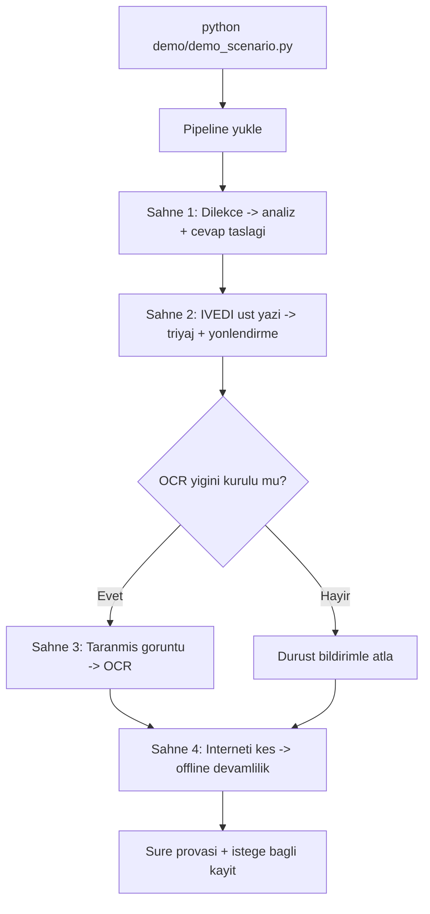

# Komut Satırı (CLI) ve Demo 🖥️

Bu sayfa, sistemin terminal üzerinden nasıl çalıştırılacağını uçtan uca anlatır: tek evrak ve toplu klasör işleme için `python -m src.main` giriş noktası, jüri sunumu için tasarlanmış 4 sahneli `demo/demo_scenario.py` senaryosu ve `scripts/` altındaki yardımcı araçlar (değerlendirme, benchmark, dayanıklılık, model eğitimi, kalibrasyon önerisi, LLM karşılaştırması, sunum üretimi). Tüm bu yollar çekirdek offline-first mimariye bağlanır; hiçbir LLM olmadan da tam işlevsel çalışır.

> [!NOTE]
> **TL;DR** — Tek evrak: `python -m src.main --input data/raw/kurgu_evraklar/dilekce_01.txt`. Toplu: `python -m src.main --klasor data/raw/kurgu_evraklar`. Jüri demosu: `python demo/demo_scenario.py` (4 sahne, "interneti kes" kanıtı dahil). Çalışma modları `full` / `classify` / `draft`. Çıktılar `--json` ve `--html-rapor` ile dosyaya alınır, `--kayit` ile SQLite denetim izine işlenir. Değerlendirme ve benchmark raporları `data/processed/` altına yazılır.

---

## Genel Bakış: CLI Yüzeyleri

Sistemin dört ayrı terminal yüzeyi vardır; hepsi aynı 11 uzman ajan + orkestratör çekirdeğine (`EndToEndPipeline`) bağlanır:

| Yüzey | Komut | Amaç |
|---|---|---|
| Ana CLI | `python -m src.main` | Tek evrak / toplu klasör işleme, JSON+HTML rapor, denetim izi |
| Demo senaryosu | `python demo/demo_scenario.py` | Jüri için 4 sahneli uçtan uca canlı gösterim |
| Değerlendirme | `python scripts/evaluate.py` | Etiketli setler üzerinde şartname metrikleri |
| Yardımcı scriptler | `scripts/*.py` | Benchmark, dayanıklılık, ML eğitimi, kalibrasyon, LLM karşılaştırma, sunum |

Web arayüzleri ve programatik erişim ayrı sayfalarda ele alınır: bakınız [Web Arayüzü — Evrak Zekâ](Web-Arayüzü), [REST API](REST-API) ve [MCP Sunucusu](MCP-Sunucusu).

---

## `python -m src.main` — Tek Evrak İşleme

Ana giriş noktası `src/main.py` içindeki `main()` fonksiyonudur; `argparse` tabanlıdır ve `rich` ile renkli konsol çıktısı üretir. En temel kullanım tek bir evrak dosyasını işler:

```bash
python -m src.main --input data/raw/kurgu_evraklar/dilekce_01.txt
```

Bu komut evrakı `EndToEndPipeline.process()` ile uçtan uca işler ve sonuçları görsel panellerle basar: sınıflandırma sonucu (tür + güven skoru), evrak özeti, resmî yazı taslağı ve birim yönlendirme önerisi (gerekçeyle).

> [!NOTE]
> `src/main.py` başlangıçta `stdout`/`stderr` akışlarını UTF-8'e sabitler (`reconfigure(encoding="utf-8", errors="replace")`). Böylece Windows'ta eski konsol kod sayfası (cp1254/cp1252) veya çıktının bir dosyaya/pipe'a yönlendirilmesi durumunda Türkçe karakterler ve emojiler `UnicodeEncodeError` ile komutu düşürmez. Bu, dokümante CLI komutunun her ortamda çalışmasını garanti eden bilinçli bir taşınabilirlik kararıdır.

### Bayraklar (argümanlar)

`src/main.py` içindeki `parse_args()` şu bayrakları tanımlar:

| Bayrak | Kısa | Değer | Açıklama |
|---|---|---|---|
| `--input` | `-i` | dosya yolu | İşlenecek evrak (PDF, PNG, JPG, TXT) |
| `--klasor` | — | dizin yolu | Dizindeki tüm `.txt` evrakları toplu işler, özet tablo gösterir |
| `--mode` | `-m` | `full` \| `classify` \| `draft` | Çalışma modu (varsayılan `full`) |
| `--output` | `-o` | dizin | Çıktı dizini (varsayılan `./output/`) |
| `--json` | — | dosya | Sonuçları JSON'a yazar (tek evrak nesne, klasör liste) |
| `--html-rapor` | — | dizin | Her evrak için HTML denetim raporunu `<dizin>/<ad>.html` kaydeder |
| `--kayit` | — | (bayrak) | İşlemleri SQLite kayıt defterine (denetim izi) işler |
| `--demo` | — | (bayrak) | 4 sahneli demo senaryosunu çalıştırır |
| `--web` | — | (bayrak) | Streamlit klasik arayüzünü (`src/app.py`) başlatır |
| `--verbose` | `-v` | (bayrak) | Log seviyesini `DEBUG`'a çeker |

### Çalışma modları

`--mode` bayrağı orkestratörün hangi bloğu yürüteceğini belirler ve pipeline sözleşmesiyle birebir uyumludur:

- **`full`** — Uçtan uca: Görev 1 (sınıflandırma + içerik analizi) ve Görev 2 (taslak + yönlendirme) birlikte.
- **`classify`** — Yalnızca Görev 1 zinciri (sınıflandırma → bilgi çıkarımı → eksik bilgi → mevzuat → triage → özet → anonimleştirme).
- **`draft`** — Taslaklama odaklı Görev 2 yolu (taslak yazımı + yönlendirme + kullanıcı bilgilendirme).

Orkestratörün koşullu akışı ve modların hangi ajanları tetiklediği [Orkestratör ve Koşullu Kapılar](Orkestratör-ve-Koşullu-Kapılar) sayfasında ayrıntılı işlenir.

### Örnek: sınıflandırma-yalnız + JSON çıktısı

```bash
python -m src.main \
  --input data/raw/kurgu_evraklar/ust_yazi_03.txt \
  --mode classify \
  --json cikti/ust_yazi_03.json
```

Tek evrak `--json` ile verildiğinde çıktı **tek bir JSON nesnesi** olarak yazılır (klasör modunda ise liste). Serileştirilemeyen nadir değerler `default=str` ile metne indirgenir; JSON çıktısı hiçbir zaman sessizce düşmez.

### Örnek konsol çıktısı

> [!NOTE]
> Aşağıdaki panel bir **biçim örneğidir**; kutulardaki tür ve güven değerleri temsilîdir, ölçüm sonucu değildir.

```text
📄 İşlenen evrak: dilekce_01.txt
⚙️  Çalışma modu: full

╭─ 🏷️ Sınıflandırma Sonucu ─────────────╮
│ Evrak Türü: dilekce                    │
│ Güven Skoru: 0.94                      │
╰────────────────────────────────────────╯
╭─ 📝 Evrak Özeti ──────────────────────╮
│ [Dilekçe] | Konu: ... | Tarih: ...     │
╰────────────────────────────────────────╯
╭─ 🏢 Birim Yönlendirme ────────────────╮
│ Önerilen Birim: Yazı İşleri Müdürlüğü  │
│ Gerekçe: ...                           │
╰────────────────────────────────────────╯
```

> [!IMPORTANT]
> Yukarıdaki değerler biçim örneğidir. Sistemin doğrulanmış performans rakamları (sınıflandırma doğruluğu, yönlendirme, taslak kalitesi vb.) için [Değerlendirme ve Metrikler](Değerlendirme-ve-Metrikler) sayfasına bakınız.

---

## Toplu İşleme (`--klasor`)

Bir dizindeki tüm `.txt` evrakları sırayla işlemek için:

```bash
python -m src.main --klasor data/raw/kurgu_evraklar --mode full
```

`klasor_isle()` fonksiyonu dizindeki `.txt` dosyalarını **sırayla** işler ve tüm evraklar için **tek bir paylaşılan pipeline örneği** kullanır. Toplu işlem hata toleranslıdır: bir evrağın işlenmesi istisna verse bile toplu akış durmaz; hatalı evrak sonuç listesine bir hata kaydıyla eklenir ve özet tabloda `HATA` satırı olarak görünür.

İşlem sonunda `ozet_tablosu_goster()` bir `rich` özet tablosu basar:

> [!NOTE]
> Aşağıdaki tablo bir biçim örneğidir; satırlardaki değerler (tür/birim/öncelik/süre) temsilîdir. Ölçülmüş performans dağılımı için [Değerlendirme ve Metrikler](Değerlendirme-ve-Metrikler) sayfasına bakınız.

```text
📋 Toplu İşlem Özeti
┏━━━━━━━━━━━━━━━━━┳━━━━━━━━━┳━━━━━━━━━━━━━━━┳━━━━━━━━━┳━━━━━━━━━━┓
┃ Dosya           ┃ Tür     ┃ Birim         ┃ Öncelik ┃ Süre(sn) ┃
┡━━━━━━━━━━━━━━━━━╇━━━━━━━━━╇━━━━━━━━━━━━━━━╇━━━━━━━━━╇━━━━━━━━━━┩
│ dilekce_01.txt  │ Dilekçe │ Yazı İşleri   │ normal  │     0.14 │
│ ust_yazi_03.txt │ Üst Yazı│ Mali Hizmetler│ ivedi   │     0.11 │
└─────────────────┴─────────┴───────────────┴─────────┴──────────┘
```

Toplu işlemi rapora dökmek için `--json` (liste olarak yazılır) ve `--html-rapor` bayrakları birlikte kullanılabilir:

```bash
python -m src.main \
  --klasor data/raw/kurgu_evraklar \
  --json cikti/toplu.json \
  --html-rapor cikti/raporlar
```

HTML raporları `html_raporlari_yaz()` ile üretilir; her evrak için kendine yeten (inline CSS, dış kaynaksız) bir denetim raporu oluşturur. Aynı ada sahip evraklar çakışırsa dosya adına sıra numarası eklenir — hiçbir rapor sessizce ezilmez. HTML rapor altyapısının içeriği (`src/utils/islem_raporu.py`) [Sistem Mimarisi](Sistem-Mimarisi) sayfasında ele alınır.

### Denetim izi (`--kayit`)

`--kayit` bayrağı, her işlemi SQLite tabanlı kayıt defterine (denetim izi) yazar:

```bash
python -m src.main --klasor data/raw/kurgu_evraklar --kayit
```

Bu, `EndToEndPipeline(kayit_defteri_aktif=True)` ile pipeline'ı açar ve işlemler `data/processed/kayit_defteri.db` içindeki `islemler` tablosuna işlenir. Kayıt defteri **varsayılan olarak kapalıdır**; böylece değerlendirme ve toplu ölçüm betikleri denetim izine yan etki üretmez. Kayıt defteri açılamazsa CLI işlemi kayıtsız sürdürür ve uyarır.

> [!WARNING]
> `--json`, `--html-rapor` veya `--kayit` bayrakları işlenecek evrak gerektirir. `--input` ya da `--klasor` verilmeden bu bayraklar kullanılırsa CLI anlaşılır bir hata mesajıyla `EXIT 1` verir.

---

## Demo Senaryosu — `demo/demo_scenario.py`

`demo/demo_scenario.py`, jüri sunumu için tasarlanmış **4 sahneli uçtan uca gösterimdir** (Demo Senaryosu 2.0). İki eşdeğer yolla çalıştırılır:

```bash
python demo/demo_scenario.py
# veya
python -m src.main --demo
```

Senaryo, şartname m.8 ("temel yetenekler ve özgün çıktılar gözlemlenebilir") kapsamında kurgulanmıştır ve her sahne belirli bir yeteneği kanıtlar.

### Dört sahne

1. **Vatandaş dilekçesi → analiz + cevap taslağı** — Görev 1 ve Görev 2 birlikte: `data/raw/kurgu_evraklar/dilekce_01.txt` işlenir; sınıflandırma, bilgi çıkarımı, eksik bilgi, mevzuat önerileri (madde etiketi + gerekçeyle), özet, resmî yazı taslağı, format denetimi ve bağımsız taslak kalite hakemi gösterilir.
2. **İVEDİ damgalı üst yazı → triyaj + birim yönlendirme** — İVEDİ üst yazı, **çalışma anında bugünün tarihiyle** üretilir (`_ivedi_evrak_uret()`), böylece triyajın "kalan gün" hesabı canlı demoda her zaman ileriye bakar ve anlamlı kalır. Aciliyet, yasal süre ve son işlem tarihi gösterilir. Triyaj mantığı için bakınız [Triage ve Akıllı Önceliklendirme](Triage-ve-Önceliklendirme).
3. **Taranmış/gürültülü evrak görüntüsü → OCR hattı** — `_taranmis_evrak_uret()` deterministik tohumla (`random.Random(2026)`) hafif eğik + tuz-biber benekli kurgu bir dilekçe görüntüsü üretir. OCR opsiyonel yığın (Pillow + pytesseract/easyocr) kuruluysa çalışır; değilse **dürüst bir mesajla atlanır** ve kurulum yönergesi (`pip install -r requirements-optional.txt`) gösterilir.
4. **"İNTERNETİ KES" sahnesi** — Tüm ağ soket erişimi `socket.socket` kurucusu istisna fırlatacak biçimde **programatik olarak** engellenir (`_internet_kesildi()` bağlam yöneticisi) ve aynı İVEDİ evrak yeniden işlenir. Çekirdek kural tabanlı sistem kesintisiz sürer — bu, offline-first mimarinin ve şartname m.8'in "internet kesintisine karşı yedek plan" beklentisinin programatik kanıtıdır.

### Demo çıktısı ve süre provası

Her sahne `_display_results()` ile zengin panellere basılır: sınıflandırma, bilgi çıkarım, eksik bilgiler, mevzuat önerileri, özet, yazı taslağı, format denetimi (madde dayanaklı), taslak kalite hakemi, birim yönlendirme, aciliyet/yasal süre, KVKK paylaşım nüshası, eksik bilgi talepleri ve işlem adımları tablosu.

Demo sonunda toplam süre, senaryodaki `DEMO_HEDEF_SANIYE = 240` (4 dakikalık sunum hedefi) ile karşılaştırılır ve "hedefin içinde / hedef aşıldı" durumu bir süre provası paneliyle bildirilir. Bu, "gerçek zamana yakın çalışma" beklentisine hazırlık amaçlıdır (mutlak süre donanıma göre değişir).

### Demo kaydı (jüri yedeği)

Konsol dökümünü bir dosyaya kaydetmek için:

```bash
python demo/demo_scenario.py --kayit demo_kaydi.txt
```

Bu, `Console(record=True)` üzerinden tüm çıktıyı metne kaydeder; jürinin kayıttan izleme talebine karşı yedektir.



---

## Yardımcı Scriptler

`scripts/` dizini, değerlendirme ve geliştirme yaşam döngüsünü destekleyen bağımsız araçlar içerir. Hepsi proje kökünü `sys.path`'e ekleyerek doğrudan çalıştırılabilir.

| Script | Amaç | Tipik komut |
|---|---|---|
| `evaluate.py` | Etiketli setler üzerinde şartname metrikleri (saf Python) | `python scripts/evaluate.py --veri-dizini ... --rapor-dosyasi ...` |
| `benchmark.py` | Performans/ölçeklenebilirlik (gecikme yüzdelikleri, throughput, bellek) | `python scripts/benchmark.py` |
| `dayaniklilik_testi.py` | Metamorfik dayanıklılık (CheckList-INV; tür/birim invaryansı) | `python scripts/dayaniklilik_testi.py` |
| `ml_egit.py` | İstatistiksel sınıflandırıcı (Naive Bayes) modelini eğitir | `python scripts/ml_egit.py` |
| `kalibrasyon_onerisi.py` | Kullanıcı geri bildiriminden kalibrasyon önerisi üretir | `python scripts/kalibrasyon_onerisi.py` |
| `llm_karsilastirma.py` | Yerel Ollama modellerinin eskalasyon kalitesini karşılaştırır | `python scripts/llm_karsilastirma.py --modeller ...` |
| `build_presentation.py` | Markdown kaynaktan sunum PPTX üretir | `python scripts/build_presentation.py` |
| `api_ornek.py` | REST API'ye örnek istemci çağrısı | (bakınız [REST API](REST-API)) |

### `evaluate.py` — Değerlendirme

Etiketli sentetik setleri uçtan uca işleyip TEKNOFEST puanlama eksenlerini (sınıflandırma, yönlendirme, eksik bilgi, mevzuat önerisi, taslak kalitesi, performans) ve ek güvence katmanlarını (kalibrasyon, seçici tahmin, konformal, KVKK, özet kalitesi, ablasyon, güven aralıkları) saf-Python metriklerle ölçer. Her rapora bir tekrarlanabilirlik mührü (git commit + platform + veri seti içerik hash'i) gömülür.

```bash
python scripts/evaluate.py \
  --veri-dizini data/raw/kurgu_evraklar \
  --rapor-dosyasi data/processed/eval_report.json
```

Held-out setler için tutulmuş varyantlar ayrı ayrı çalıştırılır (`kurgu_evraklar_heldout`, `..._v2`, `..._v3`, `..._v4`). Değerlendirme bütünlüğü kuralları, held-out disiplini ve tüm doğrulanmış metrikler için bakınız [Değerlendirme ve Metrikler](Değerlendirme-ve-Metrikler).

> [!IMPORTANT]
> `data/processed/eval_report*.json` dosyaları **elle düzenlenmez**; yalnızca `scripts/evaluate.py` ile üretilir. Sıcaklık ölçekleme (temperature scaling) yalnızca geliştirme setinde öğrenilir; held-out setlerde yalnızca ölçüm yapılır — bu disiplin koda gömülüdür.

### `benchmark.py` — Performans

Performans ve ölçeklenebilirliği ölçer: soğuk başlangıç, ısınma, gecikme yüzdelikleri (p50/p95/p99), throughput, adım dağılımı, tepe bellek (tracemalloc) ve 1x/5x/10x ölçekleme doğrusallığı. Soğuk başlangıç, ısınma ve bellek **ayrı** ölçülür; böylece p99 yapay olarak şişmez. Çıktı `data/processed/benchmark_raporu.json` ve konsol raporudur.

```bash
python scripts/benchmark.py
```

Benchmark, sabit sırada üç seti işler (geliştirme + iki held-out; 84 evrak) ve deterministiktir. Performans karakteristiği hakkında ayrıntı için [Değerlendirme ve Metrikler](Değerlendirme-ve-Metrikler) sayfasına bakınız.

### `dayaniklilik_testi.py` — Metamorfik Dayanıklılık

Geliştirme setindeki her evrağa etiket-koruyan bozulmalar (diyakritik kaybı, yazım hatası, OCR ikamesi, boşluk/noktalama gürültüsü) uygular ve sistemin kararının (tür/birim) bu bozulmalar altında değişmeme oranını (invaryans) ve gürbüz doğruluğu ölçer. 52 elle etiketli geliştirme evrağı, deterministik tohumla varyantlara ölçeklenir; en kırılgan bozulma türü (en düşük tür invaryansı) hata analizi olarak raporlanır.

```bash
python scripts/dayaniklilik_testi.py
python scripts/dayaniklilik_testi.py --tohum 7 --azami-dosya 10
```

Varsayılan tohum `1234`'tür (tekrarlanabilirlik) ve tüm yollar görelidir (raporlara mutlak yol sızmaz). Ayrıntı için bakınız [Adversarial Dayanıklılık](Adversarial-Dayanıklılık) ve [Güven ve Ölçüm Katmanı](Güven-ve-Ölçüm-Katmanı).

### `ml_egit.py` — Model Eğitimi

Geliştirme setindeki (`data/raw/kurgu_evraklar`) etiketli evraklarla saf Python Multinomial Naive Bayes modelini eğitir ve `data/processed/ml_model.json` dosyasına yazar.

```bash
python scripts/ml_egit.py
python scripts/ml_egit.py --veri-dizini data/raw/kurgu_evraklar --cikti data/processed/ml_model.json
```

> [!WARNING]
> **Veri hijyeni:** Eğitim yalnızca geliştirme setiyle yapılır. Held-out setler (`kurgu_evraklar_heldout*`) dış geçerlilik ölçümüne ayrılmıştır; eğitimde kullanılmaları veri sızıntısıdır. Betik, adında "heldout" geçen dizinlerle eğitimi anlaşılır bir hata mesajıyla **reddeder**. Model dosyası yoksa sistem saf kural tabanlı moda düşer (offline-first korunur). Sınıflandırıcı ensemble'ının detayı için [Görev 1 — Okuma, Sınıflandırma ve İçerik Analizi](Görev-1-Okuma-ve-Analiz) sayfasına bakınız.

### `kalibrasyon_onerisi.py` — Aktif Öğrenme Önerisi

Web arayüzündeki "Sonucu Düzelt" akışının biriktirdiği kullanıcı düzeltmelerini (`data/processed/geri_bildirim.jsonl`) analiz eder; hangi türün/birimin hangisiyle kaç kez düzeltildiğini özetler ve her desen için somut, dosya/sözlük adı referanslı kalibrasyon önerisi üretir.

```bash
python scripts/kalibrasyon_onerisi.py
python scripts/kalibrasyon_onerisi.py --girdi baska.jsonl --cikti rapor.json
```

> [!IMPORTANT]
> Bu betik kuralları **otomatik değiştirmez**. Öneriler insan onayına sunulur; `classification_agent.AGIRLIKLI_KELIMELER` veya `routing_agent.BIRIMLER` üzerinde otomatik yazma yapılmaz. Gerekçe: az sayıda geri bildirimle kuralları kendiliğinden değiştirmek, etiketli değerlendirme setine karşı kontrolsüz kayma (drift) yaratır. Doğru akış: öneri → insan incelemesi → elle kural değişikliği → testler + değerlendirme ile doğrulama.

### `llm_karsilastirma.py` — Yerel LLM Mini-Karşılaştırma

Aynı tutulmuş set üzerinde iki (veya daha çok) yerel Ollama modelinin eskalasyon kalitesini karşılaştıran bir **ölçüm protokolüdür**. GPU'lu/uygun bir makinede koşulur; rapora yalnızca bu betiğin ürettiği sayılar (komut + tarihle) yazılabilir.

```bash
python scripts/llm_karsilastirma.py \
  --modeller "qwen2.5:7b,hf.co/ytu-ce-cosmos/Turkish-Llama-8b-Instruct-v0.1-GGUF:Q4_K_M" \
  --veri-dizini data/raw/kurgu_evraklar_heldout \
  --rapor-dosyasi data/processed/llm_karsilastirma.json
```

Ölçülenler (model başına): LLM'in tek başına tür sınıflandırma doğruluğu, JSON çıktı disiplinine uyum oranı ve ortalama/medyan gecikme. Kural tabanlı çekirdeğin başarımı bu betikten bağımsızdır ve `evaluate.py` ile ölçülür; buradaki karşılaştırma yalnızca **opsiyonel** eskalasyon katmanı için model seçimini bilgilendirir. Model ekosistemi için bakınız [Model Bilgileri ve LLM Ekosistemi](Model-Bilgileri).

### `build_presentation.py` — Sunum Üretimi

Markdown kaynaktan (`presentations/*.md`) PPTX sunumu üretir. Slaytlar `---` satırıyla ayrılır; ilk `# ` satırı başlık, `- ` madde imi, `> not:` konuşmacı notudur.

```bash
python scripts/build_presentation.py
python scripts/build_presentation.py --girdi presentations/final_sunumu.md --cikti presentations/final_sunumu.pptx
```

> [!NOTE]
> `python-pptx` opsiyonel bir bağımlılıktır (`pip install -r requirements-optional.txt`). Şartnamenin istediği PDF sürümü, PPTX'ten PowerPoint üzerinden "Farklı Kaydet → PDF" ile elle alınmalıdır.

---

## Çıktılar Nereye Yazılır?

Sistem, kalıcı çıktılar için tutarlı bir yerleşim kullanır:

| Çıktı türü | Konum | Üreten |
|---|---|---|
| Değerlendirme raporları | `data/processed/eval_report*.json` | `scripts/evaluate.py` |
| Benchmark raporu | `data/processed/benchmark_raporu.json` | `scripts/benchmark.py` |
| Dayanıklılık raporu | `data/processed/dayaniklilik_raporu.json` | `scripts/dayaniklilik_testi.py` |
| Eğitilmiş ML modeli | `data/processed/ml_model.json` | `scripts/ml_egit.py` |
| Kalibrasyon önerileri | `data/processed/kalibrasyon_onerileri.json` | `scripts/kalibrasyon_onerisi.py` |
| SQLite denetim izi | `data/processed/kayit_defteri.db` | `--kayit` bayrağı / pipeline |
| Kullanıcı geri bildirimi | `data/processed/geri_bildirim.jsonl` | Web arayüzü "Sonucu Düzelt" |
| Tek evrak JSON/HTML | `--json` / `--html-rapor` ile belirtilen yol | `src/main.py` |
| Sunum PPTX | `presentations/*.pptx` | `scripts/build_presentation.py` |

> [!IMPORTANT]
> Değerlendirme betikleri raporlara **mutlak yol yazmaz**; `goreli_yol()` yolu proje köküne göre göreli yazar (makine/kullanıcı adı sızmaz). Bu, git ile izlenen raporların güvenliği için bilinçli bir karardır. Değerlendirme komutları her zaman göreli yollarla çalıştırılmalıdır.

---

## Sık Karşılaşılan Durumlar

- **Evrak dosyası belirtilmedi** — `--input` veya `--klasor` verilmezse CLI kısa bir kullanım rehberi basar ve normal çıkar (`--help` ile tam yardım).
- **LLM yok/erişilemiyor** — Tüm CLI ve demo yolları çekirdek kural tabanlı modda tam çalışır; LLM yalnızca düşük güvende opsiyonel eskalasyon katmanıdır. Offline garanti için `APP_OFFLINE=1` ayarı kullanılabilir (bakınız [Kurulum ve Yapılandırma](Kurulum-ve-Yapılandırma)).
- **OCR bağımlılıkları yok** — Görüntü/taranmış PDF işleme opsiyoneldir; çekirdek `.txt`/`.md` yolu bu bağımlılıklardan bağımsızdır. Demo Sahne 3 dürüstçe atlanır.
- **Toplu işlemde tek evrak hatası** — Toplu akış durmaz; hatalı evrak özet tabloda `HATA` olarak görünür.

---

## İlgili Sayfalar

- [Hızlı Başlangıç](Hızlı-Başlangıç) — 5 dakikada kurulum ve ilk evrak
- [Değerlendirme ve Metrikler](Değerlendirme-ve-Metrikler) — `evaluate.py`, 5 set, doğrulanmış metrikler
- [Adversarial Dayanıklılık](Adversarial-Dayanıklılık) — `dayaniklilik_testi.py` ve metamorfik testler
- [Orkestratör ve Koşullu Kapılar](Orkestratör-ve-Koşullu-Kapılar) — pipeline akışı ve çalışma modları
- [Web Arayüzü — Evrak Zekâ](Web-Arayüzü) — kurumsal pano ve klasik arayüz
- [MCP Sunucusu](MCP-Sunucusu) — stdio JSON-RPC 2.0 sunucusu
