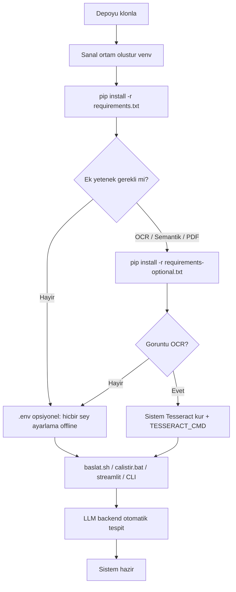
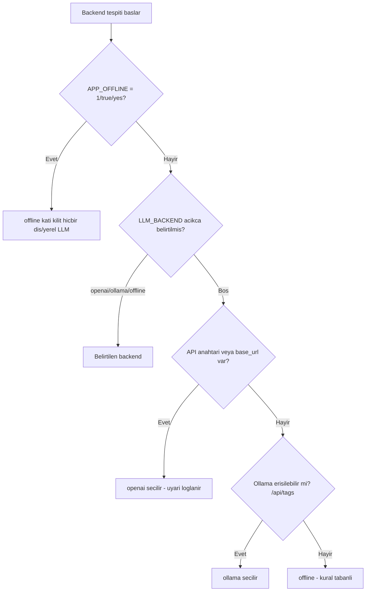

# Kurulum ve Yapılandırma ⚙️

Bu sayfa, **Kamu Evrak ve Yazışma için Akıllı Agent** sisteminin çekirdek ve opsiyonel bağımlılıklarını, ortam değişkenlerini (`.env`), LLM backend seçimini, `src/config.py` merkezî ayarlarını ve Docker/başlatıcı script'lerini uçtan uca anlatır. Amaç: sistemi ilk çalıştırmadan üretim benzeri bir kuruluma kadar tekrarlanabilir biçimde ayağa kaldırmak.

> [!NOTE]
> **TL;DR** — Sistem **offline-first**'tür: `pip install -r requirements.txt` sonrası hiçbir LLM, internet veya API anahtarı olmadan 11 ajanın tamamı çalışır. OCR (taranmış PDF/görüntü), semantik arama ve resmî PDF çıktısı **opsiyoneldir** ve `requirements-optional.txt` ile gelir. Hiçbir ortam değişkeni ayarlamazsanız LLM backend otomatik **offline** moda düşer. Tek komut başlatma: Linux/macOS'ta `./baslat.sh`, Windows'ta `calistir.bat`.

---

## 1. İki Katmanlı Bağımlılık Disiplini

Proje, TEKNOFEST şartname kısıtı gereği **çekirdek** ile **opsiyonel** bağımlılıkları kesin biçimde ayırır (`requirements.txt` vs `requirements-optional.txt`). Bu ayrım, "offline-first korunur" ilkesinin somut karşılığıdır: çekirdek kurulumla sistem **eksiksiz** çalışır; opsiyonel katman yalnızca yetenek ekler, hiçbir çekirdek işlevi bu katmana bağlı değildir.

### 1.1 Çekirdek — `requirements.txt`

Metin (TXT/MD) ve metin katmanlı PDF girişiyle sistemin **tamamı** (11 ajan, hibrit BM25 mevzuat RAG, taslak üretimi, yönlendirme, KVKK anonimleştirme) LLM olmadan çalışır. LLM çağrıları bile harici SDK gerektirmez — stdlib `urllib` ile yapılır (bkz. [Model Bilgileri](Model-Bilgileri)).

| Paket | Sürüm | Rol |
|---|---|---|
| `python-dotenv` | `>=1.0.0` | `.env` yükleme |
| `pydantic` | `>=2.0.0` | Ayar şeması doğrulama |
| `pydantic-settings` | `>=2.0.0` | Ortam değişkeni → ayar eşleme (`src/config.py`) |
| `pypdf` | `>=6.13.3` | PDF metin katmanı ayrıştırma |
| `streamlit` | `>=1.30.0` | Web arayüzleri (`app.py`, `src/app.py`) |
| `pandas` | `>=2.0.0` | Pano tablo/grafik katmanı |
| `altair` | `>=5.0.0` | Pano görselleştirme |
| `rich` | `>=13.7.0` | Konsol raporları (CLI, `evaluate.py`) |
| `pytest`, `pytest-cov` | `>=7.0.0` / `>=4.0.0` | Test ve kapsam |

> [!IMPORTANT]
> `PyPDF2` bilinçli olarak terk edilmiştir: son sürümü (3.0.1) yamasız bir DoS açığı taşır (PYSEC-2026-1835 — özel hazırlanmış PDF'te `extract_text` sonsuz döngüsü). Bakımlı ardılı `pypdf>=6.13.3` hem bu açığı hem de bir bellek DoS açığını (GHSA-jm82-fx9c-mx94) kapatır. Ayrıntı için [Anayasal İlkeler ve Etik](Anayasal-İlkeler-ve-Etik) sayfasındaki güvenlik denetim özetine bakın.

```bash
python -m venv venv
source venv/bin/activate        # Windows: venv\Scripts\activate
pip install -r requirements.txt
```

### 1.2 Opsiyonel — `requirements-optional.txt`

Bunlar **olmadan da** sistem kural tabanlı modda tam çalışır. Her opsiyonel yetenek, ilgili kütüphane yoksa **zarif fallback** (graceful degradation) ile devre dışı kalır; çekirdek yol asla bozulmaz.

| Grup | Paketler | Ne sağlar? |
|---|---|---|
| **OCR** | `pytesseract`, `Pillow`, `pdf2image`, `easyocr` | Taranmış PDF / görüntü evrak okuma (bkz. [Görev 1](Görev-1-Okuma-ve-Analiz)) |
| **Semantik arama** | `sentence-transformers`, `chromadb` | Yoğun (dense) mevzuat arama + yeniden sıralama (bkz. [Mevzuat RAG](Mevzuat-RAG-ve-Hibrit-Arama)) |
| **Yerel model** | `transformers`, `torch` | HuggingFace model çalıştırma |
| **Veri/analiz** | `pandas`, `numpy` | Ölçüm ve toplu analiz yardımcıları |
| **Sunum** | `python-pptx` | `presentations/*.pptx` üretimi |
| **Resmî PDF** | `reportlab` | Taslağı Yönetmelik görsel formatında A4 PDF'e dökme (`src/utils/resmi_pdf.py`) |

```bash
pip install -r requirements-optional.txt
```

> [!WARNING]
> **Görüntü OCR** için Python paketlerine ek olarak **sistem düzeyinde Tesseract** kurulumu gerekir (`pytesseract` yalnızca bir sarmalayıcıdır). Örn. macOS: `brew install tesseract tesseract-lang`; Debian/Ubuntu: `sudo apt install tesseract-ocr tesseract-ocr-tur`; Windows: [UB Mannheim Tesseract kurucusu](https://github.com/UB-Mannheim/tesseract). Kurulum sonrası yolu `.env` içindeki `TESSERACT_CMD` ile belirtin.

---

## 2. Kuruluma Genel Akış



---

## 3. Ortam Değişkenleri — `.env`

Depoda hazır bir `.env.example` bulunur. Bu dosyayı `.env` olarak kopyalayıp değerleri güncelleyin. **Hiçbir değeri ayarlamazsanız** sistem offline (kural tabanlı) modda tam çalışır — `.env` tamamen opsiyoneldir.

```bash
cp .env.example .env
```

Ayarlar `pydantic-settings` üzerinden `src/config.py` içindeki tipli ayar sınıflarına yüklenir. Alanların anlamı:

### 3.1 LLM Backend Seçimi

```bash
# Boş bırakılırsa otomatik tespit. Değerler: openai | ollama | offline
LLM_BACKEND=
```

### 3.2 OpenAI-uyumlu API

OpenAI'nin yanı sıra OpenRouter, Groq, vLLM, LM Studio gibi **OpenAI-uyumlu** herhangi bir sağlayıcı desteklenir.

```bash
# OPENAI_API_KEY veya LLM_OPENAI_API_KEY olarak verilebilir
OPENAI_API_KEY=
# Farklı sağlayıcı için taban URL (ör. https://openrouter.ai/api/v1)
LLM_BASE_URL=
LLM_MODEL_NAME=gpt-4o-mini
```

`LLM_BASE_URL` boşsa varsayılan kök `https://api.openai.com/v1` kullanılır; istekler `/chat/completions` ucuna gider.

### 3.3 Ollama (tamamen yerel)

```bash
LLM_OLLAMA_BASE_URL=http://localhost:11434
LLM_OLLAMA_MODEL=qwen2.5:7b
```

### 3.4 Üretim Parametreleri

```bash
LLM_TEMPERATURE=0.1
LLM_MAX_TOKENS=4096
LLM_TIMEOUT_SECONDS=90
```

| Alan | Varsayılan | Anlam |
|---|---|---|
| `LLM_TEMPERATURE` | `0.1` | Üretim sıcaklığı (düşük = daha kararlı/tekrarlanabilir) |
| `LLM_MAX_TOKENS` | `4096` | Azami üretim token sayısı |
| `LLM_TIMEOUT_SECONDS` | `90` | LLM çağrısı zaman aşımı (saniye) |

### 3.5 Embedding, OCR ve Vektör DB

```bash
EMBEDDING_MODEL_NAME=sentence-transformers/paraphrase-multilingual-MiniLM-L12-v2

# macOS/Linux: tesseract | Windows: C:/Program Files/Tesseract-OCR/tesseract.exe
TESSERACT_CMD=tesseract
TESSERACT_LANG=tur

CHROMA_PERSIST_DIR=./data/chroma_db
CHROMA_COLLECTION_NAME=mevzuat
```

### 3.6 Uygulama Ayarları

```bash
APP_HOST=localhost
APP_PORT=8501
APP_LOG_LEVEL=INFO
APP_DEBUG=false
```

> [!NOTE]
> **Gizli anahtar hijyeni:** `.env` dosyanız API anahtarı içeriyorsa depoya **commit edilmemelidir** (`.gitignore` kapsamındadır). Tam gizlilik/KVKK garantisi için aşağıdaki `APP_OFFLINE` katı kilidini kullanın.

---

## 4. LLM Backend Otomatik Tespiti

Sistem model-agnostiktir: aynı arayüz üzerinden OpenAI-uyumlu API, yerel Ollama veya tam offline çalışabilir. Backend seçimi `src/models/llm_wrapper.py` içindeki `_detect_backend` tarafından **öncelik sırasına** göre yapılır.



**Öncelik sırası:**

1. **`APP_OFFLINE` katı kilidi** — `"1"`, `"true"` veya `"yes"` ise backend koşulsuz `offline` döner; hiçbir dış/yerel LLM'e gidilmez. Bu, KVKK/gizlilik garantisinin ana mekanizmasıdır: başıboş bir `OPENAI_API_KEY` bile beklenmedik dış ağ bağlantısına yol açamaz.
2. **Açık `LLM_BACKEND`** — `openai` | `ollama` | `offline` değerlerinden biri.
3. **API anahtarı / base_url** — varsa `openai` seçilir. Bu durumda **uyarı loglanır** (evrak metni dış API'ye gidebilir); tam offline için `APP_OFFLINE=1` önerilir.
4. **Ollama yoklaması** — `/api/tags` ucuna 2 saniye zaman aşımlı istekle erişilebilirlik kontrol edilir; erişilebilirse `ollama`.
5. Hiçbiri yoksa → **`offline`** (kural tabanlı, tam işlevsel).

Varsayılan modeller: OpenAI-uyumlu tarafta `gpt-4o-mini`, Ollama tarafında `qwen2.5:7b` (Apache 2.0). LLM yalnızca **düşük güvenli kararlarda** devreye girer (bkz. [Orkestratör ve Koşullu Kapılar](Orkestratör-ve-Koşullu-Kapılar)); backend yoksa `LLMUnavailableError` fırlatılır ve ilgili ajan kural tabanlı sonucunu korur.

> [!IMPORTANT]
> **Tam offline demo için önerilen kilit:**
> ```bash
> APP_OFFLINE=1
> ```
> Bu ayarla hiçbir prompt veya evrak metni dışarı gönderilmez. Jüri demolarında ve KVKK duyarlı ortamlarda önerilir.

Backend seçim mantığının tüm ayrıntısı için [Model Bilgileri ve LLM Ekosistemi](Model-Bilgileri) sayfasına bakın.

---

## 5. Merkezî Yapılandırma — `src/config.py`

Tüm ayarlar `pydantic-settings` tabanlı sınıflarda toplanır ve ortam değişkenlerinden yüklenir. Ana `Settings` nesnesi şu alt ayar gruplarını içerir:

| Ayar sınıfı | Kapsam |
|---|---|
| `LLMSettings` | Backend, model adı, sıcaklık, token, zaman aşımı, base_url, anahtarlar |
| `OCRSettings` | `tesseract_cmd`, `tesseract_lang` |
| `EmbeddingSettings` | Model adı, `semantik_aktif`, `rerank_aktif` bayrakları |
| `ChromaSettings` | Kalıcılık dizini, koleksiyon adı |
| `AppSettings` | Host, port, log seviyesi, debug |

Önemli **varsayılan** değerler (koddan doğrulanmış):

| Ayar | Varsayılan | Not |
|---|---|---|
| `LLM temperature` | `0.1` | Kararlı üretim |
| `LLM max_tokens` | `4096` | — |
| `LLM timeout_seconds` | `90` | Çağrı zaman aşımı |
| `EMBEDDING semantik_aktif` | `False` | `EMBEDDING_SEMANTIK_AKTIF=1` ile açılır |
| `EMBEDDING rerank_aktif` | `False` | `EMBEDDING_RERANK_AKTIF=1` ile açılır |
| `AppSettings port` | `8501` | Streamlit varsayılan portu |

> [!NOTE]
> Semantik ve yeniden sıralama (rerank) katmanları **bilinçli olarak varsayılan kapalıdır**: offline-first ilkesi gereği ilk açılışta model indirmesi gerektirdikleri için, çekirdek BM25 arama yolu bunlardan bağımsız çalışır. Bu katmanları açmak için hem opsiyonel bağımlılıkları kurun hem de ilgili bayrakları ayarlayın:
> ```bash
> pip install -r requirements-optional.txt
> EMBEDDING_SEMANTIK_AKTIF=1
> EMBEDDING_RERANK_AKTIF=1
> ```
> Ayrıntı: [Mevzuat RAG ve Hibrit Arama](Mevzuat-RAG-ve-Hibrit-Arama).

---

## 6. Çalıştırma Yolları

### 6.1 Tek Komut Başlatıcılar

**Linux / macOS — `baslat.sh`:** Depo köküne geçer, sanal ortamı (varsa `venv/` veya `.venv/`) etkinleştirir, çekirdek bağımlılıkları (`pydantic`, `rich`; web modunda ayrıca `streamlit`) kontrol eder ve arayüzü başlatır. Etkin ortam yoksa uyarır ama zorlamaz.

```bash
./baslat.sh          # Streamlit web arayüzü (port 8501)
./baslat.sh --api    # REST API (port 8765) — streamlit gerektirmez
./baslat.sh --help   # yardım
```

**Windows — `calistir.bat`:** `python --version` ile Python'un kullanılabilirliğini denetler (başarısız olursa Microsoft Store kısayolu olasılığına karşı uyarır), `.venv` yoksa oluşturur, bağımlılıkları kurar ve arayüzü açar.

```bat
calistir.bat
```

> [!WARNING]
> Windows'ta yaygın bir tuzak: **Microsoft Store'un `python` kısayolu gerçek bir Python kurulumu değildir.** `python --version` başarısız olduğunda `calistir.bat` bu olasılığı hatırlatır ve [python.org](https://www.python.org/downloads/windows/) kurulumuna yönlendirir. Kurulum sihirbazında **"Add python.exe to PATH"** kutusunu işaretleyin.

### 6.2 Doğrudan Komutlar

```bash
# Kurumsal sunum panosu "Evrak Zekâ"
streamlit run app.py

# Klasik işlevsel arayüz (canlı ajan hattı — streaming)
streamlit run src/app.py

# REST API (sıfır ek bağımlılık; stdlib http.server)
python -m src.api

# MCP sunucusu (stdio JSON-RPC 2.0)
python -m src.mcp_server

# Tek evrak CLI
python -m src.main --input data/raw/kurgu_evraklar/dilekce_01.txt

# Konsol demo senaryosu
python demo/demo_scenario.py
```

Arayüzlerin ayrıntısı için [Web Arayüzü](Web-Arayüzü), [REST API](REST-API), [MCP Sunucusu](MCP-Sunucusu) ve [Komut Satırı (CLI) ve Demo](Komut-Satırı-ve-Demo) sayfalarına bakın.

### 6.3 Streamlit Güvenlik Varsayılanları — `.streamlit/config.toml`

Depoda güvenli yerel demo varsayılanları hazır gelir (güvenlik açısından öne çıkan alanlar):

```toml
[server]
address = "localhost"          # yalnızca yerel makineden erişim
maxUploadSize = 20             # 20 MB yükleme sınırı (DoS koruması)
enableXsrfProtection = true

[client]
showErrorDetails = "none"      # ham stack trace tarayıcıya basılmaz

[browser]
gatherUsageStats = false
```

> [!NOTE]
> `address = "localhost"` demo sunucusunu ağa **kapalı** başlatır. Jüri demosunda aynı ağdaki bir cihazdan erişim gerekirse bu satır bilinçli olarak değiştirilmelidir. Hata ayrıntıları tarayıcıya değil terminal loglarına yazılır (bilgi ifşası önlenir). Dosya ayrıca kurumsal bir `[theme]` bloğu içerir (koyu lacivert vurgu); bu blok güvenlik davranışını etkilemez.

---

## 7. Docker ile Çalıştırma

Depoda bir `Dockerfile` bulunur. **Dürüstlük notu:** hazır bir container imajı yayınlanmaz; imaj kullanıcı tarafından derlenir. İmaj `python:3.12-slim` tabanlıdır, yalnızca **çekirdek** bağımlılıkları kurar (offline-first) ve **root olmayan** bir kullanıcıyla (`ajan`, uid 1000) çalışır.

```bash
# Derleme
docker build -t kamu-evrak-ajan .

# Web arayüzü (UI)
docker run --rm -p 8501:8501 kamu-evrak-ajan

# REST API
docker run --rm -p 8765:8765 kamu-evrak-ajan \
  python -m src.api --host 0.0.0.0 --port 8765
```

Dockerfile öne çıkanları:

- **Katman önbelleği:** `requirements.txt` kod kaynaklarından **önce** kopyalanır; kod değişikliklerinde bağımlılık katmanı önbellekten gelir (hızlı yeniden derleme).
- **Açılan portlar:** `8501` (Streamlit) ve `8765` (REST API).
- **Sağlık denetimi (HEALTHCHECK):** stdlib `urllib` ile Streamlit'in `/_stcore/health` ucu yoklanır (curl gerekmez).
- **Varsayılan komut:** container dışından erişim için `--server.address=0.0.0.0` ile klasik Streamlit arayüzü (`src/app.py`).
- **Yazılabilir dizin:** SQLite kayıt defteri `data/processed/` altına yazdığından bu dizinin sahipliği `ajan` kullanıcısına devredilir.

> [!IMPORTANT]
> İmaj **çekirdek** bağımlılıklarla derlenir; içinde LLM/internet olmadan tam işlevli çalışır. OCR/semantik yeteneklerini container içinde istiyorsanız Dockerfile'ı `requirements-optional.txt` ve (görüntü OCR için) sistem Tesseract paketlerini de kuracak şekilde uyarlamanız gerekir.

---

## 8. Platform Notları

### Windows

- `calistir.bat` UTF-8 kod sayfasına geçer (`chcp 65001`) — Türkçe karakter çıktısı için gereklidir.
- Tesseract yolunu tam belirtin: `TESSERACT_CMD=C:/Program Files/Tesseract-OCR/tesseract.exe`.
- Sanal ortam etkinleştirme: `venv\Scripts\activate` (PowerShell'de yürütme politikası engel çıkarırsa `activate.bat` kullanın).

### Linux / macOS

- `baslat.sh` yürütülebilir olmalıdır: `chmod +x baslat.sh`.
- Tesseract Türkçe dil paketi ayrı gelir: `tesseract-ocr-tur` (Debian) / `tesseract-lang` (Homebrew).
- `pdf2image`, sistemde **poppler** ister (`apt install poppler-utils` / `brew install poppler`).

### Genel

- Python **3.9+** gereklidir (`pyproject.toml` içinde `requires-python = ">=3.9"`; `baslat.sh` de kontrol eder). Docker imajı `python:3.12-slim` kullanır.
- İlk semantik arama açılışı (`EMBEDDING_SEMANTIK_AKTIF=1`) model indirmesi gerektirir; bu adım internet ister ve offline ilkesini geçici olarak esnetir.

---

## 9. Sorun Giderme

Sistemin tasarım felsefesi **"opsiyonel bağımlılık yoksa zarif fallback"**tir. Aşağıdaki durumlar hata değil, tasarlanmış davranıştır:

| Belirti | Neden | Çözüm / Davranış |
|---|---|---|
| `çekirdek bağımlılıklar eksik` (baslat.sh) | `pydantic`/`rich` kurulu değil | `pip install -r requirements.txt` |
| `streamlit kurulu değil` | Web arayüzü için streamlit gerekli ama eksik | `pip install -r requirements.txt` ya da `./baslat.sh --api` (API streamlit gerektirmez) |
| Taranmış PDF metin dönmüyor | OCR bağımlılıkları veya sistem Tesseract yok | `requirements-optional.txt` + sistem Tesseract; yoksa çekirdek TXT/PDF yolu etkilenmez |
| PDF butonu arayüzde pasif | `reportlab` kurulu değil | Kurun; `.txt` çıktısı bozulmadan çalışmaya devam eder |
| Semantik arama çalışmıyor | `sentence-transformers` yok **veya** bayrak kapalı | Paketi kurun **ve** `EMBEDDING_SEMANTIK_AKTIF=1`; aksi halde saf BM25 ile birebir aynı davranış korunur |
| LLM'e gitmesini beklerken offline kalıyor | `APP_OFFLINE=1` kilidi açık veya backend tespit edilemedi | Kilidi kaldırın / anahtar-URL veya erişilebilir Ollama sağlayın |
| Windows'ta `python` bulunamadı | Microsoft Store kısayolu | python.org kurun, PATH'e ekleyin |
| `pdf2image` hata veriyor | poppler eksik | Sistem poppler kurun |

> [!NOTE]
> Bir opsiyonel katmanın gerçekten aktif olup olmadığını doğrulamak için `/saglik` REST ucundaki `llm_backend` alanına bakabilir veya CLI çıktısında ilgili adımın `status` değerini (`success` / `atlandi`) inceleyebilirsiniz. Değerlendirme ve doğrulama için [Test ve Sürekli Entegrasyon](Test-ve-Sürekli-Entegrasyon) ve [Değerlendirme ve Metrikler](Değerlendirme-ve-Metrikler) sayfalarına bakın.

Kurulumu doğrulamak için hızlı bir bütünlük testi:

```bash
pytest tests/            # 508 test (depo CI rozeti) yeşil olmalı
python -m src.main --input data/raw/kurgu_evraklar/dilekce_01.txt
```

---

## İlgili Sayfalar

- [Hızlı Başlangıç](Hızlı-Başlangıç) — 5 dakikada kurulum ve ilk evrak
- [Model Bilgileri ve LLM Ekosistemi](Model-Bilgileri) — modeller, lisanslar, backend ayrıntısı
- [Mevzuat RAG ve Hibrit Arama](Mevzuat-RAG-ve-Hibrit-Arama) — semantik/rerank katmanlarını açma
- [Sistem Mimarisi](Sistem-Mimarisi) — dizin haritası ve veri akışı
- [Web Arayüzü — Evrak Zekâ](Web-Arayüzü) · [REST API](REST-API) · [MCP Sunucusu](MCP-Sunucusu)
- [Sık Sorulan Sorular (SSS)](Sık-Sorulan-Sorular) — offline çalışma, LLM, kurulum soruları
