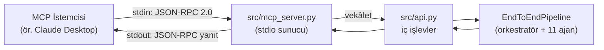
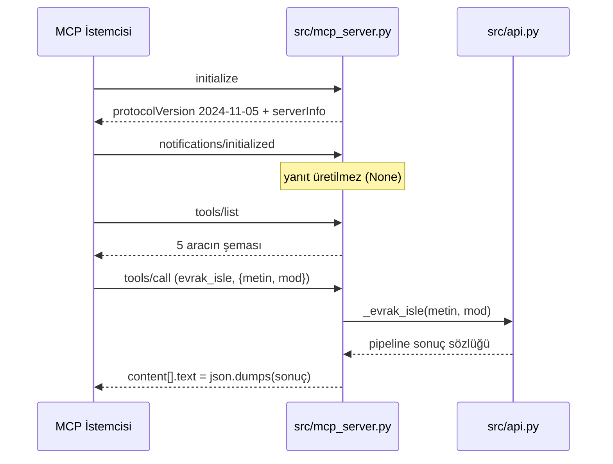

# MCP Sunucusu 🔌

Bu sayfa, projenin **Model Context Protocol (MCP)** sunucusunu — yani `src/mcp_server.py` içinde çalışan, harici SDK gerektirmeyen, stdio üzerinden JSON-RPC 2.0 konuşan aracı katmanı — anlatır. MCP sunucusu, 11 ajanlı evrak zekâsını Claude Desktop gibi bir MCP istemcisinin doğrudan çağırabileceği **5 araca** dönüştürür.

> [!NOTE]
> **TL;DR**
> - `src/mcp_server.py`, **stdio JSON-RPC 2.0** sunucusudur; stdin'den satır satır istek okur, stdout'a yanıt yazar.
> - **Harici `mcp` SDK'sine ihtiyaç yoktur** — tamamen Python standart kütüphanesiyle yazılmıştır, ağ dinlemez.
> - **5 araç** sunar: `evrak_isle`, `evrak_anonimlestir`, `birimleri_listele`, `evrak_turlerini_listele`, `sistem_sagligi` — hepsi `src/api.py` iç işlevlerine **vekâlet** eder.
> - Çalıştırma: `python -m src.mcp_server`.
> - Protokol sürümü `2024-11-05`, sunucu adı `kamu-evrak-akilli-ajan`, sürüm `0.4.0`.
> - Offline-first korunur: MCP katmanı çekirdek mimariye **hiçbir bağımlılık eklemez**; LLM olmadan da çalışır.

---

## 🧭 MCP Nedir ve Neden?

**Model Context Protocol (MCP)**, bir dil modeli istemcisinin (host) dış araçlara, veri kaynaklarına ve yeteneklere standart bir arayüz üzerinden erişmesini sağlayan açık bir protokoldür. İstemci, sunucunun sunduğu araçları keşfeder (`tools/list`), argümanlarla çağırır (`tools/call`) ve sonucu yapılandırılmış biçimde alır.

Bu projede MCP'nin rolü nettir: evrak zekâsını **bir araç olarak** dışa açmak. Bir kamu görevlisi Claude Desktop gibi bir MCP istemcisinde çalışırken, evrağı sisteme yapıştırıp "bunu işle, birime yönlendir, KVKK nüshasını üret" diyebilir; istemci arka planda bu MCP sunucusundaki araçları çağırır ve sonucu doğal dil bağlamına yerleştirir.

Tasarım hedefleri:

- **Sıfır ek bağımlılık.** MCP entegrasyonu, çekirdeğin offline-first felsefesini bozmaz; harici `mcp` paketi gerekmez.
- **Tek doğruluk kaynağı.** MCP araçları yeni iş mantığı yazmaz; [REST API](REST-API) katmanındaki iç işlevlere vekâlet eder. Böylece REST ve MCP birbirinden ayrışmaz, aynı davranışı üretir.
- **Sorumlu otomasyon.** `insan_onayi.gerekli` bayrağı ve KVKK-anonim varsayılanı yanıtlarda aynen korunur; karar bloklanmaz, insan-döngüde (human-in-the-loop) ilkesi sürer.

> [!IMPORTANT]
> MCP sunucusu bir **taşıma/adaptör** katmanıdır. Sınıflandırma, mevzuat eşleştirme, taslak üretimi ve anonimleştirme gibi tüm gerçek iş [Uzman Ajanlar](Uzman-Ajanlar) ve [Orkestratör](Orkestratör-ve-Koşullu-Kapılar) tarafından yapılır. MCP yalnızca bu yeteneği JSON-RPC üzerinden erişilebilir kılar.

---

## 🏗️ Mimari: Vekâlet Katmanı

MCP sunucusu, kendi başına bir pipeline kurmaz. Her araç çağrısı, `src/api.py` içindeki ilgili iç işleve iletilir; o işlev de paylaşılan `EndToEndPipeline` örneği üzerinden çalışır. Bu sayede [REST API](REST-API) ve MCP, aynı motoru paylaşan iki farklı kapıdır.



Katmanların sorumlulukları:

| Katman | Dosya | Sorumluluk |
|---|---|---|
| Taşıma | `src/mcp_server.py` | stdio okuma/yazma, JSON-RPC 2.0 çerçeveleme, araç→işlev eşlemesi, hata kodları |
| İş işlevleri | `src/api.py` | `_evrak_isle`, `_evrak_anonimlestir`, `_birim_katalogu`, `_evrak_turu_katalogu`, `_saglik_bilgisi` |
| Motor | `src/pipelines/end_to_end_pipeline.py` | Orkestratör sarmalayıcı; 11 ajanı koşullu akışta çalıştırır |

> [!NOTE]
> `EndToEndPipeline` dahili olarak paylaşılan `AgentState` tuttuğu için istekler `src/api.py` katmanında tek kilitle (`threading.Lock`) serileştirilir. MCP tarafı stdin'i satır satır sıralı işlediğinden, bu doğal olarak seri bir akıştır.

---

## 🛠️ 5 Araç ve İmzaları

Araçlar `src/mcp_server.py` içindeki `ARACLAR` sözlüğünde tanımlıdır. Her aracın adı, açıklaması ve `inputSchema`'sı `tools/list` yanıtında istemciye bildirilir. Aşağıdaki tablo, doğrulanmış davranışları özetler.

| Araç adı | Girdi | Vekâlet ettiği işlev | Ne yapar |
|---|---|---|---|
| `evrak_isle` | `{ metin, mod? }` | `src/api.py` → `_evrak_isle` | Tam uçtan uca hattı çalıştırır; sonuç sözlüğünü döndürür |
| `evrak_anonimlestir` | `{ metin }` | `src/api.py` → `_evrak_anonimlestir` | Yalnızca bilgi çıkarımı + anonimleştirme çalıştırır; maskeli nüsha + rapor |
| `birimleri_listele` | `{}` | `src/api.py` → `_birim_katalogu` | Yönlendirme birimleri kataloğunu döndürür |
| `evrak_turlerini_listele` | `{}` | `src/api.py` → `_evrak_turu_katalogu` | Desteklenen evrak türleri kataloğunu döndürür |
| `sistem_sagligi` | `{}` | `src/api.py` → `_saglik_bilgisi` | Durum, sürüm, LLM backend ve ajan sayısı |

### `evrak_isle`

Sistemin ana aracı. Evrak metnini alıp [Sistem Mimarisi](Sistem-Mimarisi) sayfasında anlatılan koşullu akıştan geçirir: OCR (doğrudan metinde atlanır) → sınıflandırma → bilgi çıkarımı → eksik bilgi → mevzuat → triage → özet → anonimleştirme → (Türkçe ise) taslak → yönlendirme → kullanıcı bilgilendirme.

- **`mod`** parametresi üç değer alır: `full` (varsayılan, her iki görev), `classify` (yalnızca Görev 1 — okuma/analiz), `draft` (taslak odaklı). Bu değerler `src/api.py` içindeki `_GECERLI_MODLAR = (full, classify, draft)` ile birebir eşleşir.
- Yanıt, orkestratörün derlediği tam sonuç sözlüğüdür (`siniflandirma`, `bilgi_cikarim`, `mevzuat_eslestirme`, `ozet`, `yazi_taslagi`, `yonlendirme`, `onceliklendirme`, `anonimlestirme`, `insan_onayi` vb.).
- **`insan_onayi.gerekli`** bayrağı korunur: düşük güven, boş metin veya gizlilik dereceli kaynak durumunda istemciye "insan kontrolü önerilir" sinyali aynen iletilir.

> [!NOTE]
> `evrak_isle` çıktısındaki koşullu kapılar (okunabilirlik / dil / düşük güven) [Orkestratör ve Koşullu Kapılar](Orkestratör-ve-Koşullu-Kapılar) sayfasında ayrıntılıdır. Örneğin metin anlamlı içerik taşımıyorsa (30 anlamlı karakter altı) analiz/taslak adımları atlanır ve insan onayı işaretlenir; bu davranış MCP yanıtında da aynen görünür.

### `evrak_anonimlestir`

Tam pipeline yerine yalnızca `info_extraction` + `anonimlestirme` ajanlarını çalıştırır. [KVKK ve Anonimleştirme](KVKK-ve-Anonimleştirme) sayfasında anlatılan 9 kategorili format-koruyan maskelemeyi uygular ve `{ anonim_metin, rapor }` döndürür. Bu uç orkestratörü atladığından, girdi merkezî `_MAX_GIRDI_KARAKTER` sınırıyla (200.000 karakter) ayrıca kırpılır; sınır orchestrator'dan içe aktarılır.

### Katalog araçları ve sağlık

- `birimleri_listele` ve `evrak_turlerini_listele`, LLM olmadan da çalışan salt-okunur kataloglardır; istemcinin geçerli birim kodlarını ve evrak türlerini önceden bilmesini sağlar.
- `sistem_sagligi`, `/saglik` REST ucuyla aynı bilgiyi verir: durum, sürüm, aktif `llm_backend` ve `ajan_sayisi` (canlı olarak `len(orchestrator.agents)`).

---

## ▶️ Nasıl Çalıştırılır?

MCP sunucusu bir modül olarak başlatılır. Ağ portu açmaz; stdin/stdout üzerinden konuşur.

```bash
# Depo kökünde, sanal ortam etkinken
python -m src.mcp_server
```

Sunucu başladıktan sonra stdin'den JSON-RPC istekleri bekler. Elle denemek için tek satırlık bir isteği borulayabilirsiniz:

```bash
echo '{"jsonrpc":"2.0","id":1,"method":"initialize","params":{}}' | python -m src.mcp_server
```

> [!NOTE]
> Kurulum ön koşulları (Python sürümü, çekirdek `requirements.txt`) [Kurulum ve Yapılandırma](Kurulum-ve-Yapılandırma) sayfasında anlatılır. MCP için ek paket gerekmez; çekirdek kurulum yeterlidir.

---

## 🔁 Protokol Akışı ve Yöntemler

Sunucu, JSON-RPC 2.0 yaşam döngüsünün temel yöntemlerini işler:



Yöntem davranışları:

| Yöntem | Davranış |
|---|---|
| `initialize` | `protocolVersion: 2024-11-05` ve `serverInfo: { name: kamu-evrak-akilli-ajan, version: 0.4.0 }` döner |
| `notifications/initialized` | Bildirimdir; yanıt üretmez (`None`) |
| `tools/list` | 5 aracın adı, açıklaması ve `inputSchema`'sını döner |
| `tools/call` | İlgili araca vekâlet eder; sonucu `content[].text` içinde `json.dumps` ile döner |

### JSON-RPC Hata Kodları

Sunucu, standart JSON-RPC hata kodlarını kullanır ve iç ayrıntı sızdırmaz:

| Kod | Anlam |
|---|---|
| `-32601` | Bilinmeyen yöntem |
| `-32602` | Geçersiz parametre (`ValueError` — ör. eksik/boş metin, geçersiz `mod`) |
| `-32603` | İç hata (ham istisna/stack trace **sızdırılmaz**; ayrıntılar yalnızca sunucu tarafında kalır) |

> [!WARNING]
> Yanıtlarda ham istisna mesajları ve yığın izleri istemciye gönderilmez. Bu, [Anayasal İlkeler ve Etik](Anayasal-İlkeler-ve-Etik) sayfasındaki "zarardan kaçınma" ve bilgi sızıntısını önleme ilkeleriyle uyumludur.

---

## 📨 Örnek İstek / Yanıt

### 1) Araçları listele

**İstek:**

```json
{ "jsonrpc": "2.0", "id": 2, "method": "tools/list", "params": {} }
```

**Yanıt (kısaltılmış):**

```json
{
  "jsonrpc": "2.0",
  "id": 2,
  "result": {
    "tools": [
      { "name": "evrak_isle", "description": "..." },
      { "name": "evrak_anonimlestir", "description": "..." },
      { "name": "birimleri_listele", "description": "..." },
      { "name": "evrak_turlerini_listele", "description": "..." },
      { "name": "sistem_sagligi", "description": "..." }
    ]
  }
}
```

### 2) Evrak işle

**İstek:**

```json
{
  "jsonrpc": "2.0",
  "id": 3,
  "method": "tools/call",
  "params": {
    "name": "evrak_isle",
    "arguments": {
      "metin": "Sayın Yazı İşleri Müdürlüğü, ... talep ederim.",
      "mod": "full"
    }
  }
}
```

**Yanıt (kısaltılmış — sonuç `content[].text` içinde JSON dizesidir):**

```json
{
  "jsonrpc": "2.0",
  "id": 3,
  "result": {
    "content": [
      {
        "type": "text",
        "text": "{\"siniflandirma\": {\"tur\": \"dilekce\"}, \"yonlendirme\": {\"birim\": \"yazi_isleri\"}, \"insan_onayi\": {\"gerekli\": false}}"
      }
    ]
  }
}
```

> [!NOTE]
> `content[].text` içeriği, orkestratörün ürettiği sonuç sözlüğünün `json.dumps`'lu tam halidir. İstemci bu metni ayrıştırıp alanları kullanabilir. Yukarıdaki değerler yalnızca yanıt biçimini göstermek içindir; ölçülmüş metrik değildir ve gerçek çıktı girdiye göre değişir.

---

## 🔗 Bir MCP İstemcisine Bağlama (Örnek: Claude Desktop)

MCP istemcileri, stdio tabanlı sunucuları bir komut + argüman ikilisiyle başlatacak biçimde yapılandırılır. Aşağıda temsili bir istemci yapılandırması gösterilmiştir; alan adları istemciye göre değişebilir, mantık aynıdır.

```json
{
  "mcpServers": {
    "kamu-evrak-akilli-ajan": {
      "command": "python",
      "args": ["-m", "src.mcp_server"],
      "cwd": "/depo/koku/mutlak/yolu"
    }
  }
}
```

Bağlama adımları:

- [ ] Depoyu klonlayıp çekirdek bağımlılıkları kurun (bkz. [Kurulum ve Yapılandırma](Kurulum-ve-Yapılandırma)).
- [ ] `python -m src.mcp_server` komutunun depo kökünde hatasız başladığını doğrulayın.
- [ ] İstemci yapılandırmasında `command`, `args` ve çalışma dizinini (`cwd`) depo köküne ayarlayın.
- [ ] İstemciyi yeniden başlatın; araç listesinde 5 aracın (`evrak_isle`, `evrak_anonimlestir`, `birimleri_listele`, `evrak_turlerini_listele`, `sistem_sagligi`) göründüğünü doğrulayın.
- [ ] Bir örnek evrakla `evrak_isle`'yi çağırıp yanıtı inceleyin.

> [!IMPORTANT]
> Evrak metnini işlerken gizlilik/KVKK garantisi istiyorsanız, ortamı **tam offline** kilitleyin: `APP_OFFLINE=1`. Bu durumda hiçbir metin dış/yerel LLM'e gönderilmez ve sistem tümüyle kural tabanlı çalışır. Ayrıntı için [Model Bilgileri ve LLM Ekosistemi](Model-Bilgileri) ve [Kurulum ve Yapılandırma](Kurulum-ve-Yapılandırma).

---

## 📄 `docs/mcp_vizyonu.md` — Vizyondan Gerçekleştirmeye

Proje deposunda `docs/mcp_vizyonu.md` belgesi, MCP entegrasyonunun **vizyonunu ve iskeletini** ortaya koyar: 5 aracın şema taslağı, REST → MCP eşlemesi ve ürünleşme yol haritası. Belge başında dürüstlük gereği "çalışan MCP sunucusu iddia edilmez, bu bir vizyon/iskelettir" beyanı yer alır.

Bu beyan, belgenin yazıldığı andaki durumu yansıtır. **Sonradan** `src/mcp_server.py` çalışan bir sunucu olarak eklenmiştir. Dolayısıyla belge ile kod arasındaki fark bir çelişki değil, bir **gerçekleştirme kaydıdır**: vizyon olarak konumlanan MCP katmanı, çalışan bir stdio sunucusuna dönüştürülmüştür.

> [!NOTE]
> Bu tür belge-kod farklarını şeffaf raporlamak, projenin [Anayasal İlkeler ve Etik](Anayasal-İlkeler-ve-Etik) çerçevesindeki "nesnellik ve şeffaflık" ilkesinin bir gereğidir. Jüri, hem vizyon belgesini hem çalışan sunucuyu bir arada görebilir.

---

## 🚀 Gelecek Yönü

MCP katmanı bilinçli olarak ince ve bağımlılıksız tutulmuştur; genişleme için sağlam bir temel sunar. Aşağıdaki yönler, mevcut mimariyi bozmadan ele alınabilecek doğal adımlardır (henüz uygulanmış özellikler olarak sunulmaz):

- **Araç kümesinin genişletilmesi.** Emsal/CBR sorgusu, mevzuat RAG araması ([Mevzuat RAG ve Hibrit Arama](Mevzuat-RAG-ve-Hibrit-Arama)) veya triage/önceliklendirme ([Triage ve Akıllı Önceliklendirme](Triage-ve-Önceliklendirme)) gibi işlevler ayrı MCP araçları olarak dışa açılabilir.
- **MCP kaynakları (resources) ve komut istemleri (prompts).** Mevzuat korpusu veya birim kataloğu, MCP `resources` olarak; standart yazı şablonları MCP `prompts` olarak sunulabilir.
- **EBYS entegrasyon senaryoları.** MCP, kurumsal bir EBYS'nin evrak zekâsını çağırdığı köprü olarak konumlanabilir; REST ile MCP'nin aynı iç işlevlere vekâlet etmesi bu geçişi kolaylaştırır.
- **Sürüm ve yetenek pazarlığı.** `initialize` yanıtındaki yetenek bildirimi, ileride araç güncellemeleri ve sürüm uyumluluğu için genişletilebilir.

Kritik teslim takvimi (ön değerlendirme sunumu 12 Temmuz 2026, final Ağustos 2026) ve genel plan için [Yol Haritası](Yol-Haritası) sayfasına bakınız.

---

## İlgili Sayfalar

- [REST API](REST-API) — MCP'nin vekâlet ettiği `src/api.py` uç noktaları, istek/yanıt şemaları
- [Web Arayüzü — Evrak Zekâ](Web-Arayüzü) — Aynı çekirdeğe bağlanan diğer arayüz katmanı
- [Sistem Mimarisi](Sistem-Mimarisi) — 11 ajan, `AgentState` ve uçtan uca akış
- [KVKK ve Anonimleştirme](KVKK-ve-Anonimleştirme) — `evrak_anonimlestir` aracının arkasındaki maskeleme
- [Komut Satırı (CLI) ve Demo](Komut-Satırı-ve-Demo) — `python -m` ile çalışan diğer giriş noktaları
- [Model Bilgileri ve LLM Ekosistemi](Model-Bilgileri) — `llm_backend` seçimi ve `APP_OFFLINE` kilidi
