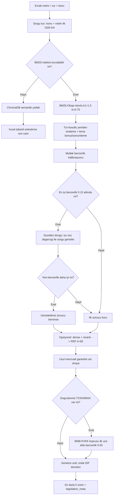

# Mevzuat RAG ve Hibrit Arama 📚

Bu sayfa, evrak içeriğine göre **ilgili mevzuat, yönetmelik ve standart yazışma kurallarını madde-referanslı ve gerekçeli biçimde öneren** hibrit RAG (Retrieval-Augmented Generation) alt sistemini anlatır. Çekirdek katman saf Python **BM25-Okapi**'dir (bağımlılıksız, offline); üzerine isteğe bağlı semantik ve yeniden sıralama (rerank) katmanları eklenebilir.

> [!NOTE]
> **TL;DR** — Mevzuat eşleştirmesi tamamen **offline-first** çalışır: harici kütüphane olmadan saf Python BM25-Okapi (k1=1.5, b=0.75) ile geri getirme yapılır. Öneriler **tür-koşullu yeniden sıralama** ile hukuki gerçekliğe göre ağırlıklandırılır; ilk benzerlik **0.15** eşiğinin altındaysa **düzeltici (corrective) sorgu genişletme döngüsü** bir kez tetiklenir. Benzerlik **mutlak** ölçekte raporlanır (göreli normalizasyon bilinçle terk edildi) — bu, zayıf eşleşmenin `1.0`'a şişirilip **yanlış mevzuat alıntısına** yol açmasını engeller. İsteğe bağlı semantik katman `turkish-e5-large` + `bge-reranker-v2-m3` ile **RRF (Reciprocal Rank Fusion, k=60)** birleşimi sunar; hepsi varsayılan kapalıdır. Ayrıca kurumsal hafıza üzerinde **emsal-tabanlı akıl yürütme (CBR)** öneri katmanı vardır. Ana dosya: `src/agents/legislation_agent.py`.

---

## 1. Amaç ve Konum

Görev 1 (okuma ve içerik analizi) kapsamında **Mevzuat (Legislation) ajanı**, sınıflandırma, bilgi çıkarımı ve eksik bilgi tespiti adımlarından sonra — ve triage'dan **önce** — çalışır. Gelen evrakın türüne, konusuna ve içeriğine bakarak hangi mevzuat hükümlerinin ve resmî yazışma kurallarının uygulanabilir olduğunu önerir. Bu sıralama önemlidir: triage ajanı yasal süre kanıtı için `legislation_matches` çıktısını kullanır, dolayısıyla mevzuat eşleştirmesi triage'dan önce tamamlanmalıdır.

Mevzuat çıktısı hem kullanıcı bilgilendirmesinde gösterilir hem de [Görev 2 — Taslaklama ve Yönlendirme](Görev-2-Taslak-ve-Yönlendirme) adımında **taslağın yasal dayanak atfını** temellemek için kullanılır.

Alt sistemin temel ilkesi, [Anayasal İlkeler ve Etik](Anayasal-İlkeler-ve-Etik) sayfasında da vurgulanan **halüsinasyon yasağıdır**: sistem asla var olmayan bir mevzuata veya maddeye atıf üretmez; öneriler yalnızca gerçek korpustaki belgelerden ve gözlenen sinyallerden kurulur.

| Özellik | Değer |
|---|---|
| Ana ajan | `LegislationAgent` (`src/agents/legislation_agent.py`) |
| Çekirdek geri getirme | Saf Python BM25-Okapi (`src/utils/bm25.py`) |
| Korpus | `data/raw/mevzuat_metinleri/` altındaki `*.txt` dosyaları (görev tanımına göre 15 belgelik korpus) |
| Çıktı (state) | `legislation_matches` (en fazla 5 öneri) + `legislation_meta` |
| Offline çalışma | Evet — opsiyonel katmanların hiçbiri yoksa davranış salt BM25 ile korunur |
| Emsal/CBR | `src/utils/emsal.py` + `src/utils/emsal_cbr.py` (advisory) |

> [!IMPORTANT]
> Korpustaki belge sayısı kodda sabit tutulmaz — korpus, dizindeki tüm `*.txt` dosyalarından **dinamik** yüklenir. Görev tanımı ve [Veri Setleri](Veri-Setleri) sayfası korpusu "15 belgelik mevzuat korpusu" olarak tanımlar; sayı, korpus dizininin içeriğinden gelir.

---

## 2. Girdi ve Çıktı Sözleşmesi

**Girdi** (`AgentState` üzerinden):

- `classification.tur` — evrak türü (tür-koşullu yeniden sıralama için)
- `extracted_info.konu` — çıkarılan konu (sorgu zenginleştirme)
- `raw_text` — ham evrak metni (ilk `SORGU_METIN_LIMITI = 1500` karakter sorguya dahil edilir)
- Opsiyonel `tc_kimlik` / `iban` — doğrulanmış PII varlığı KVKK köprüsü için sinyaldir

**Çıktı** — `state.legislation_matches`: en fazla 5 öneri; her öneri şu alanları taşır:

```json
{
  "doc_id": "resmi_yazisma_yonetmeligi",
  "baslik": "Resmî Yazışmalarda Usul ve Esaslar Hakkında Yönetmelik",
  "mevzuat_adi": "...",
  "bolum": "...",
  "madde_no": "16",
  "madde_etiketi": "m.16",
  "icerik_ozeti": "... (azami 300 karakter)",
  "benzerlik": 0.82,
  "kaynak": "...",
  "anahtar_kelimeler": ["..."],
  "gerekce": "Ortak terimler: ...; tür önceliği: ...",
  "zayif_esleme": false,
  "eklenme_nedeni": "kvkk_veri_sinyali"
}
```

Ek olarak `state.legislation_meta`: `{yontem, duzeltme_dongusu, kvkk_veri_sinyali}` — hangi yolun (BM25 / hibrit / kural tabanlı) kullanıldığını ve düzeltici döngünün tetiklenip tetiklenmediğini raporlar.

---

## 3. Çekirdek: Saf Python BM25-Okapi

Geri getirme çekirdeği, harici bağımlılık olmadan `src/utils/bm25.py` içinde uygulanmış **BM25-Okapi** sıralama fonksiyonudur. Klasik olasılıksal (probabilistic) geri getirme ailesinin Okapi BM25 varyantına dayanır ve tamamen stdlib ile çalışır.

### 3.1 Formül

Bir sorgu terimi `t` için IDF (ters belge frekansı), negatif olmayan varyantla hesaplanır:

```
IDF(t) = log( (N - df + 0.5) / (df + 0.5) + 1 )
```

Belge skoru, terim frekansı doygunluğu ve belge uzunluğu normalizasyonuyla:

```
skor(D, Q) = Σ_t  IDF(t) · ( tf · (k1 + 1) ) / ( tf + norm )
norm       = k1 · ( 1 - b + b · dl / avgdl )
```

Burada:

| Parametre | Değer | Anlam |
|---|---|---|
| `k1` | **1.5** | Terim frekansı doygunluk parametresi |
| `b` | **0.75** | Belge uzunluğu normalizasyon parametresi |
| token min uzunluk | **2** | 2 karakterden kısa token'lar elenir |
| `dl` / `avgdl` | — | Belge uzunluğu / ortalama belge uzunluğu |

`k1` terim tekrarının katkısını doyuma bağlar (bir terimin çok geçmesi skoru sınırsız artırmaz); `b` uzun belgelerin haksız avantajını dengeler. Türkçe token'laştırma küçük harfe çevirir, durak kelimeleri çıkarır ve 2+ karakterlik token'ları tutar.

### 3.2 Korpus Yükleme ve Chunk'lama

Korpus `data/raw/mevzuat_metinleri/` altındaki `*.txt` dosyalarından yüklenir. Her dosya bir başlık bloğuna ve `## ` ile başlayan bölümlere ayrılır; **her bölüm bir chunk** olur ve madde numaraları üst veriye işlenir. Korpus ve BM25 indeksi **sınıf düzeyinde önbelleklenir** — tüm `LegislationAgent` örnekleri paylaşır, böylece her evrakta yeniden inşa maliyeti oluşmaz.

---

## 4. Mutlak Benzerlik Kalibrasyonu

Bu, alt sistemin en kritik dürüstlük kararlarından biridir.

> [!WARNING]
> **Göreli normalizasyon (skor / en_iyi_skor) bilinçle terk edilmiştir.** Göreli normalizasyon, hiçbir güçlü eşleşme olmasa bile en iyi adayı `1.0`'a şişirir ve sistem, alakasız bir mevzuatı "tam isabet" gibi sunarak **yanlış hukuki alıntı** yapardı. Bu etik bir risktir.

Bunun yerine benzerlik, **mutlak bir doygunluk noktasına** oranlanır:

```
benzerlik = min( 1, agirlikli_skor / (DOYGUNLUK_KATSAYISI · toplam_idf) )
```

- `DOYGUNLUK_KATSAYISI = 1.5`
- `toplam_idf` = sorgunun benzersiz sözcüklerinin IDF kütlesi

Böylece raporlanan benzerlik **daima BM25 doygunluk ölçeğinde** kalır; tam benzerlik ancak merkezî/tekrarlı sözcük kullanımıyla yaklaşılır. RRF veya rerank yalnızca **sırayı** belirler, raporlanan benzerlik değerini değiştirmez.

### Şeffaflık: Zayıf Eşleşme İşareti

En iyi benzerlik `ZAYIF_ESLESME_ESIGI = 0.5` değerinin altındaysa, tüm sonuçlar `zayif_esleme = True` olarak işaretlenir. Bu, kullanıcıya ve [Güven ve Ölçüm Katmanı](Güven-ve-Ölçüm-Katmanı)'na "bu öneriler ihtiyatla değerlendirilmeli" sinyali verir.

---

## 5. Tür-Koşullu ve Tema-Koşullu Yeniden Sıralama

Ham BM25 skoru, evrak türünün hukuki gerçekliğine göre ağırlıklandırılır. `TUR_MEVZUAT_AGIRLIKLARI` tablosu, belirli türlerin belirli mevzuatlarla ilişkisini kodlar.

| Örnek | Ağırlık | Gerekçe |
|---|---|---|
| dilekce → 3071 s. Dilekçe Hakkı Kanunu | 1.4 | Dilekçe türünü doğrudan düzenleyen kanun |
| cevap_yazisi → resmi_yazisma | 1.2 | Resmî cevap yazısının biçim kaynağı |

### Tema Aktivasyonu

`MEVZUAT_TEMALARI` **9 tema** tanımlar: personel/657, ihale/4734, mali/5018, kişisel_veri/6698, yargı/2577, arşiv, kabahat/5326, belediye/5393, imar/3194. Bir alan mevzuatı yalnızca teması **aktif** olduğunda güçlendirilir:

- Aktif temada: `TEMA_BONUSU = 1.3` ile çarpılır
- Aktif değilse: `ALAN_DISI_SONUMLEME = 0.7` ile sönümlenir (tesadüfi sözcük çakışmasını bastırır)

Tema aktivasyonu iki koşulludur (tekil çakışmayı tesadüf sayar):

- **En az 2 farklı tetikleyici kök** (`TEMA_ASGARI_TETIKLEYICI = 2`), **VEYA**
- **Tek kökün en az 3 farklı çekim biçimi** (`TEMA_MERKEZI_BICIM = 3`)

---

## 6. Düzeltici (Corrective) Sorgu Genişletme Döngüsü 🔁

Bir "güvenlik ağı" mekanizmasıdır. İlk en-iyi benzerlik `DUZELTME_ESIGI = 0.15` değerinin altındaysa ve türe ait genişletme terimi varsa, sorgu **bir kez** tür söz dağarcığıyla genişletilir. Yeni benzerlik **yalnızca ilkinden büyükse benimsenir** — döngü asla kaliteyi düşürmez.

> [!NOTE]
> Düzeltici tetik (**0.15**), zayıf-eşleşme işareti (**0.5**) ile bilinçli olarak **ayrı ve daha aşağı** tutulmuştur. İşaret şeffaflık içindir; tetik ise yalnızca gerçek söz dağarcığı uyuşmazlığında devreye girer. Bu eşik, held-out kullanılmadan **35 evraklık geliştirme setinde** kalibre edilmiştir; [Değerlendirme ve Metrikler](Değerlendirme-ve-Metrikler) disiplini gereği bu ayrım açıkça belgelenir.

Bu tasarım, literatürdeki Corrective RAG yaklaşımından (Singh vd. 2025, arXiv:2501.09136; Li vd. 2025, arXiv:2507.09477) esinlenir.

---

## 7. Garanti Katmanları: Usul Mevzuatı ve KVKK Köprüsü

BM25 sözcük çakışmasına dayanır; ancak bazı hukuki gerçekler sözcük çakışmasından bağımsız olarak **her zaman** geçerlidir. Bu yüzden iki garanti mekanizması vardır.

### 7.1 Usul Mevzuatı Garantisi

Türü **düzenleyen** mevzuat, sözcük çakışmasından bağımsız olarak önerilerin başına alınır:

- Yazışma türlerinde → Resmî Yazışmalarda Usul ve Esaslar Hakkında Yönetmelik
- Dilekçede → 3071 sayılı Dilekçe Hakkı Kanunu

Bu öneriler **en az 0.8 benzerlikle** raporlanır ve zayıf-eşleşme işareti kaldırılır.

### 7.2 KVKK Köprüsü

[Bilgi Çıkarımı](Görev-1-Okuma-ve-Analiz) adımında **doğrulanmış bir TCKN veya IBAN** saptanırsa, 6698 sayılı KVKK önerisi sözcüksel eşleşme olmadan ilk üçe eklenir (`eklenme_nedeni = kvkk_veri_sinyali`).

> [!IMPORTANT]
> KVKK önerisinin benzerliği bilinçle `KVKK_SINYAL_BENZERLIK = 0.55` olarak tutulur — bu, taslak yazımının yasal dayanak atıf eşiği olan **0.6'nın altındadır**. Böylece öneri şeffafça işaretlenir ama taslağa zorla alıntı olarak **girmez**. Detay: [KVKK ve Anonimleştirme](KVKK-ve-Anonimleştirme).

---

## 8. İsteğe Bağlı Semantik Katman ve RRF Birleşimi

Offline çekirdeğin üzerine, kütüphaneler kuruluysa ve ayar açıksa iki opsiyonel katman eklenebilir (`src/utils/semantik_arama.py`). Her ikisi de **varsayılan kapalıdır** (`EMBEDDING_SEMANTIK_AKTIF=False`, `EMBEDDING_RERANK_AKTIF=False`; [Kurulum ve Yapılandırma](Kurulum-ve-Yapılandırma)).

| Katman | Model | Yöntem |
|---|---|---|
| Yoğun (dense) arama | `ytu-ce-cosmos/turkish-e5-large` | Kosinüs benzerliği; Instruct/Query önekli sorgu, öneksiz pasaj, `normalize_embeddings=True` |
| Yeniden sıralama | `BAAI/bge-reranker-v2-m3` | CrossEncoder; logit → sigmoid |

BM25 ve dense listeler varsayılan olarak **Reciprocal Rank Fusion (RRF)** ile birleştirilir:

```
RRF_skor(d) = Σ_liste  1 / (k + rank_liste(d))
```

- `k = 60` (alan standardı; Cormack vd. 2009)
- `HIBRIT_RRF_AKTIF = True` — RRF kapatılırsa dışbükey `puan_birlestir`'e düşülür (`HIBRIT_BM25_AGIRLIK = 0.6`, kalan 0.4 semantiğe)
- Aday havuzu: `ADAY_HAVUZU = 10`

Modeller ve lisanslar [Model Bilgileri](Model-Bilgileri) sayfasında sabit revizyonlarıyla belgelidir. Rapor edilen benzerlik daima mutlak BM25 doygunluk ölçeğinde kalır; RRF/rerank yalnızca sırayı belirler.

---

## 9. RAG Hattı Diyagramı



---

## 10. Halüsinasyon-Atıf Önlemi

Alt sistem, [Anayasal İlkeler ve Etik](Anayasal-İlkeler-ve-Etik)'in "emin olunmayan bilgi üretilmez" ilkesini üç mekanizmayla uygular:

- [x] **Gerekçe yalnızca gözlenen sinyallerden kurulur** — ortak IDF terimleri (en yüksek `GEREKCE_TERIM_SAYISI = 3` terim), tür önceliği, aktif tema, düzeltme döngüsü. Uydurma açıklama üretilmez.
- [x] **Madde referansları regex ile birebir çıkarılır** — `\bm\.\s*(\d{1,3})(?:-(\d{1,3}))?` deseniyle; kanun numarası atıfları (ör. "3071 sayılı") madde sayılmaz çünkü `m.` öneki zorunludur. En fazla 3 haneli madde numaraları yakalanır.
- [x] **Mutlak benzerlik + zayıf eşleşme işareti** — alakasız öneriler `1.0`'a şişmez ve şeffafça işaretlenir; taslak ajanı da `MEVZUAT_ATIF_ESIGI = 0.6` altındaki eşleşmeleri yasal dayanak atfı olarak kullanmaz.

Bu önlemler [Görev 2](Görev-2-Taslak-ve-Yönlendirme)'deki **mevzuat temellilik (groundedness)** denetimiyle bütünleşir: taslaktaki her atıf öneri listesiyle eşleştirilir; listede olmayan atıf halüsinasyon işareti sayılır. Çapraz doğrulama detayları [Güven ve Ölçüm Katmanı](Güven-ve-Ölçüm-Katmanı)'ndadır.

---

## 11. Emsal-Tabanlı Akıl Yürütme (CBR)

Mevzuat önerisine paralel olarak, kurumsal hafıza (kayıt defteri) üzerinde **emsal arama** ve **Case-Based Reasoning** öneri katmanı çalışır.

### 11.1 Emsal Arama (`src/utils/emsal.py`)

Kayıt defterindeki geçmiş evraklar üzerinde BM25 ile benzer geçmiş evrak aranır. Birkaç kayıtlık küçük bir defterde standart IDF yozlaştığı için **küçük korpus IDF yumuşatması** uygulanır:

```
idf(t)       = ln( 1 + (N + 1) / (df + 0.5) )
OOV agirligi = ln( 1 + (N + 1) / 0.5 )
```

- `ASGARI_BENZERLIK = 0.05` — altındakiler gürültü sayılıp elenir
- Azami sonuç: `_AZAMI_LIMIT = 20`; varsayılan limit **3** (1–20 aralığına kırpılır)
- Kendini eleme + kaynak tekilleştirme uygulanır

### 11.2 CBR Önerisi (`src/utils/emsal_cbr.py`)

Emsallerden çoğunluk tür/birim önselini (`Counter.most_common`) ve mevcut kararla çelişki uyarısını üretir.

> [!NOTE]
> CBR **ADVISORY**'dir: kararı asla ezmez, yalnızca öneri + çelişki uyarısı üretir. Boş defterde etkisizdir (`None` döner). Bu tasarım, [Orkestratör ve Koşullu Kapılar](Orkestratör-ve-Koşullu-Kapılar)'ın düşük güvende insan onayı öneren yaklaşımıyla uyumludur.

Literatür temeli: Aamodt & Plaza (1994), Park vd. (2023).

---

## 12. Zarif Bozulma ve Fallback Zinciri

Offline-first ilkesi gereği, opsiyonel her katman yoksa sistem birebir BM25 davranışını korur. Fallback zinciri:

1. **Hibrit BM25** (çekirdek) →
2. **Düzeltici döngü** (gerekirse) →
3. BM25 indeksi kurulamadıysa **ChromaDB semantik** yedek (benzerlik = 1 − kosinüs uzaklık) →
4. Son çare **kural tabanlı eşleştirme** (tür eşleşmesinde 0.8, genel 0.3 benzerlik)

Opsiyonel katmanlar (semantik, rerank, ChromaDB) kütüphane yok / ayar kapalı / model indirilemedi durumunda **zarifçe devre dışı** kalır. `sentence_transformers` kurulu değilse hibrit katman sessizce salt BM25'e döner.

---

## 13. Eşik ve Sabit Özeti

| Sabit | Değer | Dosya |
|---|---|---|
| `k1` / `b` | 1.5 / 0.75 | `src/utils/bm25.py` |
| `DOYGUNLUK_KATSAYISI` | 1.5 | `src/agents/legislation_agent.py` |
| `ZAYIF_ESLESME_ESIGI` | 0.5 | `src/agents/legislation_agent.py` |
| `DUZELTME_ESIGI` | 0.15 | `src/agents/legislation_agent.py` |
| `TEMA_BONUSU` / `ALAN_DISI_SONUMLEME` | 1.3 / 0.7 | `src/agents/legislation_agent.py` |
| `HIBRIT_BM25_AGIRLIK` | 0.6 | `src/agents/legislation_agent.py` |
| `HIBRIT_RRF_AKTIF` | True | `src/agents/legislation_agent.py` |
| RRF `k` | 60 | `src/utils/semantik_arama.py` |
| `ADAY_HAVUZU` | 10 | `src/agents/legislation_agent.py` |
| `GEREKCE_TERIM_SAYISI` | 3 | `src/agents/legislation_agent.py` |
| `SORGU_METIN_LIMITI` | 1500 | `src/agents/legislation_agent.py` |
| `OZET_LIMITI` | 300 | `src/agents/legislation_agent.py` |
| `KVKK_SINYAL_BENZERLIK` | 0.55 | `src/agents/legislation_agent.py` |
| `MEVZUAT_ATIF_ESIGI` (taslak) | 0.6 | (yorum referansı) |
| Usul mevzuatı taban benzerlik | 0.8 | `src/agents/legislation_agent.py` |
| `ASGARI_BENZERLIK` (emsal) | 0.05 | `src/utils/emsal.py` |
| emsal limit varsayılan | 3 | `src/utils/emsal.py` |

---

## 14. Değerlendirme: Mevzuat İsabet@3

Mevzuat önerisi, [Değerlendirme ve Metrikler](Değerlendirme-ve-Metrikler) sayfasında **isabet@3 (hit-rate@3)** ile ölçülür: etikette belirtilen beklenen `doc_id`'lerden en az biri ilk 3 öneride var mı? Metrik yalnızca `mevzuat_beklenen` etiketi **boş olmayan** evraklar üzerinden hesaplanır; etiketsiz evraklar metriğe katılmaz (etiketli evrak yoksa `isabet_orani = None` döner, `0.0` ile karışmaz).

Doğrulanmış ölçümler (git commit `08616ff`, offline mod; kaynak `scripts/evaluate.py`):

| Set | Mevzuat isabet@3 |
|---|---|
| geliştirme / kurgu_evraklar (52) | 0.962 |
| adversarial-temiz v4 (16) | 0.938 |

Ayrıca isabet@1, MRR@k ve nDCG@k (Järvelin & Käkäläinen 2002) ile RAGAS-tarzı context precision/recall@k da raporlanır.

> [!NOTE]
> **Standart Dosya Planı (SDP)** bilinçli olarak retrieval korpusuna alınmaz: SDP korpusa eklendiğinde geliştirme setinde mevzuat isabet@3 **0.962'den 0.923'e** düştüğü ölçüldüğü için SDP yalnızca referans belge olarak tutulur. Bu, ölçüme dayalı bir tasarım kararıdır.

> [!NOTE]
> `mevzuat_beklenen` etiketleri **sistem çıktısına bakılmadan**, içerik + hukuki rehberle atanmış ve bağımsız ikinci gözden geçirmeyle onaylanmıştır (dosya bazlı gerekçeler `data/raw/mevzuat_beklenen_gerekceleri.json`). Usul-katmanı etiketleri sistemin tür-öncelik kuralıyla aynı hukuki gerçeklikten türediğinden isabet@3 kısmen iyimser olabilir; metrik bir **regresyon siperi** ve genelleme ölçüsü olarak okunmalıdır. Bu şeffaflık notu [Veri Setleri](Veri-Setleri) sayfasında da yer alır.

---

## 15. İlgili Sayfalar

- [Görev 1 — Okuma, Sınıflandırma ve İçerik Analizi](Görev-1-Okuma-ve-Analiz) — mevzuat ajanına sorgu besleyen sınıflandırma ve bilgi çıkarımı
- [Görev 2 — Taslaklama ve Birim Yönlendirme](Görev-2-Taslak-ve-Yönlendirme) — mevzuat temellilik ve yasal dayanak atfı
- [Güven ve Ölçüm Katmanı](Güven-ve-Ölçüm-Katmanı) — çapraz tutarlılık, konformal ve kalibrasyon
- [Değerlendirme ve Metrikler](Değerlendirme-ve-Metrikler) — isabet@3, MRR/nDCG ve held-out disiplini
- [KVKK ve Anonimleştirme](KVKK-ve-Anonimleştirme) — 6698 köprüsünü tetikleyen PII sinyalleri
- [Sistem Mimarisi](Sistem-Mimarisi) — 11 ajanın iş birliği ve veri akışı
