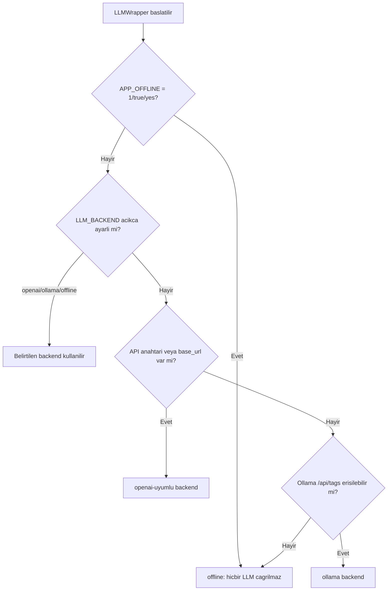

# Model Bilgileri ve LLM Ekosistemi 🧠

Bu sayfa, sistemin isteğe bağlı (opsiyonel) büyük dil modeli (LLM) katmanını, model-agnostik entegrasyon mimarisini, desteklenen backend'leri ve semantik/yeniden-sıralama modellerini lisans ve sürüm bilgileriyle birlikte belgeler. Temel ilke tektir: **çekirdek sistem hiçbir model olmadan tam işlevlidir; modeller yalnızca kaliteyi artıran isteğe bağlı katmanlardır.**

> [!NOTE]
> **TL;DR**
> - Sistem **offline-first**'tür: 11 uzman ajan + orkestratör, hiçbir LLM olmadan uçtan uca çalışır. LLM yalnızca **düşük güvenli** kararlarda devreye giren opsiyonel bir iyileştirme katmanıdır.
> - LLM katmanı **model-agnostiktir**: `src/models/llm_wrapper.py` tek bir arayüzle üç backend'i destekler — **OpenAI-uyumlu API**, yerel **Ollama** ve **offline** (LLM yok).
> - Tüm HTTP çağrıları **harici SDK olmadan** yalnızca standart kütüphane (`urllib`) ile yapılır. **Eğitim/ince-ayar yoktur** (yalnızca çıkarım / inference-only).
> - **Depoya hiçbir model ağırlığı yüklenmez.** Üçüncü taraf modeller yalnızca bağlantı + sürüm + lisans + kullanım talimatıyla `docs/model_bilgileri.md` içinde dokümante edilir (TEKNOFEST şartname m.7).
> - Opsiyonel RAG modelleri (`turkish-e5-large`, `bge-reranker-v2-m3`, ChromaDB gömme) **varsayılan kapalıdır**; açılması bilinçli bir yapılandırma kararıdır.

---

## 1. Tasarım Felsefesi: Model Zorunlu Değil

Bu proje, bir "LLM uygulaması" değil, **hibrit bir karar sistemidir**. Çekirdek zekâ kural tabanlı ve istatistiksel bileşenlerde (ağırlıklı skorlama, saf-Python Multinomial Naive Bayes, BM25-Okapi, regex çıkarımı) yaşar. LLM, bu çekirdeğin üzerine oturan ve yalnızca belirli koşullarda çağrılan bir **danışman** rolündedir.

Bu tercih üç somut gerekçeye dayanır:

- **KVKK ve yerel kurulum** — Kamu evrakı hassas veri içerir. Sistemin internete veya harici bir servise ihtiyaç duymadan çalışabilmesi, verinin kurum sınırları içinde kalmasını garanti eder.
- **İnternet/servis kesintisine dayanıklılık** — Değerlendirme ve demo, hiçbir dış bağımlılık olmadan tekrarlanabilir olmalıdır. Doğrulanmış metriklerimizin tamamı **offline backend** (LLM kullanılamıyor) koşulunda ölçülmüştür.
- **Şartname uyumu** — Ücretli servis/API kullanımı yasaktır; sistem yerel/on-prem çalışabilmelidir.

> [!IMPORTANT]
> LLM'in ne zaman ve nasıl devreye girdiği, [Orkestratör ve Koşullu Kapılar](Orkestratör-ve-Koşullu-Kapılar) sayfasında ayrıntılı anlatılır. Özetle: sınıflandırma güveni **0.6** eşiğinin altına düşerse LLM eskalasyonu denenir; yönlendirmede skorlar birbirine çok yakınsa (fark < %15) LLM ayrıştırması (tiebreak) çağrılır. Her iki durumda da LLM erişilemezse kural tabanlı sonuç **aynen korunur**.

LLM'in çağrıldığı üç mimari nokta ve her birinin güvenlik ağı:

| Çağrı noktası | Tetikleyici | LLM yoksa davranış |
|---|---|---|
| Sınıflandırma eskalasyonu | Nihai güven < `0.6` | Kural + istatistiksel ensemble sonucu korunur |
| Yönlendirme ayrıştırması | En iyi/ikinci skor farkı < `%15` | Kural tabanlı yönlendirme korunur |
| Üretken taslak/özet | `full`/`draft` modu ve metin okunabilir | Kural tabanlı şablon/extractive özet üretilir |

Sınıflandırma eskalasyonunda ayrıca isteğe bağlı **öz-tutarlılık (self-consistency)** desteği vardır: varsayılan tek çağrıdır, birden çok örnekleme açılırsa çoğunluk oyu ile kalibre güven üretilir.

---

## 2. Model-Agnostik LLM Katmanı (`llm_wrapper`)

Tüm LLM erişimi tek bir modül üzerinden geçer: `src/models/llm_wrapper.py`. Bu katman, farklı sağlayıcıları tek bir soyutlama altında birleştirir ve harici bir SDK bağımlılığı getirmez.

| Özellik | Değer / Davranış |
|---|---|
| Bağımlılık | Yalnızca stdlib `urllib` — harici `openai`/`ollama` SDK'si **yok** |
| Ana sınıf | `LLMWrapper` (`generate`, `generate_json`) |
| Paylaşılan örnek | `get_default_llm()` — modül düzeyinde singleton (tekrarlı backend tespitini önler) |
| İstisna | `LLMUnavailableError` — kullanılabilir backend yoksa |
| Eğitim | Yok — yalnızca hazır API'lere prompt gönderen **inference-only** wrapper |

### 2.1 `generate` ve `generate_json`

- `generate(prompt, system_prompt=..., json_mode=...)` → düz metin (`str`) döndürür. Backend yoksa `LLMUnavailableError` fırlatır.
- `generate_json(prompt, schema_hint=...)` → ayrıştırılmış `dict` döndürür. **Şema-kısıtlı çözümleme (constrained decoding)** tetiklenir: OpenAI'de `response_format={"type": "json_object"}`, Ollama'da `format=json`. Bozuk JSON durumunda **varsayılan 2 deneme** yapılır; toleranslı ayrıştırma (kod bloğu soyma → doğrudan parse → ilk `{...}` bloğu regex) uygulanır; tüm denemeler başarısızsa `ValueError` fırlatılır.

### 2.2 Güvenlik Sınırları

LLM katmanı, dolaylı prompt injection'a karşı çok katmanlı savunma içerir (OWASP LLM01):

- **`belge_blogu(...)`** — Evrak metnini "yalnızca veri" sınırlayıcılarıyla sarar ve içine gömülü sınırlayıcı token'ları nötrler. Ajanlar evrak metnini prompt'a bu fonksiyonla gömer.
- **`GUVENLIK_SISTEM_EKI`** — Sistem prompt'una eklenen, evrak metnini talimat değil veri sayan güvenlik uyarısı sabiti.
- **`_guvenli_http_url(...)`** — URL şemasını yalnızca `http`/`https` ile kısıtlar (CWE-22/B310); `file:`/`ftp:` gibi şemaları reddeder.
- Karar alanları (sınıflandırma türü, yönlendirme birimi) her zaman **kapalı listelerle** (enum/allowlist) doğrulanır; böylece belgeye gömülü bir talimat kararı değiştiremez.

Ek olarak, her ajan evrak metnini prompt'a gömerken `belge_blogu(...)` ile bir karakter üst sınırı uygular; bu hem kaynak tüketimini hem de enjeksiyon yüzeyini sınırlar:

| Ajan | Prompt'a gömülen azami metin |
|---|---|
| Sınıflandırma | 3.000 karakter |
| Bilgi çıkarımı | 3.000 karakter |
| Özetleme | 4.000 karakter |
| Yönlendirme (tiebreak) | 2.000 karakter |

> [!WARNING]
> Otomatik olarak `openai` backend seçildiğinde bir uyarı loglanır: evrak metni dış API'ye gidebilir. **Tam çevrimdışı garanti için `APP_OFFLINE=1` ortam değişkeni kullanılmalıdır** — bu katı kilit, başıboş bir `OPENAI_API_KEY` bulunsa bile hiçbir dış/yerel LLM'e gidilmesini engeller ve maskesiz PII'nin dışarı sızmasını önler. `APP_OFFLINE` için kabul edilen değerler: `1`, `true`, `yes`.

---

## 3. Desteklenen Backend'ler ve Otomatik Tespit

`_detect_backend` metodu, kullanılabilir backend'i belirli bir öncelik sırasıyla belirler. Açık yapılandırma her zaman otomatik tespiti geçersiz kılar.



Öncelik sırası özetle: **`APP_OFFLINE` katı kilidi → açık `LLM_BACKEND` → API anahtarı/`base_url` → Ollama erişilebilirlik yoklaması → offline.**

### 3.1 OpenAI-Uyumlu Backend

- Uç nokta: `/chat/completions`
- Varsayılan kök adres: `https://api.openai.com/v1` (yapılandırılabilir `base_url` ile herhangi bir OpenAI-uyumlu servise yönlendirilebilir)
- Varsayılan model: **`gpt-4o-mini`**
- `json_mode` → `response_format={"type": "json_object"}`

### 3.2 Ollama Backend (Yerel)

- Uç nokta: `/api/chat`; erişilebilirlik yoklaması `/api/tags` (2 sn timeout)
- Varsayılan taban adres: `http://localhost:11434`
- Varsayılan model: **`qwen2.5:7b`** (Qwen2.5 7B Instruct)
- `json_mode` → `format=json`

### 3.3 Offline Backend

- Hiçbir LLM çağrısı yapılmaz. Tüm ajanlar kural tabanlı/istatistiksel yollarına **zarifçe düşer**. Doğrulanmış metriklerin ölçüldüğü moddur.

### 3.4 Yapılandırma Sabitleri

Ayarlar `src/config.py` (pydantic-settings) üzerinden ortam değişkenlerinden okunur:

| Ayar | Varsayılan | Anlam |
|---|---|---|
| `LLM temperature` | `0.1` | Üretim sıcaklığı (düşük, deterministiğe yakın) |
| `LLM max_tokens` | `4096` | Azami üretim token sayısı |
| `LLM timeout_seconds` | `90` | Çağrı zaman aşımı (saniye) |
| `EMBEDDING_SEMANTIK_AKTIF` | `False` | Yoğun (dense) semantik RAG katmanı — varsayılan kapalı |
| `EMBEDDING_RERANK_AKTIF` | `False` | Yeniden sıralama (rerank) katmanı — varsayılan kapalı |
| `AppSettings port` | `8501` | Uygulama/Streamlit varsayılan portu |

Backend seçimi ve `.env` ayrıntıları için [Kurulum ve Yapılandırma](Kurulum-ve-Yapılandırma) sayfasına bakınız.

---

## 4. Opsiyonel Modeller Tablosu

Aşağıdaki modellerin **hiçbiri depoya dahil değildir**; yalnızca kullanıcı bilinçli olarak etkinleştirirse ve ilgili kütüphane (`sentence_transformers` vb.) kuruluysa indirilir ve kullanılır. Hepsi **varsayılan kapalıdır**.

| Model | Rol | Lisans | Yaklaşık Boyut | Sürüm/Commit | Varsayılan |
|---|---|---|---|---|---|
| `gpt-4o-mini` (OpenAI-uyumlu) | LLM eskalasyon / üretken taslak-özet | Sağlayıcı koşulları | — (API) | — | Kapalı (API anahtarı gerekir) |
| Qwen2.5 7B Instruct (`qwen2.5:7b`, Ollama) | Yerel LLM eskalasyonu | Apache 2.0 | 7B | — | Kapalı (yerel Ollama gerekir) |
| `turkish-e5-large` | Semantik (dense) mevzuat araması | MIT | ~560M | commit `02e2362` | Kapalı (`EMBEDDING_SEMANTIK_AKTIF=1`) |
| `bge-reranker-v2-m3` | Yeniden sıralama (cross-encoder rerank) | Apache 2.0 | ~568M | commit `953dc6f` | Kapalı (`EMBEDDING_RERANK_AKTIF=1`) |
| `all-MiniLM-L6-v2` (ChromaDB varsayılanı) | Yedek vektör deposu gömme | Apache 2.0 | küçük | — | Kapalı (yalnızca ChromaDB yolu) |

> [!NOTE]
> Model ağırlıklarının depoya konmaması bir **şartname zorunluluğudur** (m.7) ve aynı zamanda **tedarik zinciri güvenliği** açısından tercih edilir: modeller `safetensors` biçiminde, sabit revizyon (commit) ile ve mümkünse sha256 doğrulamasıyla indirilir. Yukarıdaki commit hash'leri bu amaçla sabitlenmiştir.

---

## 5. Semantik Arama ve Reranker Modelleri

Mevzuat RAG'in çekirdeği saf Python **BM25-Okapi**'dir ve hiçbir model gerektirmez. İki opsiyonel katman, açıldığında **yalnızca sıralamayı** iyileştirir; raporlanan benzerlik skoru daima BM25 mutlak doygunluk ölçeğinde kalır.

- **`turkish-e5-large`** (`src/utils/semantik_arama.py` → `SemantikArama`) — Sorgu tarafına `Instruct/Query` öneki, pasaj tarafına öneksiz kodlama uygulanır, `normalize_embeddings=True` ile kosinüs benzerliği üretir. BM25 ve dense listeler varsayılan olarak **Reciprocal Rank Fusion (RRF, k=60)** ile birleştirilir; RRF kapatılırsa dışbükey puan birleştirmeye (BM25 ağırlığı `0.6`) düşülür.
- **`bge-reranker-v2-m3`** (`YenidenSiralayici`) — Aday havuzunu cross-encoder ile yeniden sıralar (logit → sigmoid). Aday havuzu boyutu 10'dur.

Her iki katman da kütüphane yoksa, ayar kapalıysa veya model indirilemezse **zarifçe devre dışı kalır** ve davranış saf BM25 ile birebir korunur. Ayrıntı için [Mevzuat RAG ve Hibrit Arama](Mevzuat-RAG-ve-Hibrit-Arama) sayfasına bakınız.

> [!IMPORTANT]
> Semantik/rerank modelleri **YER (lokasyon) NER veya kişisel-veri işleme için kullanılmaz.** Türkçe yer varlığı çıkarımı 81 il gazetteer'i ile tamamen kural tabanlıdır ([KVKK ve Anonimleştirme](KVKK-ve-Anonimleştirme) ve [Görev 1 — Okuma, Sınıflandırma ve İçerik Analizi](Görev-1-Okuma-ve-Analiz)); depoya hiçbir NER model ağırlığı konmaz.

---

## 6. Model Kartı (`docs/model_karti.md`)

Sistem, Mitchell vd. (2019) **Model Cards** biçiminde bir model kartı ile belgelenir. Kartın özet başlıkları:

- **Sistem tanımı** — 11 uzman ajan + saf Python orkestratör; offline-first hibrit mimari.
- **Amaçlanan kullanım** — Kamu evrak ve yazışma süreçlerinde sınıflandırma, içerik analizi, taslak üretimi ve birim yönlendirme; karar-destek (insan-döngüde) aracı olarak. Ölçülmemiş bir metrik gerçekmiş gibi sunulmaz.
- **Değerlendirme** — Etiketli sentetik setler üzerinde ölçülen metrikler; held-out disiplini korunur.
- **Sınırlılıklar** — Sentetik veriyle geliştirilmiştir; küçük örneklem (n=16) held-out setlerde güven aralıkları geniştir; OCR maliyeti düz metin ölçümünde temsil edilmez.
- **Etik ve adalet** — Kararların kimlikten bağımsızlığı karşı-olgusal değişmezlik testiyle doğrulanır; kapsamlı toplumsal yanlılık denetimi iddia edilmez.

Sürüm bilgisi: **0.4.0**. Telif: **AGENTRA TECH**. Lisans: **Apache 2.0**.

Değerlendirme rakamları ve metodolojisi için [Değerlendirme ve Metrikler](Değerlendirme-ve-Metrikler); etik çerçeve için [Anayasal İlkeler ve Etik](Anayasal-İlkeler-ve-Etik) sayfalarına bakınız.

---

## 7. Sık Karşılaşılan Yapılandırma Senaryoları

```bash
# 1) Tam çevrimdışı (önerilen, KVKK güvencesi) — hiçbir dış/yerel LLM çağrılmaz
export APP_OFFLINE=1

# 2) Yerel Ollama ile LLM eskalasyonu (veri kurum içinde kalır)
export LLM_BACKEND=ollama
# Ollama http://localhost:11434 üzerinde qwen2.5:7b çalışır olmalı

# 3) OpenAI-uyumlu API (evrak metni dış servise gidebilir — dikkat)
export LLM_BACKEND=openai
export OPENAI_API_KEY=...   # veya OpenAI-uyumlu bir base_url

# 4) Semantik + reranker katmanlarını aç (sentence_transformers gerekir)
export EMBEDDING_SEMANTIK_AKTIF=1
export EMBEDDING_RERANK_AKTIF=1
```

> [!NOTE]
> Bu değişkenlerin hiçbiri **zorunlu değildir.** Hiçbir ayar yapılmazsa sistem, Ollama'yı yoklar ve erişilemezse offline moda düşer; bu, tekrarlanabilir değerlendirme için en tutarlı davranıştır.

---

## 8. Depo Politikası Özeti

- ✅ **Model ağırlığı depoya yüklenmez** — yalnızca bağlantı + sürüm + lisans + kullanım talimatı dokümante edilir.
- ✅ **Eğitim/ince-ayar yoktur** — sistem yalnızca hazır API'lere çıkarım için prompt gönderir; kodda hiçbir eğitim/fine-tune yolu bulunmaz.
- ✅ **Harici LLM SDK'sı yoktur** — tüm HTTP çağrıları stdlib `urllib` ile yapılır; çekirdek bağımlılık listesi minimaldir.
- ✅ **Tüm opsiyonel modeller varsayılan kapalıdır** — açmak bilinçli bir karardır ve çekirdek offline-first davranışı bozmaz.
- ✅ **Lisans uyumu** — kullanılan tüm modeller izin verici lisanslıdır (Apache 2.0 / MIT) veya sağlayıcı koşullarına tabidir; depo Apache 2.0'dır.

---

## İlgili Sayfalar

- [Kurulum ve Yapılandırma](Kurulum-ve-Yapılandırma) — Çekirdek/opsiyonel bağımlılıklar, `.env`, LLM backend seçimi ve `config.py`
- [Mevzuat RAG ve Hibrit Arama](Mevzuat-RAG-ve-Hibrit-Arama) — BM25 çekirdek, semantik + reranker katmanlarının kullanımı
- [Orkestratör ve Koşullu Kapılar](Orkestratör-ve-Koşullu-Kapılar) — LLM eskalasyonunun tetiklendiği düşük-güven kapısı
- [Anayasal İlkeler ve Etik](Anayasal-İlkeler-ve-Etik) — KVKK, adillik beyanı ve model şeffaflığı
- [Değerlendirme ve Metrikler](Değerlendirme-ve-Metrikler) — Offline modda ölçülen doğrulanmış metrikler
- [Sık Sorulan Sorular (SSS)](Sık-Sorulan-Sorular) — "LLM olmadan çalışır mı?", "Verim dışarı çıkar mı?" gibi sorular
