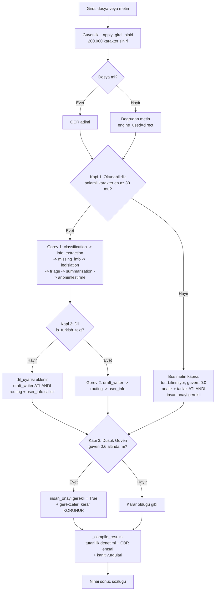

# Orkestratör ve Koşullu Kapılar

`OrchestratorAgent`, 11 uzman ajanı framework kullanmadan saf Python ile koordine eden merkezî yöneticidir. Girdiyi (dosya → OCR veya doğrudan metin) alır, Görev 1 ve Görev 2 bloklarını **düz sıralı bir zincir değil, üç koşullu kapıyla dallanan** bir akışla çalıştırır, her adımı süre/durum olarak ölçer ve tüm sonuçları tek bir sözlükte derler.

> [!NOTE]
> **TL;DR** — Orkestratör, ajanları sabit sırayla yükler ama koşullu çalıştırır. Üç kapı akışı yönetir: **(1) okunabilirlik kapısı** (anlamlı karakter < 30 → analiz/taslak atlanır), **(2) dil kapısı** (metin Türkçe değilse taslak üretimi atlanır, analiz devam eder), **(3) düşük güven kapısı** (sınıflandırma veya yönlendirme güveni < 0.6 → *insan onayı gerekli* işareti). Kapılar kararı **bloklamaz**; düşük güvende karar korunur, insan onayı önerilir. Güvenlik için tüm girdi tek merkezde 200.000 karaktere kırpılır; istisnalar yakalanır ve akış çökmeden derlenir (zarif düşüş). `EndToEndPipeline`, orkestratörü sarmalayıp toplam işlem süresini ve isteğe bağlı SQLite denetim izini ekler.

İlgili genel çerçeve için [Sistem Mimarisi](Sistem-Mimarisi) ve ajan envanteri için [Uzman Ajanlar](Uzman-Ajanlar) sayfalarına bakınız.

---

## Orkestratörün Rolü

Orkestratör tek başına bir "ajan" değil; ajanları çalıştıran bir **iş akışı motorudur**. Temel sorumlulukları:

- Ajanları sabit sırayla yükler (`_load_agents`).
- Paylaşılan bir durum nesnesini (`AgentState`) ajanlar arasında aktarır.
- Koşullu akışı (`_run_workflow`) yürütür ve üç kapıyı uygular.
- Her adımı `time.perf_counter` ile ölçer, durumunu (`success` / `error` / `atlandi`) kaydeder.
- Sınıflandırma ve yönlendirme güvenlerini izler (`confidence_trace`).
- Tüm ajan çıktılarını izlenebilirlik meta bilgisiyle tek sözlükte derler (`_compile_results`).

Ana kaynak: `src/agents/orchestrator.py`. Sarmalayıcı hat: `src/pipelines/end_to_end_pipeline.py`.

### Giriş noktaları

| Metot | Davranış |
|---|---|
| `process(input_file, mode, on_step)` | Dosya yolu üzerinden çalışır; önce **OCR** adımı yürütülür (`src/agents/ocr_agent.py`). |
| `process_text(text, mode, source_name, on_step)` | Doğrudan metin; OCR atlanır, `ocr_result` `engine_used="direct"` ile doldurulur. |

`mode` değerleri: `full` (Görev 1 + Görev 2), `classify` (yalnız Görev 1 analiz bloğu), `draft` (taslak odaklı Görev 2). `on_step` isteğe bağlı bir **canlı akış (streaming)** geri-çağırımıdır; her adım tamamlanınca çağrılır ve hatası akışı asla bozmaz.

> [!IMPORTANT]
> Güvenlik sınırı tek merkezde (`_apply_girdi_siniri`) uygulanır çünkü hem dosya hem doğrudan metin yolu buradan geçer. `raw_text` **200.000 karakteri** aşarsa kırpılır ve `girdi_kirpildi` uyarısı eklenir (CWE-400 / OWASP LLM04 kaynak tüketimi savunması).

---

## AgentState — Paylaşılan Durum

`AgentState`, bir `@dataclass` olarak ajanlar arası paylaşılan durumu taşır; her adımda güncellenir ve bir sonraki ajana aktarılır. Alanları beş grupta toplanır:

| Grup | Alanlar (özet) |
|---|---|
| Giriş | `input_file`, `raw_text` |
| Görev 1 | `ocr_result`, `classification`, `extracted_info`, `missing_info`, `legislation_matches`, `legislation_meta`, `summary`, `summary_body` |
| Yenilik | `anonymized_text`, `anonymization_report`, `triage` |
| Görev 2 | `draft_text`, `draft_type`, `format_validation`, `draft_quality`, `routing_suggestion`, `user_notifications`, `clarification_requests` |
| Meta | `errors`, `processing_steps`, `confidence_trace`, `workflow_warnings`, `human_review_required`, `human_review_reasons` |

`workflow_warnings` öğe şeması `{kod, baslik, mesaj, seviye}` biçimindedir; [Kullanıcı Bilgilendirme ajanı](Görev-2-Taslak-ve-Yönlendirme) bu uyarıları kullanıcıya yönelik bildirimlere dönüştürür.

---

## Çalışma Döngüsü ve Ajan Sırası

Ajanlar `_load_agents` ile **sabit sırayla** yüklenir: `ocr, classification, info_extraction, missing_info, legislation, summarization, draft_writer, routing, user_info, triage, anonimlestirme`. Ancak *yükleme sırası ile çalışma sırası aynı değildir*; çalışma sırasını `_run_workflow` belirler ve kapılar bazı adımları atlar.

### Görev 1 (metin okunabilirse)

`classification → info_extraction → missing_info → legislation → triage → summarization → anonimlestirme`

> [!NOTE]
> Dikkat: **triage, summarization'dan önce** çalışır. [Triage ajanı](Triage-ve-Önceliklendirme) `classification`, `extracted_info` ve `legislation_matches` çıktılarına bağımlı olduğundan bu adımlardan sonra ama özetlemeden önce konumlanır.

### Görev 2 (`mode` full/draft)

- Metin **okunabilir ve Türkçe** ise → `draft_writer` çalışır.
- Metin okunabilir ama **Türkçe değil** ise → `draft_writer` "evrak dili Türkçe görünmüyor" gerekçesiyle **atlanır** (Kapı 2).
- Metin okunabilir ise → `routing` çalışır.
- Her durumda son olarak → `user_info` çalışır.

---

## Koşullu Akış Diyagramı



---

## Kapı 1 — Okunabilirlik Kapısı

**Amaç:** İçeriği anlamsız/boş girdinin analiz ve taslak adımlarını gereksiz çalıştırmasını önlemek ve uydurma çıktı üretimini engellemek.

| Öğe | Değer |
|---|---|
| Eşik sabiti | `_MIN_ANLAMLI_KARAKTER = 30` |
| Anlamlı karakter tanımı | Harf veya rakam (`ch.isalnum()`); boşluk/noktalama sayılmaz |
| Kontrol | `_metin_okunabilir_mi` / `_uygula_bos_metin_kapisi` |
| Dosya | `src/agents/orchestrator.py` |

**Tetiklenirse:**

- `classification` → `{tur: "bilinmiyor", tur_adi: "Bilinmiyor", guven: 0.0, yontem: "kural_tabanli"}`
- İlgili analiz ve taslak adımları `atlandi` olarak kaydedilir (`sure_saniye = 0.0`, neden bilgisiyle).
- `bos_metin` uyarısı eklenir ve **insan onayı işareti** konur.

> [!NOTE]
> OCR katmanı ayrıca görüntü girdilerinde bir **"4. kapı sinyali"** üretir: `ocr_kalite` telemetrisi (`ortalama_guven`, `dusuk_guven_orani`, `kalite`, `insan_onayi_onerilir`). Bu, düşük kaliteli tarama için yeniden-OCR/insan onayına yönlendiren bir sinyaldir; orkestratörün üç kapısından ayrı, OCR'a özgü bir kalite göstergesidir. Yalnızca görüntü girdilerinde ve Tesseract motorunda hesaplanır. Ayrıntı: [Görev 1 — Okuma ve Analiz](Görev-1-Okuma-ve-Analiz).

---

## Kapı 2 — Dil Kapısı

**Amaç:** Türkçe olmayan bir evrağa Resmî Yazışma Yönetmeliği'ne uygun Türkçe taslak yazmaya kalkışmamak; ama sınıflandırma/analiz gibi dilden nispeten bağımsız işleri yine de yürütmek.

| Öğe | Değer |
|---|---|
| Kontrol | `is_turkish_text(raw_text)` (bkz. `src/utils/turkish_nlp.py`) |
| Tetik | `is_turkish_text` `False` dönerse |
| Sonuç | `dil_uyarisi` eklenir, **taslak üretimi (draft_writer) atlanır** |
| Devam eden | Sınıflandırma, içerik analizi ve yönlendirme çalışmaya devam eder |
| Kontrol metodu | `_metin_turkce_mi` |

`is_turkish_text` **OR mantığıyla** çalışır: Türkçe'ye özgü harf oranı ≥ 0.01 **VEYA** ayırt edici durak kelime oranı ≥ 0.05 ise metin Türkçe sayılır; 20 harften kısa metinlerde Türkçe varsayılır (engelleyici olmamak için). Bu tasarım aksansız Türkçe metni de yakalar.

---

## Kapı 3 — Düşük Güven Kapısı (HITL)

**Amaç:** Offline modda LLM eskalasyonu çalışamayacağından, güvenin düşük olduğu kararlarda **insan kontrolünü** (Human-in-the-Loop) zorunlu kılmak. Kapı kararı bloklamaz; yalnızca `insan_onayi.gerekli = True` işaretini ve gerekçeleri ekler.

| Öğe | Değer |
|---|---|
| Eşik sabiti | `_INSAN_ONAYI_GUVEN_ESIGI = 0.6` |
| Değerlendirme | `_degerlendir_siniflandirma_guveni` (3a) / `_degerlendir_yonlendirme_guveni` (3b) |
| Koşul | Güven `None` değil **ve** eşiğin altında |

**Kapı 3a — Sınıflandırma güveni < 0.6:** İnsan onayı işareti + uyarı; `classification.tum_skorlar` içinden en yüksek skorlu **2 tür adayı** (`_tur_adaylari`) gösterilir.

**Kapı 3b — Yönlendirme güveni < 0.6:** İnsan onayı işareti + uyarı; önerilen birim ve en fazla **3 alternatif** birim (`alternatifler[:3]`) gösterilir.

> [!IMPORTANT]
> `0.6` değeri, sınıflandırma ajanının **LLM eskalasyon eşiğiyle aynıdır**. Ancak orkestratör LLM eskalasyonunu doğrudan **yapmaz**: düşük güvende eskalasyon [Sınıflandırma ajanının içinde](Görev-1-Okuma-ve-Analiz) gerçekleşir. Orkestratör yalnızca güven izleme kaydını (yöntem dâhil) tutar ve eşik altında insan onayı işaretler. Ayrıca [Draft Writer](Görev-2-Taslak-ve-Yönlendirme) gizlilik dereceli kaynak evrakta taslağı `human_review_required = True` yapar; bu da aynı insan onayı mekanizmasını besler.

Kalibrasyon, seçici tahmin (reject option) ve konformal kapsama gibi güven metriklerinin nasıl ölçüldüğü için [Güven ve Ölçüm Katmanı](Güven-ve-Ölçüm-Katmanı) sayfasına bakınız.

---

## Güven İzleme, Adım Süreleri ve Ölçüm

### Güven izleme (`confidence_trace`)

Güven izleme **yalnızca** sınıflandırma ve yönlendirme adımlarında yapılır. `classification` kaydına ayrıca `yontem` alanı eklenir (`kural_tabanli` / `hibrit_ensemble` / `llm_eskalasyon`). `None` güven kaydedilmez. Güven skorları izleme kaydına 3 ondalığa yuvarlanır (`round(..., 3)`).

### Adım ölçümü (`_run_step`)

Her adım `_run_step` içinde `time.perf_counter` ile ölçülür ve `processing_steps` listesine şu şemayla eklenir:

```json
{
  "agent": "classification",
  "description": "Evrak turu siniflandirmasi",
  "status": "success",
  "sure_saniye": 0.012
}
```

Hata olursa kayda `error` alanı eklenir; süreler 3 ondalık saniyeye yuvarlanır. Atlanan adımlar `status: "atlandi"` ve `sure_saniye: 0.0` ile kaydedilir. `on_step` geri-çağırımı adım tamamlanınca tetiklenir; onun hatası pipeline'ı bozmaz.

> [!NOTE]
> **Performans (doğrulanmış):** Geliştirme setinde evrak başına ortalama süre **0.2278 sn**, medyan **0.1355 sn**; diğer setlerde medyan yaklaşık 0.08–0.16 sn aralığındadır. Uçtan uca hat için pratik bant **evrak başına 0.1–0.5 sn**'dir. README rozetindeki ~88 evrak/sn ifadesi *sınıflandırma-hattı verimini* anlatır; iki ölçüm karıştırılmamalıdır. Ayrıntı: [Değerlendirme ve Metrikler](Değerlendirme-ve-Metrikler).

---

## Nihai Sonuç Derleme (`_compile_results`)

Akış tamamlanınca `_compile_results` üç **advisory / additive** (kararı ezmeyen, yalnızca ekleyen) analiz yürütür:

1. **Çapraz tutarlılık denetimi** (multi-agent verification): Çelişki bulursa insan onayı **önerir**, bloklamaz (bkz. `src/utils/tutarlilik_denetimi.py`).
2. **CBR emsal önerisi**: Düşük güvenli **ve** metin varsa kurumsal hafızadan (kayıt defteri) `emsal_ara` ile en fazla **3** benzer geçmiş evrak çekilir ve çoğunluk kararı önerilir. Boş defterde etkisizdir.
3. **Kanıt vurgu span'leri**: Kararı destekleyen kaynak metin parçaları birebir eşleşmeyle işaretlenir (grounded açıklanabilirlik; halüsinasyon yok).

Bu üç katman kararı değiştirmez; yalnızca insan onayı önerir veya açıklanabilirlik sağlar. CBR ve emsal ayrıntıları: [Mevzuat RAG ve Hibrit Arama](Mevzuat-RAG-ve-Hibrit-Arama).

### Nihai çıktı sözlüğü anahtarları

```json
{
  "input_file": "...",
  "ocr": { "...": "..." },
  "siniflandirma": { "...": "..." },
  "bilgi_cikarim": { "...": "..." },
  "eksik_bilgiler": [],
  "mevzuat_eslestirme": [],
  "mevzuat_arama_meta": { "...": "..." },
  "ozet": "...",
  "yazi_taslagi": "...",
  "yazi_turu": "...",
  "format_denetimi": { "...": "..." },
  "taslak_kalitesi": { "...": "..." },
  "yonlendirme": { "...": "..." },
  "bilgilendirmeler": [],
  "eksik_bilgi_talepleri": [],
  "onceliklendirme": { "...": "..." },
  "anonimlestirme": { "metin": "...", "rapor": { "...": "..." } },
  "guven_izleme": { "...": "..." },
  "tutarlilik_denetimi": { "...": "..." },
  "emsal_onerisi": { "...": "..." },
  "kanit_vurgulari": [],
  "islem_adimlari": [],
  "hatalar": [],
  "insan_onayi": { "gerekli": false, "gerekceler": [] }
}
```

> [!NOTE]
> Kapılar tetiklense de sonuç sözlüğünün **yapısı korunur**; ilgili alanlar boş kalır ama anahtar silinmez. Böylece tüketici arayüzler (Web, REST API, MCP) tutarlı bir sözleşmeyle çalışır.

---

## EndToEndPipeline Sarmalayıcısı

`EndToEndPipeline` (`src/pipelines/end_to_end_pipeline.py`), orkestratörü sarmalayan uçtan uca hattır:

- Orkestratör çıktısına `islem_suresi_saniye` anahtarını ekler (bu anahtar `_compile_results` içinde **yoktur**, pipeline tarafından eklenir).
- `process`, `process_text`, `process_batch` metotlarını sağlar.
- İsteğe bağlı **SQLite denetim izine** (kayıt defteri) sonucu yazar.

> [!WARNING]
> Kayıt defteri **varsayılan olarak KAPALIDIR** (`kayit_defteri_aktif = False`). Bunun nedeni, değerlendirme ve toplu ölçüm betiklerinin (`scripts/evaluate.py`, `scripts/benchmark.py`) denetim izine yan etki üretmemesidir. Denetim izi altyapısı için [Geliştirici Rehberi](Geliştirici-Rehberi) ve [Değerlendirme ve Metrikler](Değerlendirme-ve-Metrikler).

---

## Hata ve İstisna Toleransı

Orkestratör, Anayasal İlkeler'deki *zarardan kaçınma* ve *şeffaflık* ilkeleriyle uyumlu olarak **çökme yerine zarif düşüş** sergiler:

- İşlem sırasındaki istisnalar `_run_workflow` içinde `try/except` ile yakalanır, `errors` listesine eklenir ve akış yine `_compile_results` ile sonuç döndürür.
- OCR/görüntü ön-işleme ve LLM bağımlılıkları yoksa çekirdek TXT/MD ve kural tabanlı yol etkilenmez.
- `on_step` streaming geri-çağırımının hatası pipeline'ı asla bozmaz (sunum katmanı çekirdeği bozamaz).
- LLM backend model-agnostiktir: `config.py` içinde `backend=''` otomatik tespit yapar (`openai` / `ollama` / `offline`). Backend yoksa sistem tam işlevsel biçimde kural tabanlı (offline) çalışır. Otomatik seçimde OpenAI-uyumlu varsayılan model `gpt-4o-mini`, Ollama varsayılanı `qwen2.5:7b`'dir.

İlgili yapılandırma sabitleri (`src/config.py`): LLM `temperature=0.1`, `max_tokens=4096`, `timeout_seconds=90`; semantik/rerank katmanları varsayılan kapalı (`EMBEDDING_SEMANTIK_AKTIF=False`, `EMBEDDING_RERANK_AKTIF=False`); uygulama portu `8501`. Ayrıntı: [Kurulum ve Yapılandırma](Kurulum-ve-Yapılandırma).

---

## Özet: Kapıların Karşılaştırması

| Kapı | Tetik | Eşik | Sonuç | Karar bloklanır mı? |
|---|---|---|---|---|
| 1 — Okunabilirlik | Anlamlı karakter < eşik | `30` | Analiz + taslak atlanır; `tur=bilinmiyor`, insan onayı | Hayır (uydurma üretilmez) |
| 2 — Dil | Metin Türkçe değil | `is_turkish_text` | Taslak atlanır; analiz + yönlendirme devam | Hayır |
| 3 — Düşük güven | Sınıflandırma/yönlendirme güveni < eşik | `0.6` | `insan_onayi.gerekli = True` + gerekçeler | Hayır (öneri) |

Her üç kapı da ortak felsefeyi paylaşır: **karar hiçbir zaman sessizce bastırılmaz**; ya insan onayına yönlendirilir ya da açıkça atlanmış olarak kaydedilir. Bu, sorumlu otomasyon ve değerlendirme bütünlüğü için tasarlanmış bir güvenlik ağıdır.

---

## İlgili Sayfalar

- [Sistem Mimarisi](Sistem-Mimarisi) — Genel mimari, AgentState veri akışı ve ajan iş birliği
- [Uzman Ajanlar](Uzman-Ajanlar) — 11 ajanın genel bakış tablosu ve görev sayfaları
- [Görev 1 — Okuma ve Analiz](Görev-1-Okuma-ve-Analiz) — OCR, sınıflandırma, bilgi çıkarımı, eksik bilgi, özetleme
- [Görev 2 — Taslak ve Yönlendirme](Görev-2-Taslak-ve-Yönlendirme) — Taslak, format öz-denetimi, Reflexion, yönlendirme, bilgilendirme
- [Güven ve Ölçüm Katmanı](Güven-ve-Ölçüm-Katmanı) — Kalibrasyon, seçici tahmin, konformal, tutarlılık denetimi
- [Triage ve Önceliklendirme](Triage-ve-Önceliklendirme) — Aciliyet, yasal süre ve son işlem tarihi hesabı
