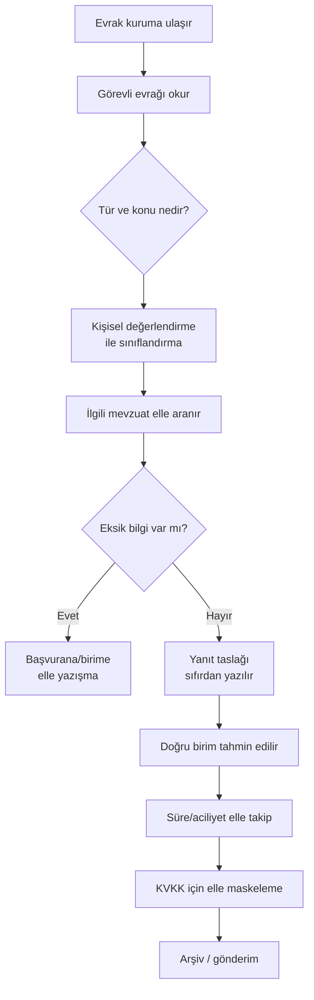
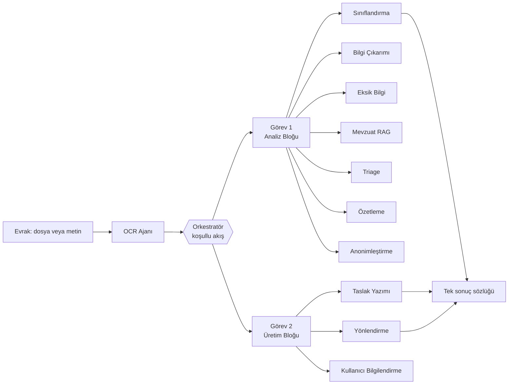

# Proje Hakkında

TEKNOFEST 2026 Yapay Zeka Dil Ajanları Yarışması 1. Senaryo için geliştirilen, kamu evrak ve yazışma süreçlerini uçtan uca otomatikleştiren **11 uzman ajan + orkestratör** mimarisine dayalı, tamamen çevrimdışı çalışabilen (offline-first) ve framework kullanmayan saf Python akıllı agent destek sistemidir.

> [!NOTE]
> **TL;DR** — Bu proje, bir kamu kurumuna gelen evrağı okur, 8 türden birine sınıflandırır, içeriğini analiz eder, eksik bilgileri tespit eder, ilgili mevzuatı önerir, önceliğini/yasal süresini hesaplar, KVKK için kişisel verileri maskeler; sonra Resmî Yazışma Yönetmeliği'ne uygun bir yanıt taslağı üretir ve evrağı doğru birime yönlendirir. Çekirdek **hiçbir LLM olmadan** tam işlevseldir; LLM yalnızca düşük güvenli durumlarda opsiyonel bir iyileştirme katmanıdır. Sistem [Görev 1](Görev-1-Okuma-ve-Analiz) (okuma/analiz) ve [Görev 2](Görev-2-Taslak-ve-Yönlendirme) (taslak/yönlendirme) bloklarını **koşullu bir akışla** yürütür.

---

## 🎯 Yarışma Senaryosu ve Amaç

Bu çalışma, **TEKNOFEST 2026 Yapay Zeka Dil Ajanları Yarışması**'nın **1. Senaryosu**na — "Kamu Evrak ve Yazışma Süreçleri için Akıllı Agent Destek Sistemi" — yanıt olarak geliştirilmiştir. Amaç, kamu kurumlarında yoğun emek gerektiren, çok adımlı ve süre baskısı altında yürüyen evrak işleme sürecini; doğru, dürüst, KVKK uyumlu ve mevzuat temelli bir yapay zekâ ajan hattıyla desteklemektir.

Senaryo iki zorunlu görevden oluşur ve değerlendirme **uçtan uca senaryolar** üzerinden yapılır:

- **Görev 1** — Gelen evrağı okuma, türüne göre sınıflandırma ve içeriğini analiz etme (bilgi çıkarımı, eksik bilgi tespiti, özetleme).
- **Görev 2** — Evrağa uygun resmî yazı taslağını hazırlama ve ilgili birime yönlendirme.

> [!IMPORTANT]
> İki görev de zorunludur. Tek görevi eksik bırakan bir sistem "tamamlanmış" sayılmaz; bu proje her iki görevi de tek bir koşullu akışta bütünleşik olarak çalıştırır. Görev bütünlüğü ve puanlama ekseninin ayrıntıları için bkz. [Şartname Uyum Matrisi](Şartname-Uyum-Matrisi) ve [Değerlendirme ve Metrikler](Değerlendirme-ve-Metrikler).

---

## 🩹 Problem: Kamu Evrak Sürecinin Acıları

Kamu evrak akışı elle yürütüldüğünde uzun, çok kişiye bağımlı ve hata payı yüksek bir zincire dönüşür. Aşağıdaki diyagram tipik bir **elle süreç** akışını gösterir; her kutu ayrı bir insan kararı ve zaman kaybı noktasıdır.

Bu zincirin başlıca acı noktaları:

| Acı Noktası | Açıklama |
|---|---|
| **Çok adımlılık** | Tek evrak için okuma, sınıflandırma, mevzuat arama, taslak, yönlendirme, süre takibi gibi çok sayıda ardışık adım gerekir. |
| **Süre baskısı** | Bilgi edinme, dilekçe cevabı, idari dava gibi yasal süreler kaçırıldığında hak kaybı ve idari sorumluluk doğar. |
| **Kişiye bağımlılık** | Sınıflandırma ve yönlendirme büyük ölçüde görevlinin deneyimine bağlıdır; tutarlılık düşer. |
| **KVKK riski** | Paylaşım/arşiv nüshalarında kişisel verilerin maskelenmesi elle yapıldığında sızıntı riski yüksektir. |
| **Format uyumu** | Resmî Yazışma Yönetmeliği'nin biçim kuralları elle uygulandığında hata ve tutarsızlık artar. |

---

## 🧩 Çözüm: 11 Ajan + Orkestratör

Sistem, her biri tek bir uzmanlık alanına odaklı **11 uzman ajan** ile bunları koordine eden **saf Python bir orkestratörden** oluşur. Ajanlar bir zincir gibi sıralı değil; **koşullu bir akışla** ve paylaşılan bir durum nesnesi (`AgentState`) üzerinden çalışır. Ayrıntılı akış için bkz. [Orkestratör ve Koşullu Kapılar](Orkestratör-ve-Koşullu-Kapılar).

Ajan kadrosu ve sorumlulukları (tam liste [Uzman Ajanlar](Uzman-Ajanlar) sayfasında):

| Ajan | Görev | Sorumluluk |
|---|---|---|
| **OCR** | Girdi | Dosyadan metin çıkarma (TXT/MD, PDF, görüntü); görüntüde kalite telemetrisi |
| **Sınıflandırma** | [Görev 1](Görev-1-Okuma-ve-Analiz) | Üçlü hibrit ile 8 evrak türünden birine atama |
| **Bilgi Çıkarımı** | [Görev 1](Görev-1-Okuma-ve-Analiz) | Tarih, sayı, TCKN, konu, muhatap, IBAN vb. regex tabanlı çıkarım |
| **Eksik Bilgi** | [Görev 1](Görev-1-Okuma-ve-Analiz) | Türe göre zorunlu alan kontrolü ve giderme önerisi |
| **Mevzuat** | [Görev 1](Görev-1-Okuma-ve-Analiz) | Hibrit BM25 RAG ile madde-referanslı mevzuat önerisi |
| **Özetleme** | [Görev 1](Görev-1-Okuma-ve-Analiz) | Sadakat garantili kısa resmî özet |
| **Triage** | Yenilik | Aciliyet + yasal süre + son işlem tarihi hesabı |
| **Anonimleştirme** | Yenilik | KVKK için 9 kategori format-koruyan maskeleme |
| **Taslak Yazımı** | [Görev 2](Görev-2-Taslak-ve-Yönlendirme) | Yönetmeliğe uygun resmî yazı taslağı + format denetimi |
| **Yönlendirme** | [Görev 2](Görev-2-Taslak-ve-Yönlendirme) | 9 kamu biriminden birine gerekçeli yönlendirme |
| **Kullanıcı Bilgilendirme** | [Görev 2](Görev-2-Taslak-ve-Yönlendirme) | Durum/uyarı bildirimleri ve eksik-bilgi soruları |

> [!NOTE]
> Orkestratör, ajanları paylaşılan `AgentState` üzerinden koordine eder ve her adımı süre/durum bakımından ölçer. İşlem sırasındaki istisnalar yakalanır, `errors` listesine eklenir ve akış çökmek yerine zarifçe sonuç döndürür. Bu "zarif düşüş" (graceful degradation) tasarımı sistemin her katmanında geçerlidir.

Görev 1 bloğu, metin okunabilir olduğunda ajanları **sınıflandırma → bilgi çıkarımı → eksik bilgi → mevzuat → triage → özetleme → anonimleştirme** sırasıyla çalıştırır (triage, özetlemeden önce işler). Görev 2 bloğu ise metin okunabilir **ve Türkçe** ise taslak yazımını, ardından yönlendirmeyi ve her durumda kullanıcı bilgilendirmeyi çalıştırır.

---

## 🏛️ Neden Bu Proje? Dört Sütun

Projenin ayırt edici duruşu dört temel tasarım tercihine dayanır:

### 1. Offline-First (Çevrimdışı Öncelikli)
Çekirdek sistem **hiçbir LLM olmadan** uçtan uca çalışır. Sınıflandırma, bilgi çıkarımı, mevzuat araması, taslak üretimi ve anonimleştirme dâhil tüm zorunlu işlevler kural tabanlı ve saf Python'dur. Bu; internet kesintisine, kurum içi (on-prem) kuruluma ve KVKK gizlilik gereksinimlerine karşı yerleşik bir güvencedir. LLM devreye girse bile karar alanları kapalı listelerle (allowlist) doğrulanır. Ayrıntı: [Model Bilgileri](Model-Bilgileri) ve [Sık Sorulan Sorular](Sık-Sorulan-Sorular).

### 2. Framework'süz Saf Python
Sistem herhangi bir ajan orkestrasyon framework'üne (LangChain, LangGraph, CrewAI vb.) bağlı değildir. Orkestratör, BM25 arama motoru, Naive Bayes sınıflandırıcı, kalibrasyon/konformal ölçüm katmanı — hepsi harici bağımlılık olmadan saf Python ile yazılmıştır. Bu, bağımlılık yüzeyini küçültür, denetlenebilirliği artırır ve on-prem kurulumu kolaylaştırır. Bkz. [Sistem Mimarisi](Sistem-Mimarisi).

### 3. Ölçüm Titizliği
Sistem yalnızca çalışmakla kalmaz, kararlarının güvenilirliğini **ölçülebilir kanıta** bağlar: kalibrasyon (ECE/temperature scaling), seçici tahmin (reject option), konformal tahmin, metamorfik dayanıklılık ve çapraz tutarlılık denetimi. Her değerlendirme raporuna git commit + platform + veri seti içerik hash'i içeren bir **tekrarlanabilirlik mührü** gömülür. Bkz. [Güven ve Ölçüm Katmanı](Güven-ve-Ölçüm-Katmanı) ve [Değerlendirme ve Metrikler](Değerlendirme-ve-Metrikler).

### 4. Mevzuat Temelli Dürüstlük
Kararlar veriye ezberlenmez; resmî/hukuki gerçekliğe dayandırılır. Format denetimi kuralları gerçek yönetmelik fıkralarına (RG 10.06.2020/31151), yasal süreler ilgili kanun maddelerine (4982, 2577, 3071 s.K.) bağlanır. Mevzuat önerileri ve gerekçeler yalnızca gözlenen sinyallerden kurulur; uydurma atıf halüsinasyon sayılır. Bkz. [Mevzuat RAG ve Hibrit Arama](Mevzuat-RAG-ve-Hibrit-Arama) ve [Anayasal İlkeler ve Etik](Anayasal-İlkeler-ve-Etik).

---

## 📥 Görev 1 — Okuma, Sınıflandırma ve İçerik Analizi

Görev 1 bloğu, metin okunabilir olduğunda şu sırayla çalışır: **sınıflandırma → bilgi çıkarımı → eksik bilgi → mevzuat → triage → özetleme → anonimleştirme**.

- **Sınıflandırma** üçlü hibrit yöntem kullanır: ağırlıklı kural tabanlı skorlama (anahtar kelime + yapısal regex sinyalleri) + saf-Python Multinomial Naive Bayes ensemble'ı (kural %60 / ML %40) + düşük güvende opsiyonel LLM eskalasyonu. 8 evrak türü tanımlıdır: `dilekce`, `ust_yazi`, `cevap_yazisi`, `bilgilendirme`, `tutanak`, `rapor`, `genelge`, `onayli_belge` (+ artık kategori `diger`).
- **Bilgi çıkarımı** tarih, evrak sayısı, TCKN (resmî checksum doğrulamalı), konu, muhatap, IBAN, telefon, e-posta gibi alanları ReDoS-güvenli regex ile çıkarır; LLM yalnızca opsiyonel zenginleştirmedir, regex sonucunu asla ezmez.
- **Eksik bilgi**, evrak türüne özgü zorunlu alanları kontrol eder ve her eksik için kritik/önemli/bilgi önceliğiyle giderme önerisi üretir.
- **Özetleme**, LLM erişilebilirse üretken, aksi halde skorlamalı extractive özet üretir; özet sadakati garantilidir (bir sayısal olgu düşerse orijinal cümle korunur).

Ayrıntılar: [Görev 1 — Okuma ve Analiz](Görev-1-Okuma-ve-Analiz).

---

## 📤 Görev 2 — Taslaklama ve Birim Yönlendirme

Görev 2 bloğu, metin okunabilir **ve Türkçe** ise taslak üretir; okunabilir ama Türkçe değilse taslak atlanır (analiz yine çalışır).

- **Taslak yazımı** hibrittir: önce LLM (isteğe bağlı bir Reflexion/Self-Refine turuyla), her zaman güvenli bir kural tabanlı şablon adayı; en yüksek format skorlu aday "keep-best" mantığıyla seçilir. Taslak, Resmî Yazışma Yönetmeliği kontrol listesinden geçirilir; **sayı uydurulmaz**, sahte logo/mühür eklenmez, gizlilik dereceli evrakta insan onayı zorunludur.
- **Bağımsız kalite hakemi**, üretici ajandan ayrı olarak taslağı 0-100 ölçeğinde puanlar; mevzuat temellilik her iki yolda da deterministik kalır (halüsinasyonu halüsinasyonla denetlememek için).
- **Yönlendirme**, ağırlıklı anahtar kelime skorlamasıyla **9 kamu biriminden** birine karar verir; yakın skorlarda opsiyonel LLM ayrıştırması devreye girer, gerekçe ve alternatifler sunar.

Ayrıntılar: [Görev 2 — Taslak ve Yönlendirme](Görev-2-Taslak-ve-Yönlendirme).

---

## ✨ Yenilik Modülleri

Şartnamenin zorunlu görevlerinin ötesine geçen, sistemi kurumsal gerçekliğe yaklaştıran özgün modüller:

| Modül | Ne Yapar | Ayrıntı Sayfası |
|---|---|---|
| **Triage / Önceliklendirme** | Aciliyet damgaları (ÇOK İVEDİ / İVEDİ / GÜNLÜDÜR / SÜRELİDİR), metin içi süreler ve yasal süre tablosuyla son işlem tarihini, kalan günü ve öncelik sınıfını hesaplar. Yasal süreler: bilgi edinme 15 iş günü (4982 s.K. m.11), CİMER 30 gün, idari dava 60 gün (2577 İYUK m.7), dilekçe 30 gün (3071 s.K. m.7). | [Triage ve Önceliklendirme](Triage-ve-Önceliklendirme) |
| **KVKK Anonimleştirme** | 9 kategoride (TCKN, telefon, e-posta, IBAN, kişi adı, adres, plaka, doğum tarihi, sicil) format-koruyan, geri döndürülemez maskeleme; bağımsız bir sızıntı denetçisiyle nicel doğrulama. Dayanak: 6698 s. KVKK m.4 ve m.8. | [KVKK ve Anonimleştirme](KVKK-ve-Anonimleştirme) |
| **Kurum Kokpiti** | Toplu sonuçlardan tür/birim dağılımı, eksikli evrak oranı, düşük güvenli karar sayısı ve muhafazakâr varsayımla tahmini zaman tasarrufu gösteren yönetim paneli. | [Web Arayüzü](Web-Arayüzü) |
| **e-Yazışma Üstveri** | CBDDO e-Yazışma Paketi'nden esinlenen üstveri taslağı (XML dâhil) ve üstveri-belge tutarlılık denetimi; birebir resmî şema iddia edilmez. | [Sistem Mimarisi](Sistem-Mimarisi) |
| **Geri Bildirim Döngüsü** | Her iki arayüz de ortak bir geri bildirim kaydını (`geri_bildirim.jsonl`) besleyerek kurumsal hafıza ve emsal (CBR) önerilerine altyapı sağlar. | [Web Arayüzü](Web-Arayüzü) |

> [!NOTE]
> Yenilik modülleri kararı **ezmez**; çapraz tutarlılık denetimi, emsal (CBR) önerisi ve kanıt vurguları "advisory/additive" niteliktedir — yalnızca insan onayı önerir veya açıklanabilirlik sağlar. Bu, sorumlu otomasyon ilkesinin doğrudan yansımasıdır.

---

## 🧠 Tasarım Felsefesi: "LLM Sarmalayıcısı Değil"

Bu proje, bir "LLM'e sor" sarmalayıcısı olarak değil, **mühendislik disipliniyle kurulmuş bir karar sistemi** olarak tasarlanmıştır. Farkı ortaya koyan ilkeler:

- **Kural tabanlı çekirdek, opsiyonel LLM** — Zorunlu işlevler LLM olmadan çalışır; LLM yalnızca güven eşiğinin (0.6) altında, açık listelerle sınırlanmış bir doğrulama katmanıdır. Bu, hem çevrimdışı garanti hem halüsinasyon kontrolü sağlar. Bkz. [Model Bilgileri](Model-Bilgileri).
- **Dürüstlük mimariye gömülü** — Sistem emin olmadığı bilgiyi üretmez; eksiklik "bilgi yetersizliği" olarak raporlanır, düşük güvende insan onayı işaretlenir. Sayı uydurulmaz, atıflar kaynağa bağlanır. Bkz. [Anayasal İlkeler ve Etik](Anayasal-İlkeler-ve-Etik).
- **Ölçülebilir güven** — Her kararın kalibrasyonu, belirsizliği ve dayanıklılığı ölçülür; küçük örneklemlerde geniş güven aralıkları kusur değil dürüstlük göstergesi olarak sunulur. Bkz. [Güven ve Ölçüm Katmanı](Güven-ve-Ölçüm-Katmanı).
- **Prompt injection savunması** — LLM'e giden evrak metni sınırlayıcılarla "yalnızca veri" olarak işaretlenir (OWASP LLM01); karar alanları kapalı listelerle doğrulanır, böylece belge içine gömülü talimat kararı değiştiremez. Bkz. [MCP Sunucusu](MCP-Sunucusu) ve [REST API](REST-API).
- **Şeffaf değerlendirme** — Held-out setler üzerinde ölçüm yapılırken kalibrasyon yalnızca geliştirme setinde öğrenilir; held-out disiplini kod ve dokümanda korunur. Bkz. [Değerlendirme ve Metrikler](Değerlendirme-ve-Metrikler) ve [Adversarial Dayanıklılık](Adversarial-Dayanıklılık).

### Doğrulanmış Yetkinlik Göstergeleri

Aşağıdaki değerler `scripts/evaluate.py` ile ölçülmüş, git commit `08616ff` (offline / LLM kullanılamıyor durumu) altındaki gerçek sonuçlardır:

| Eksen | Geliştirme (52) | Tutulmuş (16) | Tutulmuş v2 (16) | Adversarial v3 (16) | Adversarial-temiz v4 (16) |
|---|---|---|---|---|---|
| Sınıflandırma doğruluğu | 1.0 | 1.0 | 1.0 | 0.9375 | 0.9375 |
| Yönlendirme doğruluğu | 0.9615 | 1.0 | 0.9375 | 1.0 | 0.9375 |
| Eksik bilgi (micro-F1) | 1.0 | 1.0 | 1.0 | 0.8333 | 1.0 |
| Taslak kalitesi (0-100) | 93.6 | 95.8 | 94.6 | 95.8 | 94.7 |
| KVKK sızıntısı | 0 kaçak | 0 kaçak | 0 kaçak | 0 kaçak | 0 kaçak |

Ablasyon karşılaştırması, hibrit sistemin bilerek zayıf tutulmuş bag-of-words baseline karşısındaki katkısını gösterir: örneğin geliştirme setinde sınıflandırma doğruluğu **1.0'a karşı 0.5385**, tutulmuş sette **1.0'a karşı 0.375**. Kalibrasyon tarafında ECE geliştirme setinde 0.1882'den sıcaklık ölçekleme (T=0.25) sonrası 0.0081'e iner. Uçtan uca işlem, evrak başına yaklaşık 0.1-0.5 sn (geliştirme setinde medyan 0.1355 sn) sürer. Depo CI rozetine göre **508 test** geçmektedir.

> [!WARNING]
> Bu sayfadaki tüm sayılar doğrulanmış ölçümlerdir. Bir metriğin ölçüm koşulu (offline mod, ilgili commit) önemlidir; ölçülmemiş hiçbir değer gerçekmiş gibi sunulmaz. Metriklerin tam bağlamı, held-out disiplini ve tekrarlanabilirlik için [Değerlendirme ve Metrikler](Değerlendirme-ve-Metrikler) sayfasına bakınız.

---

## 📜 Lisans, Telif ve Takvim

- **Lisans:** Apache 2.0 — depoya model ağırlığı yüklenmez; üçüncü taraf modeller yalnızca bağlantı + sürüm + lisans + kullanım talimatıyla belgelenir.
- **Telif:** AGENTRA TECH — depo sahibi `msgxr`.
- **Kritik tarihler:** Ön değerlendirme sunumu **12 Temmuz 2026**, final **Ağustos 2026**.

Etik çerçeve, KVKK ilkeleri, adillik beyanı ve değerlendirme bütünlüğü kuralları için [Anayasal İlkeler ve Etik](Anayasal-İlkeler-ve-Etik) sayfasına; teslim ve backlog temaları için [Yol Haritası](Yol-Haritası) sayfasına bakınız.

---

## İlgili Sayfalar

- [Ana Sayfa](Home) — Wiki karşılama, proje özeti ve tam gezinme
- [Sistem Mimarisi](Sistem-Mimarisi) — Genel mimari, `AgentState` veri akışı ve dizin haritası
- [Uzman Ajanlar](Uzman-Ajanlar) — 11 ajanın genel bakış tablosu
- [Değerlendirme ve Metrikler](Değerlendirme-ve-Metrikler) — Tüm doğrulanmış metrikler ve held-out disiplini
- [Şartname Uyum Matrisi](Şartname-Uyum-Matrisi) — Her şartname maddesinin kanıt haritası
- [Anayasal İlkeler ve Etik](Anayasal-İlkeler-ve-Etik) — Anayasa, KVKK, adillik ve değerlendirme bütünlüğü
