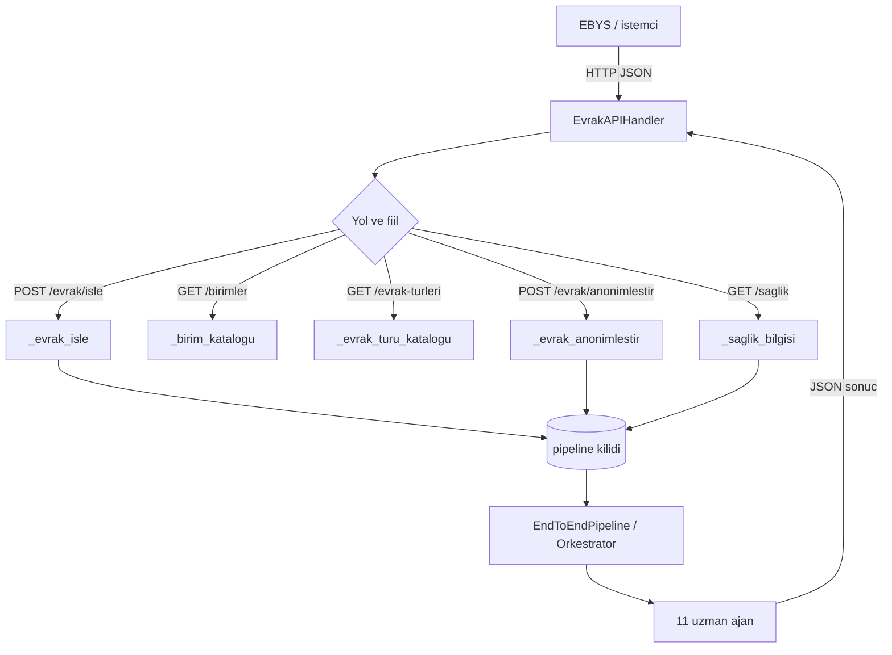

# REST API 🔌

Kamu Evrak Akıllı Ajan sisteminin, kurumların Elektronik Belge Yönetim Sistemlerinden (EBYS) ağ üzerinden çağrılabilmesi için sunduğu, tamamen Python standart kütüphanesiyle (`http.server`) yazılmış, sıfır ek bağımlılıklı hafif HTTP servisidir. 11 uzman ajan + orkestratör çekirdeğine bağlanır ve hiçbir LLM olmadan (offline) tam işlevsel çalışır.

> [!NOTE]
> **TL;DR** — `src/api.py` içindeki REST API, `http.server` tabanlı stdlib servisidir. **5 uç** sunar: `GET /saglik`, `GET /birimler`, `GET /evrak-turleri`, `POST /evrak/isle`, `POST /evrak/anonimlestir`. Tüm istek/yanıt gövdeleri **UTF-8 JSON**'dur. Varsayılan olarak **127.0.0.1:8765** adresinde, dışa kapalı başlar. Gövde sınırı **1 MB**; hata yanıtları `{"hata": "..."}` biçiminde Türkçedir ve iç ayrıntı sızdırmaz. Aynı işlevler [MCP Sunucusu](MCP-Sunucusu) tarafından da vekâletle sunulur.

## Amaç ve Tasarım Felsefesi

Kamu kurumlarının EBYS altyapıları, evrak işleme yeteneklerini kendi süreçlerine gömmek için standart bir arayüze ihtiyaç duyar. REST API bu köprüyü kurar: EBYS, taranmış/aktarılmış bir evrak metnini HTTP üzerinden gönderir, sistem tür sınıflandırması, içerik analizi, önceliklendirme, KVKK nüshası ve resmî yazı taslağı üretip tek bir JSON sözlükte geri döndürür.

Katmanın tasarımını belirleyen ilkeler:

- **Sıfır ek bağımlılık.** Servis yalnızca `http.server` / `ThreadingHTTPServer` kullanır; harici bir web framework (Flask/FastAPI vb.) yoktur. Bu, projenin offline-first ve minimum bağımlılık disiplinini API katmanına da taşır.
- **Çevrimdışı tam işlevsellik.** LLM erişimi olsa da olmasa da uçlar aynı sözleşmeyle yanıt verir; `/saglik` ucundaki `llm_backend` alanı `offline` ise sistem tamamen kural tabanlı çalışıyor demektir.
- **Dışa kapalı varsayılan.** Servis `127.0.0.1` adresine bağlanır; kamu ağlarında doğrudan internete açık servis istenmediği için dışa açmak bilinçli bir `--host` kararı gerektirir.
- **HTTP'den bağımsız iş mantığı.** Uç işlevleri (`_saglik_bilgisi`, `_evrak_isle`, `_evrak_anonimlestir`, `_birim_katalogu`, `_evrak_turu_katalogu`) HTTP katmanından ayrı tutulmuştur; hem birim testlenebilir hem de [MCP Sunucusu](MCP-Sunucusu) tarafından yeniden kullanılabilir.

Referans dosyalar: `src/api.py` (servis), `scripts/api_ornek.py` (örnek istemci), `docs/api_rehberi.md` (ayrıntılı rehber).

## Mimari

REST API, [uçtan uca pipeline](Sistem-Mimarisi)'ı sarmalayan ince bir HTTP kabuğudur. Pipeline, modül düzeyinde **tek bir kez, tembel (lazy)** kurulur ve tek bir kilitle korunur. Orkestratör istekler arasında paylaşılan `AgentState` tuttuğu için, `ThreadingHTTPServer` eşzamanlı bağlantı kabul etse de evrak işleme adımı durum tutarlılığı için `threading.Lock` ile sırayla yürütülür.



> [!IMPORTANT]
> Yanıt sözleşmesi açısından servis **durumsuzdur (stateless)**: her istek kendi başına tam sonucu döndürür. Ancak *işleme* açısından pipeline dahili olarak paylaşılan `AgentState` tuttuğu için istekler kilit altında serileştirilir. Bu ayrım, EBYS tarafında yeniden deneme (retry) mantığını güvenli kılar.

## Uç Noktalar

| Yol | Metot | Açıklama |
|---|---|---|
| `/saglik` | GET | Servis durumu, sürüm, LLM backend ve ajan sayısı |
| `/birimler` | GET | Yönlendirme birim kataloğu (havale listesi eşlemesi) |
| `/evrak-turleri` | GET | Sınıflandırma evrak türü kataloğu |
| `/evrak/isle` | POST | Evrak metnini uçtan uca işler; tam pipeline sonucu döner |
| `/evrak/anonimlestir` | POST | Yalnızca KVKK anonimleştirme; paylaşım/arşiv nüshası döner |

## Başlatma

```bash
# Varsayilan: yalnizca yerel erisim, port 8765
python3 -m src.api

# Farkli port
python3 -m src.api --port 9000
```

Programatik kullanım:

```python
from src.api import calistir
calistir(host="127.0.0.1", port=8765)
```

Test/gömülü kullanım için sunucu, başlatmadan ayrı oluşturulabilir (`sunucu_olustur(host, port)`); `port=0` verilirse işletim sistemi boş bir port seçer.

## İstek/Yanıt Şemaları

### GET /saglik

Servis izleme / ayakta-mı kontrolü. EBYS zamanlayıcısının servis sağlığını yoklaması için kullanılır.

```bash
curl http://127.0.0.1:8765/saglik
```

```json
{
  "durum": "calisiyor",
  "surum": "0.4.0",
  "llm_backend": "offline",
  "ajan_sayisi": 11
}
```

`ajan_sayisi`, `len(orchestrator.agents)` üzerinden dinamik gelir (11 ajan). `llm_backend` `offline` ise tamamen kural tabanlı çalışma; `openai`/`ollama` ise LLM destekli eskalasyon aktiftir. LLM tespiti hata verse bile bu, sağlık durumunu düşürmez: `llm_backend` alanı `bilinmiyor` döner, servis yine `calisiyor` kalır. LLM opsiyonelliği için bkz. [Model Bilgileri](Model-Bilgileri).

> [!NOTE]
> Yukarıdaki `surum` alanı `src.__version__`'dan gelir; sabit bir sözleşme değildir, depo sürümünü yansıtır. `docs/api_rehberi.md` içindeki örnekte `0.1.0` görülürken güncel depo sürümü `0.4.0`'dır — istemci bu alanı sabit varsaymamalıdır.

### POST /evrak/isle

Evrak metnini uçtan uca işler: sınıflandırma, bilgi çıkarımı, eksik bilgi tespiti, mevzuat eşleştirme, önceliklendirme, özet, KVKK nüshası, resmî yazı taslağı ve birim yönlendirme.

**İstek gövdesi:**

| Alan | Tür | Zorunlu | Açıklama |
|---|---|---|---|
| `metin` | string | evet | Evrak düz metni (boş olamaz) |
| `mod` | string | hayır | `full` (varsayılan), `classify` veya `draft` |

`mod` değerleri pipeline sözleşmesiyle birebir aynıdır: `full` her iki görevi (okuma/analiz + taslak/yönlendirme) çalıştırır, `classify` yalnızca [Görev 1](Görev-1-Okuma-ve-Analiz) analizini, `draft` ise taslak odaklı akışı yürütür. Geçersiz `mod` değeri `400` döndürür.

```bash
curl -X POST http://127.0.0.1:8765/evrak/isle \
  -H "Content-Type: application/json" \
  -d '{"metin": "ÖRNEKKENT KAYMAKAMLIĞINA\n\nMahallemizdeki sokak lambalarının arızalı olduğunu bilgilerinize sunar, gereğini arz ederim.", "mod": "full"}'
```

Yanıt, pipeline sonuç sözlüğünün tamamıdır. Anahtarlar orkestratörün ürettiği alanlarla birebir örtüşür (`siniflandirma`, `bilgi_cikarim`, `eksik_bilgiler`, `mevzuat_eslestirme`, `ozet`, `yazi_taslagi`, `format_denetimi`, `taslak_kalitesi`, `yonlendirme`, `onceliklendirme`, `anonimlestirme`, `guven_izleme`, `insan_onayi`, `islem_adimlari`, `islem_suresi_saniye` …). Kısaltılmış örnek (değerler yalnızca yapıyı göstermek içindir):

```json
{
  "siniflandirma": {"tur": "dilekce", "tur_adi": "Dilekçe", "guven": "…"},
  "ozet": "…",
  "yonlendirme": {"birim": "…", "guven": "…", "alternatifler": ["…"]},
  "yazi_taslagi": "…",
  "onceliklendirme": {"oncelik": "normal", "son_tarih": null},
  "anonimlestirme": {"metin": "…", "rapor": {"toplam": 3}},
  "insan_onayi": {"gerekli": false, "gerekceler": []},
  "islem_suresi_saniye": 0.14
}
```

> [!IMPORTANT]
> Yanıttaki `insan_onayi.gerekli` alanı, [Orkestratör ve Koşullu Kapılar](Orkestratör-ve-Koşullu-Kapılar) bölümündeki düşük-güven kapısından (Kapı 3) gelir. `true` ise karar bloklanmaz ama **insan onayı önerilir**; EBYS tarafında sonuç onaylanmadan havale yapılmamalıdır. Bu, sistemin "insan döngüde" ilkesinin API sözleşmesindeki karşılığıdır.

### POST /evrak/anonimlestir

Yalnızca KVKK anonimleştirme çalıştırır. Tam pipeline yerine gerekli iki ajan devreye girer: **bilgi çıkarımı** (kişi adı/iletişim adayları) + **anonimleştirme**. T.C. kimlik, telefon, e-posta, IBAN, adres, kişi adı, plaka, doğum tarihi ve sicil no olmak üzere **9 kişisel-veri kategorisi** format korunarak, geri döndürülemez biçimde maskelenir. Ayrıntı için bkz. [KVKK ve Anonimleştirme](KVKK-ve-Anonimleştirme).

Bu uç orkestratör akışını atladığı için, merkezî girdi sınırı (`_MAX_GIRDI_KARAKTER = 200.000` karakter) **burada ayrıca** uygulanır; aşan metin kırpılır.

```bash
curl -X POST http://127.0.0.1:8765/evrak/anonimlestir \
  -H "Content-Type: application/json" \
  -d '{"metin": "Başvuru sahibi: Ayşe YILMAZ, Tel: 0532 111 22 33"}'
```

```json
{
  "anonim_metin": "Başvuru sahibi: A*** Y***, Tel: 05** *** ** 33",
  "rapor": {
    "maskelenen": {
      "tc_kimlik": 0, "telefon": 1, "eposta": 0, "iban": 0, "kisi_adi": 1,
      "adres": 0, "plaka": 0, "dogum_tarihi": 0, "sicil_no": 0
    },
    "toplam": 2,
    "yontem": "kural_tabanli"
  }
}
```

Dönen yapı doğrudan `anonim_metin` (maskelenmiş nüsha) ve `rapor` (`{maskelenen, toplam, yontem}`) alanlarından oluşur; `toplam`, kategori sayaçlarının toplamıdır ve `yontem` her zaman `kural_tabanli`'dır (uç tamamen çevrimdışı çalışır).

### GET /birimler

[Yönlendirme ajanının](Görev-2-Taslak-ve-Yönlendirme) tanıdığı birim kataloğu; EBYS'nin havale ekranındaki birim kodlarıyla bir kez eşlenir. Katalog, `routing_agent.py` içindeki `BIRIMLER` sözlüğünden dinamik gelir (9 birim).

```bash
curl http://127.0.0.1:8765/birimler
```

```json
{
  "birimler": [
    {"kod": "yazi_isleri", "ad": "Yazı İşleri Müdürlüğü", "aciklama": "…"},
    "…"
  ],
  "adet": 9
}
```

### GET /evrak-turleri

Sınıflandırma ajanının tanıdığı evrak türü kataloğu; `classification_agent.py` içindeki `EVRAK_TURLERI` sözlüğünden gelir. Sözlükte 8 türe ek olarak artık/fallback kategori `diger` de bulunduğundan `adet` alanı 9 döner.

```bash
curl http://127.0.0.1:8765/evrak-turleri
```

```json
{
  "evrak_turleri": [
    {"kod": "dilekce", "ad": "Dilekçe", "aciklama": "…"},
    "…"
  ],
  "adet": 9
}
```

## curl ve Python Örnekleri

### Python (yalnızca stdlib)

```python
import json, urllib.request

govde = json.dumps({"metin": evrak_metni, "mod": "full"},
                   ensure_ascii=False).encode("utf-8")
istek = urllib.request.Request(
    "http://127.0.0.1:8765/evrak/isle", data=govde, method="POST",
    headers={"Content-Type": "application/json; charset=utf-8"},
)
with urllib.request.urlopen(istek, timeout=120) as yanit:
    sonuc = json.loads(yanit.read().decode("utf-8"))
print(sonuc["siniflandirma"]["tur_adi"], "→", sonuc["yonlendirme"]["birim"])
```

### Örnek istemci betiği

Depoda EBYS entegrasyon akışını uçtan uca gösteren bir demo istemci vardır: `scripts/api_ornek.py`. Yalnızca `urllib` ile bağlanır; önce sağlık kontrolü yapar, sonra kurgu (tamamen sentetik) bir evrakı işletir, ardından anonimleştirme ucunu dener.

```bash
# 1. terminal: sunucuyu baslat
python3 -m src.api

# 2. terminal: ornek istemciyi calistir
python3 scripts/api_ornek.py
python3 scripts/api_ornek.py --port 9000
```

Betiğin ürettiği akış üç adımdır: **[1] Sağlık kontrolü** (`/saglik`) → **[2] Örnek evrak işleme** (`POST /evrak/isle`, mod `full`) → **[3] KVKK anonimleştirme** (`POST /evrak/anonimlestir`). Her adım sonucu Türkçe olarak konsola basılır. Sunucuya ulaşılamazsa betik anlaşılır bir hata mesajı verip `1` ile çıkar.

> [!NOTE]
> `scripts/api_ornek.py` içindeki örnek evrak metni ve tüm kişisel unsurlar (ad, adres, telefon) **tamamen kurgudur**. Proje, gerçek kamu verisi ve gerçek PII kullanımını yasaklar; bkz. [Veri Setleri](Veri-Setleri) ve [Anayasal İlkeler ve Etik](Anayasal-İlkeler-ve-Etik).

## Hata Kodları

| Durum kodu | Anlam | Tetikleyen durum |
|---|---|---|
| `200` | Başarı | İstek geçerli, sonuç döndü |
| `400` | Geçersiz istek | Bozuk JSON, gövde JSON nesnesi değil, `metin` boş/eksik, geçersiz `mod`, geçersiz `Content-Length`, aşırı derin iç içe JSON (`RecursionError`) |
| `404` | Bilinmeyen uç | Tanımlı olmayan yol |
| `411` | Content-Length gerekli | `Content-Length` başlığı yok |
| `413` | Gövde çok büyük | Gövde 1 MB (`MAX_GOVDE_BAYT`) sınırını aşıyor |
| `500` | Sunucu hatası | İşleme sırasında beklenmeyen istisna |

Tüm hata yanıtları `{"hata": "<Türkçe açıklama>"}` biçimindedir ve **iç ayrıntı (stack trace) sızdırmaz**; ayrıntılar yalnızca sunucu loglarında (denetim izi) tutulur.

> [!WARNING]
> `413` durumunda dev gövde belleğe alınmaz: istemcinin gönderim tamponu kilitlenmesin diye sınırlı miktar (`_ATIK_OKUMA_SINIRI = 8 MB`'a kadar) parça parça okunup atılır, ardından bağlantı kapatılır. Bu, kaynak tüketimi (CWE-400) saldırılarına karşı bilinçli bir savunmadır. Aşırı derin iç içe JSON (`RecursionError`) da ayrıştırma sırasında yakalanıp `400` ile reddedilir.

## Kimlik / Güvenlik Notu

REST API kasıtlı olarak **kimlik doğrulaması içermez**; bunun yerine güvenli bir dağıtım deseni öngörür:

- **Varsayılan bind adresi `127.0.0.1`'dir.** Servis, EBYS sunucusuyla aynı makinede veya bir **ters proxy** (nginx / IIS ARR) arkasında çalışacak şekilde dışa kapalı başlar. Dışa açmak `--host` ile bilinçli bir karar olmalıdır.
- **TLS sonlandırma, kimlik doğrulama** (kurum içi API anahtarı / mTLS) **ve hız sınırlama, ters proxy katmanında** yapılmalıdır. API çekirdeği bu sorumlulukları üstlenmez.
- **Gövde sınırı 1 MB'dir**; aşan istekler belleğe alınmadan `413` ile reddedilir.
- **Evrak metni 200.000 karakterde kırpılır** (pipeline'ın merkezî girdi sınırı); aşırı uzun girdi analiz adımlarını süresiz meşgul edemez.
- **İstemci soketleri 60 saniyelik zaman aşımıyla korunur** (yavaş istemci / slowloris türü durumların işleyici thread'ini süresiz kilitlemesini önler).
- **KVKK:** Sunucu loglarında evrak metni **yazılmaz**; yalnızca istek satırı, durum kodu ve kaynak IP loglanır (denetim izi). Uygulanan savunmaların tam listesi için bkz. [Anayasal İlkeler ve Etik](Anayasal-İlkeler-ve-Etik).

## EBYS Entegrasyon Senaryosu

Tipik bir kurum EBYS'sinde gelen evrak şu akışla sisteme bağlanır:

- [ ] **Kayıt anında zenginleştirme** — EBYS, taranmış/aktarılmış evrak metnini `POST /evrak/isle` (mod: `classify`) ile gönderir; dönen tür, güven skoru ve özet, evrak kayıt formuna otomatik doldurulur. `insan_onayi.gerekli` `true` ise kayıt memuru sonucu onaylamadan havale yapılmaz.
- [ ] **Havale önerisi** — `yonlendirme.birim` ve `yonlendirme.alternatifler` alanları havale ekranında öneri olarak gösterilir; `GET /birimler` kataloğu kurumun kendi birim kodlarıyla bir kez eşlenir.
- [ ] **Cevap taslağı** — Memur onayladığında `mod: "draft"` (veya `full`) çağrısından dönen `yazi_taslagi`, EBYS'nin yazı editörüne başlangıç içeriği olarak aktarılır; imza/onay süreci EBYS'de kalır.
- [ ] **Paylaşım nüshası** — Bilgi edinme/paylaşım taleplerinde `POST /evrak/anonimlestir` çıktısı ile KVKK'ya uygun nüsha üretilir.
- [ ] **İzleme** — EBYS zamanlayıcısı `GET /saglik` ile servisi sürekli izler.

## Offline Çalışma

REST API, projenin **offline-first** ilkesini bozmaz. Çekirdek `http.server` üzerine kuruludur; hiçbir dış ağ bağlantısı, harici web framework veya LLM olmadan tüm uçlar tam çalışır. `/saglik` ucundaki `llm_backend: "offline"` bu modu doğrular. LLM aktifse (yalnızca düşük güvenli kararlarda eskalasyon amacıyla) uçlar aynı JSON sözleşmesini korur; yanıt yapısı değişmez. Böylece kurum, internet erişimi olmayan yerel/on-prem ortamlarda da servisi kesintisiz kullanabilir. LLM'in ne zaman devreye girdiği ve `APP_OFFLINE=1` katı kilidi için bkz. [Model Bilgileri](Model-Bilgileri) ve [Kurulum ve Yapılandırma](Kurulum-ve-Yapılandırma).

## Daha Fazla Bilgi

Uç şemaları, örnek istek/yanıtlar ve EBYS entegrasyon senaryosunun ayrıntılı anlatımı için depo içi rehbere bakın: `docs/api_rehberi.md`. Aynı iş mantığını JSON-RPC 2.0 / stdio üzerinden sunan MCP karşılığı için bkz. [MCP Sunucusu](MCP-Sunucusu).

## İlgili Sayfalar

- [MCP Sunucusu](MCP-Sunucusu) — Bu API işlevlerine vekâlet eden JSON-RPC 2.0 stdio sunucusu
- [Web Arayüzü — Evrak Zekâ](Web-Arayüzü) — Aynı çekirdeğe bağlanan Streamlit panoları
- [Sistem Mimarisi](Sistem-Mimarisi) — AgentState veri akışı ve uçtan uca pipeline
- [Orkestratör ve Koşullu Kapılar](Orkestratör-ve-Koşullu-Kapılar) — `insan_onayi` ve 3 kapı mantığı
- [Komut Satırı (CLI) ve Demo](Komut-Satırı-ve-Demo) — `src/main.py` CLI ve demo senaryosu
- [Kurulum ve Yapılandırma](Kurulum-ve-Yapılandırma) — Bağımlılıklar, `.env`, LLM backend seçimi
