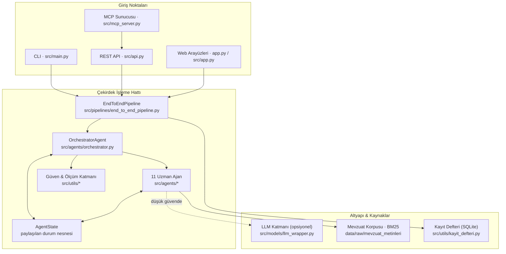
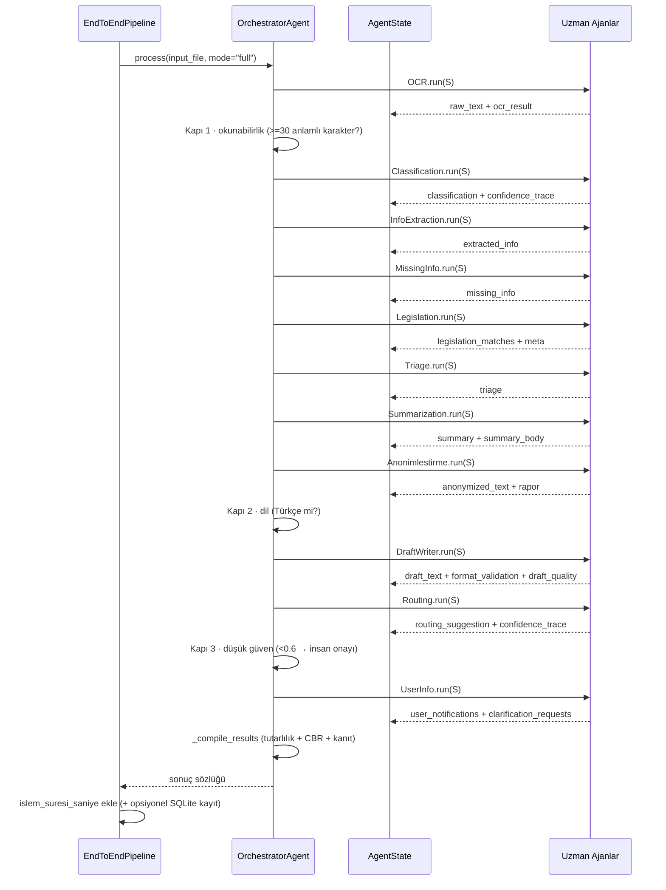

# Sistem Mimarisi

Bu sayfa, TEKNOFEST 2026 "Kamu Evrak ve Yazışma Süreçleri için Akıllı Agent Destek Sistemi" projesinin uçtan uca mimarisini anlatır: 11 uzman ajan + orkestratörün nasıl bir araya geldiğini, paylaşılan `AgentState` nesnesinin adım adım nasıl zenginleştiğini ve Görev 1 / Görev 2 hatlarının koşullu akışını açıklar.

> [!NOTE]
> **TL;DR** — Sistem, framework kullanmayan **saf Python** bir orkestratörün 11 uzman ajanı koşullu bir akışla koordine etmesine dayanır. Tüm ajanlar tek bir paylaşılan durum nesnesi (`AgentState`) üzerinde çalışır; her ajan kendi çıktısını bu nesneye yazar ve bir sonraki ajana devreder. Akış düz bir zincir değildir: orkestratör **3 koşullu kapı** (okunabilirlik / dil / düşük güven) uygular. Çekirdek tamamen **offline-first** çalışır — hiçbir LLM olmadan uçtan uca işlev korunur; LLM yalnızca düşük güvenli kararlarda opsiyonel bir iyileştirme katmanıdır.

## 1. Yüksek Seviye Mimari

Sistem üç mantıksal katmandan oluşur: **giriş noktaları** (CLI, REST API, MCP, web arayüzleri), **çekirdek işleme hattı** (orkestratör + 11 ajan + güven/ölçüm katmanı) ve **altyapı** (kayıt defteri, mevzuat korpusu, opsiyonel LLM/RAG). Aşağıdaki diyagram bu katmanları ve veri akışını özetler.

İç halka her zaman çalışır; dış bağımlılıklar (LLM, semantik RAG, kayıt defteri) **zarif düşüşle** (graceful degradation) devre dışı kaldığında sistem BM25 + kural tabanlı modda birebir çalışmaya devam eder. Not: MCP sunucusu ağ kullanmaz; 5 aracını REST API iç işlevlerine vekâlet ettirir ve bu nedenle diyagramda API üzerinden akar.

## 2. Çok-Ajanlı Tasarım İlkesi

Mimarinin temel ilkesi **tek sorumluluk** (single responsibility): her ajan resmî yazışma iş akışının tek bir aşamasından sorumludur ve girdisini yalnızca paylaşılan durumdan alır. Bu ayrıştırma; test edilebilirliği, açıklanabilirliği ve bir ajanın hatasının diğerlerini çökertmemesini (izolasyon) sağlar.

| İlke | Uygulama |
|---|---|
| **Tek sorumluluk** | Her ajan bir aşamayı üstlenir (OCR, sınıflandırma, çıkarım, ...); ajanlar birbirini doğrudan çağırmaz. |
| **Paylaşılan durum** | Ajanlar arası tüm veri akışı `AgentState` üzerinden olur; yan kanal yoktur. |
| **Koşullu koordinasyon** | Ajanları hangi sırayla ve hangi koşulda çalıştıracağına yalnızca orkestratör karar verir. |
| **Zarif düşüş** | Opsiyonel bağımlılık (LLM, cv2, reportlab, sentence-transformers) yoksa ajan kural tabanlı sonucunu korur. |
| **Katmanlı hata izolasyonu** | Bir ajanın istisnası `errors` listesine eklenir; iş akışı yine de sonucu derler (çökme yerine kısmi sonuç). |

11 ajanın genel bakışı ve her birinin kendi görev sayfası için [Uzman Ajanlar](Uzman-Ajanlar) sayfasına, orkestratörün karar mantığı için [Orkestratör ve Koşullu Kapılar](Orkestratör-ve-Koşullu-Kapılar) sayfasına bakınız.

## 3. Paylaşılan AgentState Nesnesi

`AgentState`, `src/agents/orchestrator.py` içinde tanımlı bir `@dataclass`'tır ve ajanlar arası tek doğruluk kaynağıdır. Alanları beş mantıksal grupta toplanır ve iş akışı ilerledikçe **kademeli olarak zenginleşir**.

| Grup | Başlıca alanlar | Dolduran ajan(lar) |
|---|---|---|
| **Giriş** | `input_file`, `raw_text` | OCR (veya doğrudan metin) |
| **Görev 1** | `ocr_result`, `classification`, `extracted_info`, `missing_info`, `legislation_matches`, `legislation_meta`, `summary`, `summary_body` | OCR, Sınıflandırma, Bilgi Çıkarımı, Eksik Bilgi, Mevzuat, Özetleme |
| **Yenilik** | `anonymized_text`, `anonymization_report`, `triage` | Triage, Anonimleştirme |
| **Görev 2** | `draft_text`, `draft_type`, `format_validation`, `draft_quality`, `routing_suggestion`, `user_notifications`, `clarification_requests` | Taslak Yazımı, Yönlendirme, Kullanıcı Bilgilendirme |
| **Meta** | `errors`, `processing_steps`, `confidence_trace`, `workflow_warnings`, `human_review_required`, `human_review_reasons` | Orkestratör (tüm adımlar) |

Girdi iki yoldan gelebilir: `process(input_file, mode, on_step)` dosya yolu üzerinden (önce OCR adımı) ya da `process_text(text, mode, source_name, on_step)` doğrudan metin (OCR atlanır, `ocr_result` içinde `engine_used="direct"` işaretlenir).

### 3.1 AgentState Adım Adım Nasıl Zenginleşir?

Aşağıdaki liste, tipik bir **`mode="full"`** koşusunda (metin okunabilir ve Türkçe) durumun her adımda nasıl büyüdüğünü gösterir.

1. **OCR** → `raw_text` ve `ocr_result` doldurulur. TXT/MD doğrudan okunur (`engine_used="direct"`); PDF/görüntü için pypdf/Tesseract devreye girer. Görüntü girdilerinde ek olarak `ocr_result["ocr_kalite"]` telemetrisi (4. kapı sinyali) eklenir.
2. **Güvenlik sınırı** → `_apply_girdi_siniri` ile `raw_text` en fazla 200.000 karaktere kırpılır; aşımda `girdi_kirpildi` uyarısı eklenir (CWE-400 kaynak tüketimi savunması). Bu sınır hem OCR hem doğrudan metin yolunda uygulanır.
3. **Sınıflandırma** → `classification` ({tur, tur_adi, guven, yontem, tum_skorlar, ...}) yazılır ve `confidence_trace`'e sınıflandırma güveni + yöntemi kaydedilir.
4. **Bilgi Çıkarımı** → `extracted_info` (tarih, sayı, TCKN, konu, muhatap, kurum/kişi/yer, IBAN, telefon, ...) doldurulur.
5. **Eksik Bilgi** → `missing_info` (her öge {alan, aciklama, oncelik, oneri}) evrak türüne göre üretilir.
6. **Mevzuat** → `legislation_matches` (en fazla 5 öneri) ve `legislation_meta` ({yontem, duzeltme_dongusu, kvkk_veri_sinyali}) eklenir.
7. **Triage** → `triage` ({oncelik, skor, son_tarih, kalan_gun, yasal_sure, gerekce, ...}) hesaplanır. *(Not: triage, özetlemeden **önce** çalışır.)*
8. **Özetleme** → `summary` (künyeli, ekran) ve `summary_body` (künyesiz gövde; taslak yalnızca bunu kullanır) üretilir.
9. **Anonimleştirme** → `anonymized_text` ve `anonymization_report` ({maskelenen kategori sayaçları, toplam, yontem}) eklenir.
10. **Taslak Yazımı** *(yalnızca metin Türkçe ise)* → `draft_type`, `draft_text`, `format_validation`, `draft_quality` yazılır.
11. **Yönlendirme** → `routing_suggestion` ({birim, birim_kodu, gerekce, guven, alternatifler}) eklenir ve `confidence_trace`'e yönlendirme güveni kaydedilir.
12. **Kullanıcı Bilgilendirme** *(her durumda)* → `user_notifications` ve `clarification_requests` üretilir.

Her adım `_run_step` ile `time.perf_counter` üzerinden ölçülür ve `processing_steps`'e `{agent, description, status, sure_saniye}` olarak eklenir. Adım durumları: `success` | `error` | `atlandi`. Tüm ajanlar tamamlandıktan sonra `EndToEndPipeline`, orkestratör çıktısına `islem_suresi_saniye` anahtarını ekler ve kayıt defteri **aktifse** sonucu SQLite denetim izine yazar. Kayıt defteri **varsayılan olarak kapalıdır** — değerlendirme/toplu ölçüm betiklerinin denetim izine yan etki yazmaması için.

> [!IMPORTANT]
> Koşullu bir kapı tetiklendiğinde bile sonuç sözlüğünün **yapısı korunur**: ilgili alanlar boş kalır, uydurma çıktı üretilmez. Örneğin boş/anlamsız metinde sınıflandırma `{tur: "bilinmiyor", guven: 0.0}` olarak işaretlenir ve analiz adımları `atlandi` kaydedilir.

## 4. Ajan İş Birliği Sekansı

Orkestratör, ajanları `_load_agents` ile sabit bir sırayla yükler ama onları koşullu olarak çağırır. Aşağıdaki sekans diyagramı, okunabilir ve Türkçe bir evrakta (`mode="full"`) tam akışı gösterir.

`_compile_results` aşamasında orkestratör ek olarak **çapraz tutarlılık denetimi** çalıştırır (çelişki insan onayı *önerir*, bloklamaz), düşük güvenli kararlarda **emsal/CBR önerisi** (kurumsal hafızadan çoğunluk kararı, `emsal_ara limit=3`) ekler ve **kanıt vurgu span'leri** üretir. Bunların hepsi *advisory/additive*'tir — kararı ezmez, yalnızca insan onayı önerir veya açıklanabilirlik sağlar.

> [!NOTE]
> İş akışı sırasında oluşan istisnalar `_run_workflow` içinde yakalanıp `errors` listesine eklenir ve akış yine `_compile_results` ile sonuç döndürür. Bu, tek bir ajanın hatasının tüm hattı çökertmesini önleyen **zarif düşüş** ilkesinin çekirdeğidir (Anayasa: şeffaflık + zarardan kaçınma).

## 5. Koşullu Kapılar ve Hibrit Karar

Akışı düz bir zincirden ayıran şey, orkestratörün uyguladığı üç koşullu kapıdır:

- **Kapı 1 — Okunabilirlik:** Metindeki anlamlı karakter (harf/rakam) sayısı `_MIN_ANLAMLI_KARAKTER = 30` altındaysa evrak içeriği taşımaz sayılır; analiz ve taslak adımları atlanır, `bos_metin` uyarısı ve insan onayı işareti konur.
- **Kapı 2 — Dil:** `is_turkish_text(raw_text)` False dönerse `dil_uyarisi` eklenir ve **taslak üretimi atlanır**; sınıflandırma/analiz yine çalışır.
- **Kapı 3 — Düşük güven:** Sınıflandırma veya yönlendirme güveni `_INSAN_ONAYI_GUVEN_ESIGI = 0.6` altındaysa `insan_onayi.gerekli = True` işareti + gerekçeler konur (offline modda LLM eskalasyonu çalışamayacağı için insan kontrolü zorunlu kılınır).

Bu kapıların tam mantığı, eşik değerleri ve hibrit (kural + opsiyonel LLM) karar akışı için [Orkestratör ve Koşullu Kapılar](Orkestratör-ve-Koşullu-Kapılar) sayfasına bakınız.

## 6. Görev 1 / Görev 2 Hatları

Şartname iki zorunlu görevi tanımlar; her ikisi de aynı `AgentState` üzerinde ardışık bloklar olarak çalışır.

| | **Görev 1 — Okuma, Sınıflandırma, İçerik Analizi** | **Görev 2 — Taslaklama ve Yönlendirme** |
|---|---|---|
| **Çalışma sırası** | Classification → InfoExtraction → MissingInfo → Legislation → Triage → Summarization → Anonimlestirme | DraftWriter (Türkçe ise) → Routing → UserInfo |
| **Ön koşul** | Metin okunabilir (Kapı 1) | Metin okunabilir; taslak için ayrıca Türkçe (Kapı 2) |
| **Modlar** | `classify` Görev 1'i çalıştırır | `draft` taslak odaklıdır; `full` her ikisini kapsar |
| **Sayfa** | [Görev 1 — Okuma ve Analiz](Görev-1-Okuma-ve-Analiz) | [Görev 2 — Taslak ve Yönlendirme](Görev-2-Taslak-ve-Yönlendirme) |

`mode` değerleri `full` | `classify` | `draft` olup pipeline sözleşmesiyle birebir uyumludur ve REST API/MCP/CLI tarafından da kullanılır.

## 7. Dizin Haritası

Aşağıdaki tablo, mimarinin fiziksel karşılığını — hangi sorumluluğun hangi dizinde yaşadığını — özetler.

| Dizin / Dosya | Sorumluluk |
|---|---|
| `src/agents/` | 11 uzman ajan (ocr, classification, info_extraction, missing_info, legislation, summarization, draft_writer, routing, user_info, triage, anonimlestirme) + `orchestrator.py` (koşullu akış + 3 kapı + `AgentState`) |
| `src/pipelines/end_to_end_pipeline.py` | Orkestratörü sarmalayan uçtan uca hat; toplam süre ölçümü + isteğe bağlı SQLite denetim izi; `process` / `process_text` / `process_batch` |
| `src/models/llm_wrapper.py` | Model-agnostik LLM katmanı (stdlib `urllib`; OpenAI-uyumlu / Ollama / offline otomatik tespit) |
| `src/utils/` | Yardımcı ve güven/ölçüm katmanı: BM25 (`bm25.py`), Türkçe NLP, kalibrasyon, seçici tahmin, konformal, metamorfik, özet kalitesi, tutarlılık denetimi, KVKK denetim, emsal/CBR, resmî yazışma desenleri, kayıt defteri, kokpit, e-Yazışma, koşum mührü |
| `src/config.py` | `pydantic_settings` tabanlı merkezi konfigürasyon (LLM / OCR / embedding / chroma / uygulama ayarları) |
| `src/api.py` · `src/mcp_server.py` | Sıfır-bağımlılık REST API (`http.server`) ve JSON-RPC 2.0 stdio MCP sunucusu |
| `app.py` · `src/app.py` | Kurumsal sunum panosu "Evrak Zekâ" ve klasik canlı ajan-hattı arayüzü |
| `src/templates/` | 5 resmî yazı şablonu (ust_yazi, cevap_yazisi, bilgilendirme_metni, eksik_bilgi_talep, iade_ikmal_notu) |
| `scripts/` | `evaluate.py` (saf Python metrikler), `benchmark.py`, `dayaniklilik_testi.py`, `ml_egit.py`, sunum üretimi |
| `data/` | Etiketli sentetik evrak setleri + mevzuat metinleri korpusu |
| `docs/` | Teknik rapor, model bilgileri/kartı, şartname uyum matrisi, güvenlik denetim raporu, datasheet |

Kod yapısına ve yeni ajan ekleme adımlarına dair ayrıntı için [Geliştirici Rehberi](Geliştirici-Rehberi) sayfasına bakınız.

## 8. Hibrit Zekâ: Kural Çekirdeği + Opsiyonel LLM

Sistem, iki katmanlı bir zekâ mimarisi kullanır:

- **Kural çekirdeği (her zaman aktif):** Ağırlıklı anahtar kelime skorlaması, yapısal regex sinyalleri, saf-Python Multinomial Naive Bayes (sınıflandırma), BM25-Okapi (mevzuat RAG), Türkçe morfolojik desenler ve resmî yazışma kontrol listeleri. Bu katman hiçbir harici bağımlılık gerektirmez ve **offline-first** garantisini tek başına karşılar.
- **Opsiyonel LLM katmanı (yalnızca gerektiğinde):** LLM, kararı doğrudan belirlemez. Sınıflandırmada güven `0.6` eşiğinin altındaysa eskalasyon *sınıflandırma ajanının içinde* olur; yönlendirmede yalnızca skorlar çok yakınsa (LLM ayrıştırması) devreye girer; taslak/özet/çıkarımda yalnızca kural sonucunu *zenginleştirir* (regex/kural çıktısı asla ezilmez).

LLM çağrıları harici SDK olmadan yalnızca stdlib `urllib` ile yapılır; üç backend (OpenAI-uyumlu, Ollama, offline) otomatik tespit edilir ve `APP_OFFLINE=1` katı kilidi hiçbir evrak metninin dışarı gönderilmemesini garanti eder (KVKK/gizlilik). Ayrıntı için [Model Bilgileri ve LLM Ekosistemi](Model-Bilgileri) ve [Mevzuat RAG ve Hibrit Arama](Mevzuat-RAG-ve-Hibrit-Arama) sayfalarına bakınız.

> [!NOTE]
> LLM karar manipülasyonu **mimari düzeyde** engellenir: sınıflandırma ve yönlendirme çıktıları kapalı listelerle (enum/allowlist) doğrulanır ve evrak metni `belge_blogu` sınırlayıcılarıyla "yalnızca veri" olarak işaretlenir (dolaylı prompt injection savunması, OWASP LLM01).

## 9. Neden Framework'süz?

Orkestrasyon LangChain / LlamaIndex / CrewAI gibi bir framework yerine **saf Python** ile yazılmıştır. Kısa gerekçe:

- **Offline-first ve minimal bağımlılık:** Çekirdek, ağır bir framework bağımlılığı olmadan on-prem/çevrimdışı ortamda tam işlevlidir (şartname kısıtı).
- **Şeffaflık ve denetlenebilirlik:** Koşullu akış, kapılar ve güven izleme açıkça okunabilir kod olarak durur; jüri ve geliştirici için "kara kutu" yoktur.
- **Tam kontrol:** 3 kapı, keep-best taslak seçimi, advisory CBR ve süre ölçümü gibi projeye özgü mantık, bir framework'ün soyutlamalarıyla çelişmeden doğrudan ifade edilir.

Bu kararın gerekçesi ve mimari tercih kayıtlarının tamamı [Geliştirici Rehberi](Geliştirici-Rehberi) sayfasında ayrıntılandırılmıştır.

## İlgili Sayfalar

- [Orkestratör ve Koşullu Kapılar](Orkestratör-ve-Koşullu-Kapılar) — 3 kapının tam mantığı ve hibrit karar akışı
- [Uzman Ajanlar](Uzman-Ajanlar) — 11 ajanın genel bakış tablosu ve görev sayfaları
- [Görev 1 — Okuma ve Analiz](Görev-1-Okuma-ve-Analiz) — OCR, sınıflandırma, çıkarım, eksik bilgi, özetleme
- [Görev 2 — Taslak ve Yönlendirme](Görev-2-Taslak-ve-Yönlendirme) — taslak yazımı, format denetimi, yönlendirme
- [Güven ve Ölçüm Katmanı](Güven-ve-Ölçüm-Katmanı) — kalibrasyon, seçici tahmin, konformal, metamorfik
- [Geliştirici Rehberi](Geliştirici-Rehberi) — kod yapısı, yeni ajan ekleme, mimari kararlar
