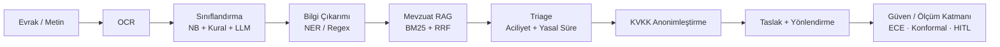

# Sözlük (Kavramlar) 📖

Bu sayfa, projenin teknik dokümantasyonunda ve kamu yazışma alanında geçen terimlerin kısa, doğru ve birbirine bağlı tanımlarını sunar. Her giriş bir-iki cümlelik açıklama ve ilgili wiki sayfasına yönlendirme içerir; teknik terimlerin İngilizce orijinal biçimleri parantez içinde verilmiştir.

> [!NOTE]
> **TL;DR** — Sözlük iki bölümden oluşur: (1) **Teknik terimler** (BM25, RAG, RRF, ECE, konformal tahmin, metamorfik test, Naive Bayes, NER, CBR, HITL, AgentState vb.) ve (2) **Resmî/kamu yazışma terimleri** (üst yazı, dilekçe, tutanak, genelge, İlgi, muhatap, GÜNLÜDÜR/İVEDİ, e-Yazışma, EBYS, KVKK, 4982/3071/2577 sayılı kanunlar). Amaç, jürinin ve geliştiricinin dokümantasyonu tek bir referanstan hızlıca çözebilmesidir. Terimler alfabetik sıralanmıştır; her terim ilgili derin-dalış sayfasına bağlanır.

---

## Bu Sözlüğü Nasıl Okumalı?

- Terimler alfabetiktir; teknik ve resmî terimler ayrı başlıklar altında toplanmıştır.
- **Kaynak dosya** sütunu, kavramın koddaki birincil karşılığını gösterir (ör. `src/utils/bm25.py`).
- **İlgili sayfa** sütunu, kavramın ayrıntılı anlatıldığı wiki sayfasına bağlanır.
- Metrik ve eşik değerleri yalnızca doğrulanmış kaynaklardan alınmıştır; ölçülmemiş bir değer bu sayfada yer almaz.

> [!NOTE]
> Diyagram kavramsal akışı özetler. Orkestratör düz sıralı bir zincir değil, **koşullu üç kapılı** bir akış yürütür (okunabilirlik / dil / düşük güven); anonimleştirme Görev 1'in sonunda, taslak ve yönlendirme Görev 2'de çalışır. Ayrıntı: [Orkestratör ve Koşullu Kapılar](Orkestratör-ve-Koşullu-Kapılar).

---

## Teknik Terimler

| Terim | Tanım | Kaynak dosya | İlgili sayfa |
|---|---|---|---|
| **AgentState** | Ajanlar arası paylaşılan `@dataclass` durum nesnesi; her adımda güncellenip bir sonraki ajana aktarılır. Alanları giriş, Görev 1, yenilik (triage/anonimleştirme), Görev 2 ve meta olmak üzere gruplanır. | `src/agents/orchestrator.py` | [Sistem Mimarisi](Sistem-Mimarisi) |
| **Ablasyon (ablation)** | Tam sistemin bileşenlerini kaldırıp performans değişimini ölçme yöntemi; burada tam sistem ile bag-of-words baseline sınıflandırma doğruluğu karşılaştırılıp fark McNemar testiyle sınanır. | `scripts/evaluate.py`, `src/utils/baseline.py` | [Değerlendirme ve Metrikler](Değerlendirme-ve-Metrikler) |
| **AURC (risk-kapsama alanı)** | Risk-coverage eğrisinin altındaki alan; seçici sınıflandırmada güvene göre reddetme kalitesini özetler (Geifman & El-Yaniv 2017). | `src/utils/kalibrasyon.py` | [Güven ve Ölçüm Katmanı](Güven-ve-Ölçüm-Katmanı) |
| **Baseline (referans model)** | Bilerek zayıf ama adil kurulmuş anahtar-kelime sayımı sınıflandırıcısı; güven/kalibrasyon/ensemble içermez, yalnızca ablasyon ve karşılaştırma için kullanılır. | `src/utils/baseline.py` | [Değerlendirme ve Metrikler](Değerlendirme-ve-Metrikler) |
| **BM25 (BM25-Okapi)** | Saf Python ile yazılmış olasılıksal metin geri getirme fonksiyonu (`k1=1.5`, `b=0.75`); mevzuat RAG'in çekirdek, bağımlılıksız ve çevrimdışı arama katmanıdır. | `src/utils/bm25.py` | [Mevzuat RAG ve Hibrit Arama](Mevzuat-RAG-ve-Hibrit-Arama) |
| **Bootstrap güven aralığı** | Yeniden örneklemeyle (varsayılan 2000 tekrar, sabit tohum) bir oranın belirsizliğini kestiren istatistik; küçük veri setlerinde dürüst raporlama sağlar (Efron 1979). | `src/utils/istatistik.py` | [Değerlendirme ve Metrikler](Değerlendirme-ve-Metrikler) |
| **Brier skoru** | Olasılıksal tahminlerin karesel hata ölçüsü; kalibrasyon kalitesini özetleyen tamamlayıcı metrik (Brier 1950). | `src/utils/kalibrasyon.py` | [Güven ve Ölçüm Katmanı](Güven-ve-Ölçüm-Katmanı) |
| **CBR (Emsal-Tabanlı Muhakeme)** | Case-Based Reasoning: kurumsal hafızadan (kayıt defteri) benzer geçmiş evrakları çekip çoğunluk tür/birim önselini ve çelişki uyarısını üreten **advisory** katman; kararı ezmez (Aamodt & Plaza 1994). | `src/utils/emsal_cbr.py`, `src/utils/emsal.py` | [Mevzuat RAG ve Hibrit Arama](Mevzuat-RAG-ve-Hibrit-Arama) |
| **Conformal Prediction (konformal tahmin)** | İstatistiksel kapsama garantili tahmin kümeleri üreten yöntem (LAC nonconformity, `alfa=0.1` → %90 hedef kapsama); geliştirme setinde ampirik kapsama 1.0, ortalama küme boyutu 1.0 ölçüldü (Angelopoulos & Bates 2021). | `src/utils/konformal.py` | [Güven ve Ölçüm Katmanı](Güven-ve-Ölçüm-Katmanı) |
| **Corrective RAG (düzeltici sorgu genişletme)** | İlk en iyi benzerlik `0.15` eşiğinin altındaysa sorgunun tür söz dağarcığıyla bir kez genişletilip yalnızca iyileşme olursa benimsendiği güvenlik ağı döngüsü. | `src/agents/legislation_agent.py` | [Mevzuat RAG ve Hibrit Arama](Mevzuat-RAG-ve-Hibrit-Arama) |
| **Damerau-Levenshtein mesafesi** | Ekleme/silme/değiştirme ve komşu harf yer değiştirmesini sayan düzenleme mesafesi; asistan niyet motorunun bulanık eşleme katmanında kullanılır. | `src/utils/bulanik.py` | [Web Arayüzü — Evrak Zekâ](Web-Arayüzü) |
| **ECE (Beklenen Kalibrasyon Hatası)** | Tahmin edilen güven ile gerçek doğruluk arasındaki ağırlıklı sapma (varsayılan 10 kutu); geliştirme setinde `0.1882` iken sıcaklık ölçekleme (T=0.25) sonrası `0.0081`'e indi (Guo vd. 2017). | `src/utils/kalibrasyon.py` | [Güven ve Ölçüm Katmanı](Güven-ve-Ölçüm-Katmanı) |
| **Ensemble (hibrit birleştirme)** | Sınıflandırmada kural tabanlı olasılık (`%60`) ile Naive Bayes olasılığının (`%40`) ağırlıklı ortalaması; tek bileşenin aşırı güvenle kararı belirlemesini sınırlar. | `src/agents/classification_agent.py` | [Görev 1 — Okuma ve Analiz](Görev-1-Okuma-ve-Analiz) |
| **Held-out (tutulmuş set)** | Geliştirme sırasında hatalarına bakılmayan, kural/kod ayarına kapalı değerlendirme seti; bakılıp düzeltme yapılırsa niteliğini kaybeder ve bu durum teknik rapora yazılır. | `data/raw/kurgu_evraklar_heldout*` | [Değerlendirme ve Metrikler](Değerlendirme-ve-Metrikler) |
| **HITL (İnsan Döngüde)** | Human-in-the-Loop: düşük güvende karar bloklanmaz, `insan_onayi.gerekli` işareti ve gerekçeler konur; nihai denetim insana bırakılır (offline modda LLM eskalasyonu çalışamayınca zorunlu). | `src/agents/orchestrator.py`, `src/utils/secici_tahmin.py` | [Orkestratör ve Koşullu Kapılar](Orkestratör-ve-Koşullu-Kapılar) |
| **İsabet@k (hit-rate@k)** | Beklenen mevzuat `doc_id`'sinin ilk k öneri içinde bulunma oranı; yalnızca `mevzuat_beklenen` etiketi olan evraklar üzerinden hesaplanır. | `scripts/evaluate.py` | [Mevzuat RAG ve Hibrit Arama](Mevzuat-RAG-ve-Hibrit-Arama) |
| **Kalibrasyon (calibration)** | Güven skorlarının gerçek doğruluk olasılığına yaklaştırılması; ECE/MCE/Brier ölçümü ve sıcaklık ölçekleme ile sağlanır. | `src/utils/kalibrasyon.py` | [Güven ve Ölçüm Katmanı](Güven-ve-Ölçüm-Katmanı) |
| **Kanıt span'i (attribution)** | Kararı destekleyen kaynak metin parçalarının (tarih/kurum/kişi/yer/damga) birebir eşleşmeyle işaretlenmesi; açıklanabilirlik sağlar, kararı değiştirmez (additive). | `src/utils/kanit.py` | [Güven ve Ölçüm Katmanı](Güven-ve-Ölçüm-Katmanı) |
| **Koşullu kapı (conditional gate)** | Orkestratörün düz zincir yerine uyguladığı üç karar noktası: (1) okunabilirlik, (2) dil, (3) düşük güven; tetiklendiğinde ilgili adımlar atlanır ve sonuç sözlüğü korunur. | `src/agents/orchestrator.py` | [Orkestratör ve Koşullu Kapılar](Orkestratör-ve-Koşullu-Kapılar) |
| **LAC (nonconformity skoru)** | Konformal tahminde uygunsuzluk ölçüsü `s = 1 − p(gerçek sınıf)`; kapsama garantili küme eşiğinin temelidir (Sadinle vd. 2019). | `src/utils/konformal.py` | [Güven ve Ölçüm Katmanı](Güven-ve-Ölçüm-Katmanı) |
| **LLM (Büyük Dil Modeli)** | Yalnızca düşük güvende devreye giren opsiyonel katman; model-agnostik sarmalayıcı stdlib `urllib` ile OpenAI-uyumlu API / Ollama / offline backend'i otomatik tespit eder. | `src/models/llm_wrapper.py` | [Model Bilgileri ve LLM Ekosistemi](Model-Bilgileri) |
| **McNemar testi** | Eşleştirilmiş iki sınıflandırıcının farkını sınayan istatistik (Yates düzeltmeli χ²); ablasyonda tam sistem ile baseline arasındaki farkın anlamlılığını ölçer. | `src/utils/istatistik.py` | [Değerlendirme ve Metrikler](Değerlendirme-ve-Metrikler) |
| **Metamorfik test (CheckList-INV)** | Etiketi değiştirmemesi gereken deterministik metin bozulmaları (diyakritik katlama, boşluk/yazım gürültüsü, OCR ikamesi, noktalama) ile modelin invaryansını ölçme (Ribeiro vd. 2020). | `src/utils/metamorfik.py`, `scripts/dayaniklilik_testi.py` | [Adversarial Dayanıklılık](Adversarial-Dayanıklılık) |
| **MRR / nDCG** | Sıralama kalitesi metrikleri: ortalama karşılıklı sıra (MRR) ve normalize indirimli kazanç (nDCG); mevzuat önerilerinin sıralama isabetini ölçer (Järvelin & Kekäläinen 2002). | `scripts/evaluate.py` | [Mevzuat RAG ve Hibrit Arama](Mevzuat-RAG-ve-Hibrit-Arama) |
| **MSP (En Yüksek Softmax Olasılığı)** | Maximum Softmax Probability; belirsizlik ve OOD sinyali olarak kullanılan temel güven ölçüsü (Hendrycks & Gimpel 2017). | `src/utils/secici_tahmin.py` | [Güven ve Ölçüm Katmanı](Güven-ve-Ölçüm-Katmanı) |
| **Naive Bayes (Multinomial NB)** | Saf Python, sklearn/numpy'sız, log-uzayda çalışan TF-IDF ağırlıklı Laplace düzeltmeli istatistiksel sınıflandırıcı; kelime token'ları ve karakter 3-gram'ları öznitelik olarak kullanır. | `src/models/istatistiksel_siniflandirici.py` | [Görev 1 — Okuma ve Analiz](Görev-1-Okuma-ve-Analiz) |
| **NER (Varlık Tanıma)** | Named Entity Recognition; burada YER boyutu için 81 il gazetteer + "X İli/İlçesi/Belediyesi" deseniyle tamamen kural tabanlı çalışır (model ağırlığı indirilmez). | `src/utils/turkce_ner.py` | [Görev 1 — Okuma ve Analiz](Görev-1-Okuma-ve-Analiz) |
| **Orkestrasyon (orchestration)** | 11 uzman ajanı framework'süz saf Python ile koordine eden merkezi yönetim; adım süresi/durumu ölçer, koşullu kapıları uygular, sonucu tek sözlükte derler. | `src/agents/orchestrator.py` | [Orkestratör ve Koşullu Kapılar](Orkestratör-ve-Koşullu-Kapılar) |
| **Öz-tutarlılık (self-consistency)** | K örneklemenin çoğunluk kararı + uzlaşı oranı; LLM eskalasyonunda kalibre güven vekili olarak kullanılabilir (Wang vd. 2022). | `src/utils/oz_tutarlilik.py` | [Güven ve Ölçüm Katmanı](Güven-ve-Ölçüm-Katmanı) |
| **Prompt injection savunması** | Evrak metninin `belge_blogu` sınırlayıcılarıyla "yalnızca veri" olarak işaretlenmesi ve gömülü talimatların nötrlenmesi (OWASP LLM01). | `src/models/llm_wrapper.py` | [Anayasal İlkeler ve Etik](Anayasal-İlkeler-ve-Etik) |
| **RAG (Getirmeyle Zenginleştirilmiş Üretim)** | Retrieval-Augmented Generation; ilgili mevzuatı arayıp madde-referanslı ve gerekçeli öneri üreten hibrit alt sistem (çekirdek BM25 + opsiyonel semantik/rerank). | `src/agents/legislation_agent.py` | [Mevzuat RAG ve Hibrit Arama](Mevzuat-RAG-ve-Hibrit-Arama) |
| **ReDoS** | Regular Expression Denial of Service; kuadratik geri izleme yaratan regex'lerle kaynak tüketimi saldırısı. Karşı önlem: e-posta/telefon desenlerinde niceleyicilerin RFC sınırlarına bağlanması (CWE-1333). | `src/agents/info_extraction_agent.py` | [Adversarial Dayanıklılık](Adversarial-Dayanıklılık) |
| **Reflexion / Self-Refine** | Taslağın format skoru hedefin (`0.85`) altındaysa başarısız kurallardan sözlü geri bildirim üretip bir tur daha yazdırma; keep-best olduğu için kaliteyi asla düşürmez (Shinn 2023 / Madaan 2023). | `src/utils/taslak_reflexion.py`, `src/agents/draft_writer_agent.py` | [Görev 2 — Taslak ve Yönlendirme](Görev-2-Taslak-ve-Yönlendirme) |
| **Reject option (seçici tahmin)** | Chow reddetme kuralı; güven `0.6` eşiğinin altındaysa karar reddedilip insana devredilir. Geliştirme setinde kapsama `0.9038`, risk `0.0`, 5 evrak reddedildi (Chow 1970). | `src/utils/secici_tahmin.py` | [Güven ve Ölçüm Katmanı](Güven-ve-Ölçüm-Katmanı) |
| **ROUGE-L** | En uzun ortak alt dizi (LCS) tabanlı özet örtüşme F1'i; altın referans özet varsa kullanılır (Lin 2004). | `src/utils/ozet_kalite.py` | [Görev 1 — Okuma ve Analiz](Görev-1-Okuma-ve-Analiz) |
| **RRF (Karşılıklı Sıra Füzyonu)** | Reciprocal Rank Fusion (`k=60`); BM25 ve yoğun (dense) semantik sonuç listelerini yalnızca sıralamada birleştirir, raporlanan benzerlik mutlak ölçekte kalır (Cormack vd. 2009). | `src/utils/semantik_arama.py` | [Mevzuat RAG ve Hibrit Arama](Mevzuat-RAG-ve-Hibrit-Arama) |
| **Sadakat (faithfulness)** | Özetteki sayı/tarih olgularının kaynakta bulunma oranı; referanssız kalite metriği. Beş sette 1.0 veya 0.9688 ölçüldü (RAGAS esinli). | `src/utils/ozet_kalite.py` | [Görev 1 — Okuma ve Analiz](Görev-1-Okuma-ve-Analiz) |
| **Softmax** | Ham skorları olasılık dağılımına çeviren normalizasyon; sınıflandırmada sıcaklık `2.0` ile uygulanır ve en yüksek olasılık güven skoru olur. | `src/agents/classification_agent.py` | [Görev 1 — Okuma ve Analiz](Görev-1-Okuma-ve-Analiz) |
| **Temperature scaling (sıcaklık ölçekleme)** | Argmax'ı değiştirmeden güveni kalibre eden tek skaler T; altın-oran aramasıyla NLL minimize edilir ve yalnızca geliştirme setinde öğrenilir (held-out bütünlüğü). | `src/utils/kalibrasyon.py` | [Güven ve Ölçüm Katmanı](Güven-ve-Ölçüm-Katmanı) |
| **Wilson güven aralığı** | Bir oran için z=1.96 (%95) skor-tabanlı güven aralığı; küçük n'de dürüst belirsizlik raporlaması (Wilson 1927). | `src/utils/istatistik.py` | [Değerlendirme ve Metrikler](Değerlendirme-ve-Metrikler) |
| **Zayıf eşleşme (weak match)** | En iyi benzerlik `0.5` eşiğinin altındaysa tüm mevzuat sonuçlarının şeffaflık amacıyla `zayif_esleme=True` işaretlenmesi; kullanıcı uyarılır. | `src/agents/legislation_agent.py` | [Mevzuat RAG ve Hibrit Arama](Mevzuat-RAG-ve-Hibrit-Arama) |

---

## Resmî ve Kamu Yazışma Terimleri

| Terim | Tanım | İlgili sayfa |
|---|---|---|
| **Aciliyet damgası** | Evrakın işlem önceliğini belirten ibare. Sistem dört düzey tanır: **ÇOK İVEDİ**, **İVEDİ**, **GÜNLÜDÜR**, **SÜRELİDİR**; triage bunları skorlayıp öncelik sınıfına çevirir. | [Triage ve Akıllı Önceliklendirme](Triage-ve-Önceliklendirme) |
| **Anonimleştirme** | Evrak metnindeki gerçek kişilere ait kişisel verilerin format koruyan ve geri döndürülemez biçimde maskelenmesi; 9 kategori (TCKN, telefon, e-posta, IBAN, kişi adı, adres, plaka, doğum tarihi, sicil no). | [KVKK ve Anonimleştirme](KVKK-ve-Anonimleştirme) |
| **Bilgilendirme (yazısı)** | Muhataba bir konuda bilgi veren resmî yazı türü; sistemdeki 8 sınıflandırma türünden biri. | [Görev 2 — Taslak ve Yönlendirme](Görev-2-Taslak-ve-Yönlendirme) |
| **Cevap yazısı** | Gelen bir başvuru/yazıya verilen resmî yanıt; ikinci şahıs iyelikli atıflar (başvurunuz/yazınız) onu üst yazıdan ayıran temel sinyaldir. | [Görev 1 — Okuma ve Analiz](Görev-1-Okuma-ve-Analiz) |
| **CİMER** | Cumhurbaşkanlığı İletişim Merkezi başvurusu; triage yasal süre tablosunda **30 gün** takvim süresiyle yer alır. | [Triage ve Akıllı Önceliklendirme](Triage-ve-Önceliklendirme) |
| **Dağıtım** | Yazının gönderildiği birim(ler); "Dağıtım/Gereği/Bilgi" satırlarındaki adlar antet (kurum_adlari) ile karıştırılmadan `dagitim_birimleri` alanına ayrıştırılır. | [Görev 1 — Okuma ve Analiz](Görev-1-Okuma-ve-Analiz) |
| **Dilekçe** | Vatandaşın bir talep/şikâyet için idareye başvurusu; zorunlu alanları tarih, ad-soyad, TC kimlik, adres, talep metni ve imzadır (3071 sayılı Kanun dayanağı). | [Görev 1 — Okuma ve Analiz](Görev-1-Okuma-ve-Analiz) |
| **EBYS** | Elektronik Belge Yönetim Sistemi; kurumların resmî belge üretim/kayıt altyapısı. Taslaklarda sayı numarası uydurulmaz, "EBYS tarafından verilecektir" ibaresi kullanılır. | [REST API](REST-API) |
| **e-Yazışma** | CBDDO e-Yazışma Paketi'nden **esinlenen** üstveri (metadata) taslağı; Sayı/Konu/Tarih/Muhatap/İlgi/Dağıtım alanlarını toplar. Birebir resmî şema **değildir**; e-imza ve şifreleme kapsam dışıdır, üretilen numaralar kurgudur. | [Komut Satırı (CLI) ve Demo](Komut-Satırı-ve-Demo) |
| **Genelge** | Bir kurumun iç birimlerine yönelik genel talimat/duyuru içeren yazı türü; 8 sınıflandırma türünden biri. | [Görev 2 — Taslak ve Yönlendirme](Görev-2-Taslak-ve-Yönlendirme) |
| **GÜNLÜDÜR** | Süreye bağlılık ibaresi (triage skoru 0.75); evrakın belirli bir gün sınırına tabi olduğunu bildiren aciliyet damgası. | [Triage ve Akıllı Önceliklendirme](Triage-ve-Önceliklendirme) |
| **İVEDİ / ÇOK İVEDİ** | Yüksek öncelikli işlem damgaları (triage skorları 0.9 ve 1.0); "ÇOK İVEDİ" eşleşince yalın "İVEDİ" deseni atlanarak çift sinyal önlenir. | [Triage ve Akıllı Önceliklendirme](Triage-ve-Önceliklendirme) |
| **İlgi** | Resmî yazışmada, atıf yapılan önceki belgelere işaret eden ve daima iki nokta ile yazılan alan ("İlgi :"); gövde içi "İlgili" cümle atıfları alan etiketi sayılmaz. | [Görev 1 — Okuma ve Analiz](Görev-1-Okuma-ve-Analiz) |
| **İlişki zinciri** | Evraklar arasındaki yazışma bağlarının otomatik kurulması: güçlü "ilgi_referansı" (bir evrakın sayısı diğerinin İlgi satırında) ve orta "konu_benzerliği" (Jaccard + ortak taraf) sinyalleri. | [Sistem Mimarisi](Sistem-Mimarisi) |
| **Kapanış ifadesi** | Yazının bitiş cümlesi; kurum kademe hiyerarşisine göre üst/eş makama "arz ederim", alt makama "rica ederim" seçilir (Yön. m.16/12). | [Görev 2 — Taslak ve Yönlendirme](Görev-2-Taslak-ve-Yönlendirme) |
| **Kayıt defteri (audit trail)** | SQLite tabanlı evrak işlem denetim izi; varsayılan **kapalıdır** ki değerlendirme betikleri yan etki üretmesin. Emsal/CBR ve kurum kokpitini besler. | [Sistem Mimarisi](Sistem-Mimarisi) |
| **KVKK** | 6698 sayılı Kişisel Verilerin Korunması Kanunu; anonimleştirme dayanağı md. 4 (amaçla bağlantılı, sınırlı, ölçülü işleme) ve md. 8 (aktarma şartları). Beş sette 0 kaçak (sızıntısız oran 1.0). | [KVKK ve Anonimleştirme](KVKK-ve-Anonimleştirme) |
| **Muhatap** | Yazının gönderildiği makam/kişi; yönlendirmede birim adının muhatap satırında geçmesi en güçlü bonusu (4.0) verir. | [Görev 2 — Taslak ve Yönlendirme](Görev-2-Taslak-ve-Yönlendirme) |
| **Onaylı belge** | Makam oluru/onayı taşıyan belge türü; 8 sınıflandırma türünden biri, yönlendirmede Genel Müdürlük'e içerik-orantılı bonus alır. | [Görev 2 — Taslak ve Yönlendirme](Görev-2-Taslak-ve-Yönlendirme) |
| **Rapor** | İnceleme/tespit sonuçlarını sunan resmî belge türü; 8 sınıflandırma türünden biri. | [Görev 1 — Okuma ve Analiz](Görev-1-Okuma-ve-Analiz) |
| **Resmî Yazışma Yönetmeliği** | 10.06.2020 tarih ve 31151 sayılı Resmî Gazete'de yayımlanan yönetmelik; taslak format denetimi ve PDF dizgisinin madde-referanslı dayanağıdır. | [Görev 2 — Taslak ve Yönlendirme](Görev-2-Taslak-ve-Yönlendirme) |
| **Son işlem tarihi (son_tarih)** | Triage'ın yasal/açık süreyi evrak tarihine ekleyerek hesapladığı bağlayıcı tarih; birden çok aday varsa en erken olan seçilir, iş günü hesabı hafta sonu ve resmî tatilleri atlar. | [Triage ve Akıllı Önceliklendirme](Triage-ve-Önceliklendirme) |
| **SÜRELİDİR** | Süreye bağlılık ibaresi (triage skoru 0.75); evrakın bir işlem süresine tabi olduğunu bildiren aciliyet damgası. | [Triage ve Akıllı Önceliklendirme](Triage-ve-Önceliklendirme) |
| **TAKP** | Türkiye Açık Kaynak Platformu; projenin açık kaynak teslim/aktarım hedefi. Depo Apache 2.0 lisanslıdır. | [Şartname Uyum Matrisi](Şartname-Uyum-Matrisi) |
| **TCKN (T.C. Kimlik No)** | 11 haneli kimlik numarası; sistem resmî checksum doğrulaması uygular (ilk hane ≠ 0, 10. ve 11. hane algoritması). Kurgu TCKN'ler checksum'ı geçer ama gerçek kişiye ait olamaz. | [KVKK ve Anonimleştirme](KVKK-ve-Anonimleştirme) |
| **Triage (önceliklendirme)** | Evrakın aciliyetini ve yasal süresini üç sinyal katmanıyla (damga + metin içi süre + yasal süre tablosu) tespit edip öncelik sınıfı (ivedi/yuksek/normal) üreten ajan. | [Triage ve Akıllı Önceliklendirme](Triage-ve-Önceliklendirme) |
| **Tutanak** | Bir olay/toplantıyı kayda geçiren belge türü; zorunlu alanları tarih, saat, yer, katılımcılar, gündem, kararlar ve **imzalar**dır (etiket şemasında "imza" değil "imzalar"). | [Görev 1 — Okuma ve Analiz](Görev-1-Okuma-ve-Analiz) |
| **Üst yazı** | Bir belgeyi/eki ileten kapak niteliğindeki resmî yazı; 8 sınıflandırma türünden biri. | [Görev 2 — Taslak ve Yönlendirme](Görev-2-Taslak-ve-Yönlendirme) |
| **Yönlendirme birimi** | Evrakın havale edileceği kamu birimi; `routing_agent.py` içindeki BİRİMLER sözlüğünde **9 birim** tanımlıdır (Yazı İşleri, Hukuk, İnsan Kaynakları, Mali Hizmetler, Bilgi İşlem, Strateji, Basın ve Halkla İlişkiler, Destek Hizmetleri, Genel Müdürlük). | [Görev 2 — Taslak ve Yönlendirme](Görev-2-Taslak-ve-Yönlendirme) |

---

## İlgili Mevzuat Kısaltmaları

Aşağıdaki kanunlar özellikle **triage** yasal süre tablosunda ve eksik bilgi dayanaklarında kullanılır.

| Kanun / Numara | Konu | Sistemdeki kullanımı |
|---|---|---|
| **4982 sayılı Kanun (m.11)** | Bilgi Edinme Hakkı | Bilgi edinme başvurusu cevap süresi: **15 iş günü**. |
| **3071 sayılı Kanun (m.7)** | Dilekçe Hakkı | Dilekçe cevap süresi: **30 gün**; eksik alan dayanağı (ad-soyad/adres/imza). |
| **2577 sayılı Kanun (İYUK m.7)** | İdari Yargılama Usulü | İdari dava açma/itiraz süresi: **60 gün** (koşulsuz; süre tebliğle işler). |
| **6698 sayılı Kanun (KVKK)** | Kişisel Verilerin Korunması | Anonimleştirme dayanağı (md. 4 ve md. 8); TCKN/IBAN sinyalinde mevzuat köprüsü. |

> [!IMPORTANT]
> **Metrik dürüstlüğü.** Bu sayfadaki tüm sayısal değerler (ECE 0.1882→0.0081, seçici tahmin kapsama 0.9038, konformal kapsama 1.0, KVKK 0 kaçak, yasal süreler vb.) doğrulanmış ölçüm ve mevzuat kaynaklarından alınmıştır. Ölçülmemiş hiçbir oran/skor bu sözlükte üretilmemiştir; ayrıntılı ölçüm bağlamı için [Değerlendirme ve Metrikler](Değerlendirme-ve-Metrikler) sayfasına bakınız.

> [!WARNING]
> **Süre hesabı ihtiyatlıdır.** Triage'ın iş günü hesabı; dinî bayramlar (Ramazan/Kurban) ve 28 Ekim yarım günü sabit listeye alınmadığından "yaklaşık en geç tarih"tir ve erken (ihtiyatlı) taraftadır. Kurum, ek tatilleri parametre olarak besleyerek hesabı tamamlayabilir. Ayrıntı: [Triage ve Akıllı Önceliklendirme](Triage-ve-Önceliklendirme).

---

## İlgili Sayfalar

- [Sistem Mimarisi](Sistem-Mimarisi) — AgentState, veri akışı ve ajan iş birliği
- [Uzman Ajanlar](Uzman-Ajanlar) — 11 ajanın genel bakışı
- [Mevzuat RAG ve Hibrit Arama](Mevzuat-RAG-ve-Hibrit-Arama) — BM25, RRF, corrective RAG, CBR
- [Güven ve Ölçüm Katmanı](Güven-ve-Ölçüm-Katmanı) — ECE, konformal, reject option, metamorfik
- [Değerlendirme ve Metrikler](Değerlendirme-ve-Metrikler) — tüm doğrulanmış metrikler ve held-out disiplini
- [Sık Sorulan Sorular (SSS)](Sık-Sorulan-Sorular) — offline çalışma, LLM, KVKK ve doğruluk soruları
