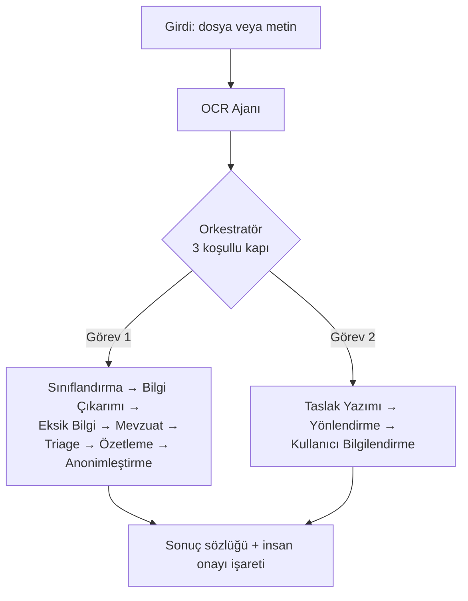

# Sık Sorulan Sorular (SSS) ❓

Bu sayfa, TEKNOFEST 2026 "Kamu Evrak ve Yazışma Süreçleri için Akıllı Agent Destek Sistemi" projesi hakkında jüri üyelerinden, geliştiricilerden ve değerlendiricilerden en sık gelen soruları soru-cevap biçiminde yanıtlar. Her cevap, ayrıntı için ilgili wiki sayfasına bağlantı verir.

> [!NOTE]
> **TL;DR** — Sistem 11 uzman ajan + 1 orkestratörden oluşur; **hiçbir LLM olmadan, tamamen çevrimdışı** uçtan uca çalışır (offline-first). Framework kullanmaz, saf Python'dur. Yalnızca **sentetik/kurgu veri** kullanır; gerçek kamu verisi asla işlenmez. LLM opsiyoneldir ve yalnızca düşük güvenli kararlarda devreye girer. Tüm metrikler `scripts/evaluate.py` ile ölçülür ve olduğu gibi raporlanır. Lisans Apache 2.0.

---

## 🔌 Çalışma Modeli ve Bağımlılıklar

### S: Sistem LLM (büyük dil modeli) olmadan çalışır mı?

**Evet, tamamen.** Sistemin çekirdek felsefesi *offline-first*'tür: 11 ajanın tamamı ve orkestratör, hiçbir LLM'e bağlanmadan uçtan uca çalışacak şekilde kural tabanlı olarak tasarlanmıştır. LLM yalnızca **opsiyonel bir iyileştirme katmanıdır** ve devreye yalnızca belirli düşük-güven durumlarında girer:

- **Sınıflandırma**, ham skor güveni `_ESKALASYON_ESIGI = 0.6` altına düştüğünde LLM'e eskalasyon dener.
- **Yönlendirme**, en iyi iki birim skoru birbirine çok yakınsa (`LLM_ESIK = 0.15`, fark < %15) LLM'e danışır.
- **Taslak/özet** ajanları, LLM varsa üretken çıktı; yoksa kural tabanlı çıktı üretir.

Her durumda LLM erişilemezse sistem sessizce ve zarifçe kural tabanlı sonuca döner (graceful degradation). Ayrıntı: [Orkestratör ve Koşullu Kapılar](Orkestratör-ve-Koşullu-Kapılar) ve [Model Bilgileri ve LLM Ekosistemi](Model-Bilgileri).

> [!IMPORTANT]
> Doğrulanmış tüm ölçümler (bkz. [Değerlendirme ve Metrikler](Değerlendirme-ve-Metrikler)) **offline backend / LLM kullanılamıyor** durumunda alınmıştır. Yani raporlanan doğruluk, süre ve kalite değerleri LLM'in olmadığı en zorlu senaryonun sonuçlarıdır.

### S: İnternet bağlantısı gerekir mi?

**Hayır.** Çekirdek işlevsellik için internet gerekmez. Tüm çekirdek bağımlılıklar `requirements.txt` içindedir ve LLM/embedding modelleri olmadan tam işlevsellik korunur. İnternet yalnızca opsiyonel bir bulut LLM'i (OpenAI-uyumlu API) kullanmayı seçerseniz gerekir; yerel Ollama veya tam offline modda ağ trafiği oluşmaz.

Ayrıca gizlilik/KVKK için katı bir kilit vardır: `APP_OFFLINE=1` ortam değişkeni (`1`/`true`/`yes` değerlerinden biri) ayarlandığında hiçbir prompt veya evrak metni dışarı gönderilmez; sistem koşulsuz offline modda kalır. Ayrıntı: [Kurulum ve Yapılandırma](Kurulum-ve-Yapılandırma).

### S: Hangi Python bağımlılıkları zorunlu, hangileri opsiyonel?

İki katmanlı bir disiplin vardır:

| Katman | Dosya | İçerik |
|---|---|---|
| Çekirdek | `requirements.txt` | Offline-first çalışma için gereken minimal bağımlılıklar |
| Opsiyonel | `requirements-optional.txt` | OCR (Tesseract/EasyOCR/OpenCV), semantik arama (sentence-transformers), PDF üretimi (reportlab), Streamlit vb. |

Örneğin görüntü OCR (`cv2`, `pytesseract`, `easyocr`, `pdf2image`, `pypdf`) tamamen opsiyoneldir; bunlar yoksa `.txt`/`.md` metin yolu hiç etkilenmez (zarif düşüm). Aynı şekilde hibrit mevzuat RAG'in yoğun (dense) semantik ve yeniden-sıralama katmanları da varsayılan **kapalıdır** ve yalnızca istenirse (`EMBEDDING_SEMANTIK_AKTIF=1`, `EMBEDDING_RERANK_AKTIF=1`) açılır. Ayrıntı: [Kurulum ve Yapılandırma](Kurulum-ve-Yapılandırma).

---

## 🧠 Modeller ve Mimari

### S: Hangi LLM modelleri destekleniyor?

LLM katmanı **model-agnostiktir** ve harici SDK gerektirmez — yalnızca stdlib `urllib` ile HTTP çağrısı yapar. Üç backend otomatik tespit edilir (`src/models/llm_wrapper.py`):

| Backend | Varsayılan Model | Notlar |
|---|---|---|
| OpenAI-uyumlu API | `gpt-4o-mini` | `/chat/completions`, `response_format=json_object` |
| Yerel Ollama | `qwen2.5:7b` | `/api/chat`, `format=json`, tamamen yerel |
| Offline | — | Hiçbir model yok; kural tabanlı mod |

Tespit önceliği: `APP_OFFLINE` kilidi → açık `LLM_BACKEND` → API anahtarı/base_url → Ollama erişilebilirliği → offline. Katman yalnızca hazır API'lere istek gönderen bir *inference-only* sarmalayıcıdır; hiçbir eğitim/fine-tune yolu yoktur. Opsiyonel RAG modelleri (varsayılan **kapalı**) ise `turkish-e5-large` (MIT) ve `bge-reranker-v2-m3` (Apache 2.0)'dur. Ayrıntı: [Model Bilgileri ve LLM Ekosistemi](Model-Bilgileri) ve [Mevzuat RAG ve Hibrit Arama](Mevzuat-RAG-ve-Hibrit-Arama).

### S: Neden bir framework (LangChain, LlamaIndex, CrewAI vb.) kullanılmadı?

Bilinçli bir tasarım kararıdır. Sistem **framework'süz, saf Python** ile yazılmıştır. Gerekçeler:

- **Offline-first ve bağımlılık minimizasyonu** — Çekirdek, ağır üçüncü taraf ajan framework'lerine bağımlı olmadan çalışır; kurulum yükü ve tedarik zinciri riski düşer.
- **Şeffaflık ve denetlenebilirlik** — Orkestratör akışı, koşullu kapılar ve ajan sözleşmeleri doğrudan okunabilir Python kodudur; "kara kutu" davranış yoktur.
- **Yarışma on-prem kısıtı** — Kamu kurumu senaryosunda yerel/kurum içi kurulabilirlik ve ücretsiz çalışabilirlik önceliklidir.

11 ajan, paylaşılan bir `AgentState` (`@dataclass`) üzerinden orkestratör tarafından koordine edilir. Ayrıntı: [Sistem Mimarisi](Sistem-Mimarisi) ve [Geliştirici Rehberi](Geliştirici-Rehberi).

### S: Kaç ajan var ve ne iş yaparlar?

**11 uzman ajan + 1 orkestratör.** Akışın özeti:

Ajanlar: OCR, Sınıflandırma, Bilgi Çıkarımı, Eksik Bilgi, Mevzuat, Özetleme, Taslak Yazımı, Yönlendirme, Kullanıcı Bilgilendirme, Triage (önceliklendirme) ve Anonimleştirme (KVKK). Akış düz sıralı bir zincir değil, koşullu 3 kapılı bir yapıdır. Ayrıntı: [Uzman Ajanlar](Uzman-Ajanlar).

---

## 🔒 Veri, KVKK ve Gizlilik

### S: Gerçek kamu verisi kullanılıyor mu?

**Kesinlikle hayır.** Şartname ve proje anayasası gereği yalnızca **sentetik/kurgu veri** kullanılır. Kurgu TCKN'ler resmi checksum algoritmasını geçer ama hiçbir gerçek kişiye atanamayacak aralıktan seçilir. Gerçek PII (kişisel veri) üretmek, kopyalamak veya sızdırmak yasaktır (KVKK ilkesi). Veri kökeni, bileşimi ve hijyeni Gebru vd. (2021) datasheet biçiminde belgelenmiştir. Ayrıntı: [Veri Setleri](Veri-Setleri) ve [Anayasal İlkeler ve Etik](Anayasal-İlkeler-ve-Etik).

### S: KVKK maskeleme güvenilir mi? Nasıl doğrulanıyor?

Anonimleştirme ajanı **9 kişisel-veri kategorisini** format koruyan ve geri döndürülemez biçimde maskeler: `tc_kimlik`, `telefon`, `eposta`, `iban`, `kisi_adi`, `adres`, `plaka`, `dogum_tarihi`, `sicil_no`. Maskeleme tamamen kural tabanlı ve çevrimdışıdır; dayanağı **6698 sayılı KVKK md. 4** (ölçülülük) ve **md. 8** (aktarma şartları)'dır.

Güvenilirliği **bağımsız bir sızıntı denetçisi** (`src/utils/kvkk_denetim.py`) ile nicel olarak ölçülür: anonim metinde maskelenmeden kalan PII desenleri kategori bazında sayılır. Doğrulanmış ölçüm:

> [!NOTE]
> **KVKK sızıntısı: beş veri setinin tamamında 0 kaçak** (sızıntısız oran 1.0).

Denetçi, ajanla aynı desenleri paylaşmaz; kendi bağımsız (ve daha gevşek) desenlerini kullanır ki maskeleme kalitesi tarafsız ölçülsün. "Şüphede maskele" ilkesi gereği paylaşım nüshasında sızıntı, aşırı maskelemeden daha ağır bir ihlal kabul edilir. Ayrıntı: [KVKK ve Anonimleştirme](KVKK-ve-Anonimleştirme).

### S: Evrak metni loglara veya dış servislere sızar mı?

Hayır. REST API sunucu loglarına **evrak metni yazılmaz** (yalnızca istek satırı, durum kodu ve IP). Offline modda hiçbir prompt dışarı gönderilmez. Bulut LLM'i açıkça seçilirse bu durum uyarı olarak loglanır ve tam gizlilik için `APP_OFFLINE=1` önerilir. LLM'e gönderilen evrak metni ayrıca `belge_blogu` ile "yalnızca veri" olarak işaretlenerek dolaylı prompt injection'a (OWASP LLM01) karşı korunur. Ayrıntı: [REST API](REST-API) ve [MCP Sunucusu](MCP-Sunucusu).

---

## 📊 Metrikler ve Değerlendirme

### S: Metrikler neden bazı setlerde %100 değil?

Bu bir kusur değil, **dürüstlük göstergesidir**. Gerçek işlevsel zorluk barındıran ve bilinçli olarak zorlaştırılmış (adversarial) setlerde sistem beklendiği gibi bir miktar hata yapar; bunlar gizlenmeden olduğu gibi raporlanır. Doğrulanmış metrikler (git commit `08616ff`, offline backend / LLM kullanılamıyor durumu):

| Set | Evrak | Sınıflandırma (acc) | Yönlendirme (acc) | Eksik Bilgi (micro-F1) | Taslak Kalitesi (0-100) |
|---|---|---|---|---|---|
| Geliştirme | 52 | 1.0 | 0.9615 | 1.0 | 93.6 |
| Tutulmuş | 16 | 1.0 | 1.0 | 1.0 | 95.8 |
| Tutulmuş v2 | 16 | 1.0 | 0.9375 | 1.0 | 94.6 |
| Adversarial v3 | 16 | 0.9375 | 1.0 | 0.8333 | 95.8 |
| Adversarial-temiz v4 | 16 | 0.9375 | 0.9375 | 1.0 | 94.7 |

v3/v4 setlerindeki 0.9375 sınıflandırma doğruluğu (macro-F1 0.9333), gürültülü/çekişmeli girdilere karşı gerçekçi performansı gösterir. Geliştirme setindeki 0.9615 yönlendirme doğruluğundaki 2 hata (`cevap_yazisi_06`, `tutanak_06`) gerçek işlevsel belirsizliktir ve **etiket/kod değişikliği yapılmamıştır**. Ayrıntı: [Değerlendirme ve Metrikler](Değerlendirme-ve-Metrikler) ve [Adversarial Dayanıklılık](Adversarial-Dayanıklılık).

### S: "Held-out" (tutulmuş) set ne demek?

Held-out set, sistemin **geliştirilmesi sırasında hiç kullanılmayan**, yalnızca son ölçüm için ayrılmış bağımsız değerlendirme setidir. Amaç, ezberlemeyi (overfitting) elemek ve genelleme yeteneğini dürüstçe ölçmektir. Projede kesin bir disiplin uygulanır:

> [!WARNING]
> Held-out set üzerinde ölçülen bir hataya bakılarak kural/kod düzeltmesi yapılırsa, set **held-out niteliğini KAYBEDER**. Bu durum `docs/teknik_rapor.md` §5'e açıkça yazılmak **zorundadır**.

Bu ilke koda da gömülüdür: sıcaklık ölçekleme (temperature scaling) yalnızca geliştirme setinde öğrenilir, held-out setlerde yalnızca ölçüm yapılır. v3 seti geliştirme-bilgili sayıldığı için, temiz ölçüm amacıyla dokunulmamış **v4** seti ayrıca üretilmiştir. Ayrıntı: [Değerlendirme ve Metrikler](Değerlendirme-ve-Metrikler) ve [Veri Setleri](Veri-Setleri).

### S: Sonuçlar tekrarlanabilir mi?

Evet. Her değerlendirme raporuna makine-okunur bir **köken (provenance) mührü** gömülür (`src/utils/kosum_muhru.py`): git commit SHA + çalışma ağacı kirli bayrağı, Python sürümü, platform, `requirements.txt` sha256'sı ve değerlendirilen setin içerik hash'i. `data/processed/eval_report*.json` dosyaları elle düzenlenmez; yalnızca `scripts/evaluate.py` ile üretilir. Raporlara mutlak yol (makine/kullanıcı adı) sızmaz. Ayrıntı: [Test ve Sürekli Entegrasyon](Test-ve-Sürekli-Entegrasyon).

### S: Sistem gerçekten "akıllı" mı, yoksa sadece anahtar kelime mi sayıyor? (Ablasyon)

Bag-of-words baseline ile karşılaştırma (ablasyon) bunu nesnel olarak yanıtlar. Sınıflandırma doğruluğunda tam sistem, bilerek zayıf ama adil kurulmuş anahtar kelime baseline'ını her sette belirgin biçimde geçer:

| Set | Tam Sistem | Baseline |
|---|---|---|
| Geliştirme | 1.0 | 0.5385 |
| Tutulmuş | 1.0 | 0.375 |
| Tutulmuş v2 | 1.0 | 0.625 |
| Adversarial v3 | 0.9375 | 0.375 |
| Adversarial-temiz v4 | 0.9375 | 0.5 |

Fark, McNemar testiyle istatistiksel anlamlılık açısından değerlendirilir. Küçük örneklem (n=16) durumunda nokta tahminlerine Wilson skor ve bootstrap %95 güven aralıkları eklenir — geniş aralıklar bir kusur değil, dürüstlük göstergesidir. Ayrıntı: [Güven ve Ölçüm Katmanı](Güven-ve-Ölçüm-Katmanı).

---

## ⚡ Performans

### S: Sistem ne kadar hızlı?

Uçtan uca hat, geliştirme setinde evrak başına ortalama **0.2278 sn**, medyan **0.1355 sn** işleme süresine sahiptir; diğer setlerde medyan yaklaşık 0.08–0.16 sn aralığındadır.

> [!IMPORTANT]
> README rozetindeki "~88 evrak/sn" ifadesi **sınıflandırma-hattı verimini** anlatır ve uçtan uca hat süresiyle karıştırılmamalıdır. Uçtan uca hat için evrak başına **0.1–0.5 sn** aralığını esas alın.

Bu, "gerçek zamana yakın sonuç üretme" beklentisini karşılar — ki bu, demo değerlendirmesinde önemli bir avantajdır. Sistem tamamen saf Python/regex tabanlı olduğundan tepe bellek kullanımı da düşüktür. Ayrıntı: [Değerlendirme ve Metrikler](Değerlendirme-ve-Metrikler).

### S: Kaç test var?

Depo CI rozetine göre **632 test** geçmektedir; `pytest tests/` ile doğrulanır. Ayrıntı: [Test ve Sürekli Entegrasyon](Test-ve-Sürekli-Entegrasyon).

---

## 🏛️ Şartname, Kapsam ve Güven

### S: Sistem TEKNOFEST şartnamesine nasıl uyuyor?

Şartnamenin her gereksinimi bir kanıt dosyasıyla eşlenir (bkz. [Şartname Uyum Matrisi](Şartname-Uyum-Matrisi)). Temel uyum eksenleri:

- **Görev 1** (okuma, sınıflandırma, içerik analizi, eksik bilgi) → [Görev 1 — Okuma, Sınıflandırma ve İçerik Analizi](Görev-1-Okuma-ve-Analiz)
- **Görev 2** (taslak üretimi, birim yönlendirme) → [Görev 2 — Taslaklama ve Birim Yönlendirme](Görev-2-Taslak-ve-Yönlendirme)
- **Türkçe zorunluluğu**, **açık kaynak (Apache 2.0)**, **sentetik veri**, **offline-first** — hepsi karşılanır.

İki görev de zorunludur; tek görevi bozan değişiklik kabul edilemez ve sistem tek görev eksikse tamamlanmış sayılmaz.

### S: Resmî yazı taslakları gerçekten yönetmeliğe uygun mu?

Evet. Taslaklar **Resmî Yazışma Yönetmeliği'ne (RG 10.06.2020/31151)** dayalı madde-referanslı bir kontrol listesinden geçer (`_validate_format`); her kural gerçek bir yönetmelik fıkrasına bağlanır (ör. T.C. başlığı m.10/2, sayı alanı m.11/1, kapanış m.16/12, imza m.17). Uydurma madde atfı yapılmaz. Ayrıca:

- Sayı numarası **uydurulmaz** — `(TASLAK — sayı EBYS tarafından verilecektir)` ibaresi yazılır.
- Sahte logo/mühür eklenmez; gizlilik dereceli evrakta insan onayı zorunludur.
- Taslak üretimi hibrittir (LLM adayı + her zaman güvenli kural tabanlı şablon adayı); en yüksek format skorlu aday seçilir (*keep-best*), böylece kalite asla düşmez. LLM taslağı hedef skorun altındaysa başarısız kurallardan geri bildirim üretilip bir tur daha yazdırılır (Reflexion/Self-Refine).
- Bağımsız bir kalite hakemi taslağı 0–100 ölçeğinde puanlar; mevzuat temellilik her iki yolda da deterministik kalır (halüsinasyonu halüsinasyonla denetlememek için).

Ayrıntı: [Görev 2 — Taslaklama ve Birim Yönlendirme](Görev-2-Taslak-ve-Yönlendirme).

### S: Sistem yanlış karar verirse ne olur? İnsan devrede mi?

Evet, tasarım *insan-döngüde* (human-in-the-loop) ilkesine dayanır. Orkestratörün üç koşullu kapısı vardır:

1. **Okunabilirlik kapısı** — anlamlı karakter (harf/rakam) sayısı `_MIN_ANLAMLI_KARAKTER = 30` altındaysa analiz/taslak adımları atlanır ve insan onayı işaretlenir.
2. **Dil kapısı** — metin Türkçe görünmüyorsa taslak üretimi atlanır (sınıflandırma/analiz yine çalışır).
3. **Düşük güven kapısı** — sınıflandırma veya yönlendirme güveni `_INSAN_ONAYI_GUVEN_ESIGI = 0.6` altındaysa "insan onayı gerekli" işareti + gerekçeler konur.

Düşük güvende karar **bloklanmaz**; sadece insan kontrolü önerilir. Çapraz tutarlılık denetimi ve emsal-tabanlı (CBR) öneri de yalnızca *advisory*'dir — kararı ezmez. Ayrıca güven/ölçüm katmanı (kalibrasyon, seçici tahmin, konformal tahmin) belirsizliği nicelleştirir. Ayrıntı: [Orkestratör ve Koşullu Kapılar](Orkestratör-ve-Koşullu-Kapılar) ve [Güven ve Ölçüm Katmanı](Güven-ve-Ölçüm-Katmanı).

### S: Süreli evraklar (yasal cevap süreleri) nasıl takip ediliyor?

Triage ajanı üç sinyal katmanıyla aciliyet ve yasal süreyi tespit eder: (1) aciliyet damgaları (`ÇOK İVEDİ`/`İVEDİ`/`GÜNLÜDÜR`/`SÜRELİDİR`), (2) metin içi açık/göreli süre, (3) yasal süre tablosu. Tablodaki dayanaklar:

| Süre türü | Dayanak | Süre |
|---|---|---|
| Bilgi edinme | 4982 s.K. m.11 | 15 iş günü |
| CİMER başvurusu | 3071/4982 çerçevesi | 30 gün |
| İdari dava/itiraz | 2577 İYUK m.7 | 60 gün |
| Dilekçe cevabı | 3071 s.K. m.7 | 30 gün |

Son işlem tarihi iş günü hesabıyla (hafta sonu + resmî tatiller atlanarak) hesaplanır. Öncelik skoru, sinyallerin toplamı değil **azamisidir** (en güçlü kanıt kazanır); birden fazla aday son tarih varsa en erken olan bağlayıcıdır. Evrak tarihi tespit edilemezse süreler halüsinasyon yerine şeffaf bir "not" alanıyla boş bırakılır. Ayrıntı: [Triage ve Akıllı Önceliklendirme](Triage-ve-Önceliklendirme).

---

## 🛠️ Uyarlama ve Entegrasyon

### S: Sistemi kendi kurumuma nasıl uyarlarım?

Ana uyarlama noktaları kod içindeki açık sözlük ve tablolardır:

- **Yönlendirme birimleri** — `src/agents/routing_agent.py` içindeki `BIRIMLER` sözlüğü (varsayılan 9 kamu birimi: Yazı İşleri, Hukuk, İnsan Kaynakları, Mali Hizmetler, Bilgi İşlem, Strateji, Basın ve Halkla İlişkiler, Destek Hizmetleri, Genel Müdürlük). Kurumunuzun birim adlarını ve anahtar kelime ağırlıklarını buradan güncelleyin.
- **Mevzuat korpusu** — `data/raw/mevzuat_metinleri/` altındaki `*.txt` dosyaları dinamik yüklenir; kendi yönetmeliklerinizi ekleyebilirsiniz.
- **Resmî tatiller** — `TriageAgent(resmi_tatiller=...)` ile kuruma özgü ek tatiller (ör. dinî bayramlar) verilebilir.
- **Şablonlar** — `src/templates/` altındaki 5 resmî yazı şablonu.
- **Yapılandırma** — `src/config.py` ve `.env` ile LLM/OCR/embedding ayarları.

Yeni bir ajan eklemek için: [Geliştirici Rehberi](Geliştirici-Rehberi). Entegrasyon için [REST API](REST-API) (stdlib `http.server`, 5 uç nokta) veya [MCP Sunucusu](MCP-Sunucusu) (JSON-RPC 2.0 stdio, 5 araç) kullanılabilir.

### S: EBYS gibi kurumsal sistemlere bağlanabilir mi?

Evet. Sıfır ek bağımlılıklı REST API (`src/api.py`) EBYS entegrasyonu için tasarlanmıştır: `POST /evrak/isle`, `POST /evrak/anonimlestir`, `GET /saglik`, `GET /birimler`, `GET /evrak-turleri`. İstek/yanıt UTF-8 JSON'dur ve API tamamen offline/LLM'siz çalışabilir. Ayrıca e-Yazışma Paketi'nden **esinlenen** bir üstveri taslağı üreticisi ve kurgu-DETSIS belge sayısı üretimi mevcuttur (birebir resmî şema değil; sayılar/DETSIS kurgudur). Ayrıntı: [REST API](REST-API).

### S: Hangi dosya formatları destekleniyor?

`.txt`/`.md` (doğrudan okuma), `.pdf` (pypdf ile metin çıkarımı, metin çıkmazsa OCR'a düşer) ve görüntüler (`.png/.jpg/.jpeg/.tiff/.tif/.bmp`, adaptif ön-işleme + Tesseract/EasyOCR). Görüntü OCR'ında kelime güvenlerinden bir kalite telemetrisi üretilir (düşük kalitede insan onayına yönlendiren "4. kapı" sinyali). Kaynak tüketimi saldırılarına karşı sayfa/piksel/DPI üst sınırları uygulanır. Ayrıntı: [Görev 1 — Okuma, Sınıflandırma ve İçerik Analizi](Görev-1-Okuma-ve-Analiz).

### S: Nereden başlamalıyım?

5 dakikada kurulum ve ilk evrak işleme için [Hızlı Başlangıç](Hızlı-Başlangıç) sayfasına bakın. Görsel deneyim için kurumsal sunum panosu "Evrak Zekâ"yı (`streamlit run app.py`) veya klasik canlı ajan hattını (`streamlit run src/app.py`) çalıştırabilirsiniz — bkz. [Web Arayüzü — Evrak Zekâ](Web-Arayüzü). Komut satırı için [Komut Satırı (CLI) ve Demo](Komut-Satırı-ve-Demo).

---

## İlgili Sayfalar

- [Proje Hakkında](Proje-Hakkında) — Problem, çözüm ve yenilik modüllerinin genel tanıtımı
- [Hızlı Başlangıç](Hızlı-Başlangıç) — Kurulum ve ilk evrak
- [Değerlendirme ve Metrikler](Değerlendirme-ve-Metrikler) — Tüm doğrulanmış metrikler ve held-out disiplini
- [Şartname Uyum Matrisi](Şartname-Uyum-Matrisi) — Madde madde kanıt haritası
- [Model Bilgileri ve LLM Ekosistemi](Model-Bilgileri) — Desteklenen modeller ve lisanslar
- [Sözlük (Kavramlar)](Sözlük) — Teknik ve resmî yazışma terimleri
