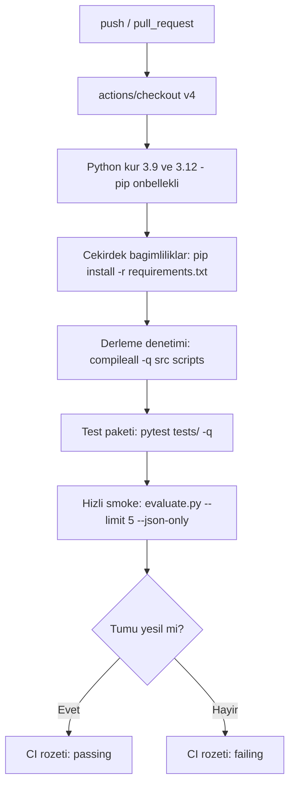

# Test ve Sürekli Entegrasyon 🧪

Bu sayfa, projenin test felsefesini, `tests/` altındaki **42 test dosyasında** toplanan test takımını (depo CI rozetine göre **632 test**), GitHub Actions sürekli tümleştirme (CI) iş akışını ve kalite kapılarını belgeler. Amaç, offline-first hibrit mimarinin her katmanının otomatik olarak doğrulanması ve jüri/geliştirici için tekrarlanabilir bir güvence zinciri sunmaktır.

> [!NOTE]
> **TL;DR** — Test paketi `pytest tests/` ile çalışır; depo CI rozetine göre **632 test** geçer. Testler üç düzeydedir: birim (her ajan/yardımcı modül izole), uçtan uca (11-ajan orkestrasyonu tam hat) ve metamorfik (etiket-koruyan bozulmalar altında invaryans). CI (`.github/workflows/ci.yml`) her `push` ve `pull_request`'te Python 3.9 ve 3.12 üzerinde derleme denetimi + testler + 5 evraklık hızlı değerlendirme smoke'u çalıştırır. Değerlendirme bütünlüğü, held-out disiplini ve göreli yol kuralları CI seviyesinde korunur.

---

## Test Felsefesi

Sistem, saf Python ve framework'süz bir çekirdek üzerine kuruludur; bu yüzden test stratejisi de dış bağımlılık olmadan (sklearn/numpy gibi kütüphaneler gerektirmeden) hızlı ve deterministik çalışacak biçimde tasarlanmıştır. Üç tamamlayıcı test düzeyi vardır:

- **Birim testleri (unit)** — Her ajan ve her yardımcı modül, komşularından yalıtılmış olarak tek tek doğrulanır. Örneğin sınıflandırma eşikleri, TCKN checksum'ı, BM25 skorlaması, kalibrasyon (ECE) hesabı, KVKK maskeleme biçimleri, triage yasal süre tablosu birer birer test edilir.
- **Uçtan uca testleri (end-to-end)** — [Orkestratör ve Koşullu Kapılar](Orkestratör-ve-Koşullu-Kapılar) katmanı; 11 ajanın koşullu akışta doğru sırayla çalıştığı (örneğin triage'ın summarization'dan önce çalışması), 3 kapının (okunabilirlik/dil/düşük güven) doğru tetiklendiği ve nihai çıktı sözlüğünün şema bütünlüğünü koruduğu tam hat üzerinde sınanır.
- **Metamorfik testleri (invariance)** — [Adversarial Dayanıklılık](Adversarial-Dayanıklılık) yaklaşımıyla; diyakritik katlama, boşluk/noktalama gürültüsü, yazım transpozisyonu ve OCR-benzeri ikame gibi etiket-koruyan bozulmalar altında kararın değişmemesi (tür/birim invaryansı) ölçülür.

> [!IMPORTANT]
> Bu proje "önce test edilebilirlik" ilkesini benimser: değerlendirme metriklerini hesaplayan fonksiyonlar (`scripts/evaluate.py`) pipeline importundan **bilinçle ayrılmıştır**, böylece `tests/test_evaluation.py` metrik doğruluğunu ağır pipeline yüklemeden test edebilir. Aynı biçimde `scripts/benchmark.py` metrik fonksiyonları da `tests/test_benchmark.py` ile bağımsız test edilir.

### Neden bu üç düzey?

Kamu evrak akışında bir hata tek bir ajanda değil, ajanlar arası **etkileşimde** doğabilir (örneğin triage'ın summarization'dan önce çalışması gerekliliği, ya da düşük güvende insan onayı işaretinin taslak üretimini nasıl etkilediği). Birim testleri bileşen doğruluğunu; uçtan uca testleri orkestrasyon sözleşmesini; metamorfik testleri ise gerçek dünyadaki OCR gürültüsü ve yazım varyasyonuna karşı gürbüzlüğü kanıtlar. Üçü birlikte, hiçbir katmanın sessizce bozulmadığını güvence altına alır.

---

## Testler Nasıl Çalıştırılır?

```bash
# Tüm test paketi (sessiz mod)
pytest tests/ -q

# Tek bir alt sistemin testleri
pytest tests/test_triage.py -q
pytest tests/test_anonimlestirme.py -q

# Tek bir test fonksiyonu
pytest tests/test_classification.py::test_dilekce_siniflandirma -q

# Ayrıntılı çıktı + ilk hatada dur
pytest tests/ -v -x

# Metamorfik dayanıklılık koşucusu (test paketinden ayrı, CLI)
python scripts/dayaniklilik_testi.py
```

> [!NOTE]
> Çekirdek testler yalnızca `requirements.txt` bağımlılıklarıyla çalışır. Opsiyonel bileşenlere (reportlab PDF, cv2 görüntü ön-işleme, semantik/rerank modelleri) dokunan testler, bağımlılık yoksa **zarifçe atlanır** (skip) — offline-first ilkesi test katmanında da korunur. `python -m src.mcp_server` gibi stdlib tabanlı arayüzler için ilgili testler ek bağımlılık olmadan tam çalışır.

---

## Test Dosyaları Haritası

Aşağıdaki tablolar, 42 test dosyasını sorumlu oldukları alt sisteme göre eşler. Her satır, ilgili wiki sayfasına ve test edilen kaynak modüle bağlanır.

### Görev 1 — Okuma, Sınıflandırma ve İçerik Analizi

| Test dosyası | Kapsanan alt sistem | İlgili kaynak |
|---|---|---|
| `tests/test_goruntu_onisleme.py` | OCR görüntü ön-işleme (deskew/ölçekleme/eşikleme, OCR kalite telemetrisi) | `src/utils/goruntu_onisleme.py` |
| `tests/test_classification.py` | Hibrit sınıflandırma (kural + NB + LLM eskalasyon) | `src/agents/classification_agent.py` |
| `tests/test_istatistiksel_siniflandirici.py` | Saf-Python Multinomial Naive Bayes, TF-IDF, karakter 3-gram | `src/models/istatistiksel_siniflandirici.py` |
| `tests/test_baseline.py` | Bilerek zayıf bag-of-words referans (ablasyon/İkiz Ekran) | `src/utils/baseline.py` |
| `tests/test_ilgi_sozel_tarih_kvkk.py` | İlgi bloğu ayrımı, sözel tarih çözümü, bilgi çıkarım uç durumları | `src/agents/info_extraction_agent.py` |
| `tests/test_turkce_ner.py` | 81-il gazetteer YER NER'i | `src/utils/turkce_ner.py` |
| `tests/test_ozet_kalite.py` | Özet sadakati, kaynak kapsama, sıkıştırma, ROUGE-L | `src/utils/ozet_kalite.py` |

Ayrıntı: [Görev 1 — Okuma ve Analiz](Görev-1-Okuma-ve-Analiz).

### Mevzuat RAG ve Hibrit Arama

| Test dosyası | Kapsanan alt sistem | İlgili kaynak |
|---|---|---|
| `tests/test_legislation.py` | BM25 hibrit arama, düzeltici sorgu, tema/tür ağırlıklandırma, KVKK köprüsü | `src/agents/legislation_agent.py`, `src/utils/bm25.py` |
| `tests/test_emsal.py` | Kayıt defteri üzerinde emsal (kurumsal hafıza) araması | `src/utils/emsal.py` |
| `tests/test_emsal_cbr.py` | Case-Based Reasoning çoğunluk önseli (advisory) | `src/utils/emsal_cbr.py` |

Ayrıntı: [Mevzuat RAG ve Hibrit Arama](Mevzuat-RAG-ve-Hibrit-Arama).

### Görev 2 — Taslaklama ve Birim Yönlendirme

| Test dosyası | Kapsanan alt sistem | İlgili kaynak |
|---|---|---|
| `tests/test_draft_writer.py` | Taslak üretimi, keep-best, format denetim listesi (yönetmelik kuralları) | `src/agents/draft_writer_agent.py` |
| `tests/test_taslak_hakemi.py` | Bağımsız 0-100 kalite hakemi (biçim/üslup/temellilik) | `src/utils/taslak_hakemi.py` |
| `tests/test_taslak_reflexion.py` | Reflexion/Self-Refine sözlü geri bildirim üretimi | `src/utils/taslak_reflexion.py` |
| `tests/test_resmi_pdf.py` | Resmî görsel formatta PDF üretimi (opsiyonel reportlab) | `src/utils/resmi_pdf.py` |

Ayrıntı: [Görev 2 — Taslak ve Yönlendirme](Görev-2-Taslak-ve-Yönlendirme).

### Yenilik Modülleri (Triage, KVKK, Güven/Ölçüm)

| Test dosyası | Kapsanan alt sistem | İlgili kaynak |
|---|---|---|
| `tests/test_triage.py` | Aciliyet damgaları, metin içi süre, yasal süre tablosu, iş günü hesabı | `src/agents/triage_agent.py` |
| `tests/test_anonimlestirme.py` | 9 kategori format-koruyan KVKK maskeleme | `src/agents/anonimlestirme_agent.py` |
| `tests/test_kvkk_denetim.py` | Bağımsız sızıntı (kaçak) denetçisi | `src/utils/kvkk_denetim.py` |
| `tests/test_kalibrasyon.py` | ECE/MCE/Brier + temperature scaling | `src/utils/kalibrasyon.py` |
| `tests/test_secici_tahmin.py` | Reject option, kapsama/risk, belirsizlik skoru | `src/utils/secici_tahmin.py` |
| `tests/test_konformal.py` | Split conformal prediction (LAC) | `src/utils/konformal.py` |
| `tests/test_metamorfik.py` | Etiket-koruyan perturbasyon kütüphanesi (CheckList-INV) | `src/utils/metamorfik.py` |
| `tests/test_tutarlilik.py` | Çapraz tutarlılık denetimi (multi-agent verification) | `src/utils/tutarlilik_denetimi.py` |
| `tests/test_oz_tutarlilik.py` | Öz-tutarlılık çoğunluk oyu (self-consistency) | `src/utils/oz_tutarlilik.py` |
| `tests/test_istatistik.py` | Wilson/bootstrap güven aralığı, McNemar | `src/utils/istatistik.py` |
| `tests/test_kanit.py` | Kanıt/attribution vurgu span'leri | `src/utils/kanit.py` |
| `tests/test_bulanik.py` | Damerau-Levenshtein bulanık eşleme | `src/utils/bulanik.py` |
| `tests/test_adillik.py` | Karşı-olgusal (counterfactual) değişmezlik/adillik | `docs/adillik_beyani.md` kapsamı |

Ayrıntı: [Triage ve Önceliklendirme](Triage-ve-Önceliklendirme), [KVKK ve Anonimleştirme](KVKK-ve-Anonimleştirme), [Güven ve Ölçüm Katmanı](Güven-ve-Ölçüm-Katmanı).

### Değerlendirme, Altyapı ve Arayüzler

| Test dosyası | Kapsanan alt sistem | İlgili kaynak |
|---|---|---|
| `tests/test_evaluation.py` | Saf-Python metrik fonksiyonları (accuracy, macro/micro F1, isabet@k, MRR/nDCG) | `scripts/evaluate.py` |
| `tests/test_benchmark.py` | Gecikme yüzdelikleri, throughput, ölçekleme doğrusallığı | `scripts/benchmark.py` |
| `tests/test_kosum_muhru.py` | Tekrarlanabilirlik mührü (git commit + hash) | `src/utils/kosum_muhru.py` |
| `tests/test_kayit_defteri.py` | SQLite denetim izi, parametreli SQL, şema göçü | `src/utils/kayit_defteri.py` |
| `tests/test_iliski_zinciri.py` | Evraklar arası yazışma zinciri tespiti | `src/utils/iliski_zinciri.py` |
| `tests/test_kokpit_eyazisma.py` | Kurum kokpiti + e-Yazışma üstveri taslağı | `src/utils/kokpit.py`, `src/utils/eyazisma.py` |
| `tests/test_sayi_ustveri.py` | Kurgu sayı üretimi (m.11 biçim) + üstveri | `src/utils/sayi_uretici.py` |
| `tests/test_eyazisma_xml.py` | e-Yazışma XML çıktısı ve tutarlılık | `src/utils/eyazisma.py` |
| `tests/test_end_to_end.py` | Tam 11-ajan orkestrasyonu (uçtan uca) | `src/agents/orchestrator.py`, `src/pipelines/end_to_end_pipeline.py` |
| `tests/test_streaming.py` | Canlı ajan hattı (on_step streaming geri-çağırımı) | `src/agents/orchestrator.py` |
| `tests/test_api.py` | REST API uç noktaları, boyut sınırları, hata kodları | `src/api.py` |
| `tests/test_mcp_server.py` | JSON-RPC 2.0 MCP sunucusu, 5 araç | `src/mcp_server.py` |
| `tests/test_llm_constrained.py` | Şema-kısıtlı JSON çözümleme, prompt injection savunması | `src/models/llm_wrapper.py` |
| `tests/test_asistan.py`, `tests/test_asistan_hesap.py` | Hibrit niyet motoru + hesap makinesi/LLM fallback | asistan katmanı |

Ayrıntı: [Değerlendirme ve Metrikler](Değerlendirme-ve-Metrikler), [REST API](REST-API), [MCP Sunucusu](MCP-Sunucusu), [Web Arayüzü](Web-Arayüzü).

> [!NOTE]
> Test **dosyası** sayısı ile test **fonksiyonu** sayısı farklıdır: 42 dosya, parametrize edilmiş durumlarla birlikte depo CI rozetine göre **632 test** olarak koşar. Kesin sayıyı görmek için CI rozetine veya `pytest tests/` özet satırına bakınız.

---

## Sürekli Tümleştirme (CI) İş Akışı

CI, `.github/workflows/ci.yml` dosyasında tanımlıdır ve her `push` ve `pull_request` olayında tetiklenir. İş, Python **3.9** (proje taban sürümü) ve **3.12** (güncel sürüm) matrisinde `ubuntu-latest` üzerinde koşar; `fail-fast: false` sayesinde bir sürüm başarısız olsa da diğerinin sonucu görülür.



CI, çekirdek olarak üç ardışık adımdan oluşur; sonuç README'deki rozete yansır:

1. **Derleme denetimi** — `python -m compileall -q src scripts` ile tüm kaynak ve script dosyalarının sözdizimi ve Python 3.9 uyumu doğrulanır. Bu adım, testlerden önce hızlı bir "syntax gate" görevi görür.
2. **Test paketi** — `pytest tests/ -q` ile testlerin tamamı koşar.
3. **Hızlı değerlendirme smoke'u** — 5 etiketli sentetik evrak üzerinde `scripts/evaluate.py --limit 5 --json-only` çalıştırılarak uçtan uca boru hattının **gerçek dosya girdisiyle** (sentetik/kurgu evraklar) çalıştığı kanıtlanır. Bu, birim testlerinin yakalayamayacağı entegrasyon regresyonlarını yakalar.

### Değerlendirme bütünlüğü CI seviyesinde

> [!WARNING]
> Smoke adımı, raporu bilinçli olarak runner'ın geçici dizinine (`${{ runner.temp }}/eval_smoke.json`) yazar. Böylece depo içindeki `data/processed/eval_report.json` dosyasının **üzerine yazılması engellenir**. Bu, "eval_report*.json elle düzenlenmez; yalnızca `scripts/evaluate.py` ile üretilir" kuralının CI karşılığıdır ve değerlendirme kayıtlarının kaza sonucu bozulmasını önler.

CI'nin bir başka görünmez güvencesi, raporlara **mutlak yol sızmamasıdır**: `scripts/evaluate.py` içindeki `goreli_yol` yardımcısı yolları proje köküne göre göreli yazar, dolayısıyla CI runner'ının makine/kullanıcı adı JSON çıktısına karışmaz. Tekrarlanabilirlik mührü (`src/utils/kosum_muhru.py`) ise her rapora git commit SHA, Python/platform sürümü, `requirements.txt` sha256'sı ve veri seti içerik hash'ini gömer — CI ortamında da geçerlidir.

---

## Kalite Kapıları

Test paketinin ötesinde, projede kod ve doküman kalitesini koruyan ek kapılar bulunur:

- [ ] **Derleme kapısı (compileall)** — Python 3.9 + 3.12 çift sürüm uyumu; sözdizimi hatası CI'yi kırar.
- [ ] **Test kapısı (pytest)** — Test takımının tamamı yeşil olmalı; herhangi bir başarısızlık merge'i engeller.
- [ ] **Uçtan uca smoke kapısı** — 5 evraklık sentetik-veri değerlendirmesi hatasız tamamlanmalı.
- [ ] **Lisans/telif kapısı** — Tüm kaynak modül başlıklarında `Copyright 2026 AGENTRA TECH` + Apache-2.0 SPDX bildirimi bulunur; depo Apache 2.0 lisanslıdır ve model ağırlığı yüklenmez.
- [ ] **Güvenlik kapısı** — Yayın öncesi `pip-audit` "No known vulnerabilities found" döndürür; tehdit modeli ve bulgular [Anayasal İlkeler ve Etik](Anayasal-İlkeler-ve-Etik) sayfasında ve `docs/GUVENLIK_DENETIM_RAPORU.md` içinde belgelenir.
- [ ] **Markdown/doküman disiplini** — Teknik rapor, veri README ve datasheet gibi belgeler tutarlı biçimde tutulur; değişiklikler `CHANGELOG.md` içinde şartname izli olarak kaydedilir.

> [!IMPORTANT]
> Kalite kapılarının en katı olanı **değerlendirme bütünlüğüdür**: bir held-out set üzerinde ölçülen hataya bakılarak kural/kod düzeltilirse set held-out niteliğini kaybeder ve bu durum `docs/teknik_rapor.md` §5'e yazılmak zorundadır. Bu disiplin bir test tarafından otomatik zorlanmaz; ekip tarafından şeffaflık geleneği olarak sürdürülür ve `scripts/evaluate.py` içinde temperature scaling'in yalnızca geliştirme setinde öğrenilmesiyle koda gömülüdür.

---

## Kapsam Alanları

Test paketi, sistemin şu boyutlarını doğrular:

- **Doğruluk (correctness)** — Sınıflandırma, yönlendirme, eksik bilgi tespiti ve mevzuat önerisinin etiketli sentetik setler üzerinde beklenen çıktıyı üretmesi. Doğrulanmış metrikler için [Değerlendirme ve Metrikler](Değerlendirme-ve-Metrikler) sayfasına bakınız.
- **Gürbüzlük (robustness)** — Metamorfik/adversarial bozulmalar altında tür ve birim kararlarının değişmemesi; bkz. [Adversarial Dayanıklılık](Adversarial-Dayanıklılık).
- **Güvenlik** — REST API boyut sınırları (1 MB gövde), ReDoS-güvenli regex desenleri, prompt injection savunması (belge=veri ayrımı), PDF/görüntü bombası sınırları ve MCP hata sızıntısı engelleri.
- **KVKK uyumu** — 9 kategori maskeleme ve bağımsız sızıntı denetçisiyle sızıntısız (0 kaçak) güvencesi; bkz. [KVKK ve Anonimleştirme](KVKK-ve-Anonimleştirme).
- **Kalibrasyon ve belirsizlik** — ECE, reject option ve conformal kapsama garantilerinin sayısal doğruluğu.
- **Performans** — Gecikme yüzdelikleri (p50/p95/p99), throughput ve ölçekleme doğrusallığının benchmark testleriyle ölçülmesi.
- **Arayüz sözleşmeleri** — REST API, MCP sunucusu ve streaming ajan hattının istek/yanıt şemalarına uyumu.

> [!NOTE]
> Testler LLM erişilebilirliğinden bağımsızdır: doğrulanmış metrikler offline backend (LLM kullanılamıyor) durumunda ölçülmüştür. Böylece CI, harici API anahtarı olmadan ve internet erişimi gerektirmeden tam olarak koşar; bu, offline-first mimarinin en güçlü kanıtlarından biridir.

---

## Yeni Test Ekleme

Yeni bir ajan, yardımcı modül veya eşik eklerken izlenecek konvansiyonlar:

1. **Dosya adı** — `tests/test_<altsistem>.py` biçiminde; mevcut haritayla tutarlı, anlamlı Türkçe ad.
2. **İzolasyon** — Birim testi, test edilen modülü doğrudan import eder; ağır pipeline yüklemesinden kaçınılır (metrik/yardımcı fonksiyonlar zaten pipeline'dan ayrılmıştır).
3. **Determinizm** — Rastgelelik varsa sabit tohum kullanılır (örn. metamorfik perturbasyonlar tohum 1234 ile deterministiktir). Testler tekrarlanabilir olmalıdır.
4. **Offline uyum** — Opsiyonel bağımlılık (reportlab/cv2/semantik model) gerektiren test, bağımlılık yoksa `pytest.importorskip` veya skip ile zarifçe atlanmalıdır.
5. **Gerçek veri sızıntısı yok** — Testlerde yalnızca sentetik/kurgu veri kullanılır; kurgu TCKN'ler checksum'ı geçer ama gerçek kişiye ait olamaz (KVKK ilkesi).
6. **Şema uyumu** — Eksik bilgi testleri eklerken etiket anahtarları `src/agents/missing_info_agent.py` içindeki `ZORUNLU_ALANLAR` ile birebir uyumlu olmalıdır (örn. tutanak için `imzalar`, `imza` değil).

```bash
# Yeni test dosyasını yerelde koştur
pytest tests/test_yeni_altsistem.py -v

# CI ile aynı komutu yerelde taklit et (çift sürüm hariç)
python -m compileall -q src scripts && pytest tests/ -q
```

Geliştirme konvansiyonları ve mimari kararlar için [Geliştirici Rehberi](Geliştirici-Rehberi) sayfasına bakınız.

---

## İlgili Sayfalar

- [Değerlendirme ve Metrikler](Değerlendirme-ve-Metrikler) — `evaluate.py`, 5 set, doğrulanmış metrikler ve held-out disiplini
- [Adversarial Dayanıklılık](Adversarial-Dayanıklılık) — v3/v4 setler, metamorfik testler ve `dayaniklilik_testi.py`
- [Güven ve Ölçüm Katmanı](Güven-ve-Ölçüm-Katmanı) — Kalibrasyon, seçici tahmin, konformal ve tutarlılık modülleri
- [Geliştirici Rehberi](Geliştirici-Rehberi) — Kod yapısı, yeni ajan ekleme ve katkı konvansiyonları
- [Sistem Mimarisi](Sistem-Mimarisi) — Genel mimari, AgentState veri akışı ve dizin haritası
- [Anayasal İlkeler ve Etik](Anayasal-İlkeler-ve-Etik) — Güvenlik denetimi, değerlendirme bütünlüğü ve KVKK ilkeleri
