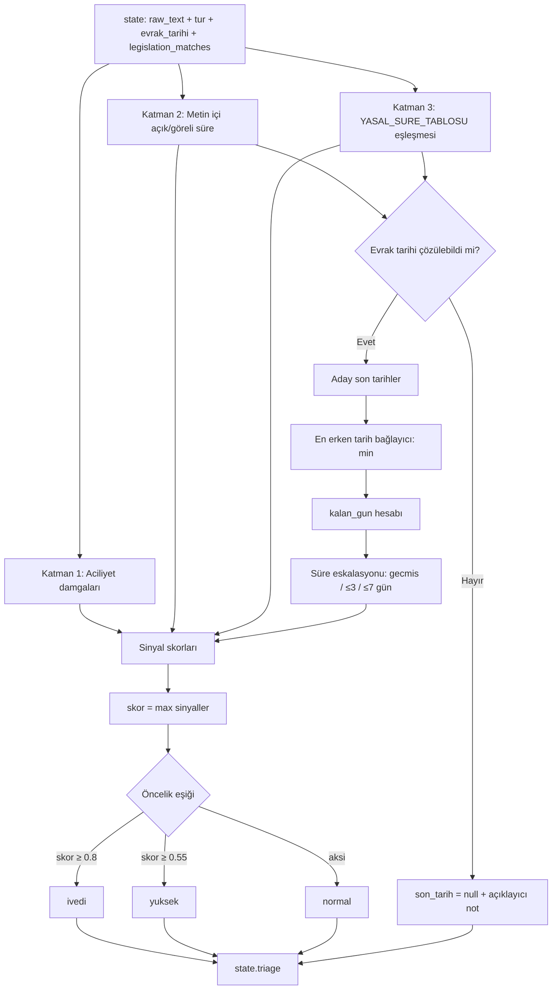

# Triage ve Akıllı Önceliklendirme ⏱️

Gelen evrakın aciliyetini ve yasal işlem süresini üç ilkesel sinyal katmanıyla tespit edip **son işlem tarihini**, **kalan günü** ve **öncelik sınıfını** hesaplayan önceliklendirme ajanı. Amaç, kamu kurumlarında süreli evrak takibini otomatikleştirip yasal cevap sürelerinin kaçırılmasını önlemektir.

> [!NOTE]
> **TL;DR** — `TriageAgent` (`src/agents/triage_agent.py`) üç katmandan sinyal toplar: (1) aciliyet damgaları (ÇOK İVEDİ / İVEDİ / ACELE / GÜNLÜDÜR / SÜRELİDİR), (2) metin içi açık ve göreli süre desenleri, (3) `YASAL_SURE_TABLOSU` (4982 s.K. m.11 → 15 iş günü; CİMER → 30 gün; 2577 İYUK m.7 → 60 gün; 3071 s.K. m.7 → 30 gün). Skor, sinyallerin **azamisi** (max) alınarak belirlenir; birden fazla aday tarih varsa **en erken** olan bağlayıcıdır. İş günü hesabı hafta sonu + sabit ulusal resmî tatilleri atlar. Ajan tamamen kural/regex tabanlıdır, **LLM kullanmaz** ve offline-first ilkesine uyar. Çıktı `state.triage` sözlüğüne yazılır.

Bu ajan, projenin özgün yenilik modüllerinden biridir: standart sınıflandırma/yönlendirme akışının ötesinde, **süreli evrak takibi** sorununu resmî/hukuki dayanaklara bağlayarak çözer. Sistemdeki yeri için [Sistem Mimarisi](Sistem-Mimarisi) ve [Uzman Ajanlar](Uzman-Ajanlar) sayfalarına bakabilirsiniz.

---

## Neden Triage? — Problem ve Tasarım Felsefesi

Kamu kurumlarında en sık yaşanan idari kusurlardan biri, yasal cevap sürelerinin kaçırılmasıdır. Bir bilgi edinme başvurusu 15 iş günü içinde, bir dilekçe 30 gün içinde, idari davaya konu bir tebligat 60 gün içinde işlem görmezse; bu yalnızca bir gecikme değil, hukuki sonuç doğuran bir eksikliktir. Triage ajanı bu riski otomatik olarak izler.

Tasarım, veri setine ezberlenmiş kalıplar yerine **ilkesel/resmî gerçekliğe** dayanır. Her kural resmî veya kamusal bir dayanağa bağlıdır (mevzuat maddesi, Resmî Yazışma Yönetmeliği, 2429 sayılı Ulusal Bayram ve Genel Tatiller Hakkında Kanun). Bu yaklaşım, [Anayasal İlkeler ve Etik](Anayasal-İlkeler-ve-Etik) sayfasındaki "halüsinasyon yasağı" ve "nesnellik/şeffaflık" ilkeleriyle doğrudan uyumludur: evrak tarihi tespit edilemediğinde ajan uydurma bir tarih üretmez, şeffaf bir `not` alanı bırakır.

Ajan, orkestratör akışında `classification`, `info_extraction` ve `legislation` ajanları çalıştıktan **sonra** devreye girer; çünkü tür, çıkarılan tarih ve mevzuat eşleşmesi girdilerine bağımlıdır. Not: yürütme sırasında triage, `summarization`'dan **önce** çalışır. Akıştaki tam konumu için [Orkestratör ve Koşullu Kapılar](Orkestratör-ve-Koşullu-Kapılar) sayfasına bakın.

---

## Genel Akış



İki temel ilke akışın tamamına hâkimdir:

- **Skor = azami (max), toplam değil.** En güçlü tek kanıt önceliği belirler; zayıf sinyaller birikip yanlış eskalasyon üretemez. (`skor = round(max(skorlar), 2)`)
- **En erken tarih bağlayıcıdır.** Birden çok aday son tarih varsa, süre kaçırma riski en erken tarihte doğduğu için `min()` seçilir.

---

## Katman 1 — Aciliyet Damgaları

Resmî yazışmada evrağın üzerine basılan aciliyet ibareleri (damgaları) taranır. Her damga sabit bir skora sahiptir; skor ne kadar yüksekse aciliyet o kadar güçlüdür.

| Damga (desen) | Skor | Açıklama |
|---|---|---|
| ÇOK İVEDİ (`\bçok\s+ivedi\b`) | **1.0** | En üst aciliyet |
| İVEDİ (`\bivedi\w*\b`) | **0.9** | Eklemeli biçimleri kapsar (ivedidir vb.) |
| ACELE (`\bacele\b`) | **0.85** | Acele ibaresi |
| GÜNLÜDÜR | **0.75** | Süreye bağlılık ibaresi |
| SÜRELİDİR | **0.75** | Süreye bağlılık ibaresi |

Kaynak: `src/agents/triage_agent.py` — `_ACILIYET_DAMGALARI`.

> [!IMPORTANT]
> **İki bilinçli kalibrasyon kararı:**
> - **'ÇOK İVEDİ' eşleşince yalın 'İVEDİ' deseni atlanır** (çift sinyal önleme). Böylece aynı ibare iki kez skora katkı yapmaz.
> - **'ACİL' sözcüğü bilinçli olarak sinyal sayılmaz.** "Acil durum planı" gibi konusal (tematik) kullanımlar yanlış pozitif ürettiği için damga listesine alınmamıştır. Buna karşılık `ivedi\w*` kökü, ekli biçimleri (ivedidir, ivedilikle) yakalar.

Bu katmanı yürüten metot: `TriageAgent._damga_sinyalleri`.

---

## Katman 2 — Metin İçi Açık ve Göreli Süre

Metnin gövdesinde geçen süre ifadeleri toplanır. İki tür süre desteklenir:

- **Açık son tarih:** Metinde doğrudan verilmiş bir tarih (ör. "…30.07.2026 tarihine kadar…").
- **Göreli süre:** Bir süre miktarı (ör. "on beş gün içinde"). Göreli süre, **evrak tarihine eklenerek** aday bir son tarihe çevrilir.

Bu katman **her evrak türünde** çalışır; başvuru koşulundan bağımsızdır. Yalnızca Katman 3 (yasal süre) başvuru niteliğine tabidir.

Metin içi açık/göreli süre için sinyal skoru: **`_SKOR_ACIK_SURE = 0.6`**.

### Türkçe Sayı Çözümleme

Göreli sürelerdeki sayılar hem rakamla hem yazıyla verilmiş olabilir. `_sayi_coz` modül fonksiyonu 1–99 aralığındaki sayıları hem ayrık ("on beş") hem bitişik ("onbeş") yazımla çözer.

- Göreli süre deseni (`_GORELI_SURE`) rakamla `\d{1,3}` (1–999) yakalar.
- Yazıyla verilen sayılar `_sayi_coz` ile 1–99 aralığında çözülür.
- "birkaç gün içinde" gibi **sayısal olmayan** ifadeler bilinçle elenir (`None` döner, sinyal üretmez) — belirsiz ifadeye somut süre atfetmemek için.

> [!WARNING]
> **Evrak tarihi yoksa göreli/yasal süre hesaplanamaz.** Evrak tarihi tespit edilemezse `son_tarih = null` olur ve açıklayıcı bir `not` alanı üretilir. Bu, [Anayasal İlkeler ve Etik](Anayasal-İlkeler-ve-Etik) sayfasındaki halüsinasyon yasağının somut bir uygulamasıdır: hesaplanamayan bir tarih uydurulmaz.

Bu katmanı yürüten metot: `TriageAgent._acik_sureler`.

---

## Katman 3 — Yasal Süre Tablosu

Katman 3, resmî mevzuata dayalı kanuni işlem sürelerini uygular. Kalbi `YASAL_SURE_TABLOSU`'dur: özelden genele sıralı 4 satır. İlk eşleşen satır döndürülür.

| Ad | Kaynak (mevzuat dayanağı) | Süre | Tip | Başvuru koşulu? |
|---|---|---|---|---|
| `bilgi_edinme` | 4982 s.K. m.11 | **15 iş günü** | iş günü | Evet |
| `cimer_basvurusu` | CİMER (3071/4982 çerçevesi) | **30 gün** | takvim | Evet |
| `idari_dava_itiraz` | 2577 s. İYUK m.7 | **60 gün** | takvim | **Hayır** |
| `dilekce_cevabi` | 3071 s.K. m.7 | **30 gün** | takvim | Evet |

Kaynak: `src/agents/triage_agent.py` — `YASAL_SURE_TABLOSU`. Her satır `ad / kaynak / sure_gun / tip / anahtar_kelimeler / turler / kanun_no / basvuru_kosulu` alanlarını taşır.

Yasal süre bulunduğunda taban sinyal skoru: **`_SKOR_YASAL_SURE = 0.4`**.

> [!IMPORTANT]
> **Yasal süre tek başına acil değildir.** `_SKOR_YASAL_SURE = 0.4`, öncelik eşiği olan `_ESIK_YUKSEK = 0.55`'in **altındadır**. Yani yalnızca yasal süresi olan (damgasız ve süre eskalasyonu tetiklenmemiş) bir evrak **normal** öncelikte kalır. Bu bilinçli bir tasarımdır: kanuni süre standart iş yükünü temsil eder, kendiliğinden alarm değildir. Eskalasyon, son tarih yaklaştıkça (aşağıya bakınız) devreye girer.

### Tablo Sırası: Özelden Genele

Sıra özgülden geneledir; ilk eşleşen satır alınır. Böylece "bilgi edinme" içerikli bir dilekçe, genel `dilekce_cevabi` (30 gün) satırına değil, özgül `bilgi_edinme` (15 iş günü) satırına bağlanır. Bir satır; anahtar kelime, tür veya mevzuat başlığı eşleşmelerinden **herhangi biriyle** tetiklenebilir.

### Başvuru Niteliği Ön Koşulu

Kanuni cevap süreleri yalnızca başvuruyu cevaplama yükümlülüğü doğduğunda uygulanır. `basvuru_kosulu = True` olan satırlar (3071 / 4982 / CİMER) **yalnızca başvuru niteliği taşıyan** evraka uygulanır. İstisna: **2577 (idari dava)** koşulsuzdur (`basvuru_kosulu = False`), çünkü dava açma süresi tebliğle işler, başvuruyla değil.

Başvuru niteliği (`TriageAgent._basvuru_niteligi`) şu mantıkla belirlenir:

- Tür `dilekce` → **True**.
- Başvuru dışı türler `{tutanak, rapor, genelge, onayli_belge, bilgilendirme}` → **False** (bu türler kanuni cevap süresi almaz).
- Diğer türlerde: `_BASVURU_SOZCUGU` (başvur / müracaat / dilekçe) **VE** `_ISTEM_IFADESI` (talep / arz / rica / istirham) birlikte geçmelidir.

### Mevzuat Doğrulaması

Triage, [Mevzuat RAG ve Hibrit Arama](Mevzuat-RAG-ve-Hibrit-Arama) ajanından gelen `legislation_matches` eşleşmelerini de bir yasal süre kanıtı olarak değerlendirir; ancak bu eşleşmelerin benzerliği `_MEVZUAT_BENZERLIK_ESIGI = 0.6` değerinin altındaysa yasal süre kanıtı sayılmaz. Böylece zayıf/tesadüfi mevzuat eşleşmeleri yanlış süre atamasına yol açmaz.

Bu katmanı yürüten metotlar: `TriageAgent._yasal_sure_bul`, `TriageAgent._basvuru_niteligi`.

---

## Süre Eskalasyonu

Son tarih hesaplandıktan sonra, kalan güne göre ek bir skor sinyali üretilir. Bu, "yasal süresi var ama henüz uzak" ile "yasal süresi var ve son gün yaklaşıyor" evraklarını ayırır.

| Durum | Koşul | Skor sinyali |
|---|---|---|
| Süre geçmiş | `kalan_gun < 0` | **`_SKOR_SURE_GECMIS = 1.0`** → derhal işlem |
| Kritik | kalan ≤ 3 gün | **`_SKOR_SURE_KRITIK = 0.85`** |
| Yakın | kalan ≤ 7 gün | **`_SKOR_SURE_YAKIN = 0.7`** |

Kaynak: `src/agents/triage_agent.py` — `_sure_eskalasyonu`. Bu sinyaller de nihai `max` hesabına katılır; dolayısıyla son tarihi 3 gün kalmış bir bilgi edinme başvurusu (`0.4` taban + `0.85` eskalasyon → max `0.85`) **ivedi** sınıfına yükselir.

---

## İş Günü ve Resmî Tatil Hesabı

Yasal süre `iş günü` tipindeyse (yalnızca `bilgi_edinme`), son tarih `is_gunu_ekle` modül fonksiyonuyla hesaplanır. Takvim tipindeyse doğrudan `timedelta(days=sure_gun)` uygulanır.

`is_gunu_ekle`, n iş günü eklerken şunları atlar:

1. **Hafta sonu** (Cumartesi ve Pazar).
2. **`SABIT_RESMI_TATILLER`** — yıla bağlı olmayan 7 sabit tarihli ulusal resmî tatil (2429 sayılı Kanun): **1 Ocak, 23 Nisan, 1 Mayıs, 19 Mayıs, 15 Temmuz, 30 Ağustos, 29 Ekim**.
3. **Parametrik ek tatiller** — kuruma özgü ek tatiller, `TriageAgent(bugun, resmi_tatiller)` yapıcısıyla verilir.

> [!WARNING]
> **Dinî bayramlar ve 28 Ekim yarım günü sabit listeye ALINMAZ.** Ramazan ve Kurban bayramları hicrî takvime bağlı olarak her yıl kaydığından, offline bir sabit listede güvenilir tutulamaz. Bu nedenle hesap **"yaklaşık en geç tarih"** verir ve daima **ihtiyatlı (erken) taraftadır**; gerçek son tarih hesaplanandan daha geç olabilir ama daha erken olamaz. Kurum, dinî bayramları `resmi_tatiller` parametresiyle tamamlayabilir. Bu sınırlılık evrağın gerekçesinde şeffaf biçimde belirtilir.

Desteklenen tarih biçimleri (`_tarih_coz`): `gg.aa.yyyy` (nokta/slash/tire ayraçlı), `gg <türkçe ay adı> yyyy`, ve ISO `yyyy-mm-dd`.

Evrak tarihi çözme önceliği (`_evrak_tarihi_coz`): `extracted_info.evrak_tarihi` → `tarihler[0]` → ham metindeki `Tarih :` satırı. Bu çıkarım katmanının nasıl ürediği için [Görev 1 — Okuma ve Analiz](Görev-1-Okuma-ve-Analiz) sayfasına bakın.

---

## Öncelik Sınıfları

Nihai skor (`max` sinyal) üç öncelik sınıfına çevrilir:

| Öncelik | Eşik |
|---|---|
| `ivedi` | skor **≥ 0.8** (`_ESIK_IVEDI`) |
| `yuksek` | skor **≥ 0.55** (`_ESIK_YUKSEK`) |
| `normal` | aksi hâlde |

---

## Çıktı Sözlüğü

Ajan sonucu `state.triage` sözlüğüne yazar. Alanlar:

| Anahtar | Tip | Anlam |
|---|---|---|
| `oncelik` | str | `ivedi` / `yuksek` / `normal` |
| `skor` | float | Azami (max) sinyal skoru, 2 haneye yuvarlı |
| `sinyaller` | list[dict] | Toplanan sinyaller: `tip` / `deger` / `aciklama` |
| `yasal_sure` | dict \| null | `kaynak` / `sure_gun` / `tip` veya `None` |
| `son_tarih` | str \| null | ISO tarih dizesi veya `None` |
| `kalan_gun` | int \| null | Son tarihe kalan gün veya `None` |
| `gerekce` | str | İnsan-okunur tek paragraflık gerekçe |
| `not` | str \| null | Evrak tarihi yoksa açıklayıcı uyarı, aksi hâlde `None` |

Sinyal `tip` değerleri: `aciliyet_damgasi`, `acik_son_tarih`, `metin_ici_sure`, `yasal_sure`, `sure_durumu`. Bu etiketler `gerekce` metninde Türkçe karşılıklara çevrilir (aciliyet ibaresi, açık son tarih, metin içi süre, yasal süre, süre durumu).

Aşağıdaki JSON, çıktı sözlüğünün **biçimini** göstermek için hazırlanmış temsilî bir örnektir (ölçüm değeri değildir):

```json
{
  "oncelik": "ivedi",
  "skor": 0.85,
  "sinyaller": [
    {"tip": "yasal_sure", "deger": "bilgi_edinme", "aciklama": "4982 s.K. m.11 (15 iş günü)"},
    {"tip": "sure_durumu", "deger": "kritik", "aciklama": "Son tarihe 3 gün kaldı"}
  ],
  "yasal_sure": {"kaynak": "4982 sayılı Kanun m.11", "sure_gun": 15, "tip": "is_gunu"},
  "son_tarih": "2026-07-17",
  "kalan_gun": 3,
  "gerekce": "Evrak bilgi edinme başvurusu niteliğinde olup 4982 s.K. m.11 uyarınca 15 iş günü içinde cevaplanmalıdır; son tarihe 3 gün kalmıştır.",
  "not": null
}
```

Triage çıktısı, kullanıcıya bildirim üreten [Görev 2 — Taslak ve Yönlendirme](Görev-2-Taslak-ve-Yönlendirme) katmanında da kullanılır: `UserInfoAgent`, öncelik `normal` ve `son_tarih` yoksa triage bildirimi üretmez; öncelik ivedi/yüksek olduğunda ise "uyarı" seviyeli bir bildirim çıkarır.

---

## Uçtan Uca Örnek

Bir bilgi edinme dilekçesi düşünelim: gövdesinde "…kurumunuzun 2025 yılı harcama kalemlerine ilişkin bilgi ve belgelerin tarafıma verilmesini talep ederim." ifadesi geçiyor, üzerinde aciliyet damgası yok, `evrak_tarihi = 25.06.2026`.

1. **Katman 1** — Damga yok → aciliyet sinyali üretilmez.
2. **Katman 2** — Metinde açık/göreli süre yok → süre sinyali üretilmez.
3. **Katman 3** — Tür `dilekce` olduğundan başvuru niteliği **True**. Tablo özelden genele tarandığında "bilgi edinme" içeriği `bilgi_edinme` satırıyla eşleşir → 4982 s.K. m.11, **15 iş günü**, tip `is_gunu`. Sinyal skoru `0.4`.
4. **Son tarih** — `is_gunu_ekle(25.06.2026, 15)`: hafta sonları ve arada kalan resmî tatiller atlanarak 15 iş günü eklenir.
5. **Eskalasyon** — Bugün (`bugun`) referansına göre kalan gün hesaplanır; 3 gün kaldıysa `_SKOR_SURE_KRITIK = 0.85` sinyali eklenir.
6. **Skor** — `max(0.4, 0.85) = 0.85` → **ivedi**.
7. **Çıktı** — Yukarıdaki JSON örneğindeki gibi bir sözlük üretilir.

Aynı dilekçede "bilgi edinme" bağlamı olmasaydı, genel `dilekce_cevabi` (3071 m.7, 30 gün) satırı uygulanırdı ve son tarih 25.06.2026 + 30 takvim günü olurdu.

---

## Tasarım Kararları ve Dürüstlük Notu

- **İlkesel kurallar, veri ezberi değil.** Her kural resmî/kamusal dayanağa (mevzuat maddesi, 2429 sayılı Kanun) bağlıdır. Bu, ajanın küçük veri setinden ezberlemek yerine gerçek hukuki kurallara dayanmasını sağlar; [Adversarial Dayanıklılık](Adversarial-Dayanıklılık) açısından da daha dirençlidir.
- **Skorda `max`, `toplam` değil.** En güçlü tek kanıt önceliği belirlemeli; zayıf sinyaller birikip yanlış eskalasyon yapmamalıdır.
- **En erken aday tarih bağlayıcı.** Süre kaçırma riski en erken tarihte doğar.
- **LLM yok.** Ajan salt-metin (regex/tablo) tabanlıdır; [Model Bilgileri](Model-Bilgileri) katmanındaki opsiyonel LLM'lerden hiçbirine bağımlı değildir. Bu, offline-first mimariyle tam uyumludur.
- **Evrak tarihi yoksa şeffaf `not` + `son_tarih = null`.** Halüsinasyon yerine dürüst eksiklik raporu.

> [!NOTE]
> **Belgelenmiş küçük bir tutarsızlık:** `triage_agent.py` docstring başında "resmî tatil listesi tutulmaz" ifadesi yer alır; ancak kod `SABIT_RESMI_TATILLER` listesini tutar ve `is_gunu_ekle` içinde uygular. Docstring, sabit ulusal tatil eki eklenmeden önceki bir aşamadan kalmıştır (dinî/değişken tatiller yönünden doğru, sabit tatiller yönünden güncel değil). Şeffaflık geleneği gereği bu ayrım burada açıkça belirtilir.

Bu sayfadaki tüm eşik ve sürelerin doğrulanmış ölçüm bağlamı ve held-out disiplini için [Değerlendirme ve Metrikler](Değerlendirme-ve-Metrikler) sayfasına bakın.

---

## İlgili Sayfalar

- [Uzman Ajanlar](Uzman-Ajanlar) — 11 ajanın genel bakışı ve triage'ın yeri
- [Orkestratör ve Koşullu Kapılar](Orkestratör-ve-Koşullu-Kapılar) — triage'ın akıştaki konumu ve bağımlılıkları
- [Görev 1 — Okuma ve Analiz](Görev-1-Okuma-ve-Analiz) — evrak tarihi ve tür çıkarımı (triage girdileri)
- [Görev 2 — Taslak ve Yönlendirme](Görev-2-Taslak-ve-Yönlendirme) — triage çıktısının kullanıcı bildirimlerine dönüşümü
- [Mevzuat RAG ve Hibrit Arama](Mevzuat-RAG-ve-Hibrit-Arama) — yasal süre doğrulamasına kaynak sağlayan mevzuat eşleşmeleri
- [Anayasal İlkeler ve Etik](Anayasal-İlkeler-ve-Etik) — halüsinasyon yasağı ve şeffaflık ilkelerinin triage'daki uygulaması
