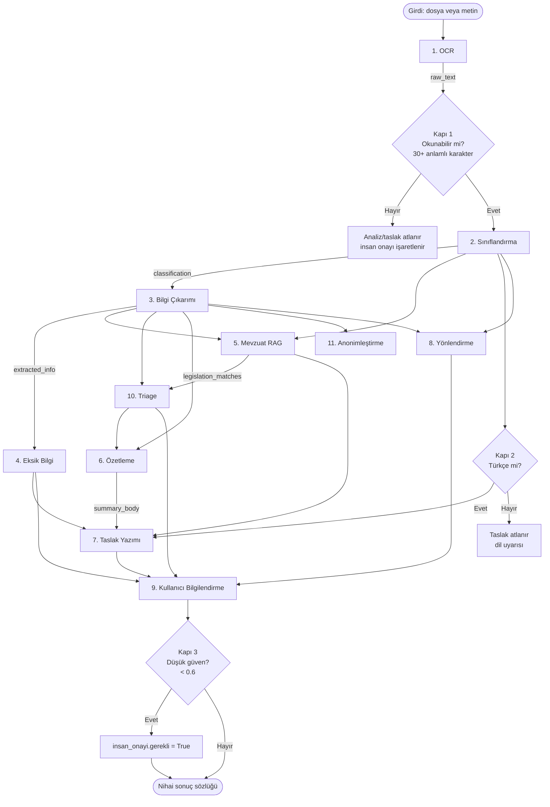

# Uzman Ajanlar 🤝

Bu sistem, tek bir devasa modele değil, her biri dar ve iyi tanımlı bir sorumluluğa sahip **11 uzman ajan** ile bunları koşullu bir akışta yöneten bir **orkestratöre** dayanır. Bu sayfa, tüm ajanların genel bakış haritasını sunar ve her ajanı ilgili görev detay sayfasına yönlendirir.

> [!NOTE]
> **TL;DR**
> - **11 uzman ajan + 1 orkestratör** (`OrchestratorAgent`), tamamı **framework'süz saf Python**.
> - Ajanlar üç mantıksal grupta toplanır: **Görev 1** (okuma/sınıflandırma/analiz), **Görev 2** (taslak/yönlendirme) ve **Yenilik** (triage + KVKK anonimleştirme).
> - Tüm ajanlar aynı paylaşılan `AgentState` durum nesnesi üzerinden veri alışverişi yapar; her adım süre/durum ölçülür.
> - Çekirdek felsefe **offline-first**: hiçbir LLM olmadan tam işlevsel çalışır. LLM yalnızca **düşük güven** durumunda opsiyonel bir iyileştirme katmanıdır.
> - Ortak tasarım desenleri: güven skoru döndürme, LLM opsiyonelliği, zarif fallback (graceful degradation) ve advisory/additive yenilik katmanları (kararı ezmez).

---

## Genel Bakış

Sistem, gelen bir evrağı (dosya veya doğrudan metin) alır, önce **Görev 1** blokunda okur/sınıflandırır/analiz eder, ardından **Görev 2** blokunda resmî yazı taslağı üretip ilgili birime yönlendirir. Yenilik ajanları (triage, anonimleştirme) bu akışa değer katan ek katmanlardır.

Ajanların koordinasyonu, düz sıralı bir zincir değil, **koşullu 3 kapılı** bir akıştır: (1) okunabilirlik, (2) dil, (3) düşük güven. Kapılar ve karar mantığı için [Orkestratör ve Koşullu Kapılar](Orkestratör-ve-Koşullu-Kapılar) sayfasına bakın. Sistemin geneli için [Sistem Mimarisi](Sistem-Mimarisi) sayfasını inceleyin.

> [!IMPORTANT]
> Ajanlar `OrchestratorAgent._load_agents` içinde **sabit sırayla** yüklenir: `ocr → classification → info_extraction → missing_info → legislation → summarization → draft_writer → routing → user_info → triage → anonimlestirme`. Ancak yürütme sırası bu yükleme sırasından farklıdır; koşullu akışta örneğin `triage`, `summarization`'dan **önce** çalışır.

---

## 11 Ajan + Orkestratör — Özet Tablo

| # | Ajan | Sorumluluk | Girdi | Çıktı | Dosya |
|---|------|-----------|-------|-------|-------|
| — | **OrchestratorAgent** | 11 ajanı koşullu akışta koordine eder, 3 kapıyı uygular, sonuçları tek sözlükte derler | `input_file` veya `raw_text`, `mode` | Tüm ajan sonuçlarını içeren nihai sözlük + izlenebilirlik meta bilgisi | `src/agents/orchestrator.py` |
| 1 | **OCR** | Dosyadan metin çıkarır (TXT/MD doğrudan, PDF pypdf, görüntü Tesseract/EasyOCR); OCR kalite telemetrisi | `input_file` (dosya yolu) | `raw_text`, `ocr_result` (+ görüntüde `ocr_kalite`) | `src/agents/ocr_agent.py` |
| 2 | **Sınıflandırma** (Classification) | Metni 8 evrak türünden birine sınıflar (kural + Naive Bayes + opsiyonel LLM eskalasyonu) | `raw_text` | `classification` (tür, güven, yöntem, tüm skorlar) | `src/agents/classification_agent.py` |
| 3 | **Bilgi Çıkarımı** (InfoExtraction) | Tarih, sayı, TCKN, konu, muhatap, IBAN, telefon vb. çok sayıda alanı regex ile çıkarır | `raw_text` | `extracted_info` (yapılandırılmış alanlar) | `src/agents/info_extraction_agent.py` |
| 4 | **Eksik Bilgi** (MissingInfo) | Evrak türüne göre zorunlu alanları denetler; eksikleri öncelik + öneriyle raporlar | `classification.tur`, `extracted_info`, `raw_text` | `missing_info` (alan, açıklama, öncelik, öneri) | `src/agents/missing_info_agent.py` |
| 5 | **Mevzuat** (Legislation) | İlgili mevzuatı hibrit RAG (BM25 çekirdek + opsiyonel semantik/rerank) ile önerir | `classification`, `extracted_info`, `raw_text` | `legislation_matches`, `legislation_meta` | `src/agents/legislation_agent.py` |
| 6 | **Özetleme** (Summarization) | Kısa, resmî, nesnel özet üretir (LLM ya da skorlamalı extractive); sadakat garantili | `raw_text`, `classification`, `extracted_info` | `summary` (künyeli), `summary_body` (künyesiz) | `src/agents/summarization_agent.py` |
| 7 | **Taslak Yazımı** (DraftWriter) | Resmî Yazışma Yönetmeliği'ne uygun yazı taslağı üretir; format + kalite denetimi | `classification`, `extracted_info`, `missing_info`, `legislation_matches`, `summary_body` | `draft_text`, `draft_type`, `format_validation`, `draft_quality` | `src/agents/draft_writer_agent.py` |
| 8 | **Yönlendirme** (Routing) | Evrağı 9 kamu biriminden birine yönlendirir; gerekçe/güven/alternatif | `raw_text`, `classification`, `extracted_info` | `routing_suggestion` (birim, güven, alternatifler) | `src/agents/routing_agent.py` |
| 9 | **Kullanıcı Bilgilendirme** (UserInfo) | İşlem sonuçlarını kullanıcıya bildirir; eksik bilgi sorularını üretir | Tüm state (uyarılar, adımlar, eksikler, triage, yönlendirme, hatalar) | `user_notifications`, `clarification_requests` | `src/agents/user_info_agent.py` |
| 10 | **Triage / Önceliklendirme** | Aciliyet + yasal süreyi tespit eder; son işlem tarihi/kalan gün/öncelik | `raw_text`, `classification`, `extracted_info`, `legislation_matches` | `triage` (öncelik, skor, son_tarih, kalan_gun) | `src/agents/triage_agent.py` |
| 11 | **Anonimleştirme** (KVKK) | 9 kategori kişisel veriyi format-koruyan biçimde maskeler | `raw_text`, opsiyonel `extracted_info` | `anonymized_text`, `anonymization_report` | `src/agents/anonimlestirme_agent.py` |

> [!NOTE]
> **8 evrak türü** (+ `diger` artık kategorisi): `dilekce`, `ust_yazi`, `cevap_yazisi`, `bilgilendirme`, `tutanak`, `rapor`, `genelge`, `onayli_belge`.
> **9 hedef birim**: `yazi_isleri`, `hukuk`, `insan_kaynaklari`, `mali_hizmetler`, `bilgi_islem`, `strateji`, `basin_halkla_iliskiler`, `destek_hizmetleri`, `genel_mudurluk`.

---

## Ajanların Görev Gruplarına Ayrışımı

Ajanlar üç mantıksal gruba ayrılır. Aşağıdaki listede her ajanın ait olduğu detay sayfasına bağlantı verilmiştir.

### 📖 Görev 1 — Okuma, Sınıflandırma ve İçerik Analizi

Şartname Görev 1 kapsamı: evrağı okuma, tür sınıflandırması, içerik analizi (bilgi çıkarımı + eksik bilgi tespiti), mevzuat eşleştirme ve özetleme.

- [ ] **OCR** — dosyadan metin çıkarımı ve kalite telemetrisi
- [ ] **Sınıflandırma** — 8 türe üçlü hibrit (kural + Naive Bayes + LLM) sınıflandırma
- [ ] **Bilgi Çıkarımı** — regex-öncelikli yapılandırılmış alan çıkarımı
- [ ] **Eksik Bilgi** — türe özgü zorunlu alan denetimi
- [ ] **Özetleme** — sadakat garantili resmî özet

Detaylar: [Görev 1 — Okuma, Sınıflandırma ve İçerik Analizi](Görev-1-Okuma-ve-Analiz). Mevzuat ajanı hibrit RAG mimarisiyle ayrı bir sayfada işlenir: [Mevzuat RAG ve Hibrit Arama](Mevzuat-RAG-ve-Hibrit-Arama).

### ✍️ Görev 2 — Taslaklama ve Birim Yönlendirme

Şartname Görev 2 kapsamı: resmî yazı taslağı üretimi ve doğru birime yönlendirme; kullanıcının bilgilendirilmesi.

- [ ] **Taslak Yazımı** — Resmî Yazışma Yönetmeliği uyumlu taslak + format/kalite denetimi (Reflexion döngüsü)
- [ ] **Yönlendirme** — 9 birime ağırlıklı anahtar kelime skorlamasıyla yönlendirme
- [ ] **Kullanıcı Bilgilendirme** — bildirimler ve eksik bilgi soruları

Detaylar: [Görev 2 — Taslaklama ve Birim Yönlendirme](Görev-2-Taslak-ve-Yönlendirme).

### 💡 Yenilik Grubu — Triage ve KVKK

Şartname temel görevlerinin ötesinde değer katan yenilik modülleri.

- [ ] **Triage / Önceliklendirme** — aciliyet damgaları + metin içi süre + yasal süre tablosu
- [ ] **Anonimleştirme (KVKK)** — 9 kategori format-koruyan maskeleme + sızıntı denetimi

Detaylar: [Triage ve Akıllı Önceliklendirme](Triage-ve-Önceliklendirme) ve [KVKK ve Anonimleştirme](KVKK-ve-Anonimleştirme).

---

## Ajan-Ajan Bağımlılık Diyagramı

Aşağıdaki diyagram, koşullu akış boyunca ajanların birbirini nasıl beslediğini gösterir. Koşullu geçişler kapılara bağlıdır.



> [!NOTE]
> Diyagramdaki numaralar tablo sırasını takip eder, yürütme sırasını değil. Gerçek yürütmede `triage`, `summarization`'dan önce çalışır ve tüm bağımlılıklar `AgentState` üzerinden aktarılır.

### Bağımlılık Özeti

- **OCR** her şeyden bağımsızdır; yalnızca dosya yolu alır ve `raw_text` üretir.
- **Sınıflandırma** yalnızca `raw_text`'e bağlıdır ve akışın geri kalanının temel girdisidir (`classification.tur`).
- **Eksik Bilgi**, **Triage**, **Taslak Yazımı** ve **Yönlendirme** ajanları, çıkarım sonuçlarına (`extracted_info`) bağımlıdır.
- **Triage**, mevzuat eşleşmelerini (`legislation_matches`) yasal süre doğrulaması için kullanır (benzerlik eşiği 0.6).
- **Taslak Yazımı**, özet **gövdesine** (`summary_body`, künyesiz) bağlıdır; künye ayraçlarını resmî gövdeye sızdırmamak için `summary` değil `summary_body` kullanılır.
- **Kullanıcı Bilgilendirme** akışın son toplayıcısıdır; neredeyse tüm state alanlarını okur.

---

## Ortak Tasarım Desenleri

Tüm ajanlar, projenin anayasal ilkeleriyle uyumlu ortak desenleri paylaşır. Bu tutarlılık, sistemin dürüstlük, dayanıklılık ve offline-first güvencelerinin temelidir.

### 1. Güven Skoru Döndürme

Karar üreten ajanlar (Sınıflandırma, Yönlendirme) yalnızca bir etiket değil, **0-1 aralığında bir güven skoru** da döndürür. Güven, kararı bloklamaz; orkestratör bunu izler (`confidence_trace`) ve `_INSAN_ONAYI_GUVEN_ESIGI = 0.6` altındaysa **insan onayı** işareti koyar.

```python
# Sınıflandırma çıktısının yapısı (örnek değerlerle)
{
    "tur": "dilekce",
    "tur_adi": "Dilekçe",
    "guven": 0.87,                    # 0-1, softmax (sıcaklık 2.0), 3 ondalık — örnek değer
    "yontem": "hibrit_ensemble",      # kural_tabanli | hibrit_ensemble | llm_eskalasyon
    "tum_skorlar": { "...": "..." }
}
```

Sınıflandırma çekirdeği üçlü hibrittir: ağırlıklı kural tabanlı skorlama + saf-Python Multinomial Naive Bayes (ensemble ağırlıkları **kural %60 / ML %40**) + düşük güvende opsiyonel LLM eskalasyonu. Güven skorlarının kalibrasyonu, seçici tahmin ve konformal garantiler için [Güven ve Ölçüm Katmanı](Güven-ve-Ölçüm-Katmanı) sayfasına bakın.

### 2. LLM Opsiyonelliği (Hibrit Kural + LLM)

LLM **hiçbir zaman zorunlu değildir**. Ajanlar kural tabanlı çekirdekle tam işlevsel çalışır; LLM yalnızca değeri artırdığında devreye girer:

- **Sınıflandırma**: güven `< 0.6` ise LLM eskalasyonu (opsiyonel self-consistency).
- **Yönlendirme**: en iyi iki birim skoru çok yakınsa (fark `< %15`) LLM ayrıştırması (tiebreak).
- **Taslak Yazımı**: LLM adayı + Reflexion turu; format skoru daha yüksekse LLM tercih edilir, eşitlikte kural tabanlı korunur (keep-best).
- **Özetleme / Bilgi Çıkarımı**: LLM yalnızca zenginleştirir; regex/kural sonuçlarını **asla ezmez**.

LLM katmanı model-agnostiktir (`src/models/llm_wrapper.py`): OpenAI-uyumlu API / yerel Ollama / offline otomatik tespit, harici SDK olmadan yalnızca `urllib` ile. `APP_OFFLINE=1` katı kilidi hiçbir metnin dışarı gönderilmemesini garanti eder (KVKK). Ayrıntı: [Model Bilgileri ve LLM Ekosistemi](Model-Bilgileri).

### 3. Offline-First ve Zarif Fallback (Graceful Degradation)

Her ajan, opsiyonel bağımlılık yoksa çekirdek işlevini korur:

- **OCR**: `cv2`, `pytesseract`, `easyocr`, `pdf2image`, `pypdf` yoksa çekirdek TXT/MD yolu hiç etkilenmez; her adım `try/except` ile sarılır.
- **Mevzuat RAG**: semantik/rerank/ChromaDB katmanları yoksa davranış **birebir saf BM25** ile korunur.
- **Sınıflandırma**: `ml_model.json` yoksa saf kural tabanlı sonuç korunur.
- **Taslak PDF**: `reportlab` yoksa `.txt` yolu bozulmaz.

İş akışındaki istisnalar `_run_workflow` içinde yakalanır, `errors` listesine eklenir ve sonuç yine derlenir — çökme yerine zarif düşüş (Anayasa: şeffaflık / zarardan kaçınma).

### 4. Advisory / Additive Yenilik Katmanları

Çapraz tutarlılık denetimi, emsal/CBR önerisi ve kanıt vurguları **kararı değiştirmez** — yalnızca insan onayı önerir veya açıklanabilirlik sağlar. Bu, "sorumlu otomasyon" ilkesinin kod düzeyindeki karşılığıdır.

### 5. Güvenlik ve Prompt Injection Savunması

- **Girdi sınırı**: güvenilmeyen metin `_MAX_GIRDI_KARAKTER = 200_000` ile kırpılır (CWE-400 / OWASP LLM04).
- **Belge=veri ayrımı**: LLM'e giden evrak metni `belge_blogu(...)` ile "yalnızca veri" olarak işaretlenir (dolaylı prompt injection savunması, OWASP LLM01).
- **Kapalı liste doğrulaması**: LLM'in ürettiği tür/birim çıktıları `EVRAK_TURLERI` ve aday birim listesiyle ayrıca doğrulanır; belge içine gömülü talimat kararı değiştiremez.

Güvenlik yaklaşımının bütünü için [Anayasal İlkeler ve Etik](Anayasal-İlkeler-ve-Etik) sayfasına bakın.

---

## Ajan Ekleme ve Katkı

Yeni bir ajan eklemek, ortak sözleşmeye uymayı gerektirir: `run(state)` imzası, `AgentState` üzerinden okuma/yazma ve `_load_agents` içinde kayıt. Ayrıntılı adımlar ve mimari kararlar için [Geliştirici Rehberi](Geliştirici-Rehberi) sayfasına bakın. Ajanların davranışı, `tests/` altındaki kapsamlı test paketiyle (508 test — depo CI rozeti) doğrulanır — bkz. [Test ve Sürekli Entegrasyon](Test-ve-Sürekli-Entegrasyon).

---

## İlgili Sayfalar

- [Sistem Mimarisi](Sistem-Mimarisi) — genel mimari, `AgentState` veri akışı, dizin haritası
- [Orkestratör ve Koşullu Kapılar](Orkestratör-ve-Koşullu-Kapılar) — akış ve 3 kapı mantığı
- [Görev 1 — Okuma, Sınıflandırma ve İçerik Analizi](Görev-1-Okuma-ve-Analiz)
- [Görev 2 — Taslaklama ve Birim Yönlendirme](Görev-2-Taslak-ve-Yönlendirme)
- [Triage ve Akıllı Önceliklendirme](Triage-ve-Önceliklendirme)
- [KVKK ve Anonimleştirme](KVKK-ve-Anonimleştirme)
