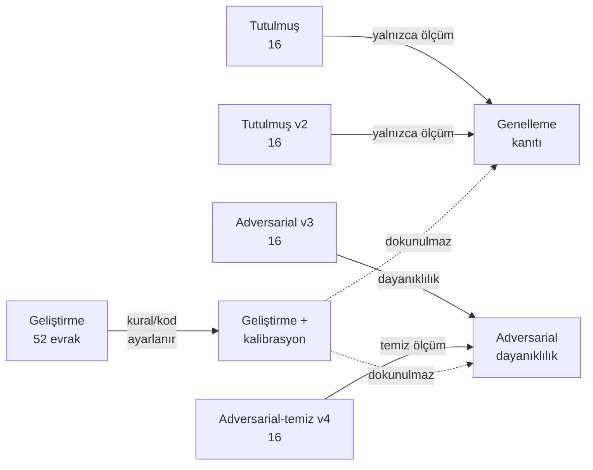
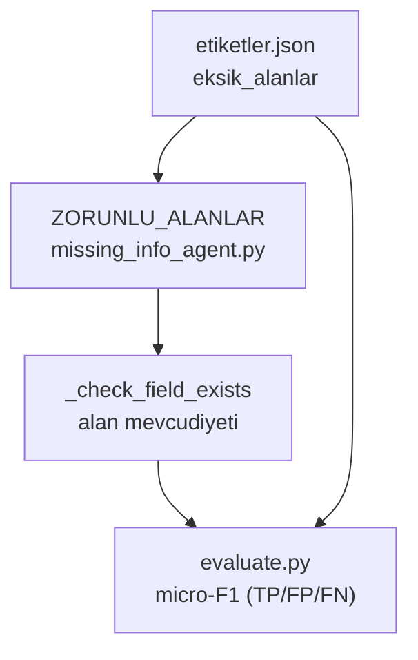

# Veri Setleri 📁

Bu sayfa, sistemin geliştirilmesinde ve değerlendirilmesinde kullanılan tüm veri varlıklarını belgeler: beş etiketli sentetik evrak seti, on beş belgelik mevzuat korpusu, etiket şeması ve bunların KVKK ile şartname ilkelerine nasıl bağlandığı. Tüm veri **kurgudur**; hiçbir gerçek kamu evrakı veya gerçek kişisel veri kullanılmaz.

> [!NOTE]
> **TL;DR**
> - **5 etiketli set:** geliştirme (52) + tutulmuş/held-out (16) + tutulmuş v2 (16) + adversarial v3 (16) + adversarial-temiz v4 (16) = **116 kurgu evrak**.
> - **15 belgelik mevzuat korpusu** (`data/raw/mevzuat_metinleri/`), kaynak [mevzuat.gov.tr](https://www.mevzuat.gov.tr); BM25 RAG bunu çalışma anında dinamik yükler (sayı kodda sabit değil).
> - **Etiket şeması:** `{tur, birim_kodu, eksik_alanlar, aciklama, mevzuat_beklenen?}` — `eksik_alanlar` anahtarları `missing_info_agent.py` içindeki `ZORUNLU_ALANLAR` ile **birebir** uyumlu.
> - **Sentetik ilke:** kurgu TCKN yalnızca resmî checksum'ı geçer, gerçek bir kişiye atanamaz (KVKK); ortalama evrak ~1,8 KB düz metin (UTF-8).
> - **Datasheet:** Gebru vd. (2021) biçiminde `docs/veri_seti_datasheet.md`; her ölçüm raporuna içerik hash'li köken mührü gömülür.
> - **Lisans:** Apache 2.0 — veri de kod da açık kaynak.

---

## 1. Sentetik Veri İlkesi (İhlal Edilemez) 🔒

Projenin en katı kısıtlarından biri **gerçek kamu verisinin asla kullanılmamasıdır**. Bu, hem TEKNOFEST 2026 şartname etik maddesinin hem de 6698 sayılı KVKK'nın doğrudan bir gereğidir.

- **Yalnızca kurgu/sentetik veri.** Evrakların içeriği, kurumları, kişileri ve olayları tamamen tasarlanmıştır; hiçbiri gerçek bir yazışmadan kopyalanmamış veya türetilmemiştir.
- **Kurgu TCKN yalnızca checksum geçer.** Kimlik numaraları, `src/agents/info_extraction_agent.py` içindeki resmî T.C. Kimlik No algoritmasını (`_tc_kimlik_gecerli`) geçecek şekilde üretilir; böylece çıkarım ve maskeleme boru hattı gerçekçi girdiyle test edilir. Ancak değerler bilinçli olarak **vatandaşa atanmayan aralıktan** (`10000000xxx` deseni) seçilir — geçerli biçimde ama sahibi olmayan numaralar.
- **Kurgu iletişim bilgileri.** Cep telefonları `0555 000 00 XX` gibi ayrılmış/kurgu kalıplardan, e-postalar ve IBAN'lar kurgu kurum evrenlerinden üretilir.
- **Gerçek PII üretimi ve kopyalanması yasaktır.** Bu ilke [Anayasal İlkeler ve Etik](Anayasal-İlkeler-ve-Etik) sayfasındaki veri koruması maddesiyle ve [KVKK ve Anonimleştirme](KVKK-ve-Anonimleştirme) alt sistemiyle uçtan uca güvence altına alınır.

> [!IMPORTANT]
> Kurgu TCKN'nin checksum'ı geçmesi bir **tasarım gereğidir**, açık değil. Sistem, gerçekçi PII üzerinde doğru maskeleme yaptığını kanıtlamak zorundadır; bunu yapabilmek için de checksum'ı geçen ama kimseye ait olmayan kurgu numaralara ihtiyaç duyar. KVKK sızıntı denetçisi (`src/utils/kvkk_denetim.py`) bu numaraların paylaşım nüshasında maskesiz kalmadığını nicel olarak (kaçak sayımı) doğrular.

---

## 2. Beş Evrak Seti 🗂️

Etiketli setler `data/raw/` altında yer alır; her set kendi `etiketler.json` dosyası ve `.txt` evraklarıyla birlikte tutulur. Değerlendirme betiği `scripts/evaluate.py` her seti aynı [uçtan uca boru hattıyla](Sistem-Mimarisi) işler.

| Set | Dizin | Adet | Amaç |
|---|---|---:|---|
| Geliştirme | `data/raw/kurgu_evraklar` | 52 | Ana geliştirme + kalibrasyon (sıcaklık ölçekleme yalnızca burada öğrenilir) |
| Tutulmuş (held-out) | `data/raw/kurgu_evraklar_heldout` | 16 | Genelleme ölçümü — geliştirmede görülmeyen dağıtım |
| Tutulmuş v2 | `data/raw/kurgu_evraklar_heldout_v2` | 16 | İkinci bağımsız genelleme kontrolü |
| Adversarial v3 | `data/raw/kurgu_evraklar_heldout_v3` | 16 | Bilinçli zorlaştırılmış (adversarial) sınır durumları |
| Adversarial-temiz v4 | `data/raw/kurgu_evraklar_heldout_v4` | 16 | İyileştirme sonrası, dokunulmamış temiz adversarial ölçüm |

### 2.1. Setlerin İş Bölümü



### 2.2. Held-out (Tutulmuş) Disiplini

Setlerin genelleme kanıtı olarak değer taşıması, üzerlerinde **ayar yapılmamasına** bağlıdır. Bu disiplin kod ve doküman düzeyinde korunur:

- [ ] Sıcaklık ölçekleme (temperature scaling) **yalnızca** geliştirme setinde (`set_adi == 'kurgu_evraklar'`) öğrenilir; tüm held-out setlerde yalnızca ölçüm yapılır (`scripts/evaluate.py`).
- [ ] Bir held-out set üzerindeki hataya bakılarak kural/kod düzeltilirse, set held-out niteliğini **kaybeder** ve bu durum `docs/teknik_rapor.md` §5'e açıkça yazılmak **zorundadır**.
- [ ] v3 üzerinde yapılan gözlemler geliştirme kararlarını etkilediği için, temiz ölçüm amacıyla dokunulmamış **v4** seti ayrıca üretilmiştir.
- [ ] `data/processed/eval_report*.json` dosyaları elle düzenlenmez; yalnızca `scripts/evaluate.py` ile üretilir.

> [!WARNING]
> `mevzuat_beklenen` etiketinin sonradan eklenmesi bir istisnadır: bu, kod veya kural değişikliği **içermediği** için ilgili setin held-out niteliğini bozmaz. Ayrıntılar `data/README.md` §2b ve `docs/veri_seti_datasheet.md` §5'te belgelenir. Adversarial setlerin ölçülen davranışı ve dayanıklılık testleri için [Adversarial Dayanıklılık](Adversarial-Dayanıklılık) sayfasına bakın.

---

## 3. Mevzuat Korpusu 📚

Mevzuat RAG alt sisteminin geri getirme (retrieval) tabanı, `data/raw/mevzuat_metinleri/` altındaki **15 belgelik** düz metin korpusudur.

- **Kaynak:** [mevzuat.gov.tr](https://www.mevzuat.gov.tr) — resmî mevzuat metinleri.
- **Biçim:** her dosya bir başlık bloğu + `## ` ile başlayan bölümlere (chunk) ayrılır; madde numaraları üstveriye işlenir (`src/agents/legislation_agent.py`).
- **Dinamik yükleme:** `LegislationAgent`, korpus dizinindeki **tüm** `*.txt` dosyalarını çalışma anında yükler; belge sayısı kodda sabit tutulmaz. Yani korpus dizine yeni bir mevzuat metni eklendiğinde otomatik olarak indekslenir (bugünkü belgelenmiş sayı 15'tir).
- **Kapsanan konular:** korpus, yönlendirme ve içerik temalarını (`MEVZUAT_TEMALARI`, 9 tema) karşılamak üzere personel (657), ihale (4734), mali (5018), kişisel veri (6698), yargı (2577), arşiv, kabahatler (5326), belediye (5393), imar (3194) gibi alanların yanı sıra Resmî Yazışma Yönetmeliği ve 3071 sayılı Dilekçe Hakkı Kanunu gibi **usul mevzuatını** içerir.

> [!NOTE]
> Korpus, `src.config.settings.app.mevzuat_dir` üzerinden okunur. Çekirdek arama saf Python **BM25-Okapi** (`k1=1.5`, `b=0.75`) ile çalışır; hiçbir model ağırlığı gerektirmez. Aramanın nasıl çalıştığı, mutlak benzerlik kalibrasyonu ve düzeltici (corrective) sorgu genişletme için [Mevzuat RAG ve Hibrit Arama](Mevzuat-RAG-ve-Hibrit-Arama) sayfasına bakın.

Standart Dosya Planı (SDP) korpusa **alınmaz**; ampirik olarak mevzuat isabet@3 metriğini düşürdüğü için referans belge olarak `docs/standart_dosya_plani_notu.md` içinde tutulur.

---

## 4. Etiket Şeması 🏷️

Her evrak, `etiketler.json` içinde tek doğruluk kaynağı olan şu şema ile etiketlenir:

```json
{
  "dilekce_01.txt": {
    "tur": "dilekce",
    "birim_kodu": "yazi_isleri",
    "eksik_alanlar": ["adres", "imza"],
    "aciklama": "Vatandaş başvurusu; adres ve ıslak imza eksik",
    "mevzuat_beklenen": ["dilekce_hakki_kanunu_3071"]
  }
}
```

| Alan | Tür | Açıklama |
|---|---|---|
| `tur` | zorunlu | 8 evrak türünden biri (+ `diger`) |
| `birim_kodu` | zorunlu | 9 yönlendirme biriminden biri |
| `eksik_alanlar` | zorunlu | Evrak türüne göre eksik zorunlu alanların listesi |
| `aciklama` | zorunlu | İnsan-okunur kısa gerekçe |
| `mevzuat_beklenen` | opsiyonel | Mevzuat isabet@3 için 1-3 korpus `doc_id` (dosya adı gövdesi) |

### 4.1. Evrak Türleri (8 + diğer)

Türler, `src/agents/classification_agent.py` içindeki `EVRAK_TURLERI` sözlüğü ile birebir uyumludur:

`dilekce`, `ust_yazi`, `cevap_yazisi`, `bilgilendirme`, `tutanak`, `rapor`, `genelge`, `onayli_belge` — artı artık/yedek kategori olarak `diger`. (Sözlükte `diger` dahil toplam 9 anahtar bulunur; "8 tür" ifadesi `diger` hariç sınıflandırılabilir türleri kasteder.) Sınıflandırmanın hibrit üçlü yöntemi için [Görev 1 — Okuma ve Analiz](Görev-1-Okuma-ve-Analiz) sayfasına bakın.

### 4.2. Yönlendirme Birimleri (9)

`birim_kodu`, `src/agents/routing_agent.py` içindeki `BIRIMLER` sözlüğündeki 9 kamu biriminden biridir: `yazi_isleri`, `hukuk`, `insan_kaynaklari`, `mali_hizmetler`, `bilgi_islem`, `strateji`, `basin_halkla_iliskiler`, `destek_hizmetleri`, `genel_mudurluk`. Yönlendirme mantığı [Görev 2 — Taslak ve Yönlendirme](Görev-2-Taslak-ve-Yönlendirme) sayfasında ayrıntılıdır.

### 4.3. ZORUNLU_ALANLAR Uyumu ⚠️

`eksik_alanlar` etiket anahtarları, `src/agents/missing_info_agent.py` içindeki `ZORUNLU_ALANLAR` sözlüğüyle **birebir** uyumlu olmak zorundadır. Aksi hâlde eksik-bilgi micro-F1 metriği yanlış negatif/pozitif üretir.



Kritik bir ayrıntı: **tutanak** için imza alanının anahtarı `imzalar`'dır, `imza` **değil**. Türlere özgü zorunlu alan kümeleri (örnekler):

| Tür | Zorunlu alan anahtarları (seçme) |
|---|---|
| `dilekce` | `tarih`, `ad_soyad`, `tc_kimlik`, `adres`, `talep_metni`, `imza` |
| `tutanak` | `tarih`, `saat`, `yer`, `katilimcilar`, `gundem`, `kararlar`, `imzalar` |

Eksik alan öncelikleri (`kritik` / `onemli` / `bilgi`), yasal dayanaklara bağlanır — örneğin dilekçede adres ve imza, 3071 sayılı Dilekçe Hakkı Kanunu'na göre kritik seviyeye yükseltilir.

### 4.4. `mevzuat_beklenen` ve İsabet@3

Opsiyonel `mevzuat_beklenen` alanı, mevzuat isabet@3 metriği için 1-3 korpus `doc_id`'si listeler. Bu etiketler **sistem çıktısına bakılmadan**, evrak içeriği ve hukukî rehber temelinde atanır; dosya bazlı gerekçeler `data/raw/mevzuat_beklenen_gerekceleri.json` içinde tutulur ve bağımsız ikinci gözden geçirmeyle onaylanır.

> [!NOTE]
> `mevzuat_beklenen` usul-katmanı etiketleri, sistemin tür-öncelik kuralıyla aynı hukukî gerçeklikten türediği için isabet@3 kısmen iyimser okunabilir; bu metrik bir **regresyon siperi + genelleme ölçüsü** olarak yorumlanmalıdır (`data/README.md` dürüstlük notu).

---

## 5. Etiketleme Yöntemi ✍️

Etiketleme, değerlendirme bütünlüğünü korumak için sistem çıktısından bağımsız yürütülür:

- Etiketler, **sistem çıktısına bakılmadan**, evrak içeriği + resmî yazışma/hukuk rehberi temelinde atanır (`data/README.md`).
- `mevzuat_beklenen` gibi hassas etiketler bağımsız ikinci bir gözden geçirmeden geçirilir.
- Şeffaflık örneği: geliştirilmiş 52'lik sette yönlendirme doğruluğu **0,9615**'tir; iki hata (`cevap_yazisi_06`, `tutanak_06`) gerçek işlevsel belirsizlikten kaynaklanır ve etiket/kod bu hataları gizlemek için **değiştirilmemiştir**.

Bu yaklaşım, [Değerlendirme ve Metrikler](Değerlendirme-ve-Metrikler) ile [Şartname Uyum Matrisi](Şartname-Uyum-Matrisi) sayfalarındaki dürüst raporlama geleneğinin temelini oluşturur.

---

## 6. Çeşitlilik 🌐

Setler, tek bir kurum kalıbına aşırı uyumu (overfitting) önlemek için çeşitlendirilmiştir:

- **8 evrak türü × farklı kurgu kurum evrenleri:** her tür, birden fazla kurgu kurum bağlamında (farklı müdürlükler, kurgu antetler, kurgu kişi/kurum adları) temsil edilir.
- **Yapısal çeşitlilik:** antetli/antetsiz, imza bloklu/bloksuz, ilgi referanslı/referanssız, süreli/süresiz evraklar.
- **Adversarial genişletme:** v3 ve v4 setleri, sınıflandırma ve yönlendirmeyi zorlayan sınır durumlarını (yanıltıcı anahtar kelimeler, karışık türler, gürültülü metin) bilinçli olarak içerir.
- **Metamorfik dayanıklılık:** `scripts/dayaniklilik_testi.py`, geliştirme setindeki her evrağa etiket-koruyan bozulmalar (diyakritik katlama, boşluk/yazım/OCR/noktalama gürültüsü) uygulayarak tür/birim invaryansını ölçer. Ayrıntı için [Adversarial Dayanıklılık](Adversarial-Dayanıklılık) ve [Güven ve Ölçüm Katmanı](Güven-ve-Ölçüm-Katmanı) sayfalarına bakın.

---

## 7. Veri Seti Datasheet Özeti 📄

Veri kökeni, bileşimi, KVKK durumu ve kullanım koşulları, Gebru vd. (2021) **datasheet** biçiminde `docs/veri_seti_datasheet.md` içinde belgelenir.

| Başlık | Değer |
|---|---|
| Toplam etiketli evrak | 116 (52 + 16 + 16 + 16 + 16) |
| Mevzuat korpusu | 15 metin |
| Evrak türü sayısı | 8 (+ `diger`) |
| Yönlendirme birimi | 9 |
| Ortalama evrak boyutu | ~1,8 KB düz metin |
| Kodlama | UTF-8 |
| Gerçek PII | Yok (kurgu TCKN yalnızca checksum geçer) |
| Köken mührü | git commit + platform + içerik hash (sha256, ilk 16 hane) |

Her değerlendirme raporuna, `src/utils/kosum_muhru.py` tarafından üretilen **tekrarlanabilirlik mührü** gömülür: git commit SHA + kirli çalışma bayrağı, Python/platform sürümü, `requirements.txt` sha256 ve setin içerik hash'i (sıralı `.txt` adları+içerikleri + `etiketler.json` sha256). Bu, veri provenansını ve jüri karşısında ölçüm bütünlüğünü güvence altına alır.

> [!NOTE]
> Küçük bir tutarsızlık şeffaflıkla belgelenmiştir: datasheet §2 tablosu 4 seti listelerken `data/README.md` beşinci seti (v4) de ekler. Wiki'de esas alınan geçerli durum **5 settir**.

---

## 8. Kullanım Hakları ⚖️

- **Lisans:** Apache 2.0. Hem kod hem veri açık kaynaktır; kurgu evraklar ve mevzuat korpusu depoyla birlikte serbestçe incelenebilir ve yeniden kullanılabilir.
- **Telif:** AGENTRA TECH. Atıf ve lisans dosyaları `LICENSE`, `NOTICE`, `AUTHORS`, `CITATION.cff` içinde tutulur.
- **Model ağırlığı yasağı:** Depoya hiçbir model ağırlığı yüklenmez; üçüncü taraf modeller yalnızca bağlantı + sürüm + lisans + kullanım talimatıyla [Model Bilgileri](Model-Bilgileri) sayfasında (ve `docs/model_bilgileri.md`) belgelenir.
- **Yeniden kullanım notu:** Veri kurgu olduğundan, türetilmiş çalışmalarda da sentetik/kurgu ilkesinin korunması ve gerçek PII eklenmemesi beklenir (KVKK).

---

## İlgili Sayfalar

- [Değerlendirme ve Metrikler](Değerlendirme-ve-Metrikler) — 5 setin doğrulanmış metrikleri, held-out disiplini, tekrarlanabilirlik
- [Adversarial Dayanıklılık](Adversarial-Dayanıklılık) — v3/v4 setleri ve metamorfik dayanıklılık testleri
- [Görev 1 — Okuma ve Analiz](Görev-1-Okuma-ve-Analiz) — sınıflandırma, bilgi çıkarımı, eksik bilgi ajanları
- [Mevzuat RAG ve Hibrit Arama](Mevzuat-RAG-ve-Hibrit-Arama) — 15 belgelik korpusun geri getirme mimarisi
- [KVKK ve Anonimleştirme](KVKK-ve-Anonimleştirme) — sentetik PII ilkesi ve sızıntı denetimi
- [Anayasal İlkeler ve Etik](Anayasal-İlkeler-ve-Etik) — veri koruması, değerlendirme bütünlüğü, açık kaynak
