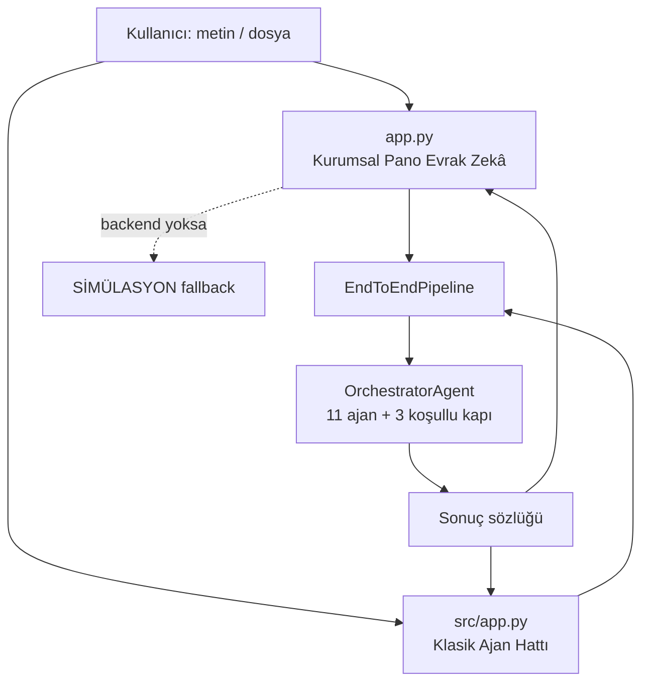
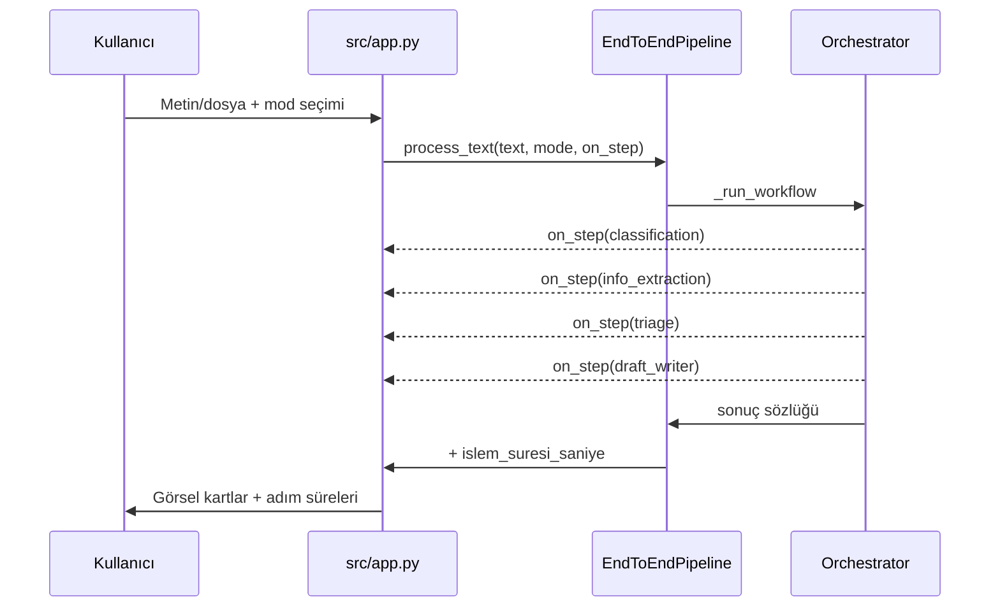

# Web Arayüzü — Evrak Zekâ 🖥️

Proje iki tamamlayıcı web arayüzü sunar: jüriye ve kurumsal karar vericiye hitap eden **sunum panosu `app.py` ("Evrak Zekâ")** ve geliştiricinin canlı ajan hattını adım adım izleyebildiği **klasik işlevsel arayüz `src/app.py`**. Her ikisi de aynı 11-ajan + orkestratör çekirdeğine (`EndToEndPipeline`) bağlanır; hiçbir arayüz katmanı çekirdeğin offline-first çalışmasını bozmaz.

> [!NOTE]
> **TL;DR**
> - **`app.py` — Kurumsal pano "Evrak Zekâ"**: 9 sayfalı, gömülü CSS'li tek dosya Streamlit uygulaması. Evrak İşleme, KVKK ve Uyum, Asistan sayfaları **gerçek** backend'e bağlıdır; genel-bakış/toplu-işleme/telemetri gibi toplu göstergeler açıkça **"temsili demo"** etiketlidir (dürüstlük ilkesi, şartname m.6).
> - **`src/app.py` — Klasik arayüz**: canlı **ajan hattı (streaming)** akışı; Görev 1/Görev 2 modları (`full`/`classify`/`draft`).
> - Çalıştırma: `streamlit run app.py` veya `streamlit run src/app.py` (varsayılan port **8501**).
> - Backend yüklenemezse pano çökmez; **SİMÜLASYON** etiketiyle zarifçe iner. Kurgu/demo skor gerçekmiş gibi sunulmaz.
> - Her iki arayüz de aynı `data/processed/geri_bildirim.jsonl` dosyasını besler (sonucu düzelt/geri bildirim).

---

## 1. İki Arayüz, Tek Çekirdek

Streamlit tabanlı iki arayüz de sunum katmanıdır; kararı üreten hiçbir mantık burada değildir. Tüm zekâ [Orkestratör ve Koşullu Kapılar](Orkestratör-ve-Koşullu-Kapılar) ile [Uzman Ajanlar](Uzman-Ajanlar) sayfalarında anlatılan çekirdekte kalır. Arayüz katmanı yalnızca girdiyi çekirdeğe iletir ve dönen sonuç sözlüğünü görselleştirir.



| Özellik | `app.py` (Kurumsal Pano) | `src/app.py` (Klasik) |
|---|---|---|
| Amaç | Jüri/kurum sunumu, uçtan uca vitrin | Geliştirici/demo, canlı hat izleme |
| Yapı | Tek dosya, gömülü CSS, 9 sayfalı gezinme | Tek `main()`, import yan etkisiz |
| Backend | Gerçek `EndToEndPipeline` + SİMÜLASYON fallback | Gerçek pipeline (`process`/`process_text`) |
| Öne çıkan | Kokpit göstergeleri, e-Yazışma üstverisi, HTML denetim raporu, PDF | Streaming ajan hattı, mod seçimi, canlı adımlar |
| Ortak | Aynı `geri_bildirim.jsonl`, aynı ajanlar | Aynı `geri_bildirim.jsonl`, aynı ajanlar |

> [!IMPORTANT]
> **Gerçek vs temsili ayrımı, şartnamenin etik omurgasıdır.** Ölçülmemiş bir metrik hiçbir zaman ölçülmüş gibi gösterilmez. Panonun canlı işlem üreten sayfaları gerçek çıktı gösterir; toplu istatistik/telemetri panelleri "temsili demo" olarak işaretlenir. Doğrulanmış metrikler için [Değerlendirme ve Metrikler](Değerlendirme-ve-Metrikler) sayfasına bakın.

---

## 2. Kurumsal Pano — `app.py` ("Evrak Zekâ")

`app.py`, tek dosyada gömülü CSS ile hazırlanmış kurumsal bir sunum panosudur. Kenar çubuğundaki `GEZINME` yapısı 9 sayfa tanımlar. Gerçek metrikler `evaluate.py` raporlarından, SQLite kayıt defterinden veya canlı işleme çıktısından alınır; kurgu/demo skor gösterilmez (şartname m.6).

### 2.1 Sayfalar

| # | Sayfa | Backend Durumu | İçerik |
|---|---|---|---|
| 1 | **Genel Bakış** | Temsili / rapordan | Sistem özeti; metrikler `evaluate.py` raporlarından, SQLite kayıt defterinden veya canlı çıktıdan gelir |
| 2 | **Evrak İşleme** | **CANLI (gerçek)** | Tekil evrak işleme; sınıflandırma, çıkarım, mevzuat, taslak, yönlendirme, KVKK |
| 3 | **Toplu İşleme** | Temsili demo + kokpit | Çoklu evrak; kokpit göstergeleri, dışa aktarım |
| 4 | **Ajan Yönetimi** | Bilgilendirici | 11 ajanın rolleri ve hat şeması |
| 5 | **Asistan (YZ)** | **Gerçek** | Hibrit niyet motoru; mevzuat RAG, hesap makinesi, genel LLM fallback |
| 6 | **Mevzuat ve RAG** | **Gerçek (BM25)** | Korpus üzerinde arama (saf Python BM25 çekirdek) |
| 7 | **KVKK ve Uyum** | **Gerçek** | Anonimleştirme nüshası + sızıntı denetimi |
| 8 | **Hakkında** | Statik | Proje, telif (AGENTRA TECH), Apache 2.0 lisansı |
| 9 | **Ayarlar** | Yapılandırma | LLM backend, tercihler |

> [!NOTE]
> CLAUDE.md ve `app.py` docstring'i tarihsel olarak **"8 sayfa"** der; koddaki `GEZINME` ve `sayfalar` sözlüğü ise **9 sayfa** fonksiyonu içerir. Wiki kodu esas alır: **9 sayfa**. Bu, arayüzün genişletildiği bir noktada dokümanın bir adım geride kalmasından kaynaklanan küçük, şeffaf bir tutarsızlıktır.

### 2.2 Gerçek backend bağlantısı ve zarif düşüş

Pano, `EndToEndPipeline`'a doğrudan bağlanır. İçe aktarma başarısız olursa uygulama çökmez; **SİMÜLASYON** etiketiyle kurgu veriye iner. Kayıt defteri (denetim izi) pano içinde **kapalı** kurulur (`kayit_defteri_aktif=False`) — böylece arayüz kullanımı değerlendirme/denetim izine yan etki yazmaz.

```bash
# Kurumsal sunum panosu
streamlit run app.py
```

### 2.3 e-Yazışma üstverisi, HTML raporu ve PDF

Evrak İşleme sayfası, işlenen her evrak için kurumsal entegrasyona dönük ek çıktılar sunar (taslak ve resmî format ayrıntıları için [Görev 2 — Taslaklama ve Birim Yönlendirme](Görev-2-Taslak-ve-Yönlendirme)):

- **e-Yazışma üstverisi (taslak, JSON indir)** — `src/utils/eyazisma.py`'deki `uret_ustveri` ile CBDDO e-Yazışma Paketi'nden **esinlenen** bir üstveri taslağı üretilir ve `ustveri_belge_tutarliligi` ile belge görüntüsüne karşı denetlenir (Yönetmelik m.28/3). Bu, birebir resmî şema değildir; EBYS entegrasyon vizyonunu gösteren bir taslaktır (üstveri sürüm etiketi `taslak-0.1`).
- **İşlem Denetim Raporu (HTML indir)** — `src/utils/islem_raporu.py` kendine yeten (inline CSS, dış kaynaksız) HTML rapor üretir; tüm değerler `html.escape` ile kaçırılır (XSS savunması).
- **Taslak PDF (indir)** — `src/utils/resmi_pdf.py` taslağı Resmî Yazışma Yönetmeliği görsel formatına döker. `reportlab` opsiyoneldir; kurulu değilse `.txt` yolu bozulmadan kalır.

```xml
<!-- e-Yazışma üstverisi kavramsal örnek (taslak-0.1; birebir resmî şema değil) -->
<ustveri surum="taslak-0.1">
  <konu>...</konu>
  <sayi_onerisi>E-XXXXXXXX-XXX.XX-N</sayi_onerisi>
  <guvenlik_kodu>TSD</guvenlik_kodu>
  <yonlendirme birim="yazi_isleri"/>
</ustveri>
```

### 2.4 Kokpit göstergeleri

Toplu İşleme sayfası, `src/utils/kokpit.py`'deki `kokpit_ozeti` ile kurum gösterge paneli üretir: tür/birim dağılımı, eksikli evrak oranı, kritik eksik sayısı, düşük güvenli (insan onayı gerekli) sayısı ve **tahmini zaman tasarrufu**. Tasarruf, evrak başına manuel işlem süresi varsayımına dayanır (varsayılan 12 dk, `MANUEL_ISLEM_DAKIKA_VARSAYIMI`); bu **muhafazakâr bir varsayımdır** ve `varsayim_mi` bayrağı ile açıkça işaretlenir. Kaydırıcı `MANUEL_DAKIKA_ARALIGI` sınırları içinde kurumun kendi ölçümünü girmesine izin verir.

---

## 3. Klasik Arayüz — `src/app.py`

Klasik arayüz, orkestratörün adım adım nasıl çalıştığını gösteren canlı bir **ajan hattı (streaming)** sunar. Tüm akış `main()` içinde toplanır ve modül içe aktarımı yan etkisizdir.

```bash
# Klasik işlevsel arayüz
streamlit run src/app.py
```

### 3.1 İşlem modları

Arayüz, orkestratörün üç modunu (`MOD_ACIKLAMALARI`) sunar ve bunlar pipeline sözleşmesiyle birebir aynıdır:

| Mod | Kapsam |
|---|---|
| `full` | Görev 1 + Görev 2 (uçtan uca) |
| `classify` | Yalnızca Görev 1 (okuma, sınıflandırma, içerik analizi) |
| `draft` | Taslak + yönlendirme odaklı akış |

### 3.2 Canlı ajan hattı (streaming)

Orkestratörün `on_step` geri-çağırımı, her ajan adımı tamamlandığında arayüze bildirilir; kullanıcı hattı canlı izler. `on_step` bir sunum katmanıdır — hatası pipeline'ı **asla bozmaz**.



Dosya girişinde `pipeline.process(...)`, doğrudan metin girişinde `pipeline.process_text(...)` çağrılır. OCR ajanı şu biçimleri destekler: **TXT/MD**, **PDF** ve görüntü (**PNG, JPG/JPEG, TIFF, BMP**). Metin uzantıları doğrudan okunur; PDF metin katmanı `pypdf` ile ayrıştırılır; taranmış PDF/görüntü için OCR bağımlılıkları (Tesseract veya EasyOCR) gerekir — bkz. [Görev 1 — Okuma, Sınıflandırma ve İçerik Analizi](Görev-1-Okuma-ve-Analiz).

### 3.3 Çıkarılan bilgiler, KVKK paneli ve indirmeler

İşlem sonucu görsel kartlarda gösterilir:

- **Çıkarılan bilgiler** — tarih, sayı, TCKN (resmî checksum'lı), konu, muhatap, kurum/kişi/yer, IBAN, telefon, e-posta, tutar, ilgi/dağıtım ([Görev 1](Görev-1-Okuma-ve-Analiz)).
- **KVKK maskeleme nüshası** — 9 kategori format-koruyan maskeleme + sızıntı denetimi ([KVKK ve Anonimleştirme](KVKK-ve-Anonimleştirme)).
- **Taslak indirme** — `.txt` ve (opsiyonel) resmî PDF.
- **e-Yazışma üstverisi (JSON)** — taslak üstveri çıktısı (`eyazisma.py`).

---

## 4. Sonucu Düzelt / Geri Bildirim

Her iki arayüz de aynı **tek** geri bildirim dosyasını (`data/processed/geri_bildirim.jsonl`) besler. Kullanıcı sistemin çıktısını (ör. tür/birim) düzeltebilir; bu düzeltme JSONL'e eklenir ve kurumsal hafıza/emsal (CBR) ile kural iyileştirme döngüsüne kaynak olur ([Mevzuat RAG ve Hibrit Arama](Mevzuat-RAG-ve-Hibrit-Arama) — emsal/CBR).

```json
{
  "kaynak": "arayuz",
  "sistem_tur": "dilekce",
  "kullanici_tur": "cevap_yazisi",
  "sistem_birim": "yazi_isleri",
  "kullanici_birim": "hukuk"
}
```

> [!WARNING]
> Geri bildirim ve tüm çıktılar **KVKK ilkesine** tabidir: gerçek kişisel veri asla üretilmez veya sızdırılmaz; yalnızca sentetik/kurgu veri kullanılır. Panonun sunucu logları da evrak metni içermez ([Anayasal İlkeler ve Etik](Anayasal-İlkeler-ve-Etik)).

---

## 5. Ekran Görselleri

> [!NOTE]
> **Ekran görseli yer tutucu.** Bu sayfa için canlı arayüz ekran görüntüleri henüz eklenmemiştir. Kurumsal panonun (Genel Bakış, Evrak İşleme, KVKK ve Uyum) ve klasik arayüzün (canlı ajan hattı) ekran görselleri, sunum hazırlığı sırasında bu bölüme eklenecektir. Çalıştırmak için `streamlit run app.py` veya `streamlit run src/app.py` komutunu kullanabilir ve arayüzü doğrudan `http://localhost:8501` adresinde inceleyebilirsiniz.

---

## 6. Arayüz Dışı Erişim Katmanları

Web arayüzü tek erişim yolu değildir. Aynı çekirdek şu kanallardan da kullanılabilir:

- **[REST API](REST-API)** — `src/api.py`, sıfır bağımlılık (`http.server`) EBYS entegrasyonu için (5 uç, stdlib).
- **[MCP Sunucusu](MCP-Sunucusu)** — `src/mcp_server.py`, stdio JSON-RPC 2.0, 5 araç; harici SDK gerekmez.
- **[Komut Satırı (CLI) ve Demo](Komut-Satırı-ve-Demo)** — `src/main.py` ve konsol demo senaryosu.

---

## İlgili Sayfalar

- [Hızlı Başlangıç](Hızlı-Başlangıç) — 5 dakikada kurulum ve arayüzlerin özeti
- [Sistem Mimarisi](Sistem-Mimarisi) — genel mimari ve AgentState veri akışı
- [Orkestratör ve Koşullu Kapılar](Orkestratör-ve-Koşullu-Kapılar) — arayüzlerin bağlandığı akış çekirdeği
- [REST API](REST-API) — programatik erişim ve EBYS entegrasyonu
- [KVKK ve Anonimleştirme](KVKK-ve-Anonimleştirme) — KVKK panelinin arkasındaki maskeleme
- [Değerlendirme ve Metrikler](Değerlendirme-ve-Metrikler) — panodaki metriklerin doğrulanmış kaynağı
