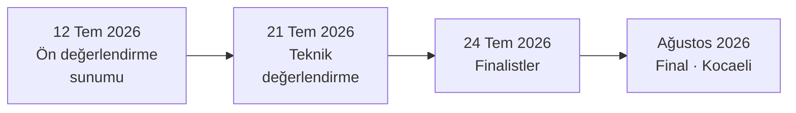
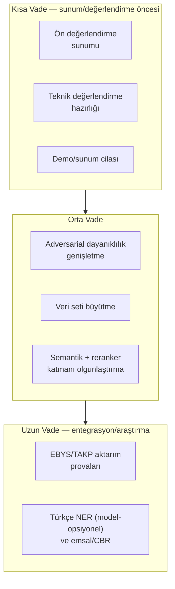

# Yol Haritası 🗺️

Bu sayfa, TEKNOFEST 2026 "Kamu Evrak ve Yazışma Süreçleri için Akıllı Agent Destek Sistemi" projesinin tamamlanan kilometre taşlarını, planlanan iyileştirmelerini ve araştırma yönlerini bir arada sunar. Yol haritası bir **niyet beyanıdır**, bağlayıcı taahhüt değildir; öncelikler yarışma takvimine, ölçüm sonuçlarına ve şartname bütünlüğüne göre güncellenebilir.

> [!NOTE]
> **TL;DR** — Sistem bugün 11 uzman ajan + orkestratör ile Görev 1 (okuma/sınıflandırma/analiz) ve Görev 2 (taslak/yönlendirme) uçtan uca çalışır durumdadır; çekirdek tamamen **offline-first** ve framework'süz saf Python'dur. Kısa vade önceliği ön değerlendirme sunumu (**12 Temmuz 2026**) ve teknik değerlendirmedir (**21 Temmuz 2026**); orta vade adversarial dayanıklılık, veri seti genişletme ve semantik RAG katmanının olgunlaştırılması; uzun vade EBYS/TAKP entegrasyon provaları ve araştırma yönleridir. Yeni metrik bu sayfada türetilmez; ölçülmüş değerler yalnızca [Değerlendirme ve Metrikler](Değerlendirme-ve-Metrikler) sayfasında raporlanır.

---

## 1. Kritik Tarihler ve Zaman Çizelgesi

Aşağıdaki tarihler proje anayasası (`CLAUDE.md`) ve resmî kaynak rehberinden (`docs/yarisma_resmi_kaynak_rehberi.md`) doğrulanmıştır. Yol haritasının tüm önceliklendirmesi bu takvime çapalanır.

| Tarih | Kilometre Taşı | Not |
|---|---|---|
| **12 Temmuz 2026** | Son başvuru + ön değerlendirme sunumu | Kritik teslim kapısı |
| **21 Temmuz 2026** | Teknik değerlendirme sınavı | Takımın 4 üyesinin tamamının katılımı zorunlu |
| **24 Temmuz 2026** | Finalistlerin açıklanması | — |
| **Ağustos 2026** | Final | Bilişim Vadisi, Kocaeli |

> [!IMPORTANT]
> Şartname gereği **iki görev de zorunludur**; tek görevi eksik bırakan bir yaklaşım sistemi "tamamlanmış" saymaz. Puanlama ekseni: Yöntem 35 + Uygulama 35 + Demo 15 + Yenilikçilik 15 = 100. Gerçek zamana yakın sonuç üretimi demoda belirgin avantaj sağlar; performans yönü bu nedenle yol haritasında sürekli gözetilir. Ayrıntı için [Şartname Uyum Matrisi](Şartname-Uyum-Matrisi).

---

## 2. Tamamlanan Kilometre Taşları

Aşağıdaki başlıklar, sistemin bugün çalışır durumda olan yeteneklerini yüksek seviyede özetler. Ayrıntılı değişiklik günlüğü için depodaki `CHANGELOG.md` esastır; her satır commit kanıtı ve şartname izi taşır.

### 2.1 Çekirdek Mimari

- [x] **11 uzman ajan + orkestratör** — saf Python, framework'süz; OCR, Sınıflandırma, Bilgi Çıkarımı, Eksik Bilgi, Mevzuat, Özetleme, Taslak Yazımı, Yönlendirme, Kullanıcı Bilgilendirme, Triage, Anonimleştirme. Ayrıntı: [Uzman Ajanlar](Uzman-Ajanlar).
- [x] **Koşullu 3 kapılı akış** — okunabilirlik, dil ve düşük güven kapıları; düz sıralı zincir değil. Ayrıntı: [Orkestratör ve Koşullu Kapılar](Orkestratör-ve-Koşullu-Kapılar).
- [x] **Offline-first çekirdek** — hiçbir LLM olmadan uçtan uca tam işlevsel çalışma; LLM yalnızca opsiyonel iyileştirme katmanı (düşük güvende eskalasyon).

### 2.2 Görev 1 — Okuma, Sınıflandırma ve Analiz

- [x] **8 evrak türü** (+ `diger`) için üçlü hibrit sınıflandırma: ağırlıklı kural + saf-Python Multinomial Naive Bayes ensemble (kural %60 / ML %40) + opsiyonel LLM eskalasyonu (güven < 0.6).
- [x] **Regex-öncelikli bilgi çıkarımı** — tarih, sayı, TCKN (resmî checksum), muhatap, IBAN, telefon, e-posta, ilgi/dağıtım vb.
- [x] **Türe özgü eksik bilgi tespiti** — kritik/önemli/bilgi öncelik seviyeleriyle.
- [x] **Sadakat garantili özetleme** — LLM veya skorlamalı extractive; künyeli/künyesiz iki alan ayrımı.

Ayrıntı: [Görev 1 — Okuma, Sınıflandırma ve İçerik Analizi](Görev-1-Okuma-ve-Analiz).

### 2.3 Görev 2 — Taslak ve Yönlendirme

- [x] **Resmî Yazışma Yönetmeliği'ne (RG 10.06.2020/31151) uyumlu taslak** — LLM + Reflexion ve kural tabanlı adaylardan keep-best seçimi; madde-referanslı format öz-denetimi.
- [x] **9 kamu birimine yönlendirme** — ağırlıklı anahtar kelime skorlaması + yakın skorlarda LLM ayrıştırması.
- [x] **Kullanıcı bilgilendirme ve eksik-bilgi soruları** — belge türüne göre koşullanan muhatap.

Ayrıntı: [Görev 2 — Taslaklama ve Birim Yönlendirme](Görev-2-Taslak-ve-Yönlendirme).

### 2.4 Yenilik ve Güvence Katmanları

- [x] **Triage / önceliklendirme** — üç sinyal katmanı (aciliyet damgaları, metin içi süre, yasal süre tablosu) ve iş günü hesaplı son işlem tarihi. Ayrıntı: [Triage ve Akıllı Önceliklendirme](Triage-ve-Önceliklendirme).
- [x] **KVKK anonimleştirme** — 9 kategori format-koruyan maskeleme + bağımsız sızıntı denetçisi. Ayrıntı: [KVKK ve Anonimleştirme](KVKK-ve-Anonimleştirme).
- [x] **Hibrit mevzuat RAG** — saf Python BM25-Okapi çekirdek + düzeltici (corrective) sorgu genişletme + opsiyonel semantik/reranker katmanları. Ayrıntı: [Mevzuat RAG ve Hibrit Arama](Mevzuat-RAG-ve-Hibrit-Arama).
- [x] **Güven ve ölçüm katmanı** — kalibrasyon (ECE/temperature scaling), seçici tahmin (reject option), konformal tahmin, metamorfik dayanıklılık, çapraz tutarlılık. Ayrıntı: [Güven ve Ölçüm Katmanı](Güven-ve-Ölçüm-Katmanı).
- [x] **Arayüz katmanı** — kurumsal sunum panosu `app.py`, klasik `src/app.py`, sıfır-bağımlılık REST API (`src/api.py`) ve JSON-RPC 2.0 MCP sunucusu (`src/mcp_server.py`). Ayrıntı: [Web Arayüzü — Evrak Zekâ](Web-Arayüzü), [REST API](REST-API), [MCP Sunucusu](MCP-Sunucusu).
- [x] **Tekrarlanabilirlik mührü** — her değerlendirme raporuna git commit + platform + veri seti içerik hash gömülür.

> [!NOTE]
> **Ölçülen mevcut durum** (offline backend, `scripts/evaluate.py`, commit 08616ff): geliştirme setinde (52 evrak) sınıflandırma doğruluğu 1.0; tutulmuş ve tutulmuş v2 setlerinde de 1.0; adversarial setlerde (v3/v4, her biri 16 evrak) 0.9375 (macro-F1 0.9333). KVKK sızıntısı beş setin tamamında 0. Taslak kalite ortalaması geliştirme setinde 93.6/100. Tüm doğrulanmış metrikler ve held-out disiplini için [Değerlendirme ve Metrikler](Değerlendirme-ve-Metrikler) sayfasına bakın; bu sayfada yeni metrik türetilmez.

---

## 3. Planlanan İyileştirmeler

Aşağıdaki temalar, önceliklendirilmiş ancak tarihe bağlanmamış niyet başlıklarıdır. Her tema, şartname bütünlüğü ve offline-first ilkesini bozmadan geliştirilecek biçimde tasarlanmıştır.

### 3.1 Adversarial Dayanıklılık

- [ ] Metamorfik test kütüphanesinin (`src/utils/metamorfik.py`) perturbasyon çeşitliliğini artırmak; en kırılgan bozulma tipini `scripts/dayaniklilik_testi.py` ile sürekli izlemek.
- [ ] Adversarial-temiz set (v4) disipliniyle, geliştirme-bilgisi sızmamış yeni ölçüm setleri üretme geleneğini sürdürmek.

Ayrıntı: [Adversarial Dayanıklılık](Adversarial-Dayanıklılık).

### 3.2 Veri Seti Genişletme

- [ ] Sentetik evrak çeşitliliğini (tür/birim/senaryo kapsamı) artırmak; her yeni set için `docs/veri_seti_datasheet.md` (Gebru vd. 2021) formatını korumak.
- [ ] Mevzuat korpusunu genişletirken düzeltici RAG ve tema aktivasyon eşiklerinin kalibresini gözden geçirmek.

> [!WARNING]
> Veri genişletmede **gerçek kamu verisi asla kullanılmaz** (KVKK ilkesi). Kurgu TCKN'ler yalnızca resmî checksum'ı geçer; gerçek bir kişiye atanamaz. Held-out setler üzerinde ölçülen hataya bakarak kural/kod düzeltilirse ilgili set held-out niteliğini kaybeder ve bu durum `docs/teknik_rapor.md` §5'e yazılmak zorundadır. Ayrıntı: [Veri Setleri](Veri-Setleri) ve [Anayasal İlkeler ve Etik](Anayasal-İlkeler-ve-Etik).

### 3.3 Semantik Katman ve Hibrit Arama

Semantik (dense) ve yeniden sıralama (rerank) katmanları bugün **varsayılan kapalıdır** (`EMBEDDING_SEMANTIK_AKTIF=1` / `EMBEDDING_RERANK_AKTIF=1` ile açılır), çünkü offline-first çekirdek yalnızca BM25 ile birebir korunur.

- [ ] Opsiyonel `turkish-e5-large` (semantik) + `bge-reranker-v2-m3` (rerank) katmanlarının RRF (k=60) birleştirmesini daha geniş senaryolarda değerlendirmek.
- [ ] Mutlak benzerlik kalibrasyonunu (göreli normalizasyon bilinçli terk edildi) korurken, sıralama kalitesini artırmak.

Ayrıntı: [Mevzuat RAG ve Hibrit Arama](Mevzuat-RAG-ve-Hibrit-Arama) ve [Model Bilgileri ve LLM Ekosistemi](Model-Bilgileri).

### 3.4 EBYS / TAKP Aktarımı

- [ ] REST API ve MCP sunucusu üzerinden EBYS entegrasyon senaryolarını (`docs/api_rehberi.md`) prova etmek; e-Yazışma üstveri taslağını (`src/utils/eyazisma.py`, CBDDO esinli) olgunlaştırmak.
- [ ] Türkiye Açık Kaynak Platformu (TAKP) teslim provasını `docs/takp_aktarim_plani.md`'deki üç senaryo (transfer / fork-mirror / topic) çerçevesinde yürütmek.

> [!NOTE]
> e-Yazışma modülü birebir resmî şema değil, **esinlenen bir taslaktır**; e-imza/şifreleme/tam paket kapsam dışıdır ve numaralar/DETSIS kurgudur. Bu sınır dürüstçe belgelenmiştir.

---

## 4. Araştırma Yönleri

Aşağıdaki başlıklar keşif niteliğindedir; çekirdek teslime dahil edilmeleri ölçüm sonuçlarına ve şartname uygunluğuna bağlıdır.

| Yön | Açıklama | İlke |
|---|---|---|
| Model-opsiyonel Türkçe NER | Yer/kişi/kurum çıkarımını kural tabanlı katmanın üstüne, BERTurk-tarzı bir modelle güçlendirme | Model ağırlığı depoya konmaz (şartname m.7); LLM-opsiyonel desen |
| Emsal / CBR olgunlaştırma | Kurumsal hafıza (SQLite kayıt defteri) üzerinde Case-Based Reasoning önselinin advisory rolünü genişletme | Karar bloklanmaz, yalnızca insan onayı önerilir |
| Öz-tutarlılık (self-consistency) | LLM eskalasyonunda K örnekleme + çoğunluk oyu ile kalibre güven | Varsayılan tek çağrı; offline-first korunur |
| Kalibrasyon derinleştirme | Konformal tahmin ve seçici tahmin sinyallerini HITL (insan-döngüde) akışına daha sıkı bağlama | Ölçüm-amaçlı, kararı değiştirmez |

Bu yönlerin hiçbiri offline çekirdeğin bağımsız çalışabilirliğini bozacak biçimde tasarlanmaz. Ayrıntılı güven/ölçüm zemini için [Güven ve Ölçüm Katmanı](Güven-ve-Ölçüm-Katmanı).

---

## 5. Katkı Çağrısı

Proje **Apache 2.0** lisanslıdır (telif: AGENTRA TECH). Katkılar yol haritasının hızını doğrudan etkiler.

- **Kod ve mimari** — yeni ajan ekleme, konvansiyonlar ve mimari kararlar için [Geliştirici Rehberi](Geliştirici-Rehberi).
- **Test ve CI** — kalite kapıları ve test haritası için [Test ve Sürekli Entegrasyon](Test-ve-Sürekli-Entegrasyon); depo CI rozetine göre 508 test yeşil (`pytest tests/`).
- **Veri** — sentetik set/etiket şeması katkıları için [Veri Setleri](Veri-Setleri); etiket anahtarları `src/agents/missing_info_agent.py` içindeki `ZORUNLU_ALANLAR` ile birebir uyumlu olmalıdır (ör. tutanak için `imzalar`, `imza` değil).
- **Etik ve uyum** — güvenlik bildirimi ve KVKK kanalı için depodaki `SECURITY.md`.

> [!IMPORTANT]
> Katkılarda anayasal ilkeler bağlayıcıdır: halüsinasyon yasağı, KVKK veri koruması, nesnellik/şeffaflık ve değerlendirme bütünlüğü. Ölçüm sonuçları ne çıkarsa olduğu gibi raporlanır; sonuç manipülasyonu ve jüriyi yanıltıcı sunum şartnameye göre etik ihlaldir. Ayrıntı: [Anayasal İlkeler ve Etik](Anayasal-İlkeler-ve-Etik).

---

## 6. Bu Yol Haritası Hakkında

Bu sayfa niyet ve önceliklendirmeyi yansıtır; **taahhüt değildir**. Kilometre taşları, tarihler ve öncelikler; yarışma takvimine, ölçüm bulgularına ve topluluk katkısına göre değişebilir. Tamamlanan işlerin kesin ve güncel kaydı için depodaki `CHANGELOG.md` tek doğruluk kaynağıdır; ölçülmüş metrikler yalnızca [Değerlendirme ve Metrikler](Değerlendirme-ve-Metrikler) sayfasında raporlanır.

---

## İlgili Sayfalar

- [Ana Sayfa](Home) — proje özeti ve tam gezinme
- [Proje Hakkında](Proje-Hakkında) — problem, çözüm ve yenilik modülleri
- [Değerlendirme ve Metrikler](Değerlendirme-ve-Metrikler) — tüm doğrulanmış metrikler ve held-out disiplini
- [Adversarial Dayanıklılık](Adversarial-Dayanıklılık) — v3/v4 setleri ve metamorfik testler
- [Şartname Uyum Matrisi](Şartname-Uyum-Matrisi) — gereksinim-kanıt haritası
- [Geliştirici Rehberi](Geliştirici-Rehberi) — katkı, konvansiyonlar ve mimari kararlar
