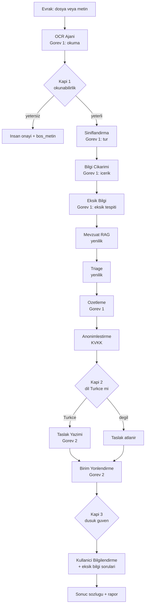

# 📋 Şartname Uyum Matrisi

TEKNOFEST 2026 Yapay Zeka Dil Ajanları Yarışması — 1. Senaryo şartnamesinin her maddesini, o maddeyi karşılayan **somut dosya/kod kanıtına** ve **uyum durumuna** bağlayan izlenebilirlik tablosu. Bu sayfa `docs/sartname_uyum_matrisi.md` belgesinin wiki karşılığıdır ve jürinin "hangi gereksinim nerede karşılanıyor?" sorusuna tek bakışta yanıt vermeyi amaçlar.

> [!NOTE]
> **TL;DR** — İki zorunlu görev (Görev 1: okuma/sınıflandırma/içerik analizi, Görev 2: taslak/birim yönlendirme) uçtan uca çalışır ve her ikisi de ölçülür. Sistem 11 uzman ajan + 1 orkestratörden oluşur; çekirdeği **offline-first** ve framework'süz saf Python'dur, LLM yalnızca opsiyonel iyileştirme katmanıdır. Her satır bir kanıt dosyasına bağlanmıştır. Şeffaflık ilkesi gereği açık kalan kalemler (⚠️ takım bilgisi, sunum PDF'i) matrisin sonunda ayrıca listelenir; metrikler yalnızca `scripts/evaluate.py` ile ölçülen değerlerdir.

---

## 1. Matrisin Okunuşu ve Durum Etiketleri

Bu matris, şartnamenin ilgili maddesini alır, projede o maddeyi karşılayan birincil kanıtı (kod veya doküman) gösterir ve bir durum atar. Kanıt dosyaları her zaman **göreli yol** ile verilir (raporlara mutlak yol sızmaması ilkesi — bkz. [Değerlendirme ve Metrikler](Değerlendirme-ve-Metrikler)).

| Etiket | Anlamı |
|---|---|
| ✅ **Karşılandı** | Gereksinim kodda/dokümanda tam olarak uygulanmış ve doğrulanabilir |
| 🔵 **Karşılandı (opsiyonel)** | Çekirdek dışı, opsiyonel katmanla güçlendirilmiş; varsayılan kapalı, offline çekirdek etkilenmez |
| ⚠️ **Açık kalem** | Teslim öncesi elle tamamlanacak (kod dışı) |

> [!IMPORTANT]
> Madde numaraları TEKNOFEST TYDA Senaryo 1 şartnamesinin yapısına göre gruplandırılmıştır (Görev tanımları, sistem bütünlüğü, veri, dokümantasyon/lisans, sunum/demo, etik). Numaralandırma yalnızca bu wiki tablosunun iç düzenidir; ölçüm sonuçlarının tümü için [Değerlendirme ve Metrikler](Değerlendirme-ve-Metrikler) sayfasını esas alın.

---

## 2. Uçtan Uca Akış — Şartname Görevleri Nerede Karşılanıyor?

Aşağıdaki diyagram, bir evrağın orkestratörden geçerken Görev 1 ve Görev 2 bloklarını nasıl kat ettiğini ve hangi ajanın hangi şartname gereksinimini karşıladığını özetler. İşlem sırasına dikkat: triage, özetlemeden **önce** çalışır.

Akışın koşullu kapı mantığı için [Orkestratör ve Koşullu Kapılar](Orkestratör-ve-Koşullu-Kapılar), ajanların tam listesi için [Uzman Ajanlar](Uzman-Ajanlar) sayfalarına bakın.

---

## 3. Görev 1 — Okuma, Sınıflandırma ve İçerik Analizi

Görev 1, gelen evrağı okuyup türünü belirlemeyi, içeriğinden anahtar bilgileri çıkarmayı, eksik bilgileri tespit etmeyi ve özetlemeyi kapsar. Ayrıntı için [Görev 1 — Okuma ve Analiz](Görev-1-Okuma-ve-Analiz).

| # | Şartname Gereksinimi | Kanıt Dosya(lar) | Durum |
|---|---|---|---|
| 1.1 | Evrağı okuma / metin çıkarma (TXT, PDF, görüntü/OCR) | `src/agents/ocr_agent.py`, `src/utils/goruntu_onisleme.py` | ✅ |
| 1.2 | Evrak türü sınıflandırma (8 tür + `diger`) | `src/agents/classification_agent.py`, `src/models/istatistiksel_siniflandirici.py` | ✅ |
| 1.3 | İçerik analizi / anahtar bilgi çıkarımı (tarih, sayı, TCKN, muhatap, kurum, kişi, yer, IBAN, telefon, e-posta, tutar, ilgi, dağıtım) | `src/agents/info_extraction_agent.py`, `src/utils/turkce_ner.py` | ✅ |
| 1.4 | Eksik bilgi tespiti (türe özgü zorunlu alan kontrolü, öncelikli) | `src/agents/missing_info_agent.py` | ✅ |
| 1.5 | Özetleme (resmî, nesnel, sadakat garantili) | `src/agents/summarization_agent.py`, `src/utils/ozet_kalite.py` | ✅ |
| 1.6 | Türkçe dil işleme (Türkçe'ye özgü küçük/büyük harf, morfoloji, dil sezimi) | `src/utils/turkish_nlp.py` | ✅ |

**Kanıt notları:**

- **8 evrak türü** kod düzeyinde sabittir: `dilekce, ust_yazi, cevap_yazisi, bilgilendirme, tutanak, rapor, genelge, onayli_belge` (+ artık/fallback kategori `diger`). Sınıflandırma **üçlü hibrit** çalışır: ağırlıklı kural tabanlı skorlama (%60) + saf-Python Multinomial Naive Bayes (%40) ensemble, düşük güvende (< 0.6) opsiyonel LLM eskalasyonu.
- **TCKN çıkarımı resmî checksum doğrulaması** yapar (11 hane, ilk hane ≠ 0, 10. ve 11. hane algoritması); geçmeyen numaralar alınmaz. E-posta/telefon regex'leri ReDoS'a (CWE-1333) karşı RFC sınırlarıyla bağlanmıştır.
- **Eksik bilgi** üç öncelik seviyesinde raporlanır (kritik/önemli/bilgi) ve etiket şeması `missing_info_agent.py` içindeki `ZORUNLU_ALANLAR` ile birebir uyumludur (ör. tutanak için `imzalar`, `imza` değil).
- **Özet sadakati** garantilidir: sıkıştırma bir sayı/tarih olgusunu düşürürse orijinal cümle korunur (`sadelestir_guvenli`).

> [!NOTE]
> **Görev 1 ölçüm özeti** (offline backend, `scripts/evaluate.py`): Sınıflandırma doğruluğu geliştirme/tutulmuş/v2 setlerinde 1.0; adversarial v3/v4 setlerinde 0.9375 (macro-F1 0.9333). Eksik bilgi micro-F1 çoğu sette 1.0 (adversarial v3'te 0.8333). Tam tablo: [Değerlendirme ve Metrikler](Değerlendirme-ve-Metrikler).

---

## 4. Görev 2 — Taslaklama ve Birim Yönlendirme

Görev 2, çıkarılan bilgi ve mevzuata göre Resmî Yazışma Yönetmeliği'ne uygun bir yanıt taslağı üretmeyi ve evrağı doğru kamu birimine yönlendirmeyi kapsar. Ayrıntı için [Görev 2 — Taslak ve Yönlendirme](Görev-2-Taslak-ve-Yönlendirme).

| # | Şartname Gereksinimi | Kanıt Dosya(lar) | Durum |
|---|---|---|---|
| 2.1 | Resmî yazı taslağı üretme (5 şablon, hibrit LLM + kural tabanlı) | `src/agents/draft_writer_agent.py`, `src/templates/*.txt` | ✅ |
| 2.2 | Yönetmelik format öz-denetimi (madde-referanslı kontrol listesi) | `src/agents/draft_writer_agent.py` (`_validate_format`) | ✅ |
| 2.3 | Bağımsız taslak kalite hakemi (0-100 puan) | `src/utils/taslak_hakemi.py` | ✅ |
| 2.4 | Reflexion / Self-Refine iyileştirme döngüsü (keep-best) | `src/utils/taslak_reflexion.py` | 🔵 |
| 2.5 | Birim yönlendirme (9 kamu birimi, gerekçeli + alternatifli) | `src/agents/routing_agent.py` | ✅ |
| 2.6 | Kullanıcı bilgilendirme + eksik bilgi soruları (clarification) | `src/agents/user_info_agent.py` | ✅ |
| 2.7 | Resmî görsel formatta PDF çıktısı | `src/utils/resmi_pdf.py` | 🔵 |

**Kanıt notları:**

- **Taslak üretimi hibrittir:** her zaman güvenli bir kural tabanlı şablon adayı üretilir; LLM adayı (varsa Reflexion turuyla) yalnızca format skorunu artırırsa **keep-best** ile tercih edilir, eşitlikte deterministik kural tabanlı seçilir. Bu, offline-first garantisini korur.
- **Format denetimi madde-referanslıdır:** her kural gerçek Yönetmelik fıkrasına (RG 10.06.2020/31151) bağlanır — ör. TC başlığı m.10/2, sayı m.11/1, tarih m.12/1, konu m.13/1, muhatap m.14, kapanış m.16/12, imza m.17. 8 zorunlu kural her zaman eklenir; koşullu kurallar (sayı biçimi, konu kısa-öz, ilgi, bitiş hiyerarşisi, yabancı kelime, maddeleme, yetki devri, gizlilik) bağlam varsa eklenir.
- **Dürüstlük garantileri:** sayı numarası uydurulmaz (`(TASLAK — sayı EBYS tarafından verilecektir)` ibaresi), sahte logo/mühür eklenmez, gizlilik dereceli kaynak evrakta (Yön. m.25) taslak **insan onayı** zorunludur (Kapı 3).
- **Yönlendirme birimleri** `routing_agent.py` içindeki `BIRIMLER` sözlüğünde tam **9 birim** olarak tanımlıdır: `yazi_isleri, hukuk, insan_kaynaklari, mali_hizmetler, bilgi_islem, strateji, basin_halkla_iliskiler, destek_hizmetleri, genel_mudurluk`. Yakın skorlarda (fark < %15) opsiyonel LLM ayrıştırması devreye girer; hata/yokluk halinde kural tabanlı karar korunur.
- **PDF (`resmi_pdf.py`)** çekirdek değil opsiyonel bağımlılıktır (reportlab); kurulu değilse `.txt` yolu bozulmaz. İçerik değiştirilmez, yalnızca görsel dizgi resmîleştirilir.

> [!NOTE]
> **Görev 2 ölçüm özeti:** Yönlendirme doğruluğu tutulmuş/v3 setlerinde 1.0, geliştirmede 0.9615, v2/v4'te 0.9375. Taslak kalite ortalaması (0-100) tüm setlerde 93.6–95.8 aralığında (geliştirmede asgari 73).

---

## 5. Sistem Bütünlüğü ve Mimari

| # | Gereksinim | Kanıt Dosya(lar) | Durum |
|---|---|---|---|
| 3.1 | Çok ajanlı mimari + merkezi orkestrasyon (11 ajan + orkestratör) | `src/agents/orchestrator.py` | ✅ |
| 3.2 | Uçtan uca pipeline (süre ölçümü + isteğe bağlı denetim izi) | `src/pipelines/end_to_end_pipeline.py` | ✅ |
| 3.3 | Koşullu akış / 3 kapı (okunabilirlik, dil, düşük güven) | `src/agents/orchestrator.py` | ✅ |
| 3.4 | Merkezi konfigürasyon (LLM/OCR/embedding/uygulama ayarları) | `src/config.py` | ✅ |
| 3.5 | Model-agnostik LLM katmanı (OpenAI-uyumlu / Ollama / offline) | `src/models/llm_wrapper.py` | ✅ |
| 3.6 | Güvenlik: girdi uzunluk sınırı, PDF/görüntü bomba koruması | `src/agents/orchestrator.py`, `src/agents/ocr_agent.py` | ✅ |
| 3.7 | Zarif düşüş (graceful degradation) — opsiyonel bağımlılık yoksa çekirdek çalışır | tüm ajanlar (try/except deseni) | ✅ |
| 3.8 | Test kapsamı (birim + uçtan uca) | `tests/`, CI iş akışı | ✅ |

**Kanıt notları:**

- **3 koşullu kapı** orkestratörde uygulanır: Kapı 1 okunabilirlik (en az 30 anlamlı — harf/rakam — karakter), Kapı 2 dil (Türkçe değilse taslak atlanır, analiz devam eder), Kapı 3 düşük güven (sınıflandırma/yönlendirme güveni < 0.6 ise "insan onayı gerekli" işareti). Karar **bloklanmaz**, insan-döngüde önerilir.
- **Güvenlik sınırları merkezidir:** güvenilmeyen metin 200.000 karakterde kırpılır (`_apply_girdi_siniri`); OCR'da PDF 50 sayfa, görüntü ~40 MP, DPI 150 ile sınırlıdır (CWE-400 / decompression-bomb savunması).
- **LLM tamamen opsiyoneldir:** `APP_OFFLINE=1` katı kilidi hiçbir metnin dışarı gönderilmemesini garanti eder (KVKK/gizlilik). Tüm HTTP çağrıları harici SDK olmadan stdlib `urllib` ile yapılır.
- **Test:** depo CI rozetine göre 508 test geçer; `pytest tests/` ile doğrulanır (bkz. [Test ve Sürekli Entegrasyon](Test-ve-Sürekli-Entegrasyon)).

İlgili sayfalar: [Sistem Mimarisi](Sistem-Mimarisi), [Orkestratör ve Koşullu Kapılar](Orkestratör-ve-Koşullu-Kapılar), [Model Bilgileri](Model-Bilgileri).

---

## 6. Yenilik Modülleri

Şartnamenin yenilikçilik ekseni, temel görevlerin ötesine geçen özgün katkıları ödüllendirir. Projenin yenilik modülleri ölçülebilir kanıta dayanır ve "ölçülmemiş bir şey ölçülmüş gibi sunulmaz" ilkesine sadıktır.

| # | Yenilik Modülü | Kanıt Dosya(lar) | Durum |
|---|---|---|---|
| 4.1 | Hibrit mevzuat RAG (BM25 çekirdek + opsiyonel semantik/rerank) | `src/agents/legislation_agent.py`, `src/utils/bm25.py`, `src/utils/semantik_arama.py` | ✅ / 🔵 |
| 4.2 | Düzeltici (corrective) sorgu genişletme | `src/agents/legislation_agent.py` | ✅ |
| 4.3 | Emsal / Case-Based Reasoning (advisory) | `src/utils/emsal.py`, `src/utils/emsal_cbr.py` | ✅ |
| 4.4 | Triage / akıllı önceliklendirme (aciliyet + yasal süre) | `src/agents/triage_agent.py` | ✅ |
| 4.5 | KVKK anonimleştirme (9 kategori format-koruyan maskeleme) | `src/agents/anonimlestirme_agent.py`, `src/utils/kvkk_denetim.py` | ✅ |
| 4.6 | Güven/ölçüm katmanı (kalibrasyon, seçici tahmin, konformal, metamorfik) | `src/utils/kalibrasyon.py`, `src/utils/secici_tahmin.py`, `src/utils/konformal.py`, `src/utils/metamorfik.py` | ✅ |
| 4.7 | Çapraz tutarlılık denetimi + kanıt/attribution span'leri | `src/utils/tutarlilik_denetimi.py`, `src/utils/kanit.py` | ✅ |
| 4.8 | REST API + MCP sunucusu (EBYS entegrasyonu) | `src/api.py`, `src/mcp_server.py` | ✅ |

**Kanıt notları:**

- **Mevzuat RAG'in çekirdeği saf Python BM25-Okapi'dir** (k1=1.5, b=0.75), bağımlılıksız ve offline. Benzerlik **mutlak** ölçeklidir (göreli normalizasyon bilinçle terk edildi — zayıf eşleşmeyi 1.0'a şişirip yanlış mevzuat alıntısını engellemek için). Semantik (`turkish-e5-large`) ve rerank (`bge-reranker-v2-m3`) katmanları varsayılan **kapalıdır** (`EMBEDDING_SEMANTIK_AKTIF` / `EMBEDDING_RERANK_AKTIF`).
- **Düzeltici RAG** ilk en-iyi benzerlik 0.15'in altındaysa sorguyu tür söz dağarcığıyla bir kez genişletir ve yalnızca iyileşme olursa benimser; güvenlik ağı niteliğindedir.
- **Triage üç sinyal katmanıyla** çalışır ve yasal süreleri resmî dayanağa bağlar: bilgi edinme 4982 s.K. m.11 (15 iş günü), CİMER 30 gün, idari dava 2577 İYUK m.7 (60 gün), dilekçe 3071 s.K. m.7 (30 gün). Aciliyet damgaları: ÇOK İVEDİ / İVEDİ / GÜNLÜDÜR / SÜRELİDİR.
- **KVKK anonimleştirme** 9 kategoriyi maskeler (TCKN, telefon, e-posta, IBAN, kişi adı, adres, plaka, doğum tarihi, sicil no); bağımsız sızıntı denetçisi (`kacak_olc`) maskeleme kalitesini ölçer. Beş setin tamamında **0 kaçak** ölçülmüştür.
- **Güven katmanı** kalibrasyon (ECE + temperature scaling), seçici tahmin (reject option), konformal tahmin ve metamorfik dayanıklılık sağlar; tümü saf Python ve additive'dir (kararı değiştirmez).

İlgili sayfalar: [Mevzuat RAG ve Hibrit Arama](Mevzuat-RAG-ve-Hibrit-Arama), [Triage ve Önceliklendirme](Triage-ve-Önceliklendirme), [KVKK ve Anonimleştirme](KVKK-ve-Anonimleştirme), [Güven ve Ölçüm Katmanı](Güven-ve-Ölçüm-Katmanı), [Adversarial Dayanıklılık](Adversarial-Dayanıklılık).

---

## 7. Veri Kullanımı

| # | Gereksinim | Kanıt Dosya(lar) | Durum |
|---|---|---|---|
| 5.1 | Yalnızca sentetik/kurgu veri (gerçek kamu verisi kullanılmaz) | `data/raw/kurgu_evraklar/`, `data/README.md` | ✅ |
| 5.2 | Etiketli değerlendirme setleri (geliştirme + 4 tutulmuş set) | `data/raw/kurgu_evraklar*/etiketler.json` | ✅ |
| 5.3 | Mevzuat korpusu (dinamik yüklenen `.txt` belgeler; 15 metin) | `data/raw/mevzuat_metinleri/` | ✅ |
| 5.4 | Datasheet (Gebru vd. 2021 formatı) | `docs/veri_seti_datasheet.md` | ✅ |
| 5.5 | KVKK veri hijyeni: kurgu TCKN checksum geçer ama gerçek kişiye ait olamaz | `data/README.md`, `docs/GUVENLIK_DENETIM_RAPORU.md` | ✅ |

**Kanıt notları:**

- **5 etiketli set:** geliştirme (52 evrak), tutulmuş/held-out (16), tutulmuş v2 (16), adversarial v3 (16), adversarial-temiz v4 (16). Etiket şeması: `{tur, birim_kodu, eksik_alanlar, aciklama, mevzuat_beklenen?}`.
- **Held-out disiplini kod düzeyinde korunur:** temperature scaling yalnızca geliştirme setinde öğrenilir; held-out setlerde yalnızca ölçüm yapılır. Held-out set üzerinde ölçülen hataya bakılarak kural/kod düzeltilirse set niteliğini kaybeder ve bu `docs/teknik_rapor.md` §5'e yazılmak zorundadır.
- Kurgu TCKN'ler bilinçli olarak vatandaşa atanmayan aralıktan seçilir (checksum geçer, gerçek kişiye ait olamaz).

İlgili sayfalar: [Veri Setleri](Veri-Setleri), [KVKK ve Anonimleştirme](KVKK-ve-Anonimleştirme).

---

## 8. Dokümantasyon ve Lisans

| # | Gereksinim | Kanıt Dosya(lar) | Durum |
|---|---|---|---|
| 6.1 | Açık kaynak lisansı (Apache 2.0) | `LICENSE`, `NOTICE` | ✅ |
| 6.2 | Model ağırlığı depoya yüklenmez; 3. taraf modeller bağlantı+sürüm+lisans+talimatla belgelenir | `docs/model_bilgileri.md` | ✅ |
| 6.3 | Model kartı (Mitchell vd. 2019) | `docs/model_karti.md` | ✅ |
| 6.4 | Teknik rapor + metodoloji + held-out bütünlüğü | `docs/teknik_rapor.md` | ✅ |
| 6.5 | Telif / atıf / eser sahipliği | `AUTHORS`, `CITATION.cff`, `NOTICE` | ✅ |
| 6.6 | Değişiklik günlüğü (Keep a Changelog / SemVer) | `CHANGELOG.md` | ✅ |
| 6.7 | Güvenlik politikası + zafiyet bildirimi | `SECURITY.md` | ✅ |
| 6.8 | Türkçe zorunluluğu (kod yorumları, dokümanlar, çıktılar) | tüm depo | ✅ |

**Kanıt notları:**

- Depo **Apache 2.0** lisanslıdır, telif **AGENTRA TECH**'e aittir. Opsiyonel modellerin lisansları belgelidir: `turkish-e5-large` (MIT), `bge-reranker-v2-m3` (Apache 2.0), Ollama varsayılanı Qwen2.5 7B Instruct (Apache 2.0) — tümü varsayılan kapalı.
- **Güvenlik denetimi** (bkz. `docs/GUVENLIK_DENETIM_RAPORU.md`) çıkış öncesi 1 YÜKSEK + 6 ORTA bulguyu tespit edip kapatmıştır; `pip-audit` "No known vulnerabilities found" döner.

İlgili sayfalar: [Model Bilgileri](Model-Bilgileri), [Anayasal İlkeler ve Etik](Anayasal-İlkeler-ve-Etik).

---

## 9. Sunum ve Demo

| # | Gereksinim | Kanıt Dosya(lar) | Durum |
|---|---|---|---|
| 7.1 | Kurumsal sunum panosu (gerçek backend'e bağlı, demo etiketli) | `app.py` | ✅ |
| 7.2 | Klasik işlevsel arayüz (canlı ajan hattı — streaming) | `src/app.py` | ✅ |
| 7.3 | Konsol demo senaryosu | `demo/demo_scenario.py` | ✅ |
| 7.4 | Tek evrak CLI + toplu klasör işleme | `src/main.py` | ✅ |
| 7.5 | Gerçek zamana yakın işleme (demo avantajı) | benchmark ölçümleri | ✅ |
| 7.6 | Sunum kaynakları + PPTX üretimi | `presentations/`, `scripts/build_presentation.py` | ✅ |

**Kanıt notları:**

- **Kurumsal pano `app.py`** gerçek `EndToEndPipeline`/anonimleştirme/BM25-RAG'e bağlanır; backend yüklenemezse açık **SİMÜLASYON** etiketiyle zarif iner. Ölçülmemiş metrik gerçekmiş gibi sunulmaz — genel-bakış/telemetri açıkça "temsili demo" etiketlidir.
- Performans (geliştirme seti, offline): evrak başına ortalama ~0.23 sn, medyan ~0.14 sn. README rozetindeki "~88 evrak/sn" ifadesi **sınıflandırma-hattı** verimini anlatır; uçtan uca hat için evrak başına **0.1–0.5 sn** aralığı esas alınmalı, ikisi karıştırılmamalıdır.

> [!WARNING]
> **Açık kalem (⚠️):** Sunum PDF'inin final teslim öncesi elle alınması gerekir. Bu, kod dışı bir teslimat adımıdır ve şeffaflık gereği burada işaretlenmiştir.

İlgili sayfalar: [Web Arayüzü — Evrak Zekâ](Web-Arayüzü), [Komut Satırı ve Demo](Komut-Satırı-ve-Demo), [REST API](REST-API), [MCP Sunucusu](MCP-Sunucusu).

---

## 10. Etik ve Değerlendirme Bütünlüğü

| # | Gereksinim | Kanıt Dosya(lar) | Durum |
|---|---|---|---|
| 8.1 | Anayasal ilkeler (bağlayıcı YZ çalışma çerçevesi) | `CLAUDE.md` | ✅ |
| 8.2 | Sonuç manipülasyonu yasağı — metrik olduğu gibi raporlanır | `scripts/evaluate.py`, `docs/teknik_rapor.md` §5 | ✅ |
| 8.3 | Tekrarlanabilirlik mührü (git commit + platform + veri hash) | `src/utils/kosum_muhru.py` | ✅ |
| 8.4 | Adillik beyanı (karşı-olgusal değişmezlik testi) | `docs/adillik_beyani.md` | ✅ |
| 8.5 | Halüsinasyon yasağı (emin olunmayan bilgi üretilmez) | tüm ajanlar (grounded gerekçe, kanıt span'leri) | ✅ |
| 8.6 | KVKK / veri koruması | `src/agents/anonimlestirme_agent.py`, `src/utils/kvkk_denetim.py` | ✅ |
| 8.7 | Held-out bütünlüğü protokolü + şeffaf raporlama | `docs/teknik_rapor.md` §5, `data/README.md` | ✅ |

**Kanıt notları:**

- **Değerlendirme raporları elle düzenlenmez;** yalnızca `scripts/evaluate.py` üretir. Her rapora tekrarlanabilirlik mührü gömülür (NeurIPS standardı) ve mutlak yol asla sızmaz (`goreli_yol`).
- **Adillik testi** kararların kimlikten (ad-soyad, cinsiyet, il/ilçe) bağımsızlığını karşı-olgusal testle doğrular; kapsamlı toplumsal yanlılık denetimi olduğu **iddia edilmez** — kapsam ve sınır açıkça beyan edilir. İstatistiksel sınıflandırıcının adları teknik olarak öznitelik uzayına aldığı da dürüstçe belirtilir; ensemble'da kural skoru %60 baskındır.
- **Ablasyon** (tam sistem vs bag-of-words baseline) tüm setlerde sistemin baseline'a üstünlüğünü McNemar testiyle gösterir (ör. geliştirme setinde 1.0 vs 0.5385).

İlgili sayfalar: [Anayasal İlkeler ve Etik](Anayasal-İlkeler-ve-Etik), [Değerlendirme ve Metrikler](Değerlendirme-ve-Metrikler), [Güven ve Ölçüm Katmanı](Güven-ve-Ölçüm-Katmanı).

---

## 11. Şartname Kısıtları (İhlal Edilemez) — Uyum Beyanı

CLAUDE.md'de "İHLAL EDİLEMEZ" olarak tanımlanan beş temel kısıt ve karşılanma durumu:

- [x] **Türkçe zorunluluğu** — Kod yorumları, dokümanlar, çıktılar ve arayüzler Türkçe; teknik terimler orijinal formda parantezle verilir.
- [x] **Açık kaynak (Apache 2.0)** — Depoya model ağırlığı yüklenmez; 3. taraf modeller yalnızca `docs/model_bilgileri.md`'de belgelenir.
- [x] **Gerçek kamu verisi ASLA kullanılmaz** — Yalnızca sentetik/kurgu veri; kurgu TCKN'ler checksum geçer ama gerçek kişiye ait olamaz (KVKK ilkesi).
- [x] **Görev bütünlüğü** — Görev 1 ve Görev 2 birlikte zorunludur; değerlendirme uçtan uca senaryolar üzerinden yapılır. Tek görevi bozan değişiklik kabul edilmez.
- [x] **Offline-first korunur** — Çekirdek `requirements.txt` ile, hiçbir LLM olmadan tam işlevsel çalışır. Yeni bağımlılıklar çekirdek/opsiyonel disiplinine (`requirements.txt` vs `requirements-optional.txt`) uyar.

---

## 12. Açık Kalemler ve İzlenecek İşler

Şeffaflık ilkesi gereği, teslim öncesi elle tamamlanacak kalemler burada açıkça listelenir:

| Kalem | Açıklama | Durum |
|---|---|---|
| Takım bilgisi alanları | Şartname uyum matrisinde takım/başvuru alanları doldurulacak | ⚠️ Açık |
| Sunum PDF'i | Final sunumun PDF'i elle alınacak (kod dışı) | ⚠️ Açık |
| Risk kabulleri | Güvenlik denetiminde 3 madde bilinçle kabul edildi (ham istisna mesajı arayüze yazımı, sürümlerin `>=` ile korunması, git geçmişindeki kişisel e-posta) | ✅ Belgelendi |

Kritik takvim hatırlatması: ön değerlendirme sunumu **12 Temmuz 2026**, final **Ağustos 2026**. Yol haritası için [Yol Haritası](Yol-Haritası).

---

## İlgili Sayfalar

- [Ana Sayfa](Home) — Proje özeti ve tam gezinme
- [Proje Hakkında](Proje-Hakkında) — Problem, çözüm, yenilik modülleri
- [Değerlendirme ve Metrikler](Değerlendirme-ve-Metrikler) — Tüm doğrulanmış metrikler ve held-out disiplini
- [Anayasal İlkeler ve Etik](Anayasal-İlkeler-ve-Etik) — CLAUDE.md anayasası, KVKK, adillik beyanı
- [Test ve Sürekli Entegrasyon](Test-ve-Sürekli-Entegrasyon) — Test haritası ve CI kalite kapıları
- [Veri Setleri](Veri-Setleri) — Sentetik setler, mevzuat korpusu, datasheet
